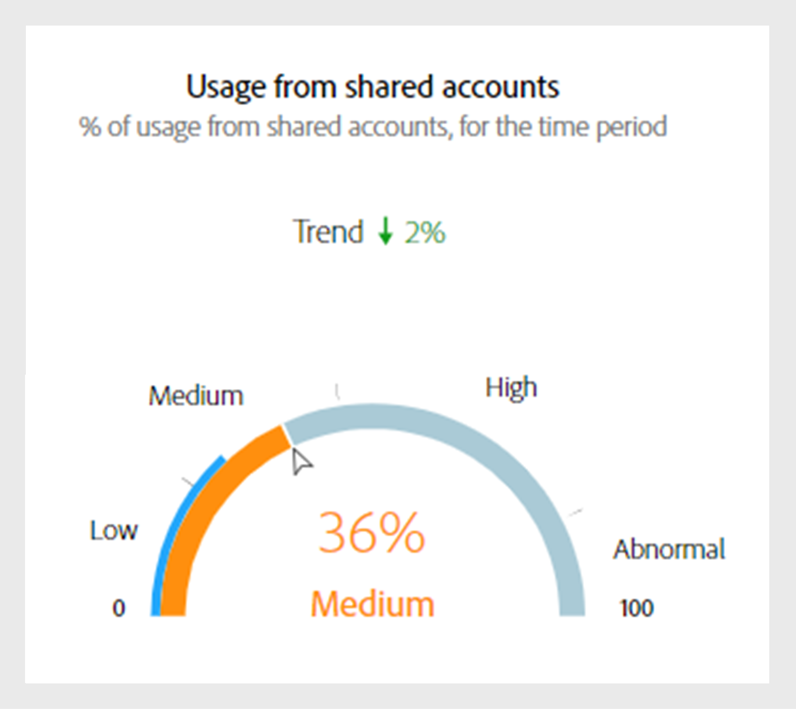

# ダッシュボードのデータパネル {#data-panels}

セグメントと時間間隔を選択すると、ダッシュボードには、選択したセグメント内での共有アクティビティの概要レベルを反映した様々なデータパネル、テーブル、グラフが表示されます。

次の表に、Account IQの様々な [ バージョン ](/help/accountiq/versions-aiq.md) におけるデータパネル間の可用性と相違点の概要を示します。

| データパネル | D2C サービス | TVE プログラマ | TVE MVPD |
|---|---|---|---|
| [ 現在のセグメントについて集計された平均共有スコア ](#aggregated-sharing) | 利用可能で一貫性がある | 利用可能で一貫性がある | 利用可能で一貫性がある |
| [ セグメントのビデオカテゴリ ](#video-categories-segment) | わずかなバリエーションで提供 | わずかなバリエーションで提供 | わずかなバリエーションで提供 |
| [ チャネルおよび MVPD によるスコアの共有 ](#sharin-score-by-channels-and-mvpds) | 利用不可 | 利用可能 | 利用不可 |
| [ アカウント共有確率 ](#accounts-sharing-probability) | 利用可能で一貫性がある | 利用可能で一貫性がある | 利用可能で一貫性がある |
| [ 確率レベルの共有によるアカウント数と使用状況 ](#number-of-accounts-usage-sharing-probability) | 利用可能で一貫性がある | 利用可能で一貫性がある | 利用可能で一貫性がある |

## 現在のセグメント用に集計された平均共有スコア {#aggregated-sharing}

平均共有スコアパネルには、共有の量と影響をアカウントとストリーミングボリュームの観点からまとめた上位の読み取り値が表示されます。

この指標は、アカウントと消費量の観点から測定した、購読者による資格情報共有のマグニチュード（低、中、高、異常の範囲）を理解するのに役立ちます。

*現在のセグメントに対してパネルで集計された平均共有スコア*

>[!NOTE]
>
> **現在のセグメントについて集計された平均共有スコア** の青いインジケーターは、D2C サービスと TV Everywhere の目的で異なる役割を果たします。 前の画像に示すように、D2C サービスの場合は、**サービス平均インデックス** を表します。 プログラマーまたは MVPD としてログインした場合、このラベルは **業界平均インデックス** に変わります。

次の指標は、平均共有スコアパネルのコンポーネントです。

### 共有レベル {#sharing-level}

共有レベル ゲージは、定義されたセグメント内のすべての共有加入者アカウントの割合を、選択された時間間隔で示します。

パーセンテージは、セグメント内のすべてのアカウントについて計算された共有確率の平均に基づいて計算されます。 この計算には、選択した時間間隔で少なくとも 1 回ストリーミングしたアカウントが含まれます。

トレンド指標は、前の時間間隔からの指標の値の変更率を示します。

{width="350" align="left"}

*共有レベル*

### 共有アカウントからの使用状況 {#usage-from-shared-accounts}

ゲージは、定義されたセグメントと期間における、すべての加入者アカウント間の共有アカウントによる使用の割合を示します。 これらのレンジは、「低」、「Medium」、「高」、「異常」と命名され、業界平均に基づいています。

トレンド指標。前の時間間隔と比較した共有アカウントの使用量の増減を示します。

{width="350" align="left"}

*共有アカウントからの使用*

### 共有の全体的なスコア {#overall-sharing-score}

共有スコア全体は、共有スコアの組み合わせです。これには、「共有レベル」と「共有アカウントからの使用状況」が含まれます。

共有の全体的な影響を反映したスコアが得られます。 その目的はクレジットスコアの目的に似ており、単一の数値で共有レベルを要約します。 ただし、この場合、スコアが高いほど、共有レベルが高いことを示します。

{width="350" align="left"}

*共有の全体的なスコア*

## セグメントのビデオカテゴリ {#video-categories-segment}

列見出しを選択すると、Account IQのすべてのバージョンでデータを並べ替えることができます。

+++D2C サービス：セグメント内の地域

D2C サービスとしてログインした場合、**セグメントの地域** テーブルには、現在のセグメントの [ ビデオカテゴリ ](/help/accountiq/product-concepts.md#video-category-def) に対して異なる集計共有スコアの比較ビューが表示されます。

*セグメント内の地域別のスコアの共有*

>[!NOTE]
>
> 前の画像で示した [ ビデオカテゴリ ](product-concepts.md#video-category-def) セグメントの **地域** などは、一例です。 Account IQにログインすると、会社の特定のビデオカテゴリがこのパネルに表示されます。

**書き出し** を選択して、.csv ファイルのデータをダウンロードします。 詳細情報 [ データパネルレポートを書き出す方法 ](/help/accountiq/export-reports.md)。

+++

+++プログラマー：セグメント内の MVPD

プログラマーとしてログインした場合、**セグメントの MVPD** テーブルには、現在のセグメントの MVPD について集計された様々な共有スコアの比較ビューが表示されます。

**書き出し** を選択して、.csv ファイルのデータをダウンロードします。 詳細情報 [ データパネルレポートを書き出す方法 ](/help/accountiq/export-reports.md)。

+++

+++MVPD：セグメントのプログラマー

MVPD としてログインした場合、**セグメントのプログラマー** テーブルには、現在のセグメントのプログラマーに対する様々な集計共有スコアの比較ビューが表示されます。

列見出しを選択して、データを並べ替えます。

*セグメントでのプログラマーによるスコアの共有*

**書き出し** を選択して、.csv ファイルのデータをダウンロードします。 詳細情報 [ データパネルレポートを書き出す方法 ](/help/accountiq/export-reports.md)。

+++

## チャネルおよび MVPD によるスコアの共有  {#sharin-score-by-channels-and-mvpds}

プログラマーとしてログインした場合、現在のセグメントの MVPD に対して選択されたチャネルの共有スコアの比較表示が表示されます。

列見出しを選択して、データを並べ替えます。

*チャネルおよび MVPD によるスコアの共有*

## アカウント共有確率 {#accounts-sharing-probability}

このチャート・パーティションは、非常に低い（0-20%）から非常に高い（80-100%）までの範囲の共有確率の四分位数の範囲を占めます。 詳しくは、「アカウント共有確率 [ の範囲を参照してくだ ](#accounts-sharing-probability) い。

>[!NOTE]
>
>棒グラフは対数スケールを使用します。

*異なる共有確率範囲におけるサブスクライバーアカウントの数と割合*

## 確率レベルを共有することによるアカウント数と使用状況 {#number-of-accounts-usage-sharing-probability}

このパネルは、確率が非常に低い（0 ～ 20 %）から非常に高い（80 ～ 100 %）まで、共有アカウントから各クインタイルに関連する使用状況の範囲に分割されたアカウントの表形式表示を提供します。 詳しくは、「アカウント共有確率 [ の範囲を参照してくだ ](#accounts-sharing-probability) い。

*様々な確率の範囲で下がるアカウント、トレンド、使用状況の数*

**書き出し** を選択して、.csv ファイルのデータをダウンロードします。 詳細情報 [ データパネルレポートを書き出す方法 ](/help/accountiq/export-reports.md)。
