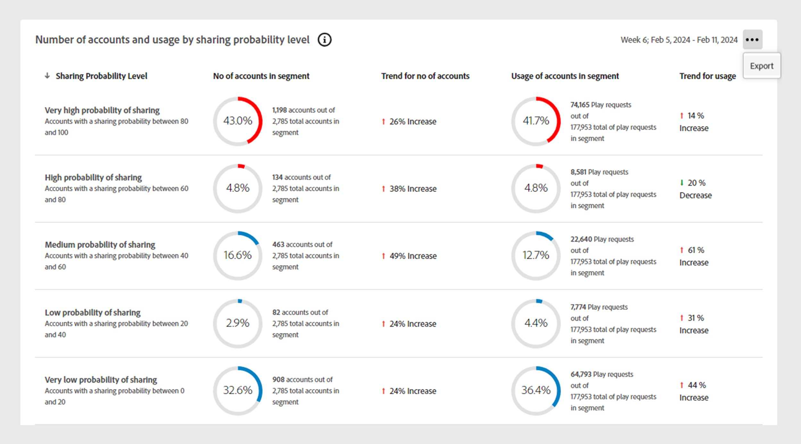
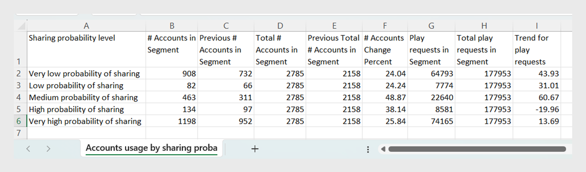

# データパネルレポートの書き出し {#export-reports}

[!UICONTROL Account IQ] のダッシュボードには、選択したセグメントにおける購読者アカウントの資格情報共有統計を分析するためのテーブルとグラフが表示されます。 共有パターン、スコアおよびアカウント使用状況の指標を表示する以外に、これらのテーブルからレポートを書き出すこともできます。

次のデータパネルレポートを書き出すことができます。

* [ セグメントのビデオカテゴリ ](data-panels.md#video-categories-segment)
* [確率レベルを共有することによるアカウント数と使用状況](data-panels.md#number-of-accounts-usage-sharing-probability)

特定のセグメントのデータパネルレポートを書き出すには、次の手順に従います。

1. 自分の資格情報を使用してログインします。
1. 必要なセグメントと時間間隔をセグメントと時間間隔パネルから選択します。 詳しくは、[ セグメントと時間間隔 ](segments-timeinterval.md#segment-selection) を参照してください。

   必要に応じて、[ セグメントの作成 ](work-with-segments.md#create-new-segment) または [ セグメントの編集 ](work-with-segments.md#edit-segment) の手順を参照してください。

1. 書き出すデータパネルに移動します。

   例えば、以下に示すように、**確率レベルを共有することによるアカウント数と使用状況** パネルについて考えてみます。

   {align="left"}

   *確率レベルの共有によるアカウント数と使用状況のエクスポート*

1. データパネルの右上隅にある「**[!UICONTROL Export]**」を選択します。

ファイルはローカルマシンに自動的にダウンロードされます。 システムは、確率レベルを.csv として共有することで、アカウント数と使用状況のデータを保存します。

書き出された.csv ファイルの例を次に示します。 ファイルは、選択したデータパネルに表示される列で構成されます。

{align="left"}

*書き出されたレポート*
