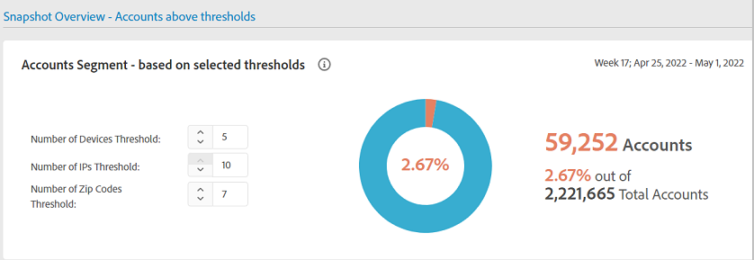

# [!UICONTROL General usage] レポート {#general-usage-reports}

[!UICONTROL Account IQ] レポートは、データを掘り下げて [ コホート ](/help/accountiq/product-concepts.md#segmet-def) を分離し、異常を特定して、アカウントの特性を理解できる基本的な分析ツールです。

レポートページに [!UICONTROL General usage]、使用中のアカウントデバイスの数、検出された IP、およびそれぞれの郵便番号に基づいてサブグループ指標を分割するツールが用意されています。

レポートはすべて、「セグメントと時間間隔 [ パネルで選択した現在のセグメントに基づ ](/help/accountiq/segments-timeinterval.md) ています。 選択内容を微調整し、（デバイス数、IP 数および郵便番号の数）しきい値を「しきい値を超えるスナップショットの概要アカウント [ パネルに指定して、しきい値を絞り込む ](#snapshot-overview) とができます。

## 再生リクエストとユニーク購読者 {#playreq-uniquesubs}

この折れ線グラフは、定義されたセグメントに対して選択された時間間隔での再生リクエストおよびユニーク購読者など、値の時間的変化を示します。

+++ D2C サービス：再生リクエスト/ユニーク購読者

*D2C サービスの再生リクエスト/ユニーク購読者*

+++

+++プログラマー：リクエストの再生/ユニーク購読者

*プログラマーのリクエストを再生/ユニーク購読者*

+++

+++MVPD：ユニーク購読者

*MVPD のユニーク購読者*

+++

 

x 軸は現在の間隔に基づく時間を表し、y 軸はその期間中の基本的な購読者のアクティビティの指標を表します。 折れ線グラフは、現在のセグメント内の購読者のアクティビティを視覚化および比較するのに役立ちます。 Account IQのバージョンに応じて、指標には次のものが含まれます。

* **AuthN OK**：成功した認証数。 詳しくは、[AuthN OK](/help/accountiq/product-concepts.md#authn-ok-def) を参照してください。

* **AuthZ OK**：成功した承認数。 詳しくは、[AuthZ OK](/help/accountiq/product-concepts.md#authz-ok-def) を参照してください。

* **再生リクエスト**：再生リクエストの数。 詳しくは、[ 再生リクエスト ](/help/accountiq/product-concepts.md#play-requests-def) を参照してください。

* **ユニーク購読者**：成功したユニーク購読者の数。 詳しくは、[ ユニーク購読者 ](/help/accountiq/product-concepts.md#unique-subscriber-def) を参照してください。

>[!NOTE]
>
>使用できる指標は、Account IQのバージョンによって異なります。

## スナップショットの概要：しきい値を超えるアカウント {#snapshot-overview}

この追加のフィルターを使用して分析とレポートを微調整し、様々な使用しきい値を設定します。 セグメントを選択したら、次のフィルターを使用して、購読者の行動をさらに分析することもできます。

* デバイス数のしきい値

* IP 数のしきい値

* 郵便番号のしきい値

[ 選択したしきい値に基づいてアカウント・セグメント・ベース ](#account-segments-basedon-segments) パネルでしきい値を更新すると、その影響は次のように表示されます。

* [アカウントごとの週または月あたりのデバイス数](#devices-week-account)

* [アカウントごとの週（または月）あたりのロケーション](#locations-week-account)

* [アカウントごとの週または月ごとの IP](#ip-week-account)

* [勘定科目セグメントの履歴ビュー](#account-segment-historical-view)

>[!NOTE]
>
>各しきい値はデフォルト値の 4 に設定されています。 つまり、一般使用状況ページには、4 つ以上のデバイスを使用し、4 つ以上の異なる IP アドレスのコンテンツを消費しているサブスクライバー、*および* 4 つ以上の異なる郵便番号の分析が表示されます。

### 選択したしきい値に基づくアカウント・セグメント・ベース {#account-segments-basedon-segments}

**選択したしきい値に基づくアカウントセグメント** パネルでは、デバイス数、IP 数、郵便番号に対するしきい値（1～10）を設定するオプションが提供されます。

グラフには、次の項目が表示されます。

* 購読者のアカウントの絶対数。

* セグメント内の全加入者アカウントのうち、IP の数からのデバイス数を、しきい値で指定された郵便番号の数で使用している割合。

## アカウントごとの週または月あたりのデバイス数 {#devices-week-account}

この棒グラフは、購読者がデバイスを使用してコンテンツにアクセスする方法に関して、使用状況の行動に対するインサイトを提供します。

X 軸はアカウント数、Y 軸はデバイス数を示します。 アカウントあたりのデバイス数に設定したしきい値に基づいて、1 週間の期間に特定の数のデバイスからコンテンツを消費したサブスクライバーアカウントの絶対数がマークされます。

（デバイス数に固有の）バーの上にマウスポインターを置くと、1 週間にそれらのデバイスでチャネルコンテンツをストリーミングしている購読者のアカウント数（およびセグメント内の全購読者のアカウントに占める割合）に関する情報を提供するラベルが表示されます。

このグラフは、次の点にもマークを付けます。

* 設定したしきい値を示す赤い線。

* サブスクライバーのアカウントが 1 週間（または 1 か月）に使用する、異なるデバイス数の平均を示す緑色の線。

ドーナツには、設定されたしきい値を超えて、現在のセグメントのアカウントで使用されているデバイスの代替ビューが表示されます。

## アカウントごとの週（または月）あたりのロケーション {#locations-week-account}

[ アカウントごとの週（または月）あたりのデバイス数 ](#devices-week-account) の指標と同様に、アカウントごとの週（または月）あたりのロケーション指標を使用すると、様々な場所からサブスクライバーのアカウントの使用状況を分析できます。 X 軸は勘定科目数を示し、Y 軸は位置数を示します。

位置数のしきい値を設定したら、グラフを使用して以下を識別できます。

* 1 週間に x 個のロケーションから（特定の）コンテンツを消費しているサブスクライバーの数（および割合）。

* しきい値を超える場所のコンテンツを表示しているサブスクライバーの合計アカウントの割合。

* 週平均（アカウントの様々な場所の数）としきい値を比較します。

## アカウントあたりの週または月あたりの IP 数 {#ip-week-account}

**アカウントあたりの 1 週間あたりのロケーション数** の指標と同様 **アカウントあたりの 1 週間あたりの IP 数** 指標を使用すると、現在のセグメントのストリーミングのソースにおける変化量を評価できます。

X 軸はアカウント数、Y 軸は IP 数を示します。

セグメントを定義し、IP 数のしきい値を設定したら、グラフを使用して次の項目を特定できます。

* 1 週間に特定の数の IP からコンテンツを消費している購読者の数（および割合）。

* しきい値を超える IP アドレスのコンテンツを表示しているサブスクライバーアカウントの合計の割合。

* 週間平均（アカウントの異なる IP 数）としきい値を比較します。

## 勘定科目セグメント – 履歴ビュー {#account-segment-historical-view}

履歴表示の棒グラフは、様々な時間間隔での使用状況指標を比較するのに役立ちます。 また、[&#128279;](#ip-week-account) アカウントあたりの週あたり（または月あたり）、[ アカウントあたりの週あたり（または月あたり）の場所 ](#devices-week-account)、[ アカウントあたりの週あたり（または月あたり）の IP](#locations-week-account) など、様々な使用指標をまとめてプロットし  す。

* X 軸には時間間隔が表示され、Y 軸には加入者アカウント数、デバイス数、ロケーション数、IP 数が表示されます。

* オレンジ色のバーは、様々な時間間隔でセグメントを示します。

* 折れ線グラフには、しきい値に基づいた時間間隔にわたる [ アカウントごとの週（または月）あたりのデバイス数 ](#devices-week-account)、[ アカウントごとの週（または月）あたりのロケーション数 ](#locations-week-account)、および [ アカウントごとの週（または月）あたりの IP](#ip-week-account) 値の変化がグラフ表示されます。

* 青いバーは、ある期間における業界全体のアクティブな購読者の合計数を示します。

* 特定の凡例を選択すると、グラフのスケールに役立ちます。

