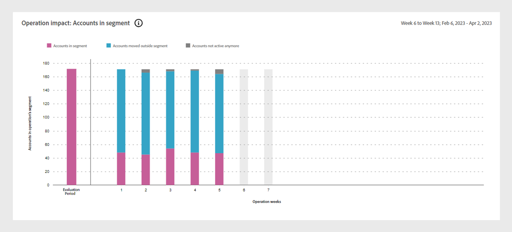
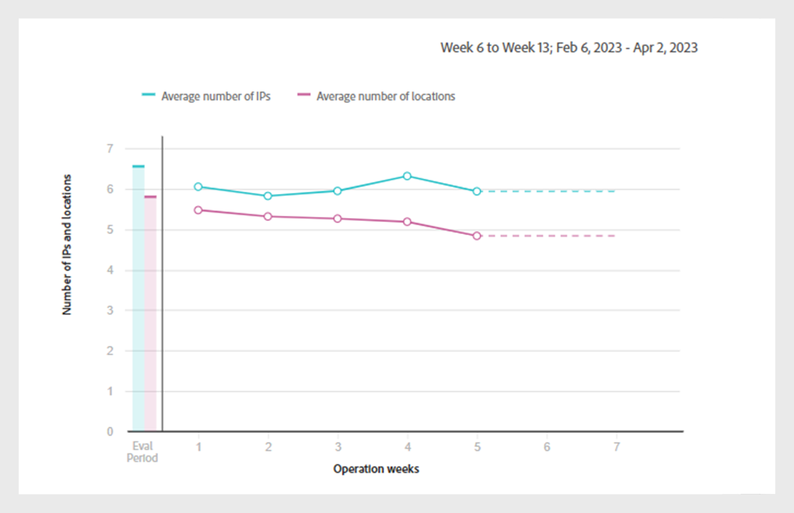
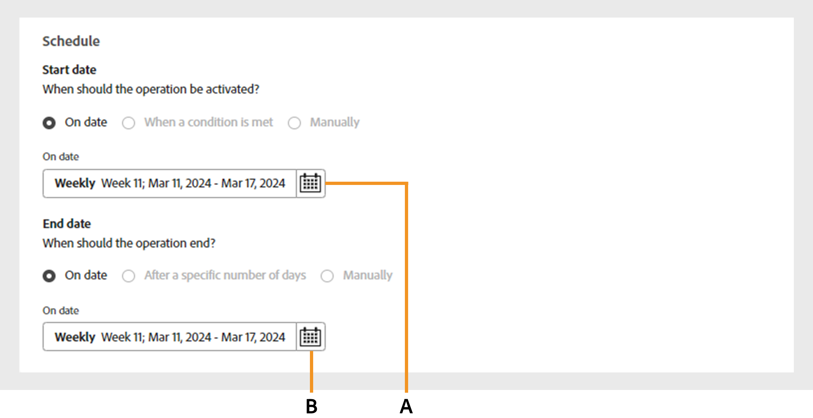
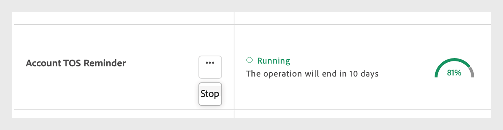

# 運用 {#operations-tab-next-steps}

を使用して購読者の使用パターンを分析し、選択したセグメントに対してパスワード共有のインスタンスを特定したら、 [!DNL Account IQ] analytics では、での操作と呼ばれる集中的な手順を通じてターゲットを絞ったアクションを実行できます。 [!DNL Account IQ].

**運用** を使用すると、アカウントのグループに対する資格情報共有を効果的に追跡および管理して、パスワード共有を軽減し、大切な購読者のエクスペリエンスを向上させることができます。

定義済みのにアクションを適用できます [セグメント](/help/accountiq/product-concepts.md#segment-def) 特定の内でパスワード共有に対処するには [時間間隔](/help/accountiq/product-concepts.md#time-interval-def) および後日に実行するように操作のスケジュールを設定します。 これらのアクションには、パスワード共有を最小限に抑える制限や、非共有アカウントに対する制約を緩和する制限が含まれます。

操作を使用すると、アクションとその範囲を指定するだけでなく、結果も測定できます。

結果を評価することで、借り手をコンバージョンしたり、資格情報の共有を軽減したり、チャーンを減らしたりして、戦略を調整して効果を最適化できます。

操作では、次のような様々な機能を実行できます。

* [運用レポートの表示](#operation-reports)
* [新しい操作の作成](#create-new-operation)
* [操作を停止](#stop-operation)

## 運用レポートの表示 {#operation-reports}

操作レポートを使用して、操作の影響を確認できます。 工程レポートを表示するには、次を選択します **運用** タブの下 **アクション** アカウント IQ アプリケーションの左パネルに表示されます。 システムで使用可能な操作のリストが表示されます。 各操作に関する主要な詳細には表形式でアクセスできます。 詳細は次のとおりです。

* 操作の名前
* 現在のステータス（スケジュール済み、実行中、終了、エラー、停止など）
* 進行状況完了率
* 操作が適用されるターゲットオーディエンスまたはセグメント
* 操作に対して選択されたアクションのタイプ
* 操作の開始日
* 操作の終了日
* 操作の作成日
* 操作の最終変更日

*Account IQ の既存の操作のリストと詳細*

目的のを選択します **操作名** 操作のリストから。 次のレポートが表示されます。

### 操作パフォーマンス {#operation-performance}

操作パフォーマンスでは、操作の実行中に、影響を受けたアカウントの数、操作の進行状況、セグメント内のアカウントの全体的な共有スコアを要約した上位の行の読み取り値を提供します [評価期間](/help/accountiq/product-concepts.md#evaluation-period-def).

*運用実績レポート*

**回答：** 影響を受けたアカウント **B.** 操作の進行状況 **C.** 共有の全体的なスコア

#### 影響を受けたアカウント {#impacted-accounts}

この数には、操作の評価期間中に実行されたアクションの影響を受けたサブスクライバーのアカウントの数が表示されます。

#### 操作の進行状況 {#operation-progress}

このゲージは、計画済スケジュールから完了した操作の日数と割合を示します。

#### 共有の全体的なスコア {#overall-sharing-score}

この折れ線グラフは、 [全体的な共有スコア](/help/accountiq/data-panels.md#overall-sharing-score)。これには、操作の評価期間中の各週の共有アカウントの共有レベルと使用状況が含まれます。

### 操作の影響：セグメント内のアカウント {#impact-accounts}

このレポートは、操作の影響の推移を示す積み重ね柱状グラフとして表示されます。

*セグメントグラフ内のアカウントに対する操作の影響*

X 軸は、操作のを表します [評価期間](/help/accountiq/product-concepts.md#evaluation-period-def)の場合、y 軸は操作のセグメント内のアカウントのステータスを示します。 グラフの各棒グラフは、次の 3 つの色に分かれています。

* ピンク色は、この操作で使用されるセグメントの条件を満たすアカウントの数を表します。

* 青は、元々セグメントに含まれていたが、操作の各週または各月の間にセグメントの条件を満たさなかったアクティブなアカウントの数を表します [評価期間](/help/accountiq/product-concepts.md#evaluation-period-def).

* グレーは、評価期間中に非アクティブだったアカウントを表します。

>[!NOTE]
>
>最初のピンク色のバーは、評価期間の開始時にオペレーションセグメントの条件を満たすアカウントの数を表します。

元の基準に対するアカウントの行動の変化が経時的に示されます（例えば、共有確率が 90 を超え、5 台を超えるデバイスが非アクティブになったなど）。

### 操作への影響：共有アカウントの指標 {#impact-shared-accounts}

共有アカウント・メトリックは、操作の処理中に、操作のセグメントの加入者アカウントによる共有レベルおよび再生要求の概要を示します [評価期間](/help/accountiq/product-concepts.md#evaluation-period-def).

#### 共有レベル {#share-level}

この折れ線グラフは、 [共有レベル](/help/accountiq/data-panels.md#sharing-level) オペレーションの評価期間にわたって毎週。

{width="550" align="left"}

*レベル折れ線グラフの共有*

#### 再生リクエスト数 {#play-requests}

この折れ線グラフは、 [リクエストを再生](/help/accountiq/general-usage-reports.md#playreq-uniquesubs) 操作の評価期間の各週。

{width="550" align="left"}

*再生リクエスト数の折れ線グラフ*

### 操作の影響：一般的な使用状況指標 {#impact-general-usage}

一般的な使用状況指標は、の操作中の操作のセグメントにおける平均デバイス数、IP 数、ロケーションの概要を提供します [評価期間](/help/accountiq/product-concepts.md#evaluation-period-def).

#### デバイス数 {#devices}

この折れ線グラフは平均を表します [デバイス数](/help/accountiq/general-usage-reports.md#devices-week-account) 操作の評価期間の各週。

{width="550" align="left"}

*デバイス数の折れ線グラフ*

#### IP と場所の数 {#IPs-locations}

この折れ線グラフは平均を表します [ip の数](/help/accountiq/general-usage-reports.md#ip-week-account) および [の場所](/help/accountiq/general-usage-reports.md#locations-week-account) 操作の評価期間の各週。

{width="550" align="left"}

*IP と場所の数の折れ線グラフ*

レポートを閉じてメインに戻るには **運用** ページ、選択 **運用** タブの下 **アクション** 左側のパネルで次の操作を行います。

## 新しい操作を作成 {#create-new-operation}

に移動すると、 **運用** タブの下 **アクション** 左パネルで、を選択します。 **新しい操作を作成** の上部 **運用** ページ。

新しい操作を作成するには、次の節の手順に従います。

* [操作の詳細](#operation-details)
* [セグメント](#segment)
* [アクション](#action)
* [スケジュール](#schedule)

### 操作の詳細 {#operation-details}

このセクションでは、で操作の名前を入力します。 **操作名**.

>[!TIP]
>
>操作の目的またはアクションの特性を説明する **操作名** すばやく識別するために使用します。 対するオプション **説明とタグを追加** 今後のリリースで利用できるようになります。

*操作名を追加*

### セグメント {#segment}

このセクションで、 **セグメントを選択** この操作を使用するセグメントを選択します。 学ぶ [セグメントの選択方法](/help/accountiq/segments-timeinterval.md#segment-selection).

セグメントを選択したら、を使用します  アイコンをクリックして詳細なセグメントの概要を表示します。 詳細を読む： [セグメントの概要](segments-timeinterval.md#segment-summary).

*セグメントと時間間隔を選択*

>[!NOTE]
>
>この [ビデオカテゴリ](product-concepts.md#video-category-def) 前の画像に表示（例：） **MVPD**, **プログラマー**、および **チャネル** tv Everywhere バージョンの Account IQ で使用されるラベルを表します。 D2C サービスとしてログインしている場合、これらのラベルには会社の特定のビデオカテゴリが表示されます。

必要に応じて、を使用します  選択したセグメントを編集するアイコン   アイコンをクリックして新しいセグメントを作成します。 詳しくは、次の手順を参照してください [新しいセグメントの作成](work-with-segments.md#create-new-segment) または [セグメントの編集](work-with-segments.md#edit-segment).

>[!IMPORTANT]
>
>**セグメントタイプ** 名前付き **[!UICONTROL Fixed number of accounts]** は現在、デフォルトで選択されています。 選択するオプション **[!UICONTROL Variable number of accounts]** は今後のリリースで利用可能になる予定です。

を選択 **精度と時間間隔** 特定の期間の動作を監視する。 の詳細 [精度と時間間隔の選択方法](/help/accountiq/segments-timeinterval.md#granularity-timeinterval).

### アクション {#action}

このセクションでは、 **アクション** ドロップダウンメニューから選択したセグメントに対して実行する。

*アクションのタイプを選択*

次の 2 つのオプションを使用できます。

* を選択 **CM ポリシー** アカウント IQ と統合された同時実行監視システムの場合。

* を選択 **外部アクション** アカウント IQ システムと統合されていないアカウント IQ 外部のワークフローを作成および処理します。

>[!NOTE]
>
>外部アクションは、パスワードの共有に直接関連するとは限りませんが、新しいシーズンの開始など、パスワードの共有に影響を与える可能性があります。

### スケジュール {#schedule}

このセクションでは、 **開始日** および **終了日** を使用して、操作のアクティブ化を設定します。

>[!IMPORTANT]
>
>現在、デフォルトのアクティベーション **開始日** および **終了日** はに設定されています。 **On date**. 選択するオプション **条件が満たされた場合** および **手動** は今後のリリースで利用可能になる予定です。

>[!NOTE]
>
>開始日と終了日の両方が、での評価用に選択された精度に合っていることを確認してください **手順 4**.

* 週ごとに集計する精度を選択した場合は、開始日と終了日を週単位で指定します（例：週 10）。
* 月ごとに集計した精度を選択した場合は、開始日と終了日を月で選択します。

*日付選択から開始日と終了日を選択します*

**回答：** 開始日選択 **B.** 終了日ピッカー

>[!NOTE]
>
>この **開始日** は、評価期間と現在の日付の両方より後である必要がありますが、 **終了日** 将来の期間で操作をスケジュールおよび実行するには、開始日および現在の日付よりも後である必要があります。

を選択 **保存操作** の上部 **運用** 新しい操作を処理するページ。

## 操作を停止 {#stop-operation}

現在実行中の操作のみを停止できます **実行中** ステータス。 既存の操作を停止するには、次の手順に従います。

1. に移動します。 **運用** タブの下 **アクション** アカウント IQ アプリケーションの左側のナビゲーションで。
1. を選択 **オプション** 停止する操作のメニュー。

   

   *操作を停止するには、オプションメニューを選択します*

1. を選択 **停止**.

