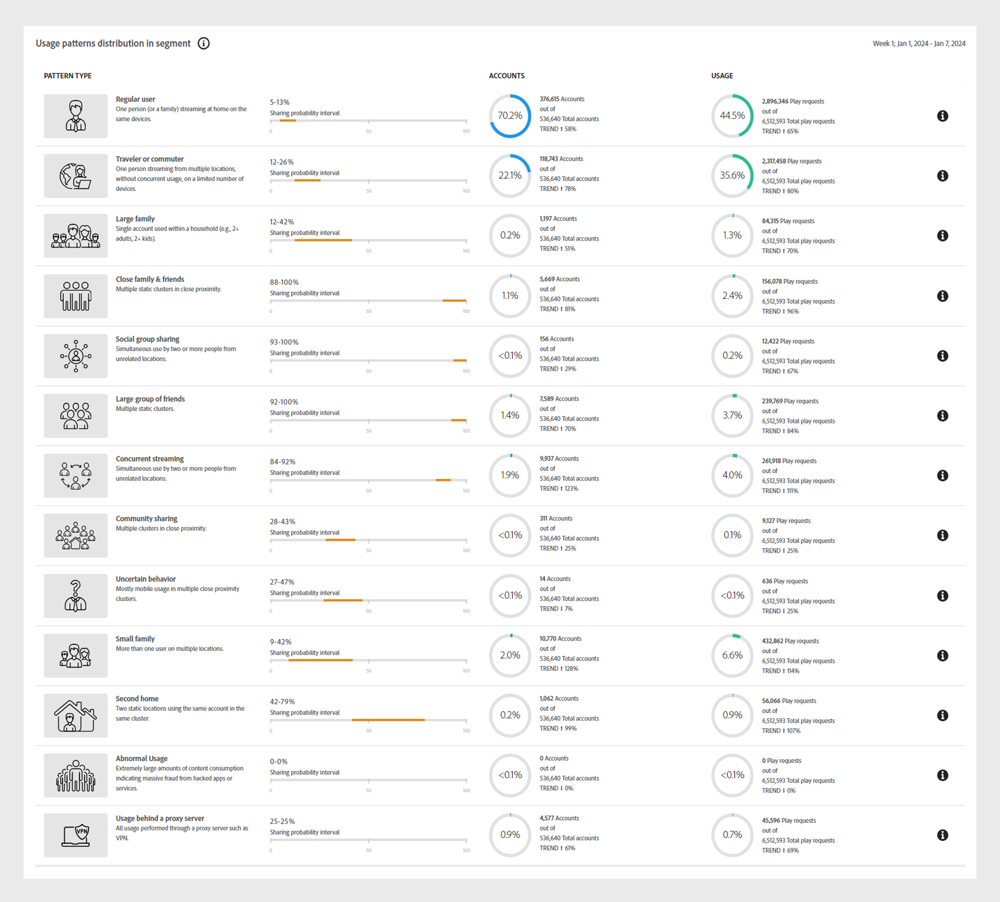
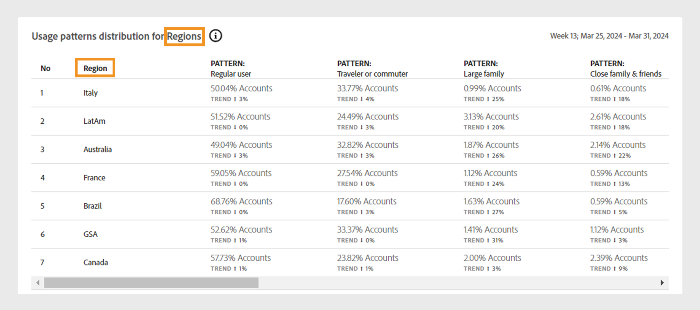

# 使用パターン {#usage-patterns}

アカウント IQ は、加入者アカウントのユーザーを、その社会行動の観点から、旅行者または通勤者、大家族、コミュニティ共有などの様々なカテゴリに分類します。 この **使用パターン** このページには、これらのユーザータイポロジに関するいくつかの異なる分析およびレポートが表示されます。 例： **使用パターンの分布** レポートでは、現在のセグメントの使用状況の動作とすべてのアカウントの使用状況の比較が行われます。

アプリの他のページと同様に、ここでの分析とレポートは、 [セグメントパネル](/help/accountiq/segments-timeinterval.md).

## 使用パターンの分布 {#usage-pattern-dis}

クラスターの棒グラフは、各ソーシャル動作または使用パターンの購読者の数と割合を示します。

+++D2C サービス：使用パターン分布 – セグメント内のユーザー

以下のクラスターの棒グラフは、現在のセグメントの使用パターン分布を、すべてのアカウントを含むセグメントと比較します。

*使用パターン分布 – セグメントのユーザー*

+++

+++どこでもテレビ：利用パターンの分布 – セグメントのユーザーと業界のユーザー

現在のセグメントの各使用パターンを業界全体と比較する以外に、すべてのアカウントを含むセグメントとも比較します。

*使用パターン分布 – セグメントと業界のユーザー*

+++

## セグメントでの使用パターンの分布 {#usage-pattern-dis-segment}

この **[!UICONTROL Usage patterns distribution in segment]** パネルには、各ユーザーパターンに関する次の情報が表形式で表示されます。

* 個々のアカウントが該当する確率範囲を共有します。
* そのパターン内のアカウントの数と割合。
* 再生リクエストに関して、そのカテゴリにおけるサブスクライバーの全体的な使用状況と割合。

*セグメントでの使用パターンの分布*

例えば、上記のビジュアライゼーションでは次のようになります。

* 定義されたセグメント内の通常のユーザー（1 か所のデバイス数が限られている 1 人から少数のユーザー）のアカウント共有確率は、5 ～ 13% です。

* 加入者アカウント総数（536,640）の 70.2% （376,615）は通常のユーザーです。

* 総再生要求（6,512,593）の 44.5% （2,896,346）は正規ユーザーによるものである。

## ビデオカテゴリの使用パターンの分布 {#usage-pattern-dis-video-categories}

+++D2C サービス：地域の使用パターンの分布

この **[!UICONTROL Usage pattern distribution]** 表は、での使用パターンを比較したものです [ビデオカテゴリ](product-concepts.md##video-category-def) 現在のセグメント内。

*地域の使用パターンの分布*

>[!NOTE]
>
>前の画像に表示されるビデオカテゴリ（など）。 **地域** は一例です。 アカウント IQ にログインすると、ラベルに会社の特定のビデオカテゴリが表示されます。

+++

+++プログラマー：MVPD の使用パターンの分布

この **[!UICONTROL Usage pattern distribution]** 現在のセグメントにおける MVPD の使用パターン分布の比較を表に示します。

*プログラマー向けの使用パターンの分布*

+++

+++MVPD：プログラマー向けの使用パターンの分布

この **[!UICONTROL Usage pattern distribution]** 表は、現在のセグメントのプログラマーまたはチャネルの使用パターン分布の比較を示しています。

*MVPD の使用パターンの分布*

+++
