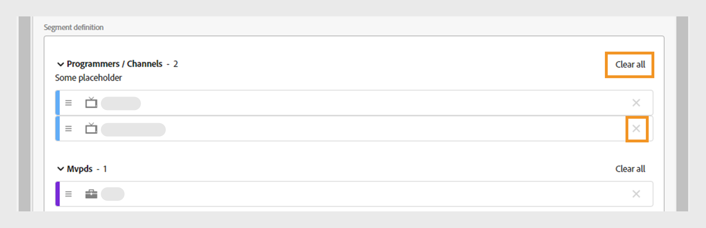

# セグメントの操作 {#work-with-segments}

[ セグメント ](product-concepts.md#segmet-def) は、ユーザーが定義した条件の下で秘密鍵証明書の共有を分析できる、購読者のアカウントの集まりです。 セグメントを使用すると、様々なサブスクライバーアカウントのセットを調べ、対応するデータレポートをテーブルとグラフで生成できます。 Account IQには次の 2 種類のセグメントがあります。

1. **デフォルトのセグメント**:**プロパティのすべてのアカウント** はシステム内の標準のセグメントで、特定の条件が適用されていないすべてのアクティブなサブスクライバーアカウントが含まれています。

   >[!NOTE]
   >
   >デフォルトセグメントを使用すると、[ セグメントのビデオカテゴリ ](data-panels.md#video-categories-segment)、[ チャネルと MVPD によるスコアの共有 ](data-panels.md#sharin-score-by-channels-and-mvpds)、[ ビデオカテゴリの使用パターン分布 ](usage-patterns.md#usage-pattern-dis-video-categories) などの特定のテーブルを表示できない場合があります。 これらのテーブルは、一度に最大 20 行のデータのみを格納および表示できます。 残りのテーブル、グラフおよびレポートは、デフォルトセグメントとカスタムセグメントで同じです。

1. **カスタムセグメント**:D2C コンテンツタイプ、プログラマー、チャネル、MVPD などの特定のカテゴリの購読者アカウントをグループ化し、ユーザー定義の条件下で資格情報の共有を分析するための、カスタマイズされたセグメントです。 詳しくは、[ カスタムセグメントの作成 ](#create-new-segment) 方法を参照してください。

   >[!IMPORTANT]
   >
   >このガイドで説明する手順はすべて、カスタムセグメントに基づいています。 ただし、デフォルトセグメントとカスタムセグメントの概念は同じままです。

**アクション** に移動し、左パネルの「**[!UICONTROL Segments]**」タブを選択すると、システムで使用可能なセグメントのリストが表示されます。 セグメントページを使用すると、各セグメントの主な詳細を表形式ですばやく評価できます。 詳細には、セグメント名、現在のセグメントを使用している [ ビデオカテゴリ ](product-concepts.md#video-category-def) 数、指標、[ 操作 ](product-concepts.md#operation-def)、最終変更日時、セグメント作成者の名前が含まれます。

セグメントで実行できる関数は次のとおりです。

* [新しいセグメントの作成](#create-new-segment)
* [セグメントの管理](#manage-segments)

## 新しいセグメントの作成 {#create-new-segment}

新しいセグメントを作成するプロセスは、D2C サービスと TV Everywhere と似ています。 ビデオカテゴリは、Account IQのバージョンごとに異なります。

+++D2C サービス

セグメントを作成し購読者の共有動作を分析するには、右上の「**[!UICONTROL Create new segment]**」を選択します。

*「新しいセグメントを作成」を選択*

>[!NOTE]
>
>前の画像に示すビデオカテゴリ（**地域** や **コンテンツタイプ** など）は、一例です。 Account IQにログインすると、これらのラベルに会社固有のビデオカテゴリが表示されます。

次の要素を含む **新規セグメント** ページが開きます。

*新しいセグメントページ*

**A.** セグメントコンポーネント **B.** セグメント定義 **C.** セグメント概要

* **セグメントコンポーネント**：セグメントの定義に使用される [ ビデオカテゴリ ](product-concepts.md##video-category-def) 計算指標のインベントリ。

  >[!NOTE]
  >
  >**[!UICONTROL Show all]** を使用して、セグメントコンポーネントのリストを展開します。 コンポーネントをすばやく見つけるには、リスト全体をスクロールするのではなく、**検索セグメントコンポーネント** でその名前を検索します。

* **セグメント定義**：様々なセグメントコンポーネントをドラッグ&amp;ドロップしてセグメントを作成できるキャンバス。

* **セグメントの概要**：セグメント定義の構成要素に基づいて適格勘定科目を見積もり、評価期間中のセグメントの概要を提供する概要。

セグメントを作成するには、次の手順を実行します。

1. セグメントのリストとセグメントの選択時に表示される **セグメント名** にセグメントの名前を入力します。
1. セグメントの詳細な説明を「**セグメントの説明**」に入力します。
1. 例えば、左側のパネルのセグメントコンポーネントから **地域とコンテンツタイプ** をドラッグし、**セグメント定義** 内の **地域/コンテンツタイプ** セクションにドロップします。

   >[!NOTE]
   >
   >地域またはコンテンツタイプのいずれかに基づいてセグメントを作成できます。 ドロップダウンメニューから、地域の関連コンテンツタイプを表示します。

   「**地域/コンテンツタイプ**」セクションで **コンテンツタイプ** を追加することから開始する場合、コンテンツタイプは後続のコンポーネントとしてのみ追加できます。

   最初に [**地域/コンテンツ タイプ**] セクションに **地域** を追加すると、決定ダイアログ ボックスが表示されます。

   {width="550" align="left"}

   *セグメントコンポーネントを領域またはそのコンテンツタイプダイアログとして追加する*

   領域に関連付けられているコンテンツタイプに基づいて、特定の領域とセグメントのどちらを比較するかを決定します。

   「**[!UICONTROL As a region]**」を選択すると、「**地域/コンテンツタイプ**」セクションに地域が追加されます。

   地域のコンテンツタイプを追加するには、「**[!UICONTROL As its content types]**」を選択します。

1. 左側のパネルのセグメントコンポーネントから **指標** をドラッグし、**セグメント定義** 内の **指標** セクションにドロップします。

   

   *演算子を選択し、追加した指標の値を割り当てます*

   セグメント定義に指標を追加した後、ドロップダウンメニューから演算子 **[!UICONTROL Select an operator]** 選択し、**[!UICONTROL Select an option]** を使用して値を割り当てます。

   上向き矢印で増加、下向き矢印で減少して、特定の指標の値を調整します。

1. 左側のパネルのセグメントコンポーネントから **計算指標** をドラッグし、**セグメント定義** 内の **計算指標** セクションにドロップします。

   

   *演算子を選択し、追加した計算指標の値を割り当てます*

   セグメント定義で計算指標を追加した後、ドロップダウンメニューから **[!UICONTROL Select an operator]** 力し、**[!UICONTROL Select an option]** を使用して値を割り当てます。

   >[!NOTE]
   >
   >セグメント定義の下にドロップするすべての指標と計算指標には、それぞれの指標と計算指標に値を割り当てるための適切な演算子が付属しています。

1. **セグメントの概要** でセグメントの詳細を確認して、セグメント全体に実装する変更を決定します。
1. **評価期間** ドロップダウンメニューから「**[!UICONTROL Last week]**」または「**[!UICONTROL Last month]**」を選択して、過去 1 週間または 1 か月の要約値を見積もります。
1. 「**[!UICONTROL Update estimation]**」を選択し、選択した評価期間に基づいて現在のセグメントの推定適格アカウント数を計算します。
1. 「**[!UICONTROL Save segment]**」を選択します。

作成したセグメントは、セグメントリストで使用できるようになりました。

+++

+++どこでも視聴できるテレビ

セグメントを作成し購読者の共有動作を分析するには、右上の「**[!UICONTROL Create new segment]**」を選択します。

*「新しいセグメントを作成」を選択*

次の要素を含む **新規セグメント** ページが開きます。

*新しいセグメントページ*

**A.** セグメントコンポーネント **B.** セグメント定義 **C.** セグメント概要

* **セグメントコンポーネント**：セグメントの定義に使用するプログラマーとチャネル、MVPD、指標、計算指標のインベントリ。

  >[!NOTE]
  >
  >**[!UICONTROL Show all]** を使用して、セグメントコンポーネントのリストを展開します。 コンポーネントをすばやく見つけるには、リスト全体をスクロールするのではなく、**検索セグメントコンポーネント** でその名前を検索します。

* **セグメント定義**：様々なセグメントコンポーネントをドラッグ&amp;ドロップしてセグメントを作成できるキャンバス。

* **セグメントの概要**：セグメント定義の構成要素に基づいて適格勘定科目を見積もり、評価期間中のセグメントの概要を提供する概要。

セグメントを作成するには、次の手順を実行します。

1. セグメントのリストとセグメントの選択時に表示される **セグメント名** にセグメントの名前を入力します。
1. セグメントの詳細な説明を「**セグメントの説明**」に入力します。
1. 左側のパネルのセグメントコンポーネントから **プログラマーとチャネル** をドラッグし、**セグメント定義** 内の **プログラマー/チャネル** セクションにドロップします。

   >[!NOTE]
   >
   >プログラマーまたはチャネルのいずれかに基づいてセグメントを作成できます。 ドロップダウンメニューから、プログラマーに関連付けられたチャネルを表示します。

   「**プログラマー/チャネル**」セクションで **チャネル** を追加することから開始する場合、後続のコンポーネントとして追加できるのはチャネルのみです。

   最初に **プログラマ** を [ プログラマ/チャネル **セクションに追加すると、決定ダイアログ ボックスが表示** れます。

   {width="550" align="left"}

   *セグメントコンポーネントをプログラマーまたはそのチャネルダイアログとして追加する*

   プログラマーに関連付けられたチャネルに基づいて、特定のプログラマーとセグメントのどちらを比較するかを決定します。

   「**[!UICONTROL As a programmer]**」を選択して、「**プログラマー/チャネル**」セクションにプログラマーを追加します。

   プログラマーのすべてのチャネルを追加するには、「**[!UICONTROL As its channels]**」を選択します。

1. 左側のパネルのセグメントコンポーネントから **MVPD** をドラッグし、**セグメント定義** 内の **MVPD** セクションにドロップします。

   >[!NOTE]
   >
   >プログラマーとしてログインすると、**xfinity** という名前の MVPD が [**MVPD**] セクションにスタンドアロン オプションとして表示されます。 他の MVPD と組み合わせることはできません。

1. 左側のパネルのセグメントコンポーネントから **指標** をドラッグし、**セグメント定義** 内の **指標** セクションにドロップします。

   

   *演算子を選択し、追加した指標の値を割り当てます*

   セグメント定義に指標を追加した後、ドロップダウンメニューから演算子 **[!UICONTROL Select an operator]** 選択し、**[!UICONTROL Select an option]** を使用して値を割り当てます。

   上向き矢印で増加、下向き矢印で減少して、特定の指標の値を調整します。

1. 左側のパネルのセグメントコンポーネントから **計算指標** をドラッグし、**セグメント定義** 内の **計算指標** セクションにドロップします。

   

   *演算子を選択し、追加した計算指標の値を割り当てます*

   セグメント定義で計算指標を追加した後、ドロップダウンメニューから **[!UICONTROL Select an operator]** 力し、**[!UICONTROL Select an option]** を使用して値を割り当てます。

   >[!NOTE]
   >
   >セグメント定義の下にドロップするすべての指標と計算指標には、それぞれの指標と計算指標に値を割り当てるための適切な演算子が付属しています。

1. **セグメントの概要** でセグメントの詳細を確認して、セグメント全体に実装する変更を決定します。
1. **評価期間** ドロップダウンメニューから「**[!UICONTROL Last week]**」または「**[!UICONTROL Last month]**」を選択して、過去 1 週間または 1 か月の要約値を見積もります。
1. 「**[!UICONTROL Update estimation]**」を選択し、選択した評価期間に基づいて現在のセグメントの推定適格アカウント数を計算します。
1. 「**[!UICONTROL Save segment]**」を選択します。

作成したセグメントは、セグメントリストで使用できるようになりました。
+++

## セグメントの管理 {#manage-segments}

セグメントリストからセグメントを選択して、次のアクションを実行できます。

* [セグメントの編集](#edit-segment)
* [セグメントの複製](#duplicate-segment)
* [セグメントの削除](#delete-segment)

*編集、複製または削除するセグメントを選択*

**A.** [ デフォルトセグメント ](#work-with-segments) **B.** [ ビデオカテゴリ ](product-concepts.md#video-category-def)

>[!NOTE]
>
>この節で示す **MVPD**、**プログラマー**、**チャンネル** などのビデオカテゴリは、Account IQの TV Everywhere 版で使用されるラベルを表します。 D2C サービスとしてログインしている場合、これらのラベルには会社の特定のビデオカテゴリが表示されます。

**プロパティ内のすべてのアカウント** という名前のデフォルトのセグメントを編集、複製、削除することはできません。

### セグメントの編集 {#edit-segment}

1. 左側のパネルで、**アクション** の下にある「**[!UICONTROL Segments]** ーディエンス」タブに移動し、セグメントのリストを表示します。
1. 編集するセグメントを選択します。
1. 「**[!UICONTROL Edit]**」を選択します。
1. セグメントの詳細（セグメント名、説明、**セグメント定義** のコンポーネントなど）を変更します。

   >[!TIP]
   >
   >**[!UICONTROL Clear all]** を使用すると、セグメント定義の各セクション内のすべてのセグメントコンポーネントを一度に削除できます。 または、「クロス」ボタンを選択して個々の項目を削除します。

    の下の各セクションのすべてのセグメントコンポーネントを消去します

   *すべてをクリアを選択して、すべてのセグメントコンポーネントを一度に削除*

1. **[!UICONTROL Update segment]** を選択して既存のセグメントを更新するか、**[!UICONTROL Save as new segment]** を選択して変更を含む新しいセグメントを作成します。

   >[!NOTE]
   >
   >現在操作中のセグメントを更新することはできません。 操作が進行中のセグメントでは、変更を新しいセグメントとして保存する以外に、保存するオプションはありません。

### セグメントの複製 {#duplicate-segment}

1. 左側のパネルで、**アクション** の下にある「**[!UICONTROL Segments]** ーディエンス」タブに移動し、セグメントのリストを表示します。
1. 複製するセグメントを選択します。
1. 「**[!UICONTROL Duplicate]**」を選択します。

選択したセグメントのコピーが生成され、セグメントリストの最後に配置されます。 複製したセグメントで必要な詳細を編集し、複製したセグメントを更新するか、新しいセグメントとして保存できます。

### セグメントの削除 {#delete-segment}

1. 左側のパネルで、**アクション** の下にある「**[!UICONTROL Segments]** ーディエンス」タブに移動し、セグメントのリストを表示します。
1. 削除するセグメントを選択します。

   複数のセグメントを選択すると、1 回の操作でセグメントを削除できます。 **セグメント名** の左側にあるチェックボックスを選択して、すべてのセグメントを一度に削除することもできます。

   >[!NOTE]
   >
   > 操作で複数のセグメントを使用している場合、またはすべてのセグメントを削除できるのは、どのセグメントも使用されていない場合のみです。 また、「プロパティ内のすべてのアカウント **という名前のデフォルトセグメントを削除す** ことはできません。 すべてのセグメントを一度に削除しようとすると、選択されていない状態のままになります。

   

   *複数のセグメントを選択して複数のセグメントを削除する*

1. 「**[!UICONTROL Delete]**」を選択します。
1. セグメ **[!UICONTROL Delete]** トを完全に削除するには、ダイアログで「」を確定します。

   >[!NOTE]
   >
   >セグメントはシステムから完全に削除されます。この操作を元に戻すことはできません。
