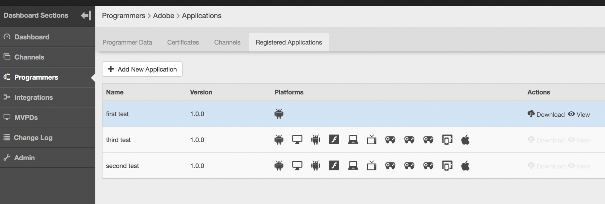

# 動的なクライアント登録管理 {#dynamic-client-registration-management}

>[!NOTE]
>
>このページのコンテンツは情報提供のみを目的としています。 この API を使用するには、Adobeから現在のライセンスが必要です。 無許可の使用は許可されていません。

## 概要 {#overview}

お客様のアプリケーションにおいて、[Android Chromeのカスタムタブ ](https://developer.chrome.com/multidevice/android/customtabs){target_blanck} および [Apple Safari ビューコントローラー ](https://developer.apple.com/documentation/safariservices/sfsafariviewcontroller){target_blanck} が広く採用されるようになり、Adobe Pass認証のユーザー認証フローが更新されました。 より具体的には、MVPD 加入者を認証するユーザーエージェントフローをリダイレクト間で追跡できるように、状態を維持するという目標を達成できなくなりました。 これは、以前は HTTP Cookie を使用して行われていました。 この制限は、すべての API を OAuth 2.0[RFC6749](https://tools.ietf.org/html/rfc6749){target_blanck} への移行を開始するためのドライバーです。

このアップデートにより、Adobe認証クライアントが OAuth 2.0 クライアントになり、Adobe Pass認証サービスのニーズに対応するためにカスタム OAuth 2.0 認証サーバーがデプロイされます。

クライアントアプリケーションが OAuth 2.0 認証を利用するには、サーバーが操作できるように特定の情報（クライアント資格情報）を取得するために、サーバーが動的に登録される必要があります。 登録プロセスの一環として、クライアントは組み込みメタデータのセットをクライアント登録エンドポイントに提示する必要があります。

このメタデータは、ソフトウェアステートメントとして通信されます。このステートメントには「software_id」が含まれ、承認サーバーが同じソフトウェアステートメントを使用してアプリケーションの異なるインスタンスを関連付けることができます。

**software statement** は、クライアントソフトウェアに関するメタデータ値をバンドルとしてアサートする JSON web トークン（JWT）です。 クライアント登録リクエストの一環として認証サーバーに提示する場合、ソフトウェアのステートメントは、JSON web 署名（JWS）を使用してデジタル署名または MAC 化する必要があります。

ソフトウェアのステートメントとその仕組みについて詳しくは、公式ドキュメント [RFC7591](https://tools.ietf.org/html/rfc7591) を参照してください。

ソフトウェアステートメントは、ユーザーのデバイス上のアプリケーションと共にデプロイする必要があります。

このアップデート以前は、アプリケーションでAdobe Pass Authentication への呼び出しを実行できる仕組みが 2 つありました。

* ブラウザーベースのクライアントは、許可された [ ドメインリスト ](/help/authentication/programmer-overview.md#reg-and-init) で登録されます
* iOSやAndroid アプリケーションなどのネイティブアプリケーションクライアントは、**署名済みリクエスター** メカニズムを通じて登録されます

クライアント登録認証メカニズムを使用して、アプリケーションを TVE ダッシュボードに追加する必要があります。

お客様が新しいAndroid SDK と今後のiOS SDK の実装を開始するには、ソフトウェアに関する声明が必要です。 ソフトウェア ステートメントは、TVE ダッシュボードで作成されたアプリケーションを識別します。

TVE ダッシュボードで登録済みアプリケーションを作成するには、以下のセクションの手順に従います。

## 登録済みアプリケーションの作成 {#create_app}

TVE Dashboard で登録済みアプリケーションを作成する方法は 2 つあります。

* [ プログラマーレベル ](#prog-level) – 登録済みアプリケーションを作成し、任意またはすべてのプログラマーチャネルにリンクできます。

* [ チャネルレベル ](#channel-level) – このチャネルのみに永続的にリンクされる登録済みアプリケーションを作成できます。

### プログラマーレベルでの登録済みアプリケーションの作成 {#prog-level}

**プログラマー**/**登録済みアプリケーション** タブに移動します。

「登録済みアプリケーション」タブで、「**新しいアプリケーションを追加**」をクリックします。 新しいウィンドウで必須フィールドに入力します。

次の画像に示すように、入力が必要なフィールドは次のとおりです。

* **アプリケーション名** - アプリケーションの名前

* **チャネルに割り当て** – このアプリケーションがリンクされているチャネルの名前 o。 ドロップダウンマスクのデフォルト設定は **すべてのチャネル」です。** インターフェイスでは、1 つのチャネルまたはすべてのチャネルを選択できます。

* **アプリケーションバージョン** - デフォルトでは「1.0.0」に設定されていますが、独自のアプリケーションバージョンで変更することを強くお勧めします。 ベストプラクティスとして、アプリケーションのバージョンを変更する場合は、新しい登録アプリケーションを作成して反映します。

* **アプリケーションプラットフォーム** - リンクするアプリケーションのプラットフォーム。 すべての値または複数の値を選択することもできます。

* **ドメイン名** - リンク先のアプリケーションのドメイン。 ドロップダウンリスト内のドメインは、すべてのチャネルのすべてのドメインを統合的に選択したものです。 リストから複数のドメインを選択することもできます。 ドメインの意味は、リダイレクト URL[RFC6749](https://tools.ietf.org/html/rfc6749) です。 クライアント登録プロセスでは、認証フローの最終処理にリダイレクト URL を使用することをクライアントアプリケーションに許可するリクエストを実行できます。 クライアントアプリケーションが特定のリダイレクト URL をリクエストすると、ソフトウェア文に関連付けられたこの登録済みアプリケーションにホワイトリストに登録されているドメインに対して検証されます。

適切な値をフィールドに入力した後、アプリケーションを設定に保存するには、「完了」をクリックする必要があります。

**作成済みのアプリケーションを変更するオプションはありません** のでご注意ください。 作成した項目が要件を満たしていないことが判明した場合は、新しい登録アプリケーションを作成し、要件を満たすクライアントアプリケーションと共に使用する必要があります。

### チャネルレベルでの新しいアプリケーションの登録 {#channel-level}

チャネルレベルで登録されたアプリケーションを作成するには、「チャネル」メニューに移動し、アプリケーションを作成するものを選択します。 次に、「登録済みアプリケーション」タブに移動した後、「新しいアプリケーションの追加」ボタンをクリックします。

以下に示すように、ここで少し異なるのは、「割り当てられたチャネル」ドロップダウンです。このドロップダウンは有効になっていないので、登録されたアプリケーションを現在のチャネル以外にバインドするオプションはありません。

## アプリケーションのリスト {#list-reg-app}

登録アプリケーションを作成した後、リクエストの一部として認証サーバーに提示するソフトウェアステートメントを取得する可能性があります。

これは、登録されたアプリケーションが作成されたプログラマーまたはチャネルに移動して、それらが一覧表示されることで実行できます。

以下に説明するように、リスト内の各エントリは、バインド先のプラットフォームの名前、バージョン、記号で識別されます。

それぞれについて、次のことができます。

* [表示](#view)
* [ソフトウェアのステートメントのダウンロード](#download-statement)

### 登録済みアプリケーションの表示 {#view}

アプリケーションのリストで、それらのいずれかを選択して「表示」ボタンをクリックすると、作成時に使用された詳細が表示されます。 前述のように、何も変更するオプションはありません。

### ソフトウェアのダウンロード ステートメント {#download-statement}

ソフトウェア ステートメントが必要なリスト エントリの [ ダウンロード ] ボタンをクリックすると、テキスト ファイルが生成されます。 このファイルには、以下のサンプル出力に似たものが含まれます。

ファイル名は、先頭に「software_statement」を付け、現在のタイムスタンプを追加することによって、一意に識別されます。

同じ登録済みアプリケーションの場合、ダウンロードボタンがクリックされるたびに異なるソフトウェア明細書が受信されますが、これにより以前に取得したソフトウェア明細書がこのアプリケーションで無効になることはありません。 これは、アクションのリクエストに応じて、その場で生成されるからです。

ダウンロードアクションに関しては、1 つ **制限** があります。 登録されたアプリケーションの作成後すぐに「ダウンロード」ボタンをクリックしてソフトウェアのステートメントを要求されたものの、それがまだ保存されておらず、設定 json が同期されていない場合、次のエラーメッセージがページ下部に表示されます。

登録されたアプリケーションの ID がまだ反映されておらず、コアに認識されていないので、コアから受け取った HTTP 404 Not Found エラーコードがラップされます。

解決策は、登録されたアプリケーションを作成した後、設定が同期されるまで最大 2 分待つことです。 これが発生すると、エラーメッセージは受信されなくなり、ソフトウェアのステートメントを含むテキストファイルをダウンロードできるようになります。

エンドツーエンドプロセスの仕組みの詳細や、リクエストの実行方法と期待される応答について何らかのインサイトを得るには、他の役立つリンクと共に、以下の関連情報のリンクを参照してください。

<!--
## Related Information {#related}

* [Dynamic Client Registration API](/help/authentication/dynamic-client-registration-api.md)
* [TVE Dashboard User Guide](/help/authentication/tve-dashboard-user-guide.md)
-->

## 機能デモ {#tutorial}

機能のコンテキストを詳しく説明する [ このウェビナー ](https://my.adobeconnect.com/pzkp8ujrigg1/) をご覧ください。これには、TVE ダッシュボードを使用してソフトウェアステートメントを管理する方法と、Android SDK の一部としてAdobeから提供されるデモアプリケーションを使用して生成されたステートメントをテストする方法のデモが含まれています。
