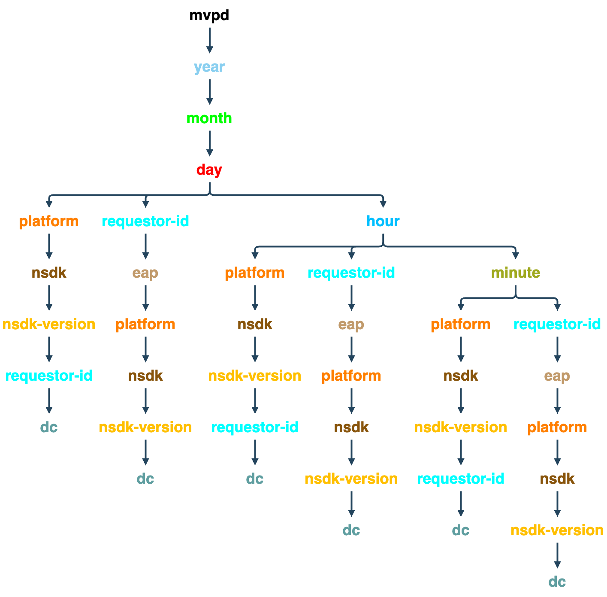

# 使用権限サービスモニタリング API {#entitlement-service-monitoring-api}

>[!IMPORTANT]
>
>このページのコンテンツは情報提供のみを目的としています。 この API を使用するには、Adobeから現在のライセンスが必要です。 無許可の使用は許可されていません。

>[!IMPORTANT]
>
> Degradation API を使用する前に、次の前提条件が満たされていることを確認してください。
>
> * [ クライアント資格情報の取得 ](../../rest-apis/rest-api-dcr/apis/dynamic-client-registration-apis-retrieve-client-credentials.md) API ドキュメントの説明に従って、クライアント資格情報を取得します。
> * [ アクセストークンの取得 ](../../rest-apis/rest-api-dcr/apis/dynamic-client-registration-apis-retrieve-access-token.md) API ドキュメントの説明に従って、アクセストークンを取得します。
>
> 登録されたアプリケーションを作成してソフトウェアのステートメントをダウンロードする方法について詳しくは、[ 動的クライアント登録の概要 ](../../rest-apis/rest-api-dcr/dynamic-client-registration-overview.md) ドキュメントを参照してください。

## API の概要 {#api-overview}

権利付与サービスモニタリング（ESM）は，WOLAP （Web ベース [ オンライン分析処理 ](https://en.wikipedia.org/wiki/Online_analytical_processing){target=_blank}）プロジェクトとして実施される。 ESM は、データウェアハウスに基づく汎用のビジネスレポート Web API です。 これは、一般的な OLAP 操作を RESTfully で実行できる HTTP クエリ言語として機能します。

>[!NOTE]
>
>ESM API は一般には使用できません。 可用性に関する質問については、Adobe担当者にお問い合わせください。

ESM API は、基盤となる OLAP キューブの階層ビューを提供します。 URL パスセグメントとしてマッピングされたディメンション階層内の各リソース [ ディメンション ](#esm_dimensions)）は、現在の選択対象の（集計） [ 指標 ](#esm_metrics) を含むレポートを生成します。 各リソースは、親リソース（ロールアップの場合）とそのサブリソース（ドリルダウンの場合）を指します。 スライスとダイシングは、ディメンションを特定の値や範囲にピン留めするクエリ文字列パラメーターによって実現されます。

REST API は、ディメンションパス、提供されたフィルターおよび選択された指標に従って、リクエストで指定された期間内に使用可能なデータを提供します（提供されていない場合はデフォルト値にフォールバックします）。 時間範囲は、時間ディメンション（年、月、日、時間、分、秒）を含まないレポートには適用されません。

エンドポイント URL のルートパスは、使用可能なドリルダウンオプションへのリンクと共に、1 つのレコード内の全体的な集計指標を返します。 API のバージョンは、エンドポイント URI パスの末尾のセグメントとしてマッピングされます。 例えば、`https://mgmt.auth.adobe.com/esm/v3` は、クライアントが WOLAP バージョン 3 にアクセスすることを意味します。

使用可能な URL パスは、応答に含まれるリンクを介して検出できます。 有効な URL パスは、（事前に）集計指標を保持する基になるドリルダウンツリー内のパスをマッピングするために保持されます。 形式 `/dimension1/dimension2/dimension3` のパスは、これら 3 つのディメンションの事前集計を反映します（SQL `clause GROUP` BY `dimension1`、`dimension2`、`dimension3` と同等）。 このような事前集計が存在せず、システムがその場で計算できない場合、API は 404 Not Found 応答を返します。

## ドリルダウン・ツリー {#drill-down-tree}

次のドリル・ダウン・ツリーでは、ESM 3.0 で [Programmers](#progr-dimensions) および [MVPD](#mvpd-dimensions) に使用できる次元（リソース）を示します。


### プログラマーが使用できるDimension {#progr-dimensions}

#### 日


#### 時間


#### 分


### MVPD で使用可能なDimension {#mvpd-dimensions}



`https://mgmt.auth.adobe.com/esm/v3` API エンドポイントへのGETは、次を含む表現を返します。

* 使用可能なルート・ドリルダウン・パスへのリンク：

   * `<link rel="drill-down" href="/v3/dimensionA"/>`

   * `<link rel="drill-down" href="/v3/dimensionB"/>`

* すべての指標の概要（集計値） （デフォルト）
クエリ文字列パラメーターが提供されていないので、間隔については、以下を参照してください）。


ドリルダウン・パスの後（ステップ・バイ・ステップ）:
`/dimensionA/year/month/day/dimensionX` 次の情報を取得します
応答：

* 「`dimensionY`」および「`dimensionZ`」ドリルダウンオプションへのリンク

* `dimensionX` の各値の日次集計を含むレポート


### フィルター

日時次元を除き、現在のプロジェクションで使用可能な次元（次元パス）は、その名前をクエリー文字列パラメータとして使用してフィルタできます。

次のフィルタリングオプションを使用できます。

* **次に等しい** フィルターは、ディメンション名をクエリ文字列内の特定の値に設定することで提供されます。

* **IN** フィルターは、同じ dimension-name パラメーターを、異なる値で複数回追加することで指定できます。dimension=value1\&amp;dimension=value2

* **次に等しくない** フィルターには「\!」を使用する必要があります 寸法名の後の記号が「\!=&#39; &quot;operator&quot;: dimension\!=値

* **NOT IN** フィルターには&#39;\！が必要です=&#39;演算子を複数回使用します。セット内の値ごとに 1 回ずつ使用します：dimension\!=value1\&amp;dimension\!=値 2&amp;...

また、クエリ文字列には、ディメンション名に特別な使用法があります。ディメンション名が値のないクエリ文字列パラメーターとして使用される場合、レポートにそのディメンションを含むプロジェクションを返すように API に指示されます。

### ESM クエリの例

| *URL* | *SQL の同等の機能* |
|---|---|
| /dimension1/dimension2/dimension3?dimension1=value1 | SELECT * from projection WHERE dimension1 = &#39;value1&#39; </br> GROUP BY dimension1, dimension2, dimension3 |
| /dimension1/dimension2/dimension3?dimension1=value1&amp;dimension1=value2 | SELECT * from projection WHERE dimension1 IN （&#39;value1&#39;, &#39;value2&#39;） </br> GROUP BY dimension1, dimension2, dimension3 |
| /dimension1/dimension2/dimension3?dimension1!=value1 | SELECT * from projection WHERE dimension1 &lt;> &#39;value1&#39; | </br> GROUP BY 次元 1、次元 2、次元 3 |
| /dimension1/dimension2/dimension3?dimension1!=value1&amp;dimension2!=value2 | SELECT * from projection WHERE dimension1 NOT IN （&#39;value1&#39;, &#39;value2&#39;） | </br> GROUP BY 次元 1、次元 2、次元 3 |
| 直接パス（/dimension1/dimension3 </br> が存在せず、パス（/dimension1/dimension2/dimension3 </br>）が存在すると仮定します。 </br> /dimension1?dimension3 | SELECT * from projection GROUP BY dimension1, dimension3 |

>[!NOTE]
>
>これらのフィルタリング手法は、`date/time` のディメンションには機能しません。 `date/time` のディメンションをフィルタリングする唯一の方法は、`start` と `end` のクエリ文字列パラメーター（以下で説明）を必要な値に設定することです。

次のクエリ文字列パラメーターには、API 用に予約された意味があります（そのため、ディメンション名として使用できません。そうでない場合、そのようなディメンションにはフィルタリングはできません）。

### ESM API 予約クエリ文字列パラメーター

| パラメーター | オプション | 説明 | デフォルト値 | 例 |
| --- | ---- |-----------------------------------------------------------------------------------------------------------------------------------------------------------------------------------------------------------------------------------------------------------------------------------------------------| ---- | --- |
| access_token | はい | DCR トークンは、標準の認証ベアラートークンとして渡すことができます。 | なし | access_token=XXXXXX |
| dimension-name | はい | 任意のディメンション名 – 現在の URL パスまたは有効なサブパスに含まれます。値は「次に等しい」フィルターとして扱われます。 値を指定しない場合、指定したディメンションが現在のパスに含まれていないか隣接していたとしても、強制的に出力に含められます | なし | someDimension=someValue&amp;someOtherDimension |
| 終了 | はい | レポートの終了時間（ミリ秒） | サーバーの現在の時刻 | 終了=-2024-07-30 |
| 形式 | はい | コンテンツネゴシエーションに使用されます（効果は同じですが、「拡張」パスより優先順位が低くなります。以下を参照してください）。 | なし：コンテンツ・ネゴシエーションでは他の戦略が試行されます | format=json |
| 制限 | はい | 返される最大行数 | リクエストに制限が指定されていない場合にセルフリンクでサーバーから報告されるデフォルト値 | 制限= 1500 |
| 指標 | はい | 返される指標名のコンマ区切りリスト。これは、使用可能な指標のサブセットのフィルタリング（ペイロードサイズの削減）と、（デフォルトの最適なプロジェクションではなく）リクエストされた指標を含むプロジェクションを返すように API を強制する場合に使用します。 | このパラメーターが指定されていない場合、現在のプロジェクションで使用可能なすべての指標が返されます。 | metrics=m1,m2 |
| 開始 | はい | レポートの開始時刻を ISO8601 として指定します。プレフィックスのみを指定した場合、サーバーは残りの部分を入力します（例：start=2024）は start=2024-01-01:00:00:00 | サーバーによってセルフリンクでレポートされます。サーバーは、選択された時間精度に基づいて適切なデフォルトの提供を試みます | 開始=2024-07-15 |

現在利用可能な HTTP メソッドはGETのみです。

## ESM API ステータス・コード {#esm-api-status-codes}

| 状態コード | 理由フレーズ | 説明 |
|---|---|---|
| 200 | OK | 応答には、「ロールアップ」リンクと「ドリルダウン」リンク（該当する場合）が含まれます。 レポートは、リソースの属性として、ネストされた「report」要素/プロパティとして表示されます。 |
| 400 | リクエストが正しくありません | 応答本文には、リクエストの問題を説明するテキストメッセージが含まれます。</br> </br> 400 Bad Request ステータスには、レスポンス本文（プレーン/テキスト メディア タイプ）に説明テキストが付属しており、クライアント エラーに関する有用な情報を提供します。 無効な日付形式や既存のディメンション以外に適用されるフィルターなどの些細なシナリオに加えて、システムは、その場で返または集計するために大量のデータが必要なクエリに対しても応答を拒否します。 |
| 401 | 未認証 | ユーザー認証に適切な OAuth ヘッダーが含まれていないリクエストが原因です |
| 403 | 禁止 | 現在のセキュリティ コンテキストで要求が許可されていないことを示します。これは、ユーザーが認証されたが、要求された情報へのアクセスが許可されていない場合に発生します |
| 404 | 見つかりません | 無効な URL パスが要求で指定された場合に発生します。 クライアントが 200 回の応答で提供される「ドリルダウン」/「ロールアップ」リンクに従う場合は、この問題は発生しません |
| 405 | 許可されていないメソッド | サポートされていないメソッドがリクエストで使用されたことを示します。 現在はGET方式のみがサポートされていますが、今後のバージョンでは、HEADやOPTIONSが可能になる可能性があります |
| 406 | 受け付けられません | サポートされていないメディアタイプがクライアントによって要求されたことを示します。 |
| 500 | 内部サーバーエラー | 「こんなことは起きてはならないでしょう」 |
| 503 | サービスを利用できません | アプリケーションまたはその依存関係のエラーを示します |

## データ形式 {#data-formats}

データは次の形式で使用できます。

* JSON （デフォルト）
* XML
* CSV
* HTML（デモ用）

クライアントは次のコンテンツ ネゴシエーション戦略を使用できます（優先順位はリスト内の位置によって決まります。最初のものです）。

1. URL パスの最後のセグメントに追加される「ファイル拡張子」。例：`/esm/v3/media-company/year/month/day.xml`。 URL にクエリ文字列が含まれる場合、拡張子は疑問符の前にする必要があります：`/esm/v3/media-company/year/month/day.csv?mvpd= SomeMVPD`
1. 形式クエリ文字列パラメーター：例：`/esm/report?format=json`
1. 標準の HTTP Accept ヘッダー：例：`Accept: application/xml`

「extension」とクエリパラメーターの両方で、次の値がサポートされています。

* xml
* json
* csv
* html

戦略のいずれかでメディアタイプが指定されていない場合、API はデフォルトで JSON コンテンツを生成します。

## ハイパーテキストアプリケーション言語 {#hypertext-application-language}

JSON および XML の場合、ペイロードは、次に示すように HAL としてエンコードされます：<http://stateless.co/hal_specification.html>。

実際のレポート（「report」と呼ばれるネストされたタグ/プロパティ）は、選択または適用可能なすべてのディメンションと指標を含んだレコードの実際のリストと、次のようにエンコードされた値で構成されます。

### JSON

```JSON
 "report": [
  {
    "dimension1": "d1",
    ...
    "metric1": "m1",
    ...
  }, {
    ...
  }
]
```

### XML

```XML
 <report>
  <record dimension1="d1" ... metric1="m1" ... />
  ...
</report
```

XML および JSON 形式の場合、レコード内のフィールド（ディメンションと指標）の順序は未指定ですが、一貫性があります（順序はすべてのレコードで同じになります）。 ただし、クライアントは、レコード内のフィールドの特定の順序に依存してはいけません。

リソースリンク（JSON の「self」 rel および XML の「href」リソース属性）には、現在のパスと、インラインレポートに使用されるクエリ文字列が含まれます。 クエリ文字列は、暗黙的なパラメーターと明示的なパラメーターをすべて表示するので、ペイロードは、使用される時間間隔や暗黙的なフィルター（ある場合）などを明示的に示します。 リソース内の残りのリンクには、現在のデータをドリルダウンするために追跡できるすべての使用可能なセグメントが含まれます。 ロールアップ用のリンクも提供され、親パス（存在する場合）を指します。 ドリルダウン/ロールアップリンクの `href` 値には、URL パスのみが含まれます（クエリ文字列は含まれないので、必要に応じてクライアントが追加する必要があります）。 現在のリソースによって使用（または暗黙）されるすべてのクエリ文字列パラメーターが「ロールアップ」リンクまたは「ドリルダウン」リンクに適用できるわけではありません（例えば、フィルターはサブリソースまたはスーパーリソースには適用されない場合があります）。

例（`clients` という指標が 1 つあり、`year/month/day/...` に事前集計があるとします）。

* https://mgmt.auth.adobe.com/esm/v3/year/month.xml

```XML
   <resource href="/esm/v3/year/month?start=2024-07-20T00:00:00&end=2024-08-20T14:35:21">
   <links>
   <link rel="roll-up" href="/esm/v3/year"/>
   <link rel="drill-down" href="/esm/v3/year/month/day"/>
   </links>
   <report>
   <record month="6" year="2024" clients="205"/>
   <record month="7" year="2024" clients="466"/>
   </report>
   </resource>
```

* https://mgmt.auth.adobe.com/esm/v3/year/month.json

  ```JSON
      {
        "_links" : {
          "self" : {
            "href" : "/esm/v3/year/month?start=2024-07-20T00:00:00&end=2024-08-20T14:35:21"
          },
          "roll-up" : {
            "href" : "/esm/v3/year"
          },
          "drill-down" : {
            "href" : "/esm/v3/year/month/day"
          }
        },
        "report" : [ {
          "month" : "6",
          "year" : "2024",
          "clients" : "205"
        }, {
          "month" : "7",
          "year" : "2024",
          "clients" : "466"
        } ]
      }
  ```

### CSV

CSV データ形式では、リンクや他のメタデータ（ヘッダー行を除く）はインラインで提供されず、代わりに、選択メタデータが、次のパターンに従ってファイル名で提供されます。

```CSV
    esm__<start-date>_<end-date>_<filter-values,...>.csv
```

CSV にはヘッダー行が含まれ、レポートデータは後続の行として含まれます。 ヘッダー行には、すべてのディメンションと、すべての指標が続きます。 レポートデータの並べ替え順序は、ディメンションの順序に反映されます。 したがって、データが `D1` 順、次に `D2` 順に並べ替えられた場合、CSV ヘッダーは `D1, D2, ...metrics...` のようになります。

ヘッダー行のフィールドの順序は、テーブルデータの並べ替え順を反映しています。


例：https://mgmt.auth.adobe.com/esm/v3/year/month.csvは、次の内容を含む `report__2024-07-20_2024-08-20_1000.csv` という名前のファイルを生成します。


| 年 | 月 | クライアント |
| ---- | :---: | ------- |
| 2024 | 6 | 580 |
| 2024 | 7 | 231 |

## データの鮮度 {#data-freshness}

成功した HTTP 応答には、本文のレポートが最後に更新された時刻を示す `Last-Modified` ヘッダーが含まれています。 Last-Modified ヘッダーがないことは、レポートデータがリアルタイムで計算されることを示します。

通常、粗い粒度のデータは、細かい粒度のデータよりも頻繁に更新されません（例：分単位の値、または 1 時間ごとの値は、毎日の値よりも最新の場合があります。特に、ユニーク数など、より小さな粒度に基づいて計算できない指標の場合）。

## GZIP 圧縮 {#gzip-compression}

Adobeでは、ESM レポートを取得するクライアントで gzip サポートを有効にすることを強くお勧めします。 これにより、応答のサイズが大幅に削減され、応答時間が短縮されます。 （ESM データの圧縮率は 20～30 の範囲である。）

クライアントで gzip 圧縮を有効にするには、`Accept-Encoding:` ヘッダーを次のように設定します。

* Accept-Encoding: gzip, deflate
