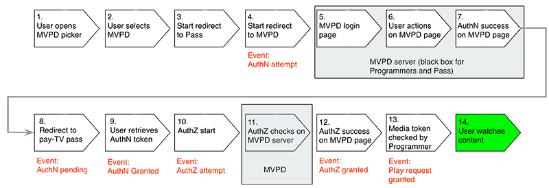
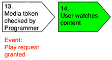
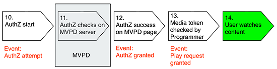

# サーバーサイド指標について {#understanding-server-side-metrics}

>[!NOTE]
>
>このページのコンテンツは、情報提供のみを目的として提供されています。 このAPIを使用するには、Adobeの現在のライセンスが必要です。 無断使用は認められません。

## 概要 {#intro}

このドキュメントでは、使用権限サービスモニタリング（ESM）サービスによって生成されるAdobe Pass認証サーバーサイド指標について説明します。 クライアント側の観点から見た場合と同じイベントは記述されません（プログラマーがAdobe Analyticsなどの測定サービスを自分のページ/アプリケーションに実装するかどうかについて見る場合）。

## イベントの概要 {#events_summary}

Adobe Pass認証のサーバーサイドの観点から、次のイベントが生成されます。

* **認証フローで生成されたイベント** （MVPDでの実際のログイン）

  * AuthN試行の通知 – ユーザーがMVPD ログインサイトに送信されたときに生成されます。
  * AuthN保留中のお知らせ – ユーザーがMVPDでログインに成功した場合、ユーザーがAdobe Pass認証にリダイレクトされたときに生成されます。
  * 「許可された認証の通知」 – ユーザーがプログラマーのサイトに戻り、Adobe Pass Authenticationから認証トークンを正常に取得した場合に生成されます。
* **認証フロー** （
MVPD）\
  *前提条件：*&#x200B;有効なAuthN トークン
  * AuthZ試行の通知
  * AuthZ Grantedの通知
* **再生要求が成功しました**\
  *前提条件：*&#x200B;有効なAuthN トークンとAuthZ トークン
  * Adobe Pass認証によるチェックの通知
  * 再生リクエストには、許可された認証と許可された認証の両方が必要です

ユニークユーザーの数については、以下の「[ ユニークユーザー](#unique-users)」セクションで詳しく説明しています。 概要として、許可された認証および認証の応答は通常キャッシュされるので、通常、次の数式が適用されます。

* AuthN試行回数\>許可されたAuthNの数
* AuthZ試行回数\>許可されたAuthZ回数
* AuthZ試行回数\>付与されたAuthNの数（通常）
* 成功した再生リクエストの数\>許可されたAuthZの数

### 例 {#example}

次の例は、の1か月間のサーバーサイド指標を示しています
ひとつのブランド：

| 指標 | MVPD 1 | MVPD 2 | ... | MVPD n | 合計 |
| -------------------------- | ------ | ------ | - | ------ | ---------------------------------------------- |
| 認証の成功 | 1125 | 2892 |   | 2203 | SUM （MVP1+...MVPD n） |
| 承認が成功しました | 2527 | 5603 |   | 5904 | SUM （MVP1+...MVPD n） |
| 成功した再生リクエスト | 4201 | 10518 |   | 10737 | SUM （MVP1+...MVPD n） |
| ユニークユーザー | 1375 | 2400 |   | 2890 | 重複排除されたすべてのMVPDのすべてのユーザーの合計\* |
| 認証試行 | 2147 | 3887 |   | 3108 | SUM （MVP1+...MVPD n） |
| 認証の試行 | 2889 | 6139 |   | 6039 | SUM （MVP1+...MVPD n） |

 

この場合の重複排除は、異なるMVPD ユーザーが同じユーザーIDを受け取らないため、影響を与えません。 2つの異なるブランドに対して合計を行うが、同じMVPDに対して行う場合、重複排除の効果はもっと大きくなる必要があります。

## イベントトリガー {#event_triggers}

### 新規ユーザー – フルフロー {#new-user-full-flow}

次のグラフは、認証トークンを持たないユーザー（新しいユーザーまたは認証トークンの有効期限が切れたユーザー）のイベントと手順を示しています。

このフローでは、認証（\#7）と認証（\#11）の両方のMVPDに対してラウンドトリップを#5こないます。

フローが完了すると、認証トークンと認証トークンがユーザーのデバイスにキャッシュされます。 認証トークンの有効期間（TTL）の値は、6時間から90日の間です。 AuthN トークンの有効期限は、AuthZ トークンの有効期限を自動的に強制的に設定します。 認証トークンのTTL値は通常24時間です。

| サーバーサイドイベントがトリガーされました | <ul><li>認証試行、認証保留中、認証付与</li><li>認証の試行、許可が付与されました</li><li>Play リクエストに成功しました</li></ul> |
|---|---|

### ユーザーを返す – AuthZおよびAuthN トークンがキャッシュされました

有効なAuthZ トークンとAuthN トークンがキャッシュされているユーザーの場合、次の手順を実行します
ステップの実行：

これは`getAuthorization()`の呼び出し時に自動的にトリガーされ、Adobe Pass認証を使用したチェックのみが含まれます。 MVPDはこのフローには関与しません。

| サーバーサイドイベントがトリガーされました | * Play リクエストに成功しました |
|---|---|

### ユーザーを返す – AuthN トークンがキャッシュされ、AuthZ トークンが期限切れになる

有効なAuthN トークンを引き続き持つユーザーの場合、次の手順が実行されます。

この流れはMVPDへの往復を含みます。

| サーバーサイドイベントがトリガーされました | <ul><li>認証の試行、認証OK</li><li>Play リクエストに成功しました</li> |
|---|---|

## 認証イベント {#authn_events}

### 認証の試行 {#authentication-attempt}

上記の図に示すように、認証イベントは、利用者がMVPDにラウンドトリップした場合にのみトリガーされます。認証イベントには、キャッシュされたトークン認証は含まれません。

認証試行イベントは、ユーザーがピッカーから特定のMVPDをクリックした後にトリガーされます。

* MVPD側で、これに近い最初のイベントはページ読み込みです
* Adobe Pass Authenticationでは、MVPD ページにログインするユーザーの再試行はカウントされません（誤ったパスワード、再試行）
* 複数回の試行は1回としてカウントされます
* MVPDの中には、認証ステップで認証を実行するものもあり、認証に失敗した場合にユーザーがリダイレクトされることはありません。

### 認証保留中 {#authentication-pending}

このイベントは、Adobe Pass認証へのリダイレクトプロセスが開始されたときに発生します。

### 認証が許可されました {#authentication-granted}

MVPDの既知の加入者は、通常、有料テレビのサブスクリプションを利用しますが、インターネットアクセスの場合のみ利用できます。 認証が成功した場合は、ユーザーがMVPDで有効な資格情報を明示的に入力したか、以前に有効な資格情報を入力し、「私を覚えておく」をチェックした（以前のセッションの有効期限が切れていなかった）ために発生する可能性があります。

したがって、MVPDはAdobe Pass認証を認証リクエストに対して肯定的な応答として送信し、Adobe Pass認証は&#x200B;*AuthN トークン*&#x200B;を作成します。

* 認証は通常、長期間（1か月以上）キャッシュされます。 これにより、トークンが期限切れになり、フローが再度開始されるまで、認証イベントは存在しなくなります。
* シングルサインオンを介して別のサイトやアプリからアクセスしても、認証イベントはトリガーされません。

### Comcast Authentication {#comcast-authentication}

Comcastは、他のMVPDと比較して異なるAuthN フローを持ちます。

次の機能では、違いについて説明します。

* **セッション Cookieの動作**：これにより、ユーザーがブラウザーを閉じた後、認証トークンが完全に削除されます。 この機能はweb上でのみ有効です。 主な目的は、Comcast セッションが安全でない/共有されたコンピューターに保持されないようにすることです。 影響は、他のMVPDよりも多くの認証試行/許可されたフローが存在することです。

* **AuthN/要求者ID**: Comcastでは、ある要求者IDから別の要求者IDにAuthN状態をキャッシュすることはできません。 このため、各サイト/アプリは認証トークンを取得するためにComcastに移動する必要があります。 ユーザーエクスペリエンスの考慮事項に加えて、上記のように、より多くの認証試行/付与イベントが生成されることが影響を与えます。

* **パッシブ認証**: ユーザーエクスペリエンスを向上させるためですが
引き続き要求者IDごとのAuthN機能を維持すると、パッシブ認証フローが非表示のiFrameで発生します。 ユーザーには何も表示されませんが、イベントは以前と同じようにトリガーされます。

ユーザーがComcast ログインページで「私を覚えておいてください」をクリックした場合、その後このページへの訪問（2週間の期間）は簡単なリダイレクトバックになります。 そうしないと、ユーザーは実際にページで認証する必要があります。

### 認証に失敗しました {#unsuccessful-authentication}

認証が失敗した場合は、Adobe Pass認証ではイベント自体ではありませんが、試行と成功の違いとして計算できます。

2013年5月のリリースでは、Adobe Pass Authenticationは、DRM エラー（トークンのバインディングに失敗した場合）やLSO エラー（トークンを書き込むスペースがないなど）などのシステムエラーまたはネットワークエラーが原因の認証が失敗した場合にエラーコードを追加します。

### 認証コンバージョン率 {#authenitication-conversion-rate}

プログラマーが追跡できる興味深い指標の1つは、認証変換率で、（AuthN リクエスト / AuthNが付与された）パーセントとして計算されます。

指標に関するいくつかのメモ：

* イベントベースの指標であるため、ユーザーが8回試行して9回目の成功を収めた場合、これは上記のコンバージョン率に非常に悪く反映されます。
* （サーバーサイドの）Adobe Pass Authenticationで、一意のベースの認証変換を計算する方法はありません。
* サイト/アプリに自動AuthN再試行が存在する場合、これは上記の指標をゆがめることにもなります。

## 認証イベント {#authorization_events}

### 認証の試行 {#authorization_attempt}

ユーザーは、認証トークンを取得するだけでなく、コンテンツを再生する前に認証トークンを取得する必要があります。 これは通常、認証後、または認証トークンの有効期限が切れた場合に発生します。 このチェックはサーバーサイド（Adobe Pass認証サーバーからMVPD サーバーまで）で行われるので、ユーザーは何もする必要がありません。

### 認証が付与されました {#authorization-granted}

「承認付与」は、認証されたユーザのサブスクリプションに要求されたプログラミングが含まれていることを示す。

すべてのMVPDが個別の認証ステップをサポートしているわけではないことに注意してください。一部の認証は認証と同等です。 MVPDは、バックチャネルのAuthZ リクエストに対してAdobe Pass Authenticationに正常な応答を送信し、Adobe Pass AuthenticationはAuthZ トークンを作成します。

* AuthZ トークンは一定期間、通常は24時間キャッシュされます。この期間中、AuthZ イベントは発生しません。
* アセットレベルの認証を使用するMVPDもあれば、チャネルレベルの認証を使用するMVPDもあります。使用するMVPDに応じて、複数または少ないAuthZ イベントが発生します。 チャネルレベルの認証でも、キャッシュは有効なので、同じアセットが24時間以内にリクエストされた場合、イベントは発生しません。

### 認証が拒否されました {#authorization-denied}

認証が拒否された場合、認証されたユーザーは、要求されたプログラミングに対する確認されたサブスクリプションを持っていません。 最も可能性の高い原因は、チャネルがユーザーのサブスクリプションパッケージに含まれていないことですが、これは、MVPDからのインターネットアクセスのみを持つユーザーを反映している可能性もあります。

MVPDの中には、MVPDのインターネットサブスクリプションしか持っていなくても正常に認証されるユーザーもいます（有料テレビのサブスクリプションはありません）。 この場合、ユーザーが認証を要求するチャネルが基本パッケージ内にあるにもかかわらず、認証は拒否されます。

一部のMVPDでは、パッケージをアップグレードするオファーを含めることができるAuthZ否認用のカスタムエラーメッセージを提供しています。

### 認証コンバージョン率 {#authorization-conversion-rate}

認証コンバージョン率は、（AuthZ リクエスト / AuthZが付与された） %として計算できます。

### 再生リクエストが正常に完了しました {#successful-play-request}

認証および許可されたユーザーは、保護されたコンテンツを表示できます。

再生リクエストが成功すると、Adobe Pass Authenticationは、ユーザーがリクエストされたビデオを表示する権利を有することを主張する短期間有効なメディアトークンを生成します。 プログラマーは、このメディアトークンを使用して、見込み視聴者をさらに検証します。 メディアトークンは、成功した再生リクエストとして追跡されます。

* Adobe Pass Authenticationでは、Media Tokenの生成後にビデオ再生が開始されたかどうかを&#x200B;*not*&#x200B;で追跡します。 例えば、コンテンツに地理的制限がある場合、ストリームが実際に開始されなくても、トランザクションは引き続き成功した再生リクエストとしてカウントされます。
* AuthN トークンとAuthZ トークンは、MVPD レスポンスを一定期間キャッシュするため、成功した再生リクエストイベントは、メトリクス内で最も頻繁に発生するイベントです。

## ユニークユーザー {#unique-users}

### 定義 {#definition}

認証が成功すると、Adobe Pass Authenticationは、返されたMVPD User ID値に基づいて、一意のユーザーの存在を追跡します。  この値は、ユーザーのログイン情報に基づいていますが、個人を特定できる情報は含まれていません。

この値は、sendTrackingData コールバックでサイト/アプリにも渡されます。

この値は、デバイス間で永続的である可能性があります（MVPDは、ログインが発生する場所に関係なく、特定のユーザーに同じ値を生成します）。または、一時的な値（ログインごとに、新しい値が生成され、MVPDがそのバックエンドにマッピングします。 通常、MVPDからAdobe Pass Authenticationに提供される値は、セッションとデバイス間で永続的ですが、前述のように、永続性は保証も検証もされません。

この値は、一意のユーザーを計算する方法として使用されます。 報告された値（要求者ID/間隔/MVPDごと）は、特定の間隔で重複が排除されます。 したがって、1日あたりのユニークユーザーの合計は、通常、月間値とは異なり、月間値の値は低くなります。

この数値には、Adobe Pass認証のすべてのイベントが含まれ、認証試行（ユーザーIDがない）を差し引いたものの、試行された（失敗した可能性がある）認証が含まれます。

### 例 {#examples}

#### 1日目 {#day1}

ユーザーXYZは、動画を見るためにサイトを訪れます。

実行されたイベント：

* AuthN試行（一意のユーザーはまだありません）
* AuthNが付与されました
  * この時点で、MVPDが返す内容に基づいてユーザーを一意に識別するため、1日のユニークなユーザー数が1増加します
  * authN トークンは30日間キャッシュされます
* AuthZ試行/付与イベント
  * 1日間キャッシュされたAuthZ トークン
* 再生リクエストイベントが成功しました

#### 1日目（後で） {#day1-later-on}

ユーザーXYZは別の動画を視聴します。

実行されたイベント：

* 再生リクエストイベントが成功しました（残りはキャッシュされます）
* 日次または月次のユニーク数は増加しません

#### 3日目 {#day3}

ユーザーXYZは別の動画を視聴します。

実行されたイベント：

* AuthZ試行/付与イベント
  * 1日キャッシュから1日キャッシュの有効期限
* 再生リクエストイベントが成功しました（残りはキャッシュされます）
* 1日当たりのユニークユーザー数が1増加 – 月別のユニークユーザー数はまだ1人です

#### 31日目 {#day31}

ユーザーXYZは別の動画を視聴します。

AuthN キャッシュの有効期限が切れてから1日目と同じです。

同じユーザーが認証に失敗した場合でも、ユーザーIDを含む2つのイベント（認証付与と認証の試行）が存在するため、月別の一意のユーザー数は1増加します。

### シングルサインオン（SSO） {#single-sign-on-sso}

場合によっては、一意のユーザーの数が、認証に成功したユーザーの数よりも多くなることがあります。 これは通常、多くのユーザーが他のサイトやアプリからSSO経由でアクセスし、現在のサイトやアプリで認証を取得する必要がある場合に発生します。

### クライアントサイドとサーバーサイドのユニークユーザーの比較 {#comparing-client-side-and-server-side-unique-users}

`sendTrackingData()`のユーザーIDの値をクライアントサイドで使用してユニークユーザーをカウントする場合は、クライアントサイドとサーバーサイドの番号が一致する必要があります。

相違点が大きい場合は、通常、次の理由が
差：

* 動画のプレイはユニークなのか、それともイベントのユニークなのか。 前述のように、Adobe Pass Authenticationでは、AuthN試行を除くすべてのイベントに対してユニークユーザーをカウントします。 つまり、ユーザーが（ページ上で）認証しただけで、ビデオを表示しない場合でも、ユニークなユーザー数の増加がトリガーされます。

* 認証に失敗したユーザーのカウント - Adobe Pass認証では、これらのユーザーもレポートされた数でカウントされます。

<!--
## Related Information {#related-information}

- [Entitlement Service Monitoring API](/help/authentication/entitlement-service-monitoring-api.md)

-->
