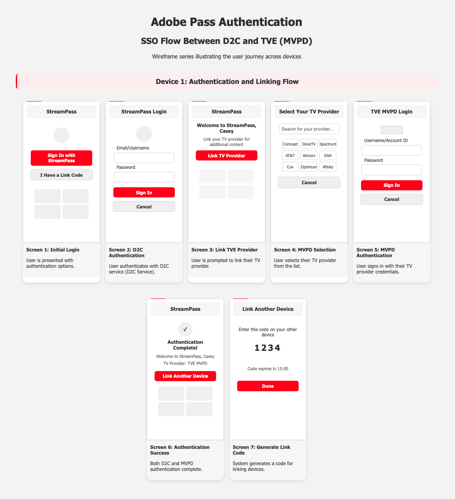
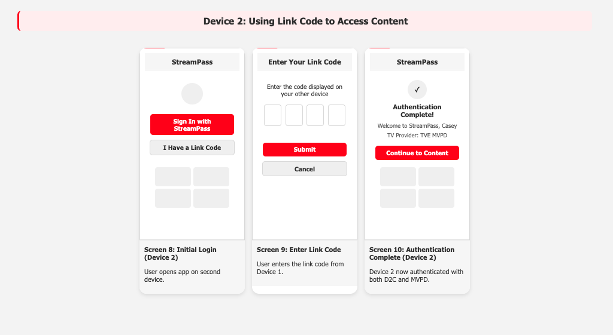

# Adobe シングルサインオンサービス {#sso-service}

このドキュメントでは、Adobe Single Sign-On Serviceのユースケース、エンドポイント、およびAPIについて説明します。

**現在のリビジョン - 1.0.0**

## 範囲 {#scope}

Adobe Pass SSO サービスは、複数のデバイスやアプリケーションでのシームレスな認証を可能にし、セキュリティとコンプライアンス基準を維持しながら、統合されたユーザーエクスペリエンスを提供します。 このサービスは、今日のマルチデバイスストリーミング環境におけるクロスプラットフォーム認証の必要性の高まりに対応します。

## 概要 {#overview}

### 現状 {#what-it-is}

利用者が一度認証を行えば、情報にもとづいて他のデバイスへの認証の転送を管理できる包括的なシングルサインオンソリューションです

### 認証の現在の課題 {#current-challenges}

* ユーザーは、サブスクリプションを持っているすべてのストリーミングサービスで認証する必要があります
* ユーザーは、各デバイスまたはアプリケーションで個別に認証する必要があります
* 一部のプラットフォームでは、認証フローでパスワードを入力するのが難しいため、放棄率が向上する可能性があります

### Adobe Pass SSO サービスのオポチュニティ {#opportunity}

* 独自の認証を必要とするストリーミングサービスの数の増加
* シームレスなクロスデバイス体験に対する需要の高まり
* 世帯あたりのストリーミングデバイス数の増加
* 世帯あたりの統合認証の必要性

### 導入のメリット {#business-benefits}

#### コンテンツプロバイダー {#content-providers}

* **ユーザーエンゲージメントの向上** - シームレスなエクスペリエンスにより、セッション時間が長くなる
* **摩擦の減少** – 認証障壁の低下によるコンテンツの消費量の増加
* **リテンション率の向上** – 優れたユーザーエクスペリエンスにより、解約率が減少します
* **コスト削減** – 認証の問題に関連するサポートチケットの数が少ない

#### エンドユーザー {#end-users}

* **シームレスなエクスペリエンス** – 一度認証すれば、どこからでもアクセスできます
* **時間の節約** – 繰り返しログインプロセスはありません
* **デバイスの柔軟性** – 中断なくデバイスを切り替える
* **一貫したエクスペリエンス** – すべてのプラットフォームで統一された認証

#### IdP （MVPD、通信事業者など） {#idps}

* MVPDは、認証されたSSOを使用して、追加のデバイスについて通知できます
* **ユーザー満足度の向上** – 認証エクスペリエンスの向上
* **サポート負荷の軽減** – 認証関連のサポート呼び出しが少ない
* **競争優位性** – 競合他社よりも優れたユーザーエクスペリエンス

## ユースケース {#use-cases}

### ID マッピング {#identity-mapping}

このサービスは、同じアプリでD2CとTVE アカウントをリンクする機能を構築します。

より多くのストリーミングサービスが、サードパーティ（MVPD/バーチャルMVPD/通信会社など）に販売するバンドルを構築しています。 ユーザーは、同じアプリで複数のアカウントを処理する必要があります。 シームレスな認証エクスペリエンスを作成するには、ログインエクスペリエンスを簡素化するために、これらのアカウントをブリッジするサービスが必要です。

ユーザーはD2C アカウントで認証し、別のアカウントで一度認証します（例： MVPD）。 アドビのサービスでは、これらのアカウントはリンクされます。つまり、今後、さまざまなデバイスでのその後の認証は、D2C アカウントでのみ実行できます。

### クロスデバイス SSO {#cross-device-sso}

TV接続デバイスでの認証は、携帯電話での認証よりも面倒になる可能性があります。 優れたユーザーエクスペリエンスは、スマートフォンで認証してから、その認証をスマートテレビに渡すことです。

## 主要コンポーネント {#key-components}

* **サービストークン API** - シングル サインオン メカニズムを安全に管理する主要コンポーネント
* **リスト API** - アプリケーションは、ユーザーがエコシステム内のデバイスのリストを理解するのに役立ちます
* **Link API** - ユーザーがエコシステムに追加のデバイスを追加できるようにするアプリケーション
* **リンク解除API** - ユーザーがエコシステム内のデバイスを削除できるようにするアプリケーション

## 詳細なユースケース {#use-cases-detailed}

### D2C-TVE SSO {#d2c-tve-sso}

このユースケースでは、1つのデバイス上のD2CとTVE （MVPD）資格情報をリンクし、同じアプリケーション内の他のデバイス上のそのリンクされたプロファイルを活用することができます。





### クロスデバイス SSO {#cross-device-sso-detailed}

このユースケースでは、1つのデバイスで既に認証されているユーザーが、他のデバイスにインストールされている同じD2CまたはTVE アプリケーション（認証と認証のためにAdobe Pass REST V2を実装するために必要なアプリケーション）で認証プロファイルを再利用できるようにします。

## D2C-TVE アプリケーションにAdobe SSO サービスを統合する方法 {#integration}

### 手順1 – 共通IDの取得 {#step-1}

Adobe SSO サービスを統合するには、アプリケーションの実装で、X-SSO-IDで共通の識別子SSO属性として使用する一意の永続的なIDを確立する必要があります。 これは、D2C サービスを使用してユーザーを認証し、この認証に関する属性を保持することで取得できます。

### 手順2 - サービストークンの取得 {#step-2}

POST /serviceToken エンドポイントでX-SSO-IDの共通IDを使用すると、次のペイロードを含む署名済みJWTが取得されます。

```json
{
  "iss": "ssoservicetoken",
  "sub": "unique_common_identifier",
  "nbf": 1758093558,
  "exp": 1758097158,
  "iat": 1758093558
}
```

サービストークンには、サービストークンが有効な期間の有効期限である「iat」が発行され、「exp」が発行されます。 有効期限が切れた場合は、期限切れのサービストークンを含むGET /serviceToken エンドポイントを使用して新しいJWTを取得できます。

### ステップ 3 - TVE MVPDでAdobe Pass REST API V2を使用して認証する {#step-3}

Adobe Passによる認証は、サービストークンを使用して実装する必要があります：[REST API V2 - シングルサインオンサービストークンのフロー](https://experienceleague.adobe.com/en/docs/pass/authentication/integration-guide-programmers/rest-apis/rest-api-v2/rest-api-v2-flows/rest-api-v2-single-sign-on-access-flows/rest-api-v2-single-sign-on-service-token-flows)

### ステップ 4 – 別のデバイスをリンクする {#step-4}

認証されたアプリケーションから、/link APIを使用して、別のデバイスで使用するためのリンクを作成できます

```json
{
    "status": "CREATED",
    "code": "228128",
    "notBefore": 1758094617220,
    "notAfter": 1758098217220
}
```

「コード」は、ユーザーがセカンダリデバイス上の未認証のアプリケーションに導入する6桁のシーケンスの形式の短命なリンクコードです

### 手順5 - シングルサインオン認証の取得 {#step-5}

別のデバイスでは、ユーザーがコードを導入すると、アプリケーションで次のことが可能になります。

* d2C サービスからのIDの取得
* rest V2 APIを使用したAdobe PassからのMVPD プロファイルの取得

MVPD プロファイルは、最初の認証が取得された期間、SSOを通じて有効になります。

MVPDでプロファイルが無効になったり、ユーザーがMVPDからログアウトすることを選択した場合、Adobe Pass REST API V2を使用するアプリケーションにはプロファイルレコードがなくなり、ユーザーがMVPDで再度認証する必要があります。

### 手順6 – 他のデバイスでのシングルサインオンの管理 {#step-6}

アプリケーションは、/list APIを使用して、同じ共通識別子にリンクされているすべての他のデバイスに関する情報を取得できます。

デバイスのリンクを/unlink APIで解除すると、いつでもシングルサインオンからデバイスを削除できます。

## API {#apis}

### サービストークン API {#service-token-api}

#### 説明 {#service-token-description}

サービストークン APIを使用して、複数のアプリケーションまたはデバイス間のシングルサインオン（SSO）機能を有効にするサービストークンをリクエストおよび管理できます。 これらのサービストークンは、認証済みプロファイル（SSO プロファイル）を識別し、SSO接続の確立と維持に不可欠です。

>[!WARNING]
>
>サービストークンには、機密性の高い認証情報が含まれています。 アプリケーションはこれらのトークンを安全に処理し、信頼できない関係者に公開してはなりません。

サービストークン APIには、次の2つの主要エンドポイントが用意されています。

* **POST /api/{serviceProvider}/serviceToken** – 新しく作成したJWS サービストークンを取得します
* **GET /api/{serviceProvider}/serviceToken** – 既存のJWS サービストークンを更新します

Adobe Pass Authentication Services エラーが原因でサービストークン API リクエストを処理できなかった場合、API レスポンスの一部として追加のエラー情報が含まれます。

#### POST - serviceToken {#post-service-token}

##### リクエスト {#post-service-token-request}

<table style="table-layout:auto">
   <tr>
      <th style="background-color: #EFF2F7;">HTTP</th>
      <th style="background-color: #EFF2F7;"></th>
      <th style="background-color: #EFF2F7;"></th>
   </tr>
   <tr>
      <td style="background-color: #DEEBFF;">パス</td>
      <td>/api/{serviceProvider}/serviceToken</td>
      <td></td>
   </tr>
   <tr>
      <td style="background-color: #DEEBFF;">メソッド</td>
      <td>投稿する</td>
      <td></td>
   </tr>
   <tr>
      <th style="background-color: #EFF2F7;">パスパラメーター</th>
      <th style="background-color: #EFF2F7;"></th>
      <th style="background-color: #EFF2F7;"></th>
   </tr>
   <tr>
      <td style="background-color: #DEEBFF;">serviceProvider</td>
      <td>トークンが要求されているサービスプロバイダーの識別子。</td>
      <td><i>必須</i></td>
   </tr>
   <tr>
      <th style="background-color: #EFF2F7;">ヘッダー</th>
      <th style="background-color: #EFF2F7;"></th>
      <th style="background-color: #EFF2F7;"></th>
   </tr>
   <tr>
      <td style="background-color: #DEEBFF;">認証</td>
      <td>ベアラートークンのペイロードの生成については、<a href="https://experienceleague.adobe.com/en/docs/pass/authentication/integration-guide-programmers/rest-apis/rest-api-v2/rest-api-v2-appendix/rest-api-v2-appendix-headers/rest-api-v2-appendix-headers-authorization">Authorization</a> ヘッダーのドキュメントを参照してください。</td>
      <td><i>必須</i></td>
   </tr>
   <tr>
      <td style="background-color: #DEEBFF;">AP-Device-Identifier</td>
      <td>
         デバイス識別子ペイロードの生成については、<a href="https://experienceleague.adobe.com/en/docs/pass/authentication/integration-guide-programmers/rest-apis/rest-api-v2/rest-api-v2-appendix/rest-api-v2-appendix-headers/rest-api-v2-appendix-headers-ap-device-identifier">AP-Device-Identifier</a> ヘッダーのドキュメントを参照してください。
         <br/><br/>
         この識別子は、X-SSO-IDが指定されていない場合に、デフォルトのSSO識別子として使用されます。
      </td>
      <td><i>必須</i></td>
   </tr>
   <tr>
      <td style="background-color: #DEEBFF;">X-Device-Info</td>
      <td>
         <a href="https://experienceleague.adobe.com/en/docs/pass/authentication/integration-guide-programmers/rest-apis/rest-api-v2/rest-api-v2-appendix/rest-api-v2-appendix-headers/rest-api-v2-appendix-headers-x-device-info">X-Device-Info</a> ヘッダードキュメントで指定されているデバイス情報。
         <br/><br/>
         <b> アプリケーションのデバイスプラットフォームで有効な値の指定が明示的に許可されている場合に使用することを強くお勧めします</b>。
         <br/><br/>
         Adobe Pass認証バックエンドは、明示的に設定された値と暗黙的に抽出された値をマージします。 指定しない場合、デフォルトの抽出値が使用されます。
      </td>
      <td><i>必須</i></td>
   </tr>
   <tr>
      <td style="background-color: #DEEBFF;">X-SSO-LINK</td>
      <td>
         このリクエストを既存の認証済みプロファイルに関連付けるリンクコード。 提供された場合、応答には、リンクコードを生成したプロファイルを含むSSOのサービストークンが含まれます。
         <br/><br/>
         これは通常、セカンダリアプリケーションまたはデバイスがプライマリアプリケーションまたはデバイスから認証済みプロファイルに接続する場合に使用されます。
      </td>
      <td>x-sso-idが指定されていない場合は必須</td>
   </tr>
   <tr>
      <td style="background-color: #DEEBFF;">X-SSO-ID</td>
      <td>
         アプリケーションが基本SSOに対して要求する共通の識別子。
         <br/><br/>
         この識別子を指定すると、デバイスやアプリケーション間で共通のSSO プロファイルを確立するために使用されます。
      </td>
      <td>x-sso-linkが指定されていない場合は必須</td>
   </tr>
   <tr>
      <td style="background-color: #DEEBFF;">承認</td>
      <td>
         クライアントアプリケーションが受け入れたメディアタイプ。
         <br/><br/>
         指定する場合は、application/jsonにする必要があります。
      </td>
      <td>オプション</td>
   </tr>
   <tr>
      <td style="background-color: #DEEBFF;">User-Agent</td>
      <td>クライアントアプリケーションのユーザーエージェント。</td>
      <td>オプション</td>
   </tr>
</table>

##### 応答 {#post-service-token-response}

<table style="table-layout:auto">
   <tr>
      <th style="background-color: #EFF2F7;">コード</th>
      <th style="background-color: #EFF2F7;">テキスト</th>
      <th style="background-color: #EFF2F7;">説明</th>
   </tr>
   <tr>
      <td>201</td>
      <td>Created</td>
      <td>
        サービストークンが正常に生成され、応答本文に返されました。
      </td>
   </tr>
   <tr>
      <td>400</td>
      <td>不正なリクエスト</td>
      <td>
        リクエストが無効です。クライアントはリクエストを修正して、もう一度試す必要があります。 応答本文には、<a href="https://experienceleague.adobe.com/en/docs/pass/authentication/integration-guide-programmers/standard-features/error-reporting/enhanced-error-codes">拡張エラーコード </a>のドキュメントに準拠するエラー情報が含まれる場合があります。
      </td>
   </tr>
   <tr>
      <td>401</td>
      <td>未承認</td>
      <td>
        アクセストークンが無効です。クライアントは新しいアクセストークンを取得し、再試行する必要があります。 詳しくは、<a href="https://experienceleague.adobe.com/en/docs/pass/authentication/integration-guide-programmers/rest-apis/rest-api-dcr/dynamic-client-registration-overview">動的クライアント登録の概要</a>のドキュメントを参照してください。
      </td>
   </tr>
   <tr>
      <td>500</td>
      <td>内部サーバーエラー</td>
      <td>
        サーバーサイドで問題が発生しました。 応答本文には、<a href="https://experienceleague.adobe.com/en/docs/pass/authentication/integration-guide-programmers/standard-features/error-reporting/enhanced-error-codes">拡張エラーコード </a>のドキュメントに準拠するエラー情報が含まれる場合があります。
      </td>
   </tr>
</table>

###### 成功 {#success-post-service-token}

<table style="table-layout:auto">
   <tr>
      <th style="background-color: #EFF2F7;">ヘッダー</th>
      <th style="background-color: #EFF2F7"></th>
      <th style="background-color: #EFF2F7;"></th>
   </tr>
   <tr>
      <td style="background-color: #DEEBFF;">ステータス</td>
      <td>201</td>
      <td><i>必須</i></td>
   </tr>
   <tr>
      <td style="background-color: #DEEBFF;">コンテンツタイプ</td>
      <td>アプリケーション/json</td>
      <td><i>必須</i></td>
   </tr>
   <tr>
      <th style="background-color: #EFF2F7;">本文</th>
      <th style="background-color: #EFF2F7"></th>
      <th style="background-color: #EFF2F7;"></th>
   </tr>
   <tr>
      <td style="background-color: #DEEBFF;">ステータス</td>
      <td>HTTP ステータス （例：「作成済み」）</td>
      <td><i>必須</i></td>
   </tr>
   <tr>
      <td style="background-color: #DEEBFF;">jws</td>
      <td>サービストークンを含むBase64 エンコード JSON Web Signature （JWS）。 このトークンは、認証されたプロファイルを識別し、SSO機能を有効にするために、その後のAPI呼び出しで使用できます。</td>
      <td><i>必須</i></td>
   </tr>
   <tr>
      <td style="background-color: #DEEBFF;">notBefore</td>
      <td>エポックミリ秒、またはエラー時に0回</td>
      <td><i>必須</i></td>
   </tr>
   <tr>
      <td style="background-color: #DEEBFF;">notAfter</td>
      <td>エポックミリ秒、またはエラー時に0回</td>
      <td><i>必須</i></td>
   </tr>
</table>

###### エラー {#error-post-service-token}

<table style="table-layout:auto">
   <tr>
      <th style="background-color: #EFF2F7;">ヘッダー</th>
      <th style="background-color: #EFF2F7;"></th>
      <th style="background-color: #EFF2F7;"></th>
   </tr>
   <tr>
      <td style="background-color: #DEEBFF;">ステータス</td>
      <td>400, 401, 500</td>
      <td><i>必須</i></td>
   </tr>
   <tr>
      <td style="background-color: #DEEBFF;">コンテンツタイプ</td>
      <td>アプリケーション/json</td>
      <td><i>必須</i></td>
   </tr>
   <tr>
      <th style="background-color: #EFF2F7;">本文</th>
      <th style="background-color: #EFF2F7;"></th>
      <th style="background-color: #EFF2F7;"></th>
   </tr>
   <tr>
      <td style="background-color: #DEEBFF;"></td>
      <td>応答本文は、<a href="https://experienceleague.adobe.com/en/docs/pass/authentication/integration-guide-programmers/standard-features/error-reporting/enhanced-error-codes">拡張エラーコード </a> ドキュメントに準拠する追加のエラー情報を提供する場合があります。</td>
      <td><i>必須</i></td>
   </tr>
</table>

## サンプル {#samples-post-service-token}

### &#x200B;1. 新しいサービストークンをリクエスト（SSO ID付き）

>[!BEGINTABS]

>[!TAB  リクエスト ]

```HTTPS
POST /api/{serviceProvider}/serviceToken HTTP/1.1

    Authorization: Bearer <access_token>
    X-SSO-ID: <sso_id>
    AP-Device-Identifier: fingerprint <base64_device_id>
    X-Device-Info: <base64_device_info>
    Accept: application/json
```

>[!TAB 応答]

```HTTPS
HTTP/1.1 201 Created

Content-Type: application/json

{
  "status": "CREATED",
  "serviceToken": "eyJhbGciOiJIUzI1NiIsInR5cCI6IkpXVCJ9...",
  "notBefore": 1710000000000,
  "notAfter": 1710003600000
}
```

>[!ENDTABS]

### &#x200B;2. 新しいサービストークンのリクエスト（SSO リンク付き）

>[!BEGINTABS]

>[!TAB  リクエスト ]

```HTTPS
POST /api/{serviceProvider}/serviceToken HTTP/1.1

    Authorization: Bearer <access_token>
    X-SSO-LINK: <link_code>
    AP-Device-Identifier: fingerprint <base64_device_id>
    X-Device-Info: <base64_device_info>
    User-Agent: <user_agent>
    Accept: application/json
```

>[!TAB 応答]

```HTTPS
HTTP/1.1 201 Created

Content-Type: application/json

{
  "status": "CREATED",
  "serviceToken": "eyJhbGciOiJIUzI1NiIsInR5cCI6IkpXVCJ9...",
  "notBefore": 1710000000000,
  "notAfter": 1710003600000
}
```

>[!ENDTABS]

#### GET - serviceToken {#get-service-token}

##### リクエスト {#get-service-token-request}

<table style="table-layout:auto">
   <tr>
      <th style="background-color: #EFF2F7;">HTTP</th>
      <th style="background-color: #EFF2F7;"></th>
      <th style="background-color: #EFF2F7;"></th>
   </tr>
   <tr>
      <td style="background-color: #DEEBFF;">パス</td>
      <td>/api/{serviceProvider}/serviceToken</td>
      <td></td>
   </tr>
   <tr>
      <td style="background-color: #DEEBFF;">メソッド</td>
      <td>GET</td>
      <td></td>
   </tr>
   <tr>
      <th style="background-color: #EFF2F7;">パスパラメーター</th>
      <th style="background-color: #EFF2F7;"></th>
      <th style="background-color: #EFF2F7;"></th>
   </tr>
   <tr>
      <td style="background-color: #DEEBFF;">serviceProvider</td>
      <td>トークンが要求されているサービスプロバイダーの識別子。</td>
      <td><i>必須</i></td>
   </tr>
   <tr>
      <th style="background-color: #EFF2F7;">ヘッダー</th>
      <th style="background-color: #EFF2F7;"></th>
      <th style="background-color: #EFF2F7;"></th>
   </tr>
   <tr>
      <td style="background-color: #DEEBFF;">認証</td>
      <td>ベアラートークンのペイロードの生成については、<a href="https://experienceleague.adobe.com/en/docs/pass/authentication/integration-guide-programmers/rest-apis/rest-api-v2/rest-api-v2-appendix/rest-api-v2-appendix-headers/rest-api-v2-appendix-headers-authorization">Authorization</a> ヘッダーのドキュメントを参照してください。</td>
      <td><i>必須</i></td>
   </tr>
   <tr>
      <td style="background-color: #DEEBFF;">AD-Service-Token</td>
      <td>
         更新が必要な、以前に取得したサービストークン。
         <br/><br/>
         更新対象にするには、このトークンが有効であるか、最近有効期限が切れている必要があります。
      </td>
      <td><i>必須</i></td>
   </tr>
   <tr>
      <td style="background-color: #DEEBFF;">承認</td>
      <td>
         クライアントアプリケーションが受け入れたメディアタイプ。
         <br/><br/>
         指定する場合は、application/jsonにする必要があります。
      </td>
      <td>オプション</td>
   </tr>
   <tr>
      <td style="background-color: #DEEBFF;">User-Agent</td>
      <td>クライアントアプリケーションのユーザーエージェント。</td>
      <td>オプション</td>
   </tr>
</table>

##### 応答 {#get-service-token-response}

<table style="table-layout:auto">
   <tr>
      <th style="background-color: #EFF2F7;">コード</th>
      <th style="background-color: #EFF2F7;">テキスト</th>
      <th style="background-color: #EFF2F7;">説明</th>
   </tr>
   <tr>
      <td>200</td>
      <td>OK</td>
      <td>
        サービストークンは正常に更新され、応答本文で返されました。
      </td>
   </tr>
   <tr>
      <td>400</td>
      <td>不正なリクエスト</td>
      <td>
        リクエストが無効です。クライアントはリクエストを修正して、もう一度試す必要があります。 応答本文には、<a href="https://experienceleague.adobe.com/en/docs/pass/authentication/integration-guide-programmers/standard-features/error-reporting/enhanced-error-codes">拡張エラーコード </a>のドキュメントに準拠するエラー情報が含まれる場合があります。
      </td>
   </tr>
   <tr>
      <td>401</td>
      <td>未承認</td>
      <td>
        アクセストークンまたはサービストークンが無効です。クライアントは新しいアクセストークンまたはサービストークンを取得して、再試行する必要があります。 詳しくは、<a href="https://experienceleague.adobe.com/en/docs/pass/authentication/integration-guide-programmers/rest-apis/rest-api-dcr/dynamic-client-registration-overview">動的クライアント登録の概要</a>のドキュメントを参照してください。
      </td>
   </tr>
   <tr>
      <td>500</td>
      <td>内部サーバーエラー</td>
      <td>
        サーバーサイドで問題が発生しました。 応答本文には、<a href="https://experienceleague.adobe.com/en/docs/pass/authentication/integration-guide-programmers/standard-features/error-reporting/enhanced-error-codes">拡張エラーコード </a>のドキュメントに準拠するエラー情報が含まれる場合があります。
      </td>
   </tr>
</table>

###### 成功 {#success-get-service-token}

<table style="table-layout:auto">
   <tr>
      <th style="background-color: #EFF2F7;">ヘッダー</th>
      <th style="background-color: #EFF2F7"></th>
      <th style="background-color: #EFF2F7;"></th>
   </tr>
   <tr>
      <td style="background-color: #DEEBFF;">ステータス</td>
      <td>200</td>
      <td><i>必須</i></td>
   </tr>
   <tr>
      <td style="background-color: #DEEBFF;">コンテンツタイプ</td>
      <td>アプリケーション/json</td>
      <td><i>必須</i></td>
   </tr>
   <tr>
      <th style="background-color: #EFF2F7;">本文</th>
      <th style="background-color: #EFF2F7"></th>
      <th style="background-color: #EFF2F7;"></th>
   </tr>
   <tr>
      <td style="background-color: #DEEBFF;">ステータス</td>
      <td>HTTP ステータス （例：「OK」）</td>
      <td><i>必須</i></td>
   </tr>
   <tr>
      <td style="background-color: #DEEBFF;">jws</td>
      <td>更新されたサービストークンを含む、Base64 エンコードされたJSON Web Signature （JWS）。 このトークンは、認証されたプロファイルを識別し、SSO機能を有効にするために、その後のAPI呼び出しで使用できます。</td>
      <td><i>必須</i></td>
   </tr>
   <tr>
      <td style="background-color: #DEEBFF;">notBefore</td>
      <td>エポックミリ秒、またはエラー時に0回</td>
      <td><i>必須</i></td>
   </tr>
   <tr>
      <td style="background-color: #DEEBFF;">notAfter</td>
      <td>エポックミリ秒、またはエラー時に0回</td>
      <td><i>必須</i></td>
   </tr>
</table>

###### エラー {#error-get-service-token}

<table style="table-layout:auto">
   <tr>
      <th style="background-color: #EFF2F7;">ヘッダー</th>
      <th style="background-color: #EFF2F7;"></th>
      <th style="background-color: #EFF2F7;"></th>
   </tr>
   <tr>
      <td style="background-color: #DEEBFF;">ステータス</td>
      <td>400, 401, 500</td>
      <td><i>必須</i></td>
   </tr>
   <tr>
      <td style="background-color: #DEEBFF;">コンテンツタイプ</td>
      <td>アプリケーション/json</td>
      <td><i>必須</i></td>
   </tr>
   <tr>
      <th style="background-color: #EFF2F7;">本文</th>
      <th style="background-color: #EFF2F7;"></th>
      <th style="background-color: #EFF2F7;"></th>
   </tr>
   <tr>
      <td style="background-color: #DEEBFF;"></td>
      <td>応答本文は、<a href="https://experienceleague.adobe.com/en/docs/pass/authentication/integration-guide-programmers/standard-features/error-reporting/enhanced-error-codes">拡張エラーコード </a> ドキュメントに準拠する追加のエラー情報を提供する場合があります。</td>
      <td><i>必須</i></td>
   </tr>
</table>

## サンプル {#samples-get-service-token}

### &#x200B;1. サービストークンを更新するリクエスト

>[!BEGINTABS]

>[!TAB  リクエスト ]

```HTTPS
GET /api/{serviceProvider}/serviceToken HTTP/1.1

    Authorization: Bearer <access_token>
    AD-Service-Token: <service_token>
    Accept: application/json
    User-Agent: <user_agent>
```

>[!TAB 応答]

```HTTPS
HTTP/1.1 200 OK

Content-Type: application/json

{
  "status": "OK",
  "serviceToken": "eyJhbGciOiJIUzI1NiIsInR5cCI6IkpXVCJ9...",
  "notBefore": 1710000000000,
  "notAfter": 1710003600000
}
```

>[!ENDTABS]

### リンク API {#link-api}

#### 説明 {#link-description}

リンク APIを使用して、複数のアプリケーションまたはデバイス間のシングルサインオン（SSO）を有効にできるリンクコード（またはQR コード）をリクエストできます。 このリンクコードを使用すると、新しいアプリケーションまたはデバイスを既存の認証プロファイル（SSO プロファイル）に接続し、アプリケーションまたはデバイス間でシームレスなSSO エクスペリエンスを提供できます。

リンク APIでは、AD-Service-Token ヘッダーで有効なサービストークンを指定する必要があります。

生成されたリンクコードは、通常、プライマリアプリケーションまたはデバイスのユーザーに表示され、セカンダリアプリケーションまたはデバイスに入力してSSO接続を確立します。 リンクコードの有効期間は限られており（通常5～30分）、1回限りの使用を目的としています。

Adobe Pass Authentication Services エラーが原因でLink API リクエストを処理できなかった場合は、Link APIの応答結果の一部として追加のエラー情報が含まれます。

#### POST - リンク {#post-link}

##### リクエスト {#post-link-request}

<table style="table-layout:auto">
   <tr>
      <th style="background-color: #EFF2F7;">HTTP</th>
      <th style="background-color: #EFF2F7;"></th>
      <th style="background-color: #EFF2F7;"></th>
   </tr>
   <tr>
      <td style="background-color: #DEEBFF;">パス</td>
      <td>/api/{serviceProvider}/link</td>
      <td></td>
   </tr>
   <tr>
      <td style="background-color: #DEEBFF;">メソッド</td>
      <td>投稿する</td>
      <td></td>
   </tr>
   <tr>
      <th style="background-color: #EFF2F7;">パスパラメーター</th>
      <th style="background-color: #EFF2F7;"></th>
      <th style="background-color: #EFF2F7;"></th>
   </tr>
   <tr>
      <td style="background-color: #DEEBFF;">serviceProvider</td>
      <td>トークンが要求されているサービスプロバイダーの識別子。</td>
      <td><i>必須</i></td>
   </tr>
   <tr>
      <th style="background-color: #EFF2F7;">ヘッダー</th>
      <th style="background-color: #EFF2F7;"></th>
      <th style="background-color: #EFF2F7;"></th>
   </tr>
   <tr>
      <td style="background-color: #DEEBFF;">認証</td>
      <td>ベアラートークンのペイロードの生成については、<a href="https://experienceleague.adobe.com/en/docs/pass/authentication/integration-guide-programmers/rest-apis/rest-api-v2/rest-api-v2-appendix/rest-api-v2-appendix-headers/rest-api-v2-appendix-headers-authorization">Authorization</a> ヘッダーのドキュメントを参照してください。</td>
      <td><i>必須</i></td>
   </tr>
   <tr>
      <td style="background-color: #DEEBFF;">AP-Device-Identifier</td>
      <td>デバイス識別子ペイロードの生成については、<a href="https://experienceleague.adobe.com/en/docs/pass/authentication/integration-guide-programmers/rest-apis/rest-api-v2/rest-api-v2-appendix/rest-api-v2-appendix-headers/rest-api-v2-appendix-headers-ap-device-identifier">AP-Device-Identifier</a> ヘッダーのドキュメントを参照してください。</td>
      <td><i>必須</i></td>
   </tr>
   <tr>
      <td style="background-color: #DEEBFF;">AD-Service-Token</td>
      <td>
         サービストークンの生成については、サービストークン API ドキュメントを参照してください。
         <br/><br/>
         このサービストークンは、リンクコードが生成される認証済みプロファイルを識別します。
      </td>
      <td><i>必須</i></td>
   </tr>
   <tr>
      <td style="background-color: #DEEBFF;">承認</td>
      <td>
         クライアントアプリケーションが受け入れたメディアタイプ。
         <br/><br/>
         指定する場合は、application/jsonにする必要があります。
      </td>
      <td>オプション</td>
   </tr>
   <tr>
      <td style="background-color: #DEEBFF;">User-Agent</td>
      <td>クライアントアプリケーションのユーザーエージェント。</td>
      <td>オプション</td>
   </tr>
</table>

##### 応答 {#post-link-response}

<table style="table-layout:auto">
   <tr>
      <th style="background-color: #EFF2F7;">コード</th>
      <th style="background-color: #EFF2F7;">テキスト</th>
      <th style="background-color: #EFF2F7;">説明</th>
   </tr>
   <tr>
      <td>201</td>
      <td>Created</td>
      <td>
        リンクコードが正常に生成され、応答本文に返されました。
      </td>
   </tr>
   <tr>
      <td>400</td>
      <td>不正なリクエスト</td>
      <td>
        リクエストが無効です。クライアントはリクエストを修正して、もう一度試す必要があります。 応答本文には、<a href="https://experienceleague.adobe.com/en/docs/pass/authentication/integration-guide-programmers/standard-features/error-reporting/enhanced-error-codes">拡張エラーコード </a>のドキュメントに準拠するエラー情報が含まれる場合があります。
      </td>
   </tr>
   <tr>
      <td>401</td>
      <td>未承認</td>
      <td>
        アクセストークンが無効です。クライアントは新しいアクセストークンを取得し、再試行する必要があります。 詳しくは、<a href="https://experienceleague.adobe.com/en/docs/pass/authentication/integration-guide-programmers/rest-apis/rest-api-dcr/dynamic-client-registration-overview">動的クライアント登録の概要</a>のドキュメントを参照してください。
      </td>
   </tr>
   <tr>
      <td>500</td>
      <td>内部サーバーエラー</td>
      <td>
        サーバーサイドで問題が発生しました。 応答本文には、<a href="https://experienceleague.adobe.com/en/docs/pass/authentication/integration-guide-programmers/standard-features/error-reporting/enhanced-error-codes">拡張エラーコード </a>のドキュメントに準拠するエラー情報が含まれる場合があります。
      </td>
   </tr>
</table>

###### 成功 {#success-post-link}

<table style="table-layout:auto">
   <tr>
      <th style="background-color: #EFF2F7;">ヘッダー</th>
      <th style="background-color: #EFF2F7"></th>
      <th style="background-color: #EFF2F7;"></th>
   </tr>
   <tr>
      <td style="background-color: #DEEBFF;">ステータス</td>
      <td>201</td>
      <td><i>必須</i></td>
   </tr>
   <tr>
      <td style="background-color: #DEEBFF;">コンテンツタイプ</td>
      <td>アプリケーション/json</td>
      <td><i>必須</i></td>
   </tr>
   <tr>
      <th style="background-color: #EFF2F7;">本文</th>
      <th style="background-color: #EFF2F7"></th>
      <th style="background-color: #EFF2F7;"></th>
   </tr>
   <tr>
      <td style="background-color: #DEEBFF;">ステータス</td>
      <td>HTTP ステータス （例：「作成済み」）</td>
      <td><i>必須</i></td>
   </tr>
   <tr>
      <td style="background-color: #DEEBFF;">リンク</td>
      <td>セカンダリアプリケーションまたはデバイスでSSO接続を確立するために使用できる短い数値コードまたは英数字コード。</td>
      <td><i>必須</i></td>
   </tr>
   <tr>
      <td style="background-color: #DEEBFF;">notBefore</td>
      <td>リンクコードが有効になるときのタイムスタンプ（エポックからのミリ秒単位）。</td>
      <td><i>必須</i></td>
   </tr>
   <tr>
      <td style="background-color: #DEEBFF;">notAfter</td>
      <td>リンクコードの有効期限が切れるときのタイムスタンプ（エポックからのミリ秒単位）。</td>
      <td><i>必須</i></td>
   </tr>
</table>

###### エラー {#error-post-link}

<table style="table-layout:auto">
   <tr>
      <th style="background-color: #EFF2F7;">ヘッダー</th>
      <th style="background-color: #EFF2F7;"></th>
      <th style="background-color: #EFF2F7;"></th>
   </tr>
   <tr>
      <td style="background-color: #DEEBFF;">ステータス</td>
      <td>400, 401, 500</td>
      <td><i>必須</i></td>
   </tr>
   <tr>
      <td style="background-color: #DEEBFF;">コンテンツタイプ</td>
      <td>アプリケーション/json</td>
      <td><i>必須</i></td>
   </tr>
   <tr>
      <th style="background-color: #EFF2F7;">本文</th>
      <th style="background-color: #EFF2F7;"></th>
      <th style="background-color: #EFF2F7;"></th>
   </tr>
   <tr>
      <td style="background-color: #DEEBFF;"></td>
      <td>応答本文は、<a href="https://experienceleague.adobe.com/en/docs/pass/authentication/integration-guide-programmers/standard-features/error-reporting/enhanced-error-codes">拡張エラーコード </a> ドキュメントに準拠する追加のエラー情報を提供する場合があります。</td>
      <td><i>必須</i></td>
   </tr>
</table>

## サンプル {#samples-post-link}

### &#x200B;1. 既存の認証プロファイルのリンクコードをリクエスト

>[!BEGINTABS]

>[!TAB  リクエスト ]

```HTTPS
POST /api/{serviceProvider}/link HTTP/1.1

    Authorization: Bearer <access_token>
    AP-Device-Identifier: fingerprint <base64_device_id>
    AD-Service-Token: <service_token>
    Accept: application/json
    User-Agent: <user_agent>
```

>[!TAB 応答]

```HTTPS
HTTP/1.1 201 Created

Content-Type: application/json

{            
   "status": "CREATED",
   "code": "123456",
   "notBefore": 1623840000000,
   "notAfter": 1623842700000
}
```

>[!ENDTABS]

### Unlink API {#unlink-api}

#### 説明 {#unlink-description}

Unlink APIを使用して、認証済みプロファイル（SSO プロファイル）からデバイスまたは複数のデバイスの削除をリクエストできます。 このAPIを使用すると、ユーザーはSSO設定からデバイスを切断でき、認証されたプロファイルにアクセスできるデバイスを制御できます。

>[!WARNING]
>
>Unlink APIでは、AD-Service-Token ヘッダーで有効なサービストークンを指定する必要があります。

Adobe Pass Authentication Services エラーが原因でUnlink API リクエストを処理できなかった場合は、Unlink API レスポンス結果の一部として追加のエラー情報が含まれます。

#### POST - リンク解除 {#post-unlink}

##### リクエスト {#post-unlink-request}

<table style="table-layout:auto">
   <tr>
      <th style="background-color: #EFF2F7;">HTTP</th>
      <th style="background-color: #EFF2F7;"></th>
      <th style="background-color: #EFF2F7;"></th>
   </tr>
   <tr>
      <td style="background-color: #DEEBFF;">パス</td>
      <td>/api/{serviceProvider}/unlink</td>
      <td></td>
   </tr>
   <tr>
      <td style="background-color: #DEEBFF;">メソッド</td>
      <td>投稿する</td>
      <td></td>
   </tr>
   <tr>
      <th style="background-color: #EFF2F7;">パスパラメーター</th>
      <th style="background-color: #EFF2F7;"></th>
      <th style="background-color: #EFF2F7;"></th>
   </tr>
   <tr>
      <td style="background-color: #DEEBFF;">serviceProvider</td>
      <td>サービスプロバイダーの識別子。</td>
      <td><i>必須</i></td>
   </tr>
   <tr>
      <th style="background-color: #EFF2F7;">Body パラメーター</th>
      <th style="background-color: #EFF2F7;"></th>
      <th style="background-color: #EFF2F7;"></th>
   </tr>
   <tr>
      <td style="background-color: #DEEBFF;">デバイス</td>
      <td>
         リンク解除するデバイス IDの配列。
         <br/><br/>
         例：<br/><code>["deviceid1", "deviceid2", "deviceid3"]</code>
      </td>
      <td><i>必須</i></td>
   </tr>
   <tr>
      <th style="background-color: #EFF2F7;">ヘッダー</th>
      <th style="background-color: #EFF2F7;"></th>
      <th style="background-color: #EFF2F7;"></th>
   </tr>
   <tr>
      <td style="background-color: #DEEBFF;">認証</td>
      <td>ベアラートークンのペイロードの生成については、<a href="https://experienceleague.adobe.com/en/docs/pass/authentication/integration-guide-programmers/rest-apis/rest-api-v2/rest-api-v2-appendix/rest-api-v2-appendix-headers/rest-api-v2-appendix-headers-authorization">Authorization</a> ヘッダーのドキュメントを参照してください。</td>
      <td><i>必須</i></td>
   </tr>
   <tr>
      <td style="background-color: #DEEBFF;">コンテンツタイプ</td>
      <td>
         送信されるリソースの許可されたメディアタイプ。
         <br/><br/>
         application/jsonである必要があります。
      </td>
      <td><i>必須</i></td>
   </tr>
   <tr>
      <td style="background-color: #DEEBFF;">AP-Device-Identifier</td>
      <td>デバイス識別子ペイロードの生成については、<a href="https://experienceleague.adobe.com/en/docs/pass/authentication/integration-guide-programmers/rest-apis/rest-api-v2/rest-api-v2-appendix/rest-api-v2-appendix-headers/rest-api-v2-appendix-headers-ap-device-identifier">AP-Device-Identifier</a> ヘッダーのドキュメントを参照してください。</td>
      <td><i>必須</i></td>
   </tr>
   <tr>
      <td style="background-color: #DEEBFF;">AD-Service-Token</td>
      <td>
         サービストークンの生成については、サービストークン API ドキュメントを参照してください。
         <br/><br/>
         このサービストークンは、リンクを解除するデバイスの認証済みプロファイルを識別します。
      </td>
      <td><i>必須</i></td>
   </tr>
   <tr>
      <td style="background-color: #DEEBFF;">承認</td>
      <td>
         クライアントアプリケーションが受け入れたメディアタイプ。
         <br/><br/>
         指定する場合は、application/jsonにする必要があります。
      </td>
      <td>オプション</td>
   </tr>
   <tr>
      <td style="background-color: #DEEBFF;">User-Agent</td>
      <td>クライアントアプリケーションのユーザーエージェント。</td>
      <td>オプション</td>
   </tr>
</table>

##### 応答 {#post-unlink-response}

<table style="table-layout:auto">
   <tr>
      <th style="background-color: #EFF2F7;">コード</th>
      <th style="background-color: #EFF2F7;">テキスト</th>
      <th style="background-color: #EFF2F7;">説明</th>
   </tr>
   <tr>
      <td>200</td>
      <td>OK</td>
      <td>
        要求されたデバイスは、SSO セットアップから正常にリンク解除されました。
      </td>
   </tr>
   <tr>
      <td>400</td>
      <td>不正なリクエスト</td>
      <td>
        リクエストが無効です。クライアントはリクエストを修正して、もう一度試す必要があります。 応答本文には、<a href="https://experienceleague.adobe.com/en/docs/pass/authentication/integration-guide-programmers/standard-features/error-reporting/enhanced-error-codes">拡張エラーコード </a>のドキュメントに準拠するエラー情報が含まれる場合があります。
      </td>
   </tr>
   <tr>
      <td>401</td>
      <td>未承認</td>
      <td>
        アクセストークンが無効です。クライアントは新しいアクセストークンを取得し、再試行する必要があります。 詳しくは、<a href="https://experienceleague.adobe.com/en/docs/pass/authentication/integration-guide-programmers/rest-apis/rest-api-dcr/dynamic-client-registration-overview">動的クライアント登録の概要</a>のドキュメントを参照してください。
      </td>
   </tr>
   <tr>
      <td>405</td>
      <td>メソッドは許可されていません</td>
      <td>
        HTTP メソッドが無効です。クライアントは、リクエストされたリソースに対して許可されているHTTP メソッドを使用して、再試行する必要があります。
      </td>
   </tr>
   <tr>
      <td>500</td>
      <td>内部サーバーエラー</td>
      <td>
        サーバーサイドで問題が発生しました。 応答本文には、<a href="https://experienceleague.adobe.com/en/docs/pass/authentication/integration-guide-programmers/standard-features/error-reporting/enhanced-error-codes">拡張エラーコード </a>のドキュメントに準拠するエラー情報が含まれる場合があります。
      </td>
   </tr>
</table>

###### 成功 {#success-post-unlink}

<table style="table-layout:auto">
   <tr>
      <th style="background-color: #EFF2F7;">ヘッダー</th>
      <th style="background-color: #EFF2F7"></th>
      <th style="background-color: #EFF2F7;"></th>
   </tr>
   <tr>
      <td style="background-color: #DEEBFF;">ステータス</td>
      <td>200</td>
      <td><i>必須</i></td>
   </tr>
   <tr>
      <td style="background-color: #DEEBFF;">コンテンツタイプ</td>
      <td>アプリケーション/json</td>
      <td><i>必須</i></td>
   </tr>
   <tr>
      <th style="background-color: #EFF2F7;">本文</th>
      <th style="background-color: #EFF2F7"></th>
      <th style="background-color: #EFF2F7;"></th>
   </tr>
   <tr>
      <td style="background-color: #DEEBFF;">ステータス</td>
      <td>操作結果に関する情報：「OK」</td>
      <td><i>必須</i></td>
   </tr>
   <tr>
      <td style="background-color: #DEEBFF;">unlinkedDevices</td>
      <td>
         正常にリンク解除されたデバイスのリスト。
         <br/><br/>
         例：<br/><code>["deviceid1", "deviceid2", "deviceid3"]</code>
      </td>
      <td><i>必須</i></td>
   </tr>
</table>

###### エラー {#error-post-unlink}

<table style="table-layout:auto">
   <tr>
      <th style="background-color: #EFF2F7;">ヘッダー</th>
      <th style="background-color: #EFF2F7;"></th>
      <th style="background-color: #EFF2F7;"></th>
   </tr>
   <tr>
      <td style="background-color: #DEEBFF;">ステータス</td>
      <td>400, 401, 405, 500</td>
      <td><i>必須</i></td>
   </tr>
   <tr>
      <td style="background-color: #DEEBFF;">コンテンツタイプ</td>
      <td>アプリケーション/json</td>
      <td><i>必須</i></td>
   </tr>
   <tr>
      <th style="background-color: #EFF2F7;">本文</th>
      <th style="background-color: #EFF2F7;"></th>
      <th style="background-color: #EFF2F7;"></th>
   </tr>
   <tr>
      <td style="background-color: #DEEBFF;"></td>
      <td>応答本文は、<a href="https://experienceleague.adobe.com/en/docs/pass/authentication/integration-guide-programmers/standard-features/error-reporting/enhanced-error-codes">拡張エラーコード </a> ドキュメントに準拠する追加のエラー情報を提供する場合があります。</td>
      <td><i>必須</i></td>
   </tr>
</table>

## サンプル {#samples-post-unlink}

### &#x200B;1. SSO プロファイルからデバイスのリンクを解除するリクエスト

>[!BEGINTABS]

>[!TAB  リクエスト ]

```HTTPS
POST /api/{serviceProvider}/unlink HTTP/1.1

    Authorization: Bearer <access_token>
    Content-Type: application/json
    AP-Device-Identifier: fingerprint <base64_device_id>
    AD-Service-Token: <service_token>
    Accept: application/json
    User-Agent: <user_agent>
    
{
  "devices": [
    "deviceid1",
    "deviceid2",
    "deviceid3"
  ]
}
```

>[!TAB 応答]

```HTTPS
HTTP/1.1 200 OK

Content-Type: application/json

{
  "status": "OK",
  "unlinkedDevices": [
    "deviceid1",
    "deviceid2",
    "deviceid3"
  ]
}
```

>[!ENDTABS]

### &#x200B;2. 部分的に成功したデバイスのリンク解除をリクエスト

>[!BEGINTABS]

>[!TAB  リクエスト ]

```HTTPS
POST /api/{serviceProvider}/unlink HTTP/1.1

    Authorization: Bearer <access_token>
    Content-Type: application/json
    AP-Device-Identifier: fingerprint <base64_device_id>
    AD-Service-Token: <service_token>
    Accept: application/json
    User-Agent: <user_agent>
    
{
  "devices": [
    "deviceid1",
    "unknowndevice",
    "deviceid3"
  ]
}
```

>[!TAB 応答]

```HTTPS
HTTP/1.1 200 OK

Content-Type: application/json

{
  "status": "OK",
  "unlinkedDevices": [
    "deviceid1",
    "deviceid3"
  ]
}
```

>[!ENDTABS]

### リスト API {#list-api}

#### 説明 {#list-description}

List APIを使用して、認証済みプロファイル（SSO プロファイル）に現在接続されているデバイスのリストを取得できます。 このAPIを使用すると、ユーザーとアプリケーションは、SSO設定の一部であるデバイスを表示でき、複数のデバイスにまたがる認証済みエクスペリエンスの可視性と管理機能を提供します。

>[!WARNING]
>
>List APIでは、AD-Service-Token ヘッダーで有効なサービストークンを指定する必要があります。

List APIは、ユーザーがデバイスを認識するのに役立つ可能性のあるデバイス IDとメタデータを含む、認証済みプロファイル（SSO プロファイル）の各デバイスに関する詳細を返します。 この情報は、ユーザーがSSO設定に残す必要があるデバイスについて、情報に基づいた意思決定を行うのに役立ちます。

Adobe Pass Authentication Services エラーが原因でList API リクエストを処理できない場合は、List APIの応答結果に追加のエラー情報が含まれます。

#### GET - リスト {#get-list}

##### リクエスト {#get-list-request}

<table style="table-layout:auto">
   <tr>
      <th style="background-color: #EFF2F7;">HTTP</th>
      <th style="background-color: #EFF2F7;"></th>
      <th style="background-color: #EFF2F7;"></th>
   </tr>
   <tr>
      <td style="background-color: #DEEBFF;">パス</td>
      <td>/api/{serviceProvider}/list</td>
      <td></td>
   </tr>
   <tr>
      <td style="background-color: #DEEBFF;">メソッド</td>
      <td>GET</td>
      <td></td>
   </tr>
   <tr>
      <th style="background-color: #EFF2F7;">パスパラメーター</th>
      <th style="background-color: #EFF2F7;"></th>
      <th style="background-color: #EFF2F7;"></th>
   </tr>
   <tr>
      <td style="background-color: #DEEBFF;">serviceProvider</td>
      <td>サービスプロバイダーの識別子。</td>
      <td><i>必須</i></td>
   </tr>
   <tr>
      <th style="background-color: #EFF2F7;">ヘッダー</th>
      <th style="background-color: #EFF2F7;"></th>
      <th style="background-color: #EFF2F7;"></th>
   </tr>
   <tr>
      <td style="background-color: #DEEBFF;">認証</td>
      <td>ベアラートークンのペイロードの生成については、<a href="https://experienceleague.adobe.com/en/docs/pass/authentication/integration-guide-programmers/rest-apis/rest-api-v2/rest-api-v2-appendix/rest-api-v2-appendix-headers/rest-api-v2-appendix-headers-authorization">Authorization</a> ヘッダーのドキュメントを参照してください。</td>
      <td><i>必須</i></td>
   </tr>
   <tr>
      <td style="background-color: #DEEBFF;">AP-Device-Identifier</td>
      <td>デバイス識別子ペイロードの生成については、<a href="https://experienceleague.adobe.com/en/docs/pass/authentication/integration-guide-programmers/rest-apis/rest-api-v2/rest-api-v2-appendix/rest-api-v2-appendix-headers/rest-api-v2-appendix-headers-ap-device-identifier">AP-Device-Identifier</a> ヘッダーのドキュメントを参照してください。</td>
      <td><i>必須</i></td>
   </tr>
   <tr>
      <td style="background-color: #DEEBFF;">AD-Service-Token</td>
      <td>
         サービストークンの生成については、サービストークン API ドキュメントを参照してください。
         <br/><br/>
         このサービストークンは、デバイスリストを取得する認証済みプロファイルを識別します。
      </td>
      <td><i>必須</i></td>
   </tr>
   <tr>
      <td style="background-color: #DEEBFF;">承認</td>
      <td>
         クライアントアプリケーションが受け入れたメディアタイプ。
         <br/><br/>
         指定する場合は、application/jsonにする必要があります。
      </td>
      <td>オプション</td>
   </tr>
   <tr>
      <td style="background-color: #DEEBFF;">User-Agent</td>
      <td>クライアントアプリケーションのユーザーエージェント。</td>
      <td>オプション</td>
   </tr>
</table>

##### 応答 {#get-list-response}

<table style="table-layout:auto">
   <tr>
      <th style="background-color: #EFF2F7;">コード</th>
      <th style="background-color: #EFF2F7;">テキスト</th>
      <th style="background-color: #EFF2F7;">説明</th>
   </tr>
   <tr>
      <td>200</td>
      <td>OK</td>
      <td>
        SSO セットアップのデバイスのリストが正常に取得され、応答本文に返されました。
      </td>
   </tr>
   <tr>
      <td>400</td>
      <td>不正なリクエスト</td>
      <td>
        リクエストが無効です。クライアントはリクエストを修正して、もう一度試す必要があります。 応答本文には、<a href="https://experienceleague.adobe.com/en/docs/pass/authentication/integration-guide-programmers/standard-features/error-reporting/enhanced-error-codes">拡張エラーコード </a>のドキュメントに準拠するエラー情報が含まれる場合があります。
      </td>
   </tr>
   <tr>
      <td>401</td>
      <td>未承認</td>
      <td>
        アクセストークンが無効です。クライアントは新しいアクセストークンを取得し、再試行する必要があります。 詳しくは、<a href="https://experienceleague.adobe.com/en/docs/pass/authentication/integration-guide-programmers/rest-apis/rest-api-dcr/dynamic-client-registration-overview">動的クライアント登録の概要</a>のドキュメントを参照してください。
      </td>
   </tr>
   <tr>
      <td>405</td>
      <td>メソッドは許可されていません</td>
      <td>
        HTTP メソッドが無効です。クライアントは、リクエストされたリソースに対して許可されているHTTP メソッドを使用して、再試行する必要があります。
      </td>
   </tr>
   <tr>
      <td>500</td>
      <td>内部サーバーエラー</td>
      <td>
        サーバーサイドで問題が発生しました。 応答本文には、<a href="https://experienceleague.adobe.com/en/docs/pass/authentication/integration-guide-programmers/standard-features/error-reporting/enhanced-error-codes">拡張エラーコード </a>のドキュメントに準拠するエラー情報が含まれる場合があります。
      </td>
   </tr>
</table>

###### 成功 {#success-get-list}

<table style="table-layout:auto">
   <tr>
      <th style="background-color: #EFF2F7;">ヘッダー</th>
      <th style="background-color: #EFF2F7"></th>
      <th style="background-color: #EFF2F7;"></th>
   </tr>
   <tr>
      <td style="background-color: #DEEBFF;">ステータス</td>
      <td>200</td>
      <td><i>必須</i></td>
   </tr>
   <tr>
      <td style="background-color: #DEEBFF;">コンテンツタイプ</td>
      <td>アプリケーション/json</td>
      <td><i>必須</i></td>
   </tr>
   <tr>
      <th style="background-color: #EFF2F7;">本文</th>
      <th style="background-color: #EFF2F7"></th>
      <th style="background-color: #EFF2F7;"></th>
   </tr>
   <tr>
      <td style="background-color: #DEEBFF;">デバイス</td>
      <td>
         キー、値のペアのマップを含むJSON。
         <br/><br/>
         <b> キー：</b> deviceId - <a href="https://experienceleague.adobe.com/en/docs/pass/authentication/integration-guide-programmers/rest-apis/rest-api-v2/rest-api-v2-appendix/rest-api-v2-appendix-headers/rest-api-v2-appendix-headers-ap-device-identifier">AP-Device-Identifier</a> ヘッダーのドキュメントに記載されているデバイス識別子ペイロード
         <br/><br/>
         <b>値：</b>属性 – デバイスメタデータ属性のマップを含むJSON:
         <ul>
            <li>デバイスタイプ</li>
            <li>platform</li>
            <li>ユーザーエージェント</li>
            <li>デバイスを特定するのに役立つその他の関連メタデータ</li>
         </ul>
         属性の値は単純です（文字列、整数、ブール値など）。
      </td>
      <td><i>必須</i></td>
   </tr>
</table>

###### エラー {#error-get-list}

<table style="table-layout:auto">
   <tr>
      <th style="background-color: #EFF2F7;">ヘッダー</th>
      <th style="background-color: #EFF2F7;"></th>
      <th style="background-color: #EFF2F7;"></th>
   </tr>
   <tr>
      <td style="background-color: #DEEBFF;">ステータス</td>
      <td>400, 401, 405, 500</td>
      <td><i>必須</i></td>
   </tr>
   <tr>
      <td style="background-color: #DEEBFF;">コンテンツタイプ</td>
      <td>アプリケーション/json</td>
      <td><i>必須</i></td>
   </tr>
   <tr>
      <th style="background-color: #EFF2F7;">本文</th>
      <th style="background-color: #EFF2F7;"></th>
      <th style="background-color: #EFF2F7;"></th>
   </tr>
   <tr>
      <td style="background-color: #DEEBFF;"></td>
      <td>応答本文は、<a href="https://experienceleague.adobe.com/en/docs/pass/authentication/integration-guide-programmers/standard-features/error-reporting/enhanced-error-codes">拡張エラーコード </a> ドキュメントに準拠する追加のエラー情報を提供する場合があります。</td>
      <td><i>必須</i></td>
   </tr>
</table>

## サンプル {#samples-get-list}

### &#x200B;1. SSO プロファイル内のデバイスの一覧表示を要求

>[!BEGINTABS]

>[!TAB  リクエスト ]

```HTTPS
GET /api/{serviceProvider}/list HTTP/1.1

    Authorization: Bearer <access_token>
    AP-Device-Identifier: fingerprint <base64_device_id>
    AD-Service-Token: <service_token>
    Accept: application/json
    User-Agent: <user_agent>
```

>[!TAB 応答]

```HTTPS
HTTP/1.1 200 OK

Content-Type: application/json

{
  "devices": {
    "deviceid1": {
      "deviceType": "smartTV",
      "model": "Samsung",
      "os": "Tizen",
      "osVersion": "5.0",
      "lastSeen": 1623840000000,
      "type": "regular"
    },
    "deviceid2": {
      "deviceType": "mobile",
      "model": "iPhone",
      "os": "iOS",
      "osVersion": "14.5",
      "lastSeen": 1623830000000,
      "type": "sso"
    },
    "deviceid3": {
      "deviceType": "tablet",
      "model": "iPad",
      "os": "iPadOS",
      "osVersion": "14.5",
      "lastSeen": 1623820000000,
      "type": "sso"
    }
  }
}
```

>[!ENDTABS]

### &#x200B;2. リンクされたデバイスがないデバイスの一覧表示をリクエスト

>[!BEGINTABS]

>[!TAB  リクエスト ]

```HTTPS
GET /api/{serviceProvider}/list HTTP/1.1

    Authorization: Bearer <access_token>
    AP-Device-Identifier: fingerprint <base64_device_id>
    AD-Service-Token: <service_token>
    Accept: application/json
    User-Agent: <user_agent>
```

>[!TAB 応答]

```HTTPS
HTTP/1.1 200 OK

Content-Type: application/json

{
  "devices": {}
}
```

>[!ENDTABS]

## エラーコード {#error-codes}

### エラー応答構造 {#error-structure}

すべてのエラー応答には、次のフィールドが含まれます。

| フィールド | タイプ | 説明 |
|:---|:---|:---|
| ステータス | 整数 | HTTP ステータスコード （400、401、500など） |
| コード | 文字列 | 機械読み取り可能なエラーコード |
| メッセージ | 文字列 | 人間が判読できる説明 |
| アクション | 文字列 | クライアントに対して提案されたアクション |
| helpUrl | 文字列 | ドキュメントリンク |
| trace | 文字列 | 相関用の一意のリクエスト ID （UUID） |

**エラー応答の例**

```json
{
  "status": "BAD_REQUEST",
  "error": {
    "status": 400,
    "code": "header_missing",
    "message": "Required header is missing",
    "action": "check_headers",
    "helpUrl": "https://experienceleague.adobe.com/docs/pass/authentication/auth-features/error-reportn/enhanced-error-codes.html",
    "trace": "a1b2c3d4-e5f6-7890-abcd-ef1234567890"
  }
}
```

**成功応答の例**

```json
{
  "status": "OK",
  "serviceToken": "eyJhbGciOiJIUzI1NiIs...",
  "notBefore": 1697500800000,
  "notAfter": 1697587200000
}
```

>[!NOTE]
>
>成功応答にはエラーフィールドが含まれていません。 エラー応答には成功フィールドが含まれていません。

### エラーコードカタログ {#error-catalog}

#### 一般的なエラー

| コード | ステータス | メッセージ | アクション |
|:---|:---|:---|:---|
| token_invalid | 400 | 指定されたトークンが無効です | get_new_token |
| token_expired | 401 | トークンの有効期限が切れています | get_new_token |
| header_missing | 400 | 必須ヘッダーがありません | check_headers |
| 権限がありません | 401 | 不正アクセス | なし |
| internal_error | 500 | 内部エラーが発生しました | なし |

#### 検証エラー

| コード | ステータス | メッセージ | アクション |
|:---|:---|:---|:---|
| request_null | 400 | リクエストオブジェクトをnullにすることはできません | なし |

#### POST ServiceToken エラー

| コード | ステータス | メッセージ | アクション |
|:---|:---|:---|:---|
| header_missing | 400 | POST リクエストにはx-sso-idまたはx-sso-link ヘッダーが必要です | check_headers |
| header_missing | 400 | POST リクエストにはAP-Device-Identifier ヘッダーが必要です | check_headers |

#### GET ServiceToken エラー

| コード | ステータス | メッセージ | アクション |
|:---|:---|:---|:---|
| header_missing | 400 | AD-Service-Token ヘッダーは、GET リクエストに必要です | check_headers |
| header_invalid | 401 | AD-Service-TokenのJWT署名が無効です | get_new_token |
| header_invalid | 401 | JWT署名の検証中にエラーが発生しました | get_new_token |
| header_invalid | 401 | AD-Service-TokenでJWT件名（sub）が見つからないか、空です | get_new_token |
| header_invalid | 401 | JWT件名の抽出中にエラーが発生しました | get_new_token |

#### リンク検証エラー

| コード | ステータス | メッセージ | アクション |
|:---|:---|:---|:---|
| header_missing | 401 | AD-Service-Token ヘッダーは、リンク要求に必要です | check_headers |
| header_invalid | 401 | AD-Service-TokenのJWT署名が無効です | get_new_token |
| header_invalid | 401 | JWT署名の検証中にエラーが発生しました | get_new_token |

#### 検証エラーのリンク解除

| コード | ステータス | メッセージ | アクション |
|:---|:---|:---|:---|
| header_missing | 401 | リンク解除リクエストにはAD-Service-Token ヘッダーが必要です | check_headers |
| header_invalid | 401 | AD-Service-TokenのJWT署名が無効です | get_new_token |
| header_invalid | 401 | JWT署名の検証中にエラーが発生しました | get_new_token |
| header_invalid | 401 | AD-Service-TokenでJWT件名（sub）が見つからないか、空です | get_new_token |
| request_invalid | 400 | デバイス リストをnullまたは空にすることはできません | check_request_body |

#### 検証エラーのリスト

| コード | ステータス | メッセージ | アクション |
|:---|:---|:---|:---|
| header_missing | 401 | リスト要求にはAD-Service-Token ヘッダーが必要です | check_headers |
| header_invalid | 401 | AD-Service-TokenのJWT署名が無効です | get_new_token |
| header_invalid | 401 | JWT署名の検証中にエラーが発生しました | get_new_token |
| header_invalid | 401 | AD-Service-TokenでJWT件名（sub）が見つからないか、空です | get_new_token |
| header_invalid | 401 | JWT件名の抽出中にエラーが発生しました | get_new_token |
