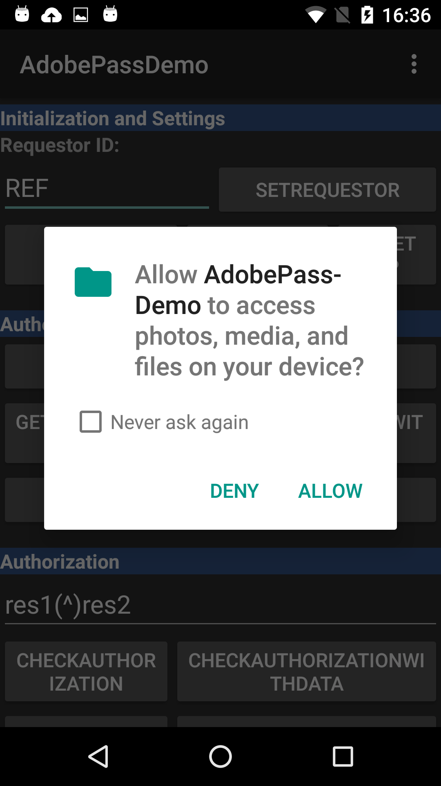

# （レガシー） Adobe Pass認証とAndroid 6 「Marshmallow」新しい権限モデル {#adobe-primetime-authentication-and-the-android-6-marshmallow-new-permissions-model}

>[!NOTE]
>
>このページのコンテンツは、情報提供のみを目的として提供されています。 このAPIを使用するには、Adobeの現在のライセンスが必要です。 無断使用は認められません。

>[!IMPORTANT]
>
> [製品のお知らせ](/help/authentication/product-announcements.md) ページに集計されている最新のAdobe Pass認証製品のお知らせと廃止予定について、常に情報を得てください。

</br>

新しいAndroid 6 Marshmallow リリースでは、既存のAdobe Pass Authentication SDK バージョン 1.8以前を使用するアプリの動作に影響を与える可能性のある、権限モデルの一部のアップデートが導入されました。

新機能として、新しいAndroid OSでは、インストール時および実行時にアプリが必要とする権限を[細かく制御できます](https://developer.android.com/about/versions/marshmallow/android-6.0-changes.html)。

>[!IMPORTANT]
>
>以下に説明する変更は、**Android 6.0**&#x200B;専用に開発されたアプリケーションにのみ影響します（targetSdkVersion=23）。 Android 6.0へのアップグレード時に、ユーザーのデバイスにすでにインストールされている古いアプリケーションには影響しません。


具体的には、[API レベル 23](http://developer.android.com/sdk/api_diff/23/changes.html)を使用してAndroid Studioで開発され、Adobe Pass Authentication SDKを使用するアプリの場合、開発者はカスタムコードを記述する必要があります（以下のコードスニペットを参照） [権限の許可/拒否ダイアログをトリガーする](https://developer.android.com/training/permissions/requesting.html)。

デバイス外部ストレージへの書き込みアクセスをリクエストするために使用されるコードの抜粋を次に示します。

```java
// Here, thisActivity is the current activity
if (ContextCompat.checkSelfPermission(thisActivity,
                Manifest.permission.WRITE_EXTERNAL_STORAGE)
        != PackageManager.WRITE_EXTERNAL_STORAGE) {

    // Should we show an explanation?
    if (ActivityCompat.shouldShowRequestPermissionRationale(thisActivity,
            Manifest.permission.WRITE_EXTERNAL_STORAGE)) {

        // Show an expanation to the user *asynchronously* -- don't block
        // this thread waiting for the user's response! After the user
        // sees the explanation, try again to request the permission.

    } else {

        // No explanation needed, we can request the permission.

        ActivityCompat.requestPermissions(thisActivity,
                new String[]{Manifest.permission.WRITE_EXTERNAL_STORAGE},
                MY_PERMISSIONS_REQUEST_WRITE_EXTERNAL_STORAGE);

        // MY_PERMISSIONS_REQUEST_WRITE_EXTERNAL_STORAGE is an
        // app-defined int constant. The callback method gets the
        // result of the request.
    }
}
```


**ユーザーの視点**&#x200B;から見ると、インストール時に、ファイルの読み取り/書き込み権限の確認を求めるウィンドウが表示されます（下の図2を参照）。 これは次の2つの結果のうちの1つです。

1. ユーザー&#x200B;**が権限を確認**&#x200B;した場合、通常の認証フローは保持され、トークンはグローバルストレージに保存されます。 ユーザーは、トークンが有効である限り、アプリ内およびアプリ間でAdobe Pass認証を使用して認証されたままになります。
1. ユーザー&#x200B;**が権限を拒否**&#x200B;した場合、ストレージ内の書き込みアクションは失敗し、ユーザーはアプリを終了するまで認証されません。 フォアグラウンドとバックグラウンドを切り替えると、一部のアプリケーションが再初期化されるため、このアクションを実行する際にユーザーがログアウトされることに注意してください。 トークンは保存されないので、ユーザーはアプリを使用するたびに認証する必要があります。


>[!TIP]
>
>現在、Adobe Pass Authentication SDK 1.9用にストレージのレジリエンスを導入する機能が開発中です。 新しいSDKは、10月&#x200B;**の最終週の** リリースを目標としています。 一般的なストレージを使用できない場合、アプリケーションはアプリケーションのサンドボックスストレージへの書き込みにフォールバックします。 これは、API レベル 23で開発されたアプリケーションについて、ユーザーがグローバルストレージでの読み取り/書き込み権限を受け入れない場合をカバーします。 トークンはアプリごとに個別に保存されるため、Adobe Pass認証を使用したアプリ間のシングルサインオンは無効になります。




*図：API レベル 23*&#x200B;をターゲットとして作成されたアプリの権限リクエストダイアログ

>[!IMPORTANT]
>
> Adobeは、認証プロセスで可能な限り優れたユーザーエクスペリエンスを保証するために、API レベル 22 （targetSdkVersion=22）以前を使用してアプリを開発するよう&#x200B;**のパートナーにアドバイスします**。
