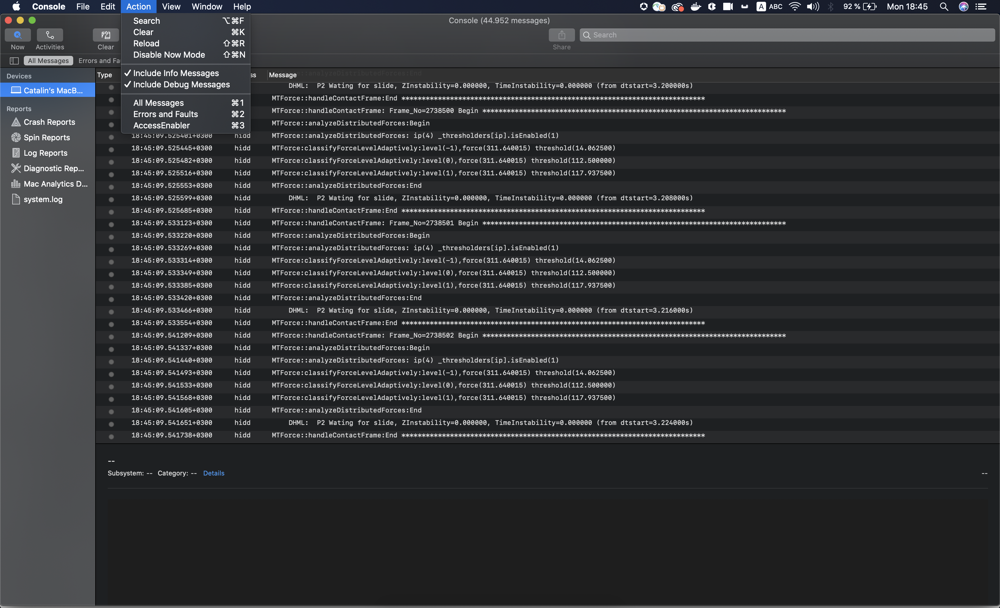
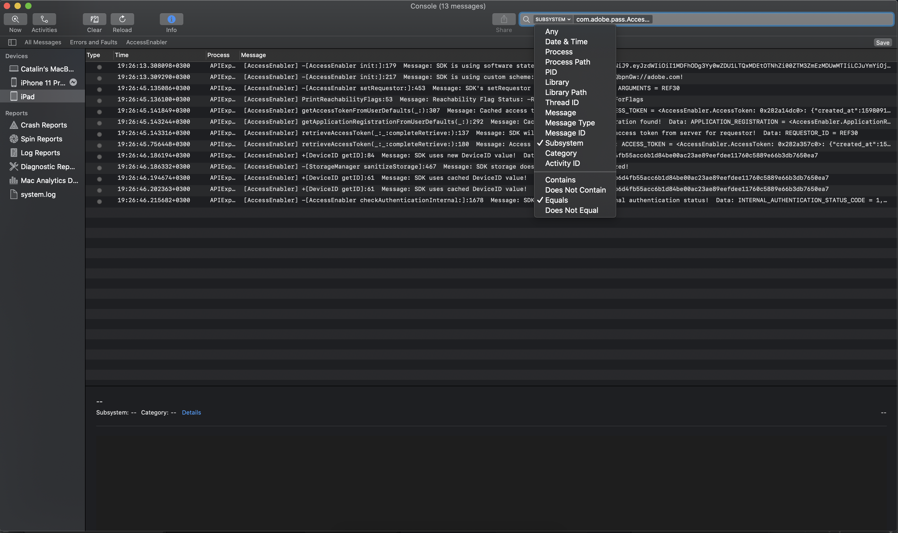
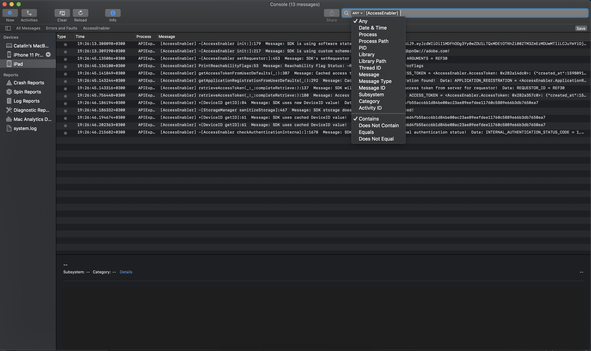

# （レガシー） コンソールアプリログを使用したAccessEnabler iOS/tvOS SDKのデバッグ {#debugging-the-accessenabler-iostvos-sdk-using-console-app-logs}

>[!NOTE]
>
>このページのコンテンツは、情報提供のみを目的として提供されています。 このAPIを使用するには、Adobeの現在のライセンスが必要です。 無断使用は認められません。

>[!IMPORTANT]
>
> [製品のお知らせ](/help/authentication/product-announcements.md) ページに集計されている最新のAdobe Pass認証製品のお知らせと廃止予定について、常に情報を得てください。

## 概要

このドキュメントでは、AccessEnablerのiOS/tvOS SDK ログ機能の進化と、コンソール アプリのログを使用したAccessEnabler フレームワークのデバッグに役立つ詳細情報を取り上げて紹介します。

## ロギング機構状態

AccessEnabler iOS/tvOS ロギング メカニズムの目的は、AccessEnabler フレームワークを使用するアプリケーションが原因で発生する可能性のある問題のトラブルシューティングに役立つメッセージを送信することです。

### AccessEnabler iOS/tvOS 3.5.0以降

AccessEnabler iOS/tvOS 3.5.0 バージョン以降、ロギング メカニズムでは、次の機能強化が変更として導入されています。

* AccessEnabler フレームワークは、Appleの推奨[OSLog](https://developer.apple.com/documentation/os/oslog)実装を使用します。

* AccessEnabler フレームワークでは、サブシステム **com.adobe.pass.AccessEnabler**&#x200B;に基づいてコンソールアプリログをフィルタリングする機能が導入されています。 SDKから送信されるすべてのメッセージは、com.adobe.pass.AccessEnablerの一部です。

* AccessEnabler フレームワークでは、任意（プレフィックス）に基づいてコンソールアプリログをフィルタリングする機能が導入されました：**[AccessEnabler]**。 SDKから送信されるすべてのメッセージには、[AccessEnabler]というプレフィックスが付きます。

* AccessEnabler フレームワークでは、カテゴリ：**debug**、**error**&#x200B;に基づいてコンソールアプリログをフィルタリングする機能が、上記の2つの条件であるサブシステムまたは任意（プレフィックス）と組み合わせて導入されています。

## コンソールアプリログを使用したデバッグ

調査される問題によっては、AccessEnabler フレームワークから出力されるログメッセージを含めるか除外する場合があるため、調査中やコンソールアプリログを使用する際に役立つ有用な詳細情報を以下に示します。

### AccessEnabler iOS/tvOS 3.5.0以降

#### 含む {#including}

まず、AccessEnabler フレームワークによって発行されたログ メッセージを表示するには、次の画像に示すように、コンソールアプリのアクション セクションで「情報メッセージを含める」と「デバッグメッセージを含める」を選択する必要があります&#x200B;**1&rbrace;。**

AccessEnabler iOS/tvOS SDKの機能と&#x200B;**AccessEnabler フレームワークのログを**&#x200B;参照して、次の操作を実行できます。

* コンソールアプリで、**Subsystem** オプションを使用して検索します。このオプションは、次の画像のようにcom.adobe.pass.AccessEnabler値に等しくなります。

* **Any** オプションを使用してコンソールアプリで検索します。このオプションには、
  [AccessEnabler]の値を次の画像に示します。

上記の2つの条件に加えて、**Category** オプションを&#x200B;**Subsystem**&#x200B;または&#x200B;**Any （プレフィックス）**&#x200B;と組み合わせて使用して、AccessEnabler iOS/tvOS SDKから出力される&#x200B;**debug**&#x200B;または&#x200B;**error** レベルのメッセージを明示的に検索することもできます。

#### 除外

他のコンポーネントの機能をより適切にデバッグし、AccessEnabler フレームワークのログを&#x200B;**exclude**&#x200B;できるように、次の操作を実行できます。

* com.adobe.pass.AccessEnablerの値と等しくない&#x200B;**Subsystem** オプションを使用して、コンソールアプリで検索します。
* [AccessEnabler]値を含まない&#x200B;**Any** オプションを使用してコンソールアプリで検索します。

## 問題の報告

Adobe Pass認証に問題を報告する場合は、次の推奨事項を検討してください。

* 再生の手順を指定してください。
* 問題が発生するOS バージョンとデバイスモデルを指定してください。
* 問題が発生しているAccessEnabler iOS/tvOS SDKのバージョンを提供してみてください。
* 「[を含む](#including)」セクションに記載されている2つのオプションのいずれかを使用して、すべてのAccessEnabler iOS/tvOS SDK ログ メッセージをキャプチャして添付してみてください。
