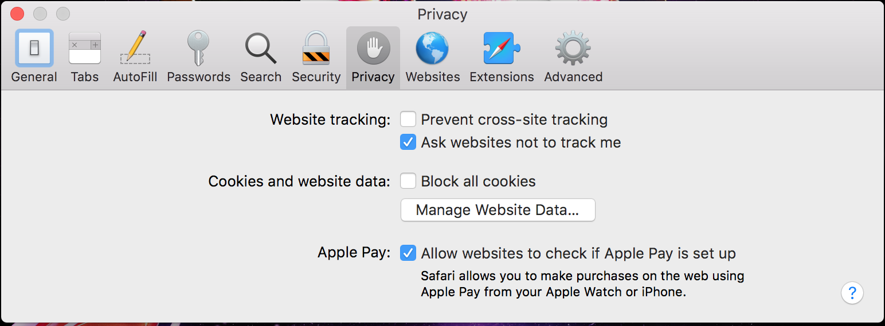
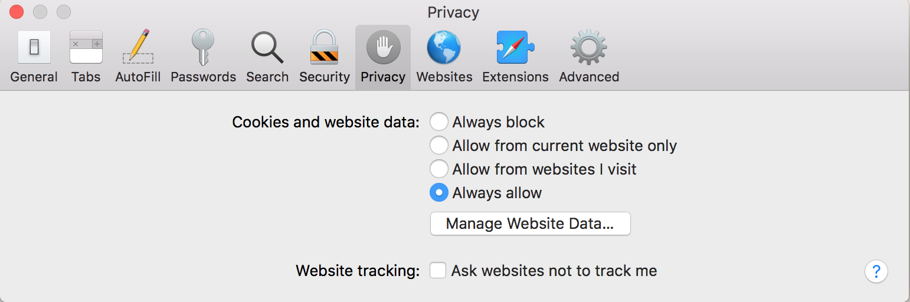
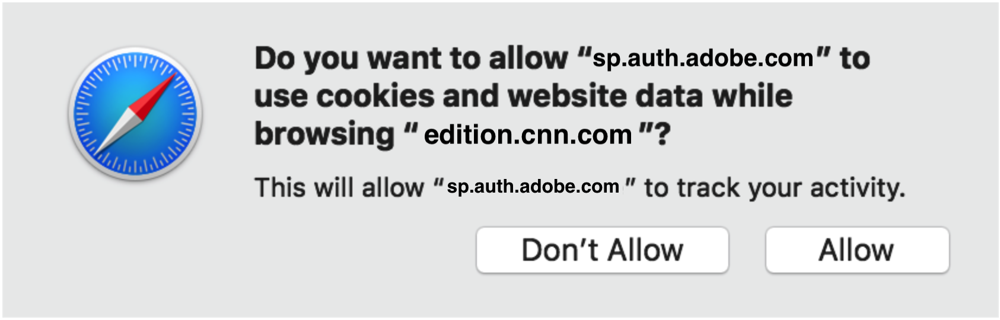

# （従来）トラッキング防止評価 – Apple Safari {#tracking-prevention-assessment-apple-safari}

>[!NOTE]
>
>このページのコンテンツは、情報提供のみを目的として提供されています。 このAPIを使用するには、Adobeの現在のライセンスが必要です。 無断使用は認められません。

>[!IMPORTANT]
>
> [製品のお知らせ](/help/authentication/product-announcements.md) ページに集計されている最新のAdobe Pass認証製品のお知らせと廃止予定について、常に情報を得てください。

## Safari 10 {#safari10}

**詳細**

Safari 10以降、デフォルトのブラウザープライバシー設定では、シングルサインオン（SSO）、シングルログアウト（SLO）、およびパッシブ認証機能が動作しなくなります。 シングルサインオン（SSO）とパッシブ認証は、次の場合でも機能しません
複数のタブまたはブラウザーウィンドウ間で同じセッションが表示されます。

これらの変更は、Adobe Pass認証プロセスに影響を与え、影響を与えています
accessEnabler JavaScript SDKの次のバージョン（バージョン 2.x）、v3 （バージョン 3.x）、v4 （バージョン 4.x）の場合。

### 緩和 {#mitigation-safari10}

これらの制限を軽減するには、ユーザーにSafari 10 ブラウザーのプライバシー設定を変更するように指示し、ブラウザーの「**Cookieとweb サイトのデータ**」エントリの「**常に許可**」オプションを環境設定から使用します（下図を参照）。

## Safari 11 {#safari11}

**詳細**

>[!IMPORTANT]
>
>上記のすべての詳細は、Safari 11の場合も引き続き適用されます。

Safari 11以降、ブラウザーは[&#x200B; インテリジェントトラッキング防止](https://webkit.org/blog/7675/intelligent-tracking-prevention/) （ITP）メカニズムを導入します。これは、クロスサイトトラッキングを防止するためにヒューリスティクスを使用するテクノロジーです。 これらのヒューリスティクスは、ネットワーク呼び出しに対するサードパーティ Cookieの保存と再生に影響します。つまり、ITP メカニズムのアクティベーションに応じて、Safari ブラウザーがクライアント – サーバーモデルの通信でサードパーティ Cookieをブロックします。

Adobe Pass認証サービスは、機能&#x200B;**を実行するために、認証プロセス**&#x200B;の一部としてCookieを使用し、これに依存しています。 認証プロセスが自動的に行われる場合（Temp Passなど）、またはiFrameまたは「リフレッスレス」機能を使用する実装では、AdobeのCookieはサードパーティのCookieと見なされ、デフォルトでブロックされます。 それ以外の場合、Safariでは、マシンラーニングアルゴリズムを使用して、すべてのAdobe Pass Authentication Service Cookieをトラッキング Cookieとしてフラグ付けする可能性があります。これにより、ITPのブロックの対象となります。

結論として、Safari 11 ブラウザーのユーザーは、特に複数のAdobe Pass認証対応web サイトを使用している場合、Intelligent Tracking Prevention （ITP）メカニズムのアクティベーション後、Adobe Pass認証対応web サイトで認証できない可能性があります。 したがって、ユーザーの認証エクスペリエンスは、ログインできないから予想される認証時間よりも短くなるまで、予期せぬ未定義である可能性があります。

これらの変更は、AccessEnabler JavaScript SDKのv2 （バージョン 2.x）、v3 （バージョン 3.x）の次のバージョンのAdobe Pass認証プロセスに影響を与え、影響を与えています。

### 緩和 {#mitigation-safari11}

AccessEnabler JavaScript SDK v3 （バージョン 3.x）とAccessEnabler JavaScript SDK v4 （バージョン 4.x）の両方で、必要なCookieが欠落しているためにユーザーの認証がブロックされた状況を特定できるメカニズムが含まれています。 このような状況では、ライブラリは特定のエラーコールバック [N130](/help/authentication/integration-guide-programmers/legacy/error-reporting/error-reporting.md#advanced-error-codes-reference)をトリガーします。このコールバックは、問題を軽減するためのアクションをユーザーに指示するためのシグナルとして使用するために、Adobe Pass認証対応web サイトに渡されます。 このメカニズムを利用するには、Web サイトで[&#x200B; エラー報告](/help/authentication/integration-guide-programmers/legacy/error-reporting/error-reporting.md)仕様を実装する必要があります。

AccessEnabler JavaScript SDK v2 （バージョン 2.x）の場合、ライブラリには上記のメカニズムは提供されないため、Adobe Pass認証対応web サイトに、問題を軽減するためのアクションを実行するようにユーザーに指示する際に通知を送ることはできません。

前述の問題を軽減できるアクションのリスト **は、AccessEnabler JavaScript SDKの3つのバージョン**&#x200B;すべてに適用されます。

実装者のweb サイトで[N130](/help/authentication/integration-guide-programmers/legacy/error-reporting/error-reporting.md#advanced-error-codes-reference) エラーコールバックを受け取った場合、次の方法でIntelligent Tracking Prevention （ITP）を無効にし、サードパーティ Cookieを有効にするようにユーザーに指示する必要があります。

* Mac OS X High Sierra以降の場合：次の画像に示すように、ブラウザーの「**Web サイトトラッキング**」エントリの「**クロスサイトトラッキングを防止**」オプションのチェックを外します。

  

* Mac OS X Sierra以前の場合：ブラウザの「環境設定」タブの「**Cookieとweb サイト データ**」エントリの「**常に許可**」オプションを次の画像に示すように確認します。

  

## Safari 12 {#safari12}

**詳細**

>[!IMPORTANT]
>
>上記のすべての詳細は、Safari 10およびSafari 11のセクションで引き続き適用されます。

この節では、Safari 12での&#x200B;**AccessEnabler JavaScript SDK バージョン 4.x**&#x200B;の互換性の問題について詳しく説明します。

>[!NOTE]
>
>AccessEnabler JavaScript SDK バージョン 2.xおよびAccessEnabler JavaScript SDK バージョン 3.xの場合、どちらも認証プロセスにサードパーティ Cookieを使用します。また、Safari 11以降のITPおよびサードパーティ Cookie ポリシーにより、ユーザーの認証エクスペリエンスが予期しない未定義の可能性があります。ログインできない場合や、想定される認証時間よりも短い場合があります。

### Safari 12でのAccessEnabler JavaScript SDK v4 （バージョン 4.x）の認定機能 {#certified-functionality-of-accessenabler-javacscript=sdk-v4}

バージョン 4.0以降のAccessEnabler JavaScript SDKでは、認証プロセスにサードパーティ Cookieが使用されなくなったため、ユーザーのブラウザーでサードパーティ Cookieが無効になっている場合でも、ユーザーインタラクションを利用する&#x200B;**認証** フローは常に機能します。

>[!NOTE]
>
>ユーザーは、ログインポップアップを開いたり、MVPD ログインページを操作したりするために、サイトを操作する必要があります。

**認証/プリフライト/ユーザーメタデータ**&#x200B;操作は、ユーザーが既に認証されていれば、完全に機能します。

### Safari 12でのAccessEnabler JavaScript SDK v4 （バージョン 4.x）の既知の問題 {#known-issues-of-accessenabler-javascript-sdk-4}

* SSOとSLO

  * Safari 10以降のSafariでlocalStorageが実装される方法により、JS SDKは共通ドメイン iFrameを介してログインステートを共有できなくなります。 つまり、AccessEnabler JavaScript SDKを使用するすべてのサイトにログインする必要があります。 ログアウトしても、サイト間の認証トークンは削除されないため、Adobe Pass認証対応の各web サイトからログアウトする必要があります。

* テンプパス

  * 一時的なパスの場合、AccessEnabler JavaScript SDKは、認証トークンを特定のデバイス（ブラウザーインスタンス）にロックするために、個別化メカニズムを使用します。 Safari 12の新しいメカニズムはトラッキングを防止するために設計されているため、個人化メカニズム **で計算および使用しているフィンガープリントは、同じIP アドレス**&#x200B;を持つすべてのユーザーに対して同じになります。 私たちは個人化の目的のためにクライアント IPを考慮していますが、それでも同じパブリック IP アドレスを共有するユーザーに影響があります。 これらのユーザーに対しては、同じ個人化IDを計算し、一時パスはそれに関連付けられます。 これは、そのようなユーザーが一時的なパスを使用すると、他の誰もそれにアクセスできなくなります\! これは特に、企業ユーザー、教育機関、または複数のユーザーがNATまたは共通のプロキシを使用してインターネットにアクセスしている他の組織に影響を与えます。

>[!NOTE]
>
>この問題は、実装者がユーザー操作の結果としてTemp Passを使用している場合にのみユーザーに影響します。それ以外の場合、Temp Pass認証は以下の&#x200B;**自動フロー**&#x200B;の対象となります。

* 自動フロー

  * JS SDK 4.0を使用する場合、Safari 12でユーザーの操作なしで自動モードで試行された認証フローは成功しません。 今後のJS SDK 4.1では、自動フローに関するすべての問題が修正されます。

この問題の影響を受けるユースケース：

* TempPass （Free Preview）認証の自動処理 – このようなフローでは、SDKはN130 エラーをスローします。

* パッシブ認証（サイレントで失敗） – ユーザーはこのMVPDを選択して資格情報を入力するよう求められます

### 緩和 {#mitigation-safari12}

**SSOおよびSLO**

本文書を執筆する時点では、現時点で利用可能または可能な既知の緩和策はありません。 AppleはSafari 12 （`https://webkit.org/blog/8124/introducing-storage-access-api`）で「Storage Access API」を導入しましたが、現在の実装はlocalStorageには適用されず、Cookieにのみ適用されます。 さらに、APIを使用するにはユーザーインタラクションが必要であり、使用すると、ユーザーは次のような権限ダイアログでプロンプトが表示されます。

この時点では、これらのSafariの要件/プロンプトはUX要件と一致せず、他のブラウザーと同様に一貫した動作を示しません。共通ドメインのlocalStorageにトークンを保存すると、SSOが「機能する」ことになります。

**一時パス**

個人化の問題を軽減し、ユーザーとのやり取りを行うために、インタラクティブな方法で&#x200B;**[プロモーションテンプパス](/help/authentication/integration-guide-programmers/features-premium/temporary-access/temp-pass-feature.md#promotional-temp-pass)**&#x200B;を使用し、ユーザーに関する少なくとも1つの追加情報（電子メールアドレスなど）を提供することをお勧めします。

## Safari 13 {#safari13}

**詳細**

>[!IMPORTANT]
>
>Safari 10からSafari 12までの上記の詳細は、Safari 13の場合も引き続き適用されます。

Safari 13以降、ブラウザーは[&#x200B; インテリジェントトラッキング防止](https://webkit.org/blog/7675/intelligent-tracking-prevention/) （ITP）に新しい変更を導入し、クロスサイトトラッキングを防ぐために、サードパーティクッキーをトラッキングクッキーとしてフラグ付けするプロセスにおいて、メカニズムの背後にあるヒューリスティクスを強化しました。

前の節で説明したように、Adobe Pass Authentication Serviceは、実装でAccessEnabler JavaScript SDK v2 （バージョン 2.x）およびAccessEnabler JavaScript SDK v3 （バージョン 3.x）を使用する場合に、認証プロセスの一部としてサードパーティ Cookieを使用および使用します。 ITPがユーザーと関係者（プログラマーのウェブサイトとAdobe）との間のインタラクションについて「学習」するために少し時間を費やした後に開始された以前のバージョンのSafari ブラウザーと比較して、Safari 13 ブラウザーは、クライアントのトラッキング Cookieと見なされるサードパーティ Cookieの開始からブロックされています – サーバーモデル通信。

結論として、Safari 13 ブラウザーのユーザーは、古いバージョンのAccessEnabler JavaScript SDK、v2 （バージョン 2.x）またはv3 （バージョン 3.x）を使用しているAdobe Pass認証対応web サイトで、新しい認証を開始できない可能性が高くなります。 これは、必要なすべてのAdobe Primetime Authentication Service CookieがITPによってブロックされているため、サービスが認証リクエストを満たすことができないことが原因で発生します。

AccessEnabler JavaScript SDK v4 （バージョン 4.x）ライブラリでは、認証プロセスにサードパーティ Cookieは使用されないため、Safari 13の変更によって操作が影響を受けることはありません。

### 緩和 {#mitigation-safari13}

何よりもまず、Safari ブラウザーで安定した予測可能な動作を実現するために、AccessEnabler JavaScript SDK バージョン 4.x **への**&#x200B;移行を強くお勧めします。

次に、AccessEnabler JavaScript SDK v3 （バージョン 3.x）の場合、ライブラリには、必須Cookieが欠落しているためにユーザー認証がブロックされた状況を特定できるメカニズムが含まれています。 このような状況では、ライブラリは特定のエラーコールバック（[N130](/help/authentication/integration-guide-programmers/legacy/error-reporting/error-reporting.md#advanced-error-codes-reference)）をトリガーします。このエラーコールバックは、問題を軽減するためのアクションをユーザーに指示するためのシグナルとして使用するために、Adobe Pass認証対応web サイトに渡されます。 このメカニズムを利用するには、Web サイトで[&#x200B; エラー報告](/help/authentication/integration-guide-programmers/legacy/error-reporting/error-reporting.md)仕様を実装する必要があります。

AccessEnabler JavaScript SDK v2 （バージョン 2.x）の場合、ライブラリには上記のメカニズムは提供されないため、Adobe Pass認証対応web サイトに、問題を軽減するためのアクションを実行するようにユーザーに指示する際に通知を送ることはできません。

実装者のweb サイトで[N130](/help/authentication/integration-guide-programmers/legacy/error-reporting/error-reporting.md#advanced-error-codes-reference) エラーコールバックを受け取った場合、次の方法でIntelligent Tracking Prevention （ITP）を無効にし、サードパーティ Cookieを有効にするようにユーザーに指示する必要があります。

* Mac OS X High Sierra以降の場合：次の画像に示すように、ブラウザーの「**Web サイトトラッキング**」エントリの「**クロスサイトトラッキングを防止**」オプションのチェックを外します。

  

* Mac OS X Sierra以前の場合：次の画像で示すように、ブラウザーの「環境設定」から「**Cookieとweb サイトのデータ**」エントリの「**常に許可**」オプションをオンにします。

  
