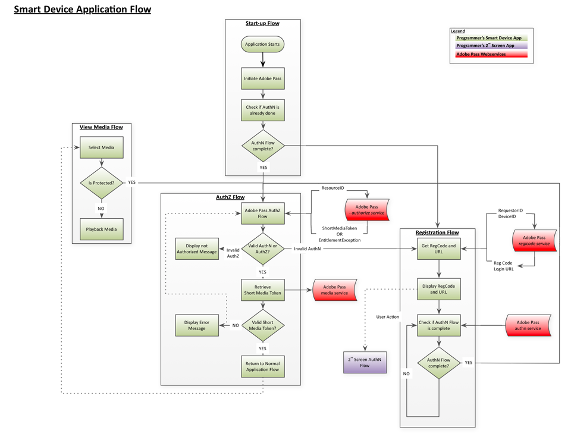
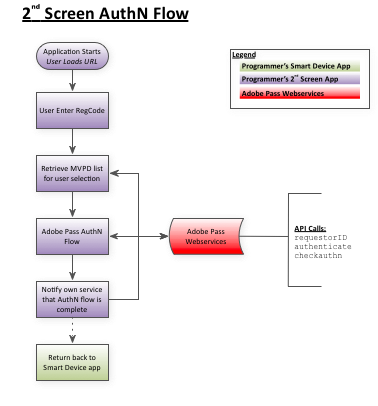
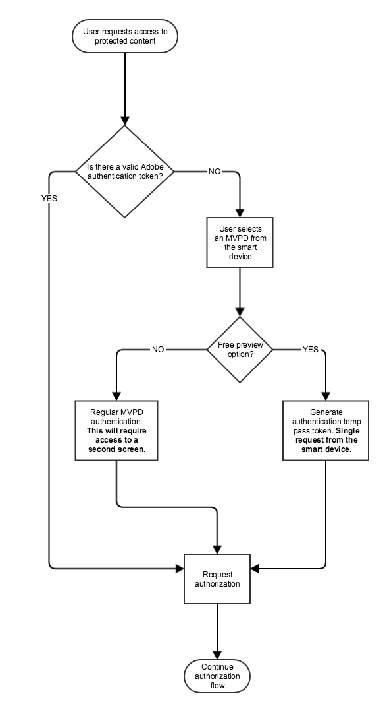

# （レガシー） REST API クックブック （クライアント間） {#rest-api-cookbook-client-to-server}

>[!NOTE]
>
>このページのコンテンツは、情報提供のみを目的として提供されています。 このAPIを使用するには、Adobeの現在のライセンスが必要です。 無断使用は認められません。

>[!IMPORTANT]
>
> [製品のお知らせ](/help/authentication/product-announcements.md) ページに集計されている最新のAdobe Pass認証製品のお知らせと廃止予定について、常に情報を得てください。

## 概要 {#overview}

このドキュメントでは、プログラマーのエンジニアリングチームが「スマートデバイス」（ゲームコンソール、スマートテレビアプリ、セットトップボックスなど）を統合するための手順を説明します。 REST API サービスを使用してAdobe Pass認証を行います。 クライアントSDKではなくREST APIを使用するこのクライアント間アプローチにより、一意のSDKを大量に開発できない様々なプラットフォームを幅広くサポートできます。 クライアントレスソリューションの仕組みについて詳しくは、[ クライアントレステクニカル概要](/help/authentication/integration-guide-programmers/legacy/rest-api-v1/rest-api-overview.md)を参照してください。

このアプローチでは、必要なフローを完了するために、2つのコンポーネント（ストリーミングアプリとAuthN アプリ）が必要です。ストリーミングアプリのスタートアップ、登録、認証、ビューメディアフローと、AuthN アプリの認証フローです。

### スロットル機構

Adobe Pass Authentication REST APIは、[ スロットル メカニズム ](/help/authentication/integration-guide-programmers/throttling-mechanism.md)によって管理されます。

## コンポーネント {#components}

作業中のクライアント間ソリューションでは、次のコンポーネントが含まれます。

| タイプ | コンポーネント | 説明 |
| --- | --- | --- |
| ストリーミングデバイス | ストリーミングアプリ | ユーザーのストリーミングデバイス上に存在し、認証済みビデオを再生するプログラマーアプリケーション。 |
| | \[Optional\] AuthN モジュール | ストリーミングデバイスにUser Agent （Web ブラウザー）がある場合、AuthN Moduleは、MVPD IdP上のユーザーを認証する責任があります。 |
| \[Optional\] AuthN デバイス | 認証アプリ | ストリーミングデバイスにユーザーエージェント（Web ブラウザーなど）がない場合、AuthN アプリケーションは、Web ブラウザーを使用して別のユーザーのデバイスからアクセスされるプログラマーのWeb アプリケーションです。 |
| Adobe Infrastructure | Adobe Pass Service | MVPD IdPおよびAuthZ サービスと統合し、認証および認証の決定を提供するサービス。 |
| MVPD Infrastructure | MVPD IdP | 資格情報ベースの認証サービスを提供し、ユーザーのIDを検証するMVPD エンドポイント。 |
| | MVPD AuthZ Service | ユーザーのサブスクリプションやペアレンタル制御などに基づいて認証に関する意思決定を行うMVPD エンドポイント。 |

## フロー{#flows}

### 動的クライアント登録（DCR）

Adobe Passでは、DCRを使用して、プログラマーアプリケーションやサーバーとAdobe Passサービス間のクライアントコミュニケーションを保護します。 DCR フローは個別であり、[動的クライアント登録の概要](../../../rest-apis/rest-api-dcr/dynamic-client-registration-overview.md)のドキュメントで説明されています。

### ストリーミング（スマートデバイス）アプリフロー

#### 起動フロー

1. アプリが起動し、初期UIが読み込まれます。

2. デバイス IDを取得/生成します。

3. デバイスが既に認証されているかどうかを確認するには、Check-authentication呼び出しを発行します。  例：[`<SP_FQDN>/api/v1/checkauthn [device ID]`](/help/authentication/integration-guide-programmers/legacy/rest-api-v1/apis/check-authentication-token.md)

4. `checkauthn`呼び出しが成功した場合は、手順2以降の認証フローに進みます。  失敗した場合は、登録フローを開始します。

#### 登録フロー

1. ユーザーがセカンドスクリーンログインアプリにアクセスするために使用する登録コードとURLを取得し、ユーザーに提示します。

   a.  Adobe Registration Code ServiceにPOST リクエストを送信し、ハッシュ化されたデバイス IDと「Registration URL」を渡します。  例：[`<REGGIE_FQDN>/reggie/v1/[requestorId]/regcode [device ID]`](/help/authentication/integration-guide-programmers/legacy/rest-api-v1/apis/registration-code-request.md)

   b.  返された登録コードとURLをユーザーに提示します。

   c.  Web対応デバイスに切り替え、URLに移動してから登録コードを入力するようにユーザーに指示します。

#### 承認フロー

1. ユーザーは2番目の画面アプリから戻り、デバイスの「続行」ボタンを押します。 または、ポーリングメカニズムを実装して認証ステータスを確認することもできますが、Adobe Pass認証では、ポーリングよりも「続行」ボタン方式を推奨しています。<!--(For information on employing a "Continue" button versus polling the Adobe Pass Authentication backend server, see the Clientless Technical Overview: Managing 2nd-Screen Workflow Transition.)--> 例：[\&lt;SP\_FQDN\>/api/v1/tokens/authn](/help/authentication/integration-guide-programmers/legacy/rest-api-v1/apis/retrieve-authentication-token.md)

2. GET リクエストをAdobe Pass Authentication authorization serviceに送信して、認証を開始します。 例：`<SP_FQDN>/api/v1/authorize [device ID, Requestor ID, Resource ID]`

<!-- end list -->

* 応答が成功を示す場合：ユーザーには有効なAuthN トークンがあり、ユーザーはリクエストされたメディアを視聴する権限を持っています（このユーザーには有効なAuthZ トークンがあります）。

* 応答が失敗を示す場合：そのタイプ（AuthN、AuthZなど）を判断するためにスローされた例外を調べます。

   * AuthN エラーの場合は、登録フローを再起動します。

   * AuthZ エラーの場合、ユーザーは要求されたメディアを視聴する権限を持たず、何らかのエラーメッセージがユーザーに表示されます。

   * 他のエラー（接続エラー、ネットワークエラーなど）が発生した場合 その後、ユーザーに適切なエラーメッセージを表示します。

#### メディアフローの表示

1. メディアの選択肢の提示： ユーザーは表示するメディアを選択します。

2. メディアは保護されていますか？

   a.  アプリは、メディアが保護されているかどうかを確認します。

   b.  メディアが保護されている場合、アプリは認証を開始します
（AuthZ）上記のフロー。

   c.  メディアが保護されていない場合は、のメディアを再生します
ユーザー：

3. メディアを再生します。

### AuthN （第2画面）アプリフロー

1. このユーザーのMVPDのリストを取得します。 例：[`<SP_FQDN>/api/v1/config/[requestorID]`](/help/authentication/integration-guide-programmers/legacy/rest-api-v1/apis/provide-mvpd-list.md)

1. 認証フローを開始します。  例：[`<SP_FQDN>/api/v1/authenticate [requestorID, MVPD ID, Redirect URL, Domain name, Registration Code, "noflash=true"]`](/help/authentication/integration-guide-programmers/legacy/rest-api-v1/apis/initiate-authentication.md)

1. 認証が成功したかどうかを確認します。 例：[`<SP_FQDN>/api/v1/checkauthn/[registration code][requestor ID]`](/help/authentication/integration-guide-programmers/legacy/rest-api-v1/apis/check-authentication-token.md)

1. ユーザーをスマートデバイスアプリに送り返して、認証フローを完了させます。

## パートナーシングルサインオン {#partner-sso}

一部のデバイスでは、パートナーシングルサインオン（SSO）の専用サポートを提供しています。

* [APPLE SSO](/help/authentication/integration-guide-programmers/legacy/sso-access/apple-sso-cookbook-rest-api-v1.md)

## Platform シングルサインオン {#platform-sso}

一部のデバイスでは、Platform Single Sign-On （SSO）の専用サポートを提供しています。

* [AMAZON SSO](../../sso-access/amazon-sso-cookbook-rest-api-v1.md)

## REST API用TempPassとプロモーション TempPass {#temppass}

ユーザーが資格情報を入力する必要がないTempPassおよびプロモーション TempPass実装の場合、ストリーミングアプリで直接認証を実装できます。

**このAPIを使用するには、トークンの識別に使用されているデバイス IDと、オプションの追加データが一意であることをストリーミングアプリで確認する必要があります。**

