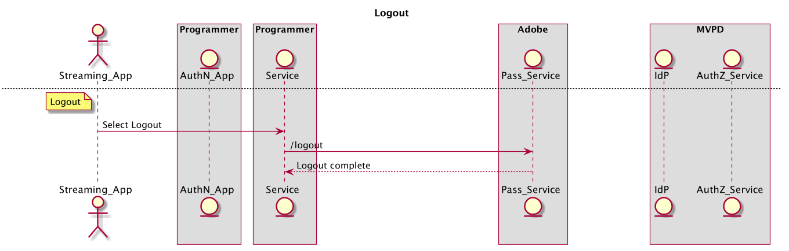

# （レガシー） REST API クックブック（サーバー間） {#rest-api-cookbook-server-to-server}

>[!NOTE]
>
>このページのコンテンツは情報提供のみを目的としています。 この API を使用するには、Adobeから現在のライセンスが必要です。 無許可の使用は許可されていません。

## 概要 {#overview}

このクックブックドキュメントの目的は、サーバー間アーキテクチャを使用したAdobe Pass認証の実装に関するベストプラクティスを詳しく説明することです。  基本的な要件、段階的なフローの実装および実稼動環境と運用に関する一般的な考慮事項を提供します。

### スロットルメカニズム

Adobe Pass認証 REST API は、[ スロットルメカニズム ](/help/authentication/integration-guide-programmers/throttling-mechanism.md) によって制御されます。

## Components {#components}

動作しているサーバー間ソリューションには、次のコンポーネントが含まれます。

| タイプ | コンポーネント | 説明 |
| --- | --- | --- |
| ストリーミングデバイス | ストリーミングアプリ | ユーザーのストリーミングデバイス上に存在し、認証済みビデオを再生するプログラマーアプリケーション。 |
| | \[ オプション\] AuthN モジュール | streaming Device にユーザーエージェント（Web ブラウザー）がある場合、AuthN モジュールはMVPD IdP でユーザーの認証を行う必要があります。 |
| \[ オプション\] AuthN デバイス | AuthN アプリ | ストリーミングデバイスにユーザーエージェント（Web ブラウザー）がない場合、AuthN アプリケーションは、Web ブラウザーを使用して別のユーザーのデバイスからアクセスする、プログラマー向けの Web アプリケーションです。 |
| プログラマ基盤 | プログラマーサービス | ストリーミングデバイスをAdobe Pass サービスにリンクして、認証と承認の決定を取得するサービス。 |
| Adobe基盤 | Adobe Pass サービス | MVPD IdP および AuthZ サービスと統合され、認証と承認の決定を行うサービス。 |
| MVPD インフラストラクチャ | MVPD IdP | ユーザーの ID を検証するために、資格情報ベースの認証サービスを提供するMVPD エンドポイント。 |
| | MVPD AuthZ サービス | ユーザーの購読、保護者による制限などに基づいて認証の決定を行うMVPD エンドポイント。 |

フローで使用されるその他の用語は、
[ 用語集 ](/help/authentication/kickstart/glossary.md)。

## フロー {#flows}

### 動的クライアント登録（DCR）

Adobe Passは、DCR を使用して、プログラマーアプリケーションまたはサーバーとAdobe Pass サービスの間のクライアント通信を保護します。 DCR フローは独立しており、[Dynamic Client Registration Overview](../../../rest-apis/rest-api-dcr/dynamic-client-registration-overview.md) ドキュメントで説明されています。

### 認証（authN）

認証フローは、ユーザーが自分自身を識別できるようにするために使用されます
をMVPDに送信して、ユーザーが有効なアカウントを持っているかどうかを確認します。

1. ユーザーがストリーミングデバイスアプリを起動し、保護されたコンテンツにログインまたは表示を試みます。
2. ストリーミングデバイスアプリは、デバイスが既に認証されているかどうかを判断するために、プログラマーサービスにリクエストを送信します。
3. プログラマーサービスは、DCR を使用してアプリを登録します。
4. プログラマーサービスは、Adobe Pass サービス **checkauthn** API を呼び出して、ストリーミングデバイス authN ステータスを確認します。
5. **checkauthn** 呼び出しでユーザーデバイスが認証済みのステータスが返された場合、アプリは認証フローに進むことができます。
6. **checkauthn** 呼び出しでユーザーデバイスが認証されていないというステータスが返された場合、アプリはユーザーリクエストのログインを待つ必要があります。
7. ユーザーが直接ログインをリクエストする場合（例：ログインボタンを選択する）、または間接的にログインをリクエストする場合（例：未認証の場合に保護されたコンテンツを選択する）、ストリーミングデバイスアプリはプログラマーサービスに対してユーザー認証を開始するリクエストを行います。 プログラマーサービスは、Adobe Pass サービス（regcode） API を呼び出して、一意の登録コード **regcode** をリクエストし、受け取ります。
8. また、プログラマーサービスは、Adobe Pass サービス **config** API を呼び出して、現在の MVPD および属性のリストを取得します。 メモ：この API は、フローの前半で呼び出され、キャッシュされることもあります。
9. プログラマーサービスは、ストリーミングデバイスアプリと、手順\#7 でリクエストされた処理済みMVPD リストに regcode を返します。 注意：処理済みのMVPDのリスト形式はプログラマーによって指定され、特定の MVPD （許可リストまたはブロックリスト）を明示的に許可またはブロックするようにフィルタリングできます。
10. が AuthN デバイスと異なる場合（つまり、「2 番目の画面」）、選択または必要に応じて（つまり、ストリーミングデバイスがユーザーエージェントをサポートしていない場合）、ストリーミングデバイスは regcode と、ユーザーが AuthN アプリケーションにアクセスするための URI を表示する必要があります。 ユーザーは、AuthN デバイスのユーザーエージェントに URI を入力して AuthN アプリケーションを起動し、そのアプリケーションに regcode を入力します。 ストリーミングデバイスが AuthN デバイスと同じ場合、regcode をプログラムによって AuthN モジュールに渡すことができます。
11. AuthN モジュールは、MVPD ピッカーを表示して、MVPDでのユーザー認証を開始します。 ユーザーがMVPDを選択すると、AuthN モジュールが regcode を使用して **authenticate** を呼び出します。これにより、ユーザーエージェントがMVPD IdP にリダイレクトされます。 MVPDでユーザーが正常に認証されると、ユーザーエージェントはAdobe Pass サービスを通じてリダイレクトされ戻されます。ここで成功した認証は regcode で記録され、その後 AuthN モジュールにリダイレクトされます。
12. ストリーミングデバイスが AuthN デバイスと異なる場合、AuthN デバイスは成功した認証メッセージをユーザーに表示し、続行する手順を示す必要があります（例：「成功」）。 ゲーム機に戻って [...\]] を続けることができます）。 ストリーミングデバイスが AuthN デバイスと同じ場合、ストリーミングデバイスはプログラムによって認証完了を検出できます。

次の図に、認証フローを示します。

### 認証（authZ）

認証フローは、要求されたコンテンツにユーザーがアクセスする権限があるかどうかを判断するために使用されます。

1. ユーザーがストリーミングデバイスアプリで保護されたコンテンツを表示しようとするたびに、ストリーミングデバイスアプリはコンテンツを識別し、ストリームを開始するために必要な権限と情報を要求するプログラマーサービスを呼び出します。
1. プログラマーサービスは、リソース ID と他の必須パラメーターを渡すAdobe Pass **authorize** API を呼び出します。 Adobe サービスは、リソース ID を使用してMVPD AuthZ サービスを呼び出し、承認の判断を受け取って、それをプログラマーサービスに返します。 この認証決定は、設定可能な期間、Adobe Pass サービスによってキャッシュされます。 プログラマーサービスからAdobe Pass サービスへの後続の **authorize** 呼び出し時に、キャッシュされた値が有効である限り返されます。
1. 認証が付与された場合、プログラマーサービスはAdobe Pass **/tokens/media** API を呼び出す必要があります。この API は署名済みのメディアトークンを返します。 プログラマーサービスは、メディアトークン検証用ライブラリ（JAR）を使用してメディアトークンを検証する必要があります。 有効な場合、プログラマーサービスは権限と、手順\#1 で要求されたストリーム （例：ストリーム URL）を開始するために必要なを返します。
1. 認証が拒否された場合、**authorize** 呼び出しはエラーコードと説明をプログラマーサービスに返します。 プログラマーサービスは、手順\#1 の要求にエラーコードと説明（またはプログラマーが変更したメッセージ）を返す必要があります。

次の図に、認証フローを示します。

### ログアウト

ログアウトフローを使用すると、ユーザーは現在 ID を削除できます
アプリケーションに関連付けられます。

1. ユーザーがログアウトをリクエストすると（つまり、アプリケーションに関連付けられた現在のMVPD アカウントをデバイスから削除すると）、ストリーミングデバイスアプリはプログラマーサービスを呼び出し、デバイスをログアウトするように指示します。
1. プログラマーサービスは、Adobe Pass **ログアウト** API を呼び出す必要があります。

次の図に、ログアウトフローを示します。

### \[ オプション\] 事前認証（プリフライト）

事前認証を使用すると、一連のリソースから、ユーザーがアクセスできるリソースをすばやく判断できます。  この呼び出しの結果は、通常、個々のユーザーの UI をカスタマイズするために使用されます。

1. ユーザが認証されると、ストリーミングデバイスは、プログラマーサービスを呼び出して、ユーザがストリーミングする権利を有するコンテンツを要求することができる。

1. プログラマーサービスは、リソース ID のリストを使用してAdobe Pass **事前認証** API を呼び出す必要があります。この ID は、通常、ユーザーがストリーム配信を受ける資格のあるチャネルを表す単純な文字列です。 *メモ：現在、* ***preauthorize*** *呼び出しは、リストを 5 つのリソース ID に制限するように設定されています。 5 つ以上のリソースが必要な場合は、複数の****preauthorize****コールを行うか、MVPD からの契約で 5 つ以上のリソースを受け入れるようにコールを設定することができます。 実装者は、MVPDのリソースに対する****preauthorize****call のコストと、プログラマへの応答時間を念頭に置き、呼び出しの使用を慎重に構造化する必要があります。*

1. **preauthorize** 呼び出しは、リクエストの各リソース ID に TRUE または FALSE の値を含む JSON オブジェクトを使用してプログラマーサービスに応答し、ユーザーに関連するチャネルの権利が付与されているかどうかを示します。 *メモ：ネットワークエラーやタイムアウトなどが原因で、MVPDから特定のリソース ID の回答が得られない場合、値はデフォルトで FALSE になります。*

1. プログラマーサービスは、プログラマー定義のストリーミングデバイスへのカスタム応答を作成する場合、通常は使用権限に基づいてユーザーに対するプレゼンテーションをパーソナライズする場合に、**事前認証** 呼び出し応答を使用します。

次の図に、事前認証フローを示します。

### \[ オプション\] メタデータ

メタデータを使用すると、MVPDで共有されるユーザー情報を取得できます。
例えば、ユーザー ID、郵便番号などがあります。

1. ユーザーが認証されると、プログラマーサービスは、Adobe Pass **usermetadata** API を呼び出して、認証されたユーザーに関する情報をリクエストできます。

1. 応答には、特定のユーザーで使用可能なすべてのメタデータが含まれます。 特定のフィールドは、プログラマーとMVPDの統合ごとに個別に設定されます。

次の図に、事前認証フローを示します。

## 環境と機能要件{#environments}

プログラマーは、実稼動用とステージング用の 2 つ以上の環境を少なくとも作成する必要があります。

### 実稼動

実稼働環境は可用性が高く、大きなスパイクや予期しないスパイク（ライブスポーツ、破損など）に対して適切にスケーリングする必要があります
ニュース）。

Adobe Pass サービスは、米国全体に地理的に分散した複数のデータセンターで実行されます。  Adobe Pass サービスからの応答時間を最高にするには（つまり、待ち時間を最小にするには）、プログラマーも同様に地理的に分散したサービスを作成する必要があります
インフラストラクチャ

プログラマーサービスは、Adobeがトラフィックを再ルーティングする必要がある場合、DNS キャッシュを最大 30 秒に制限する必要があります。 これは、データセンターが利用できなくなったときに発生する可能性があります。

プログラマーは、実稼動環境の公開 IP 範囲を指定する必要があります。 これらは、アクセス用にAdobe Pass インフラストラクチャの IP の許可リストに登録され、Adobeの公正な API 使用ポリシーによって管理されます。

### ステージング

ステージング環境は最小限にすることができますが、すべてのシステムコンポーネントとビジネスロジックを含める必要があります。 実稼動環境と同様に機能し、実稼動環境以外のリリースをテストできます。 ステージング環境をAdobe Pass テスト環境に接続して、プログラマーが使用したり、必要に応じてAdobeで使用したりできれば、テストとトラブルシューティングに役立ちます。

### 機能要件

プログラマーサービスは、フローを実行しているデバイスの正確なデバイス識別情報を渡す必要があります。 さらに、プログラマーサービスは、フローを実行するデバイスの IP を（x-forwarded-for ヘッダーで）接続ソースポートと共に（device info フィールドで）渡す必要があります。

    **X-Forwarded-For : \&lt;client\_ip\>**
    
     ここで、\&lt;client\_ip\> はクライアントのパブリック IP アドレスです 
    
    
    
     ヘッダーは**regcode**および**authorize**呼び出しに追加する必要があります 
    
     例：
    
    POST /reggie/v1/{req\_id}/regcode HTTP/1.1
    
    X-Forwarded-For:203.45.101.2001.20
    
    
    
     GET /api/v1/authorize HTTP FOR:203.45.101.20
/1.1
    
    X-Forwarded-For

プログラマーサービスは、個々の MVPD または統合アプリ（デバイス IP、ソースポート、デバイス情報、MRSS、ECID などのオプションデータ）で必要なデータと形式を送信する必要があります。<!--Please see the documentation for [Passing Device and Connection Information Cookbook](http://tve.helpdocsonline.com/passing-device-information-cookbook)-->。

プログラマーサービスは、キャッシュ時には authN および authZ の TTL を遵守し、通知時には authN または authZ セッションを無効にする必要があります。

プログラマーは、Adobeと共有される証明書を保持する必要があります。

<!--
## Related Information {#related}

* [REST API Reference](/help/authentication/rest-api-reference.md)
* [Glossary of Terms](/help/authentication/adobe-pass-glossary.md)
-->
