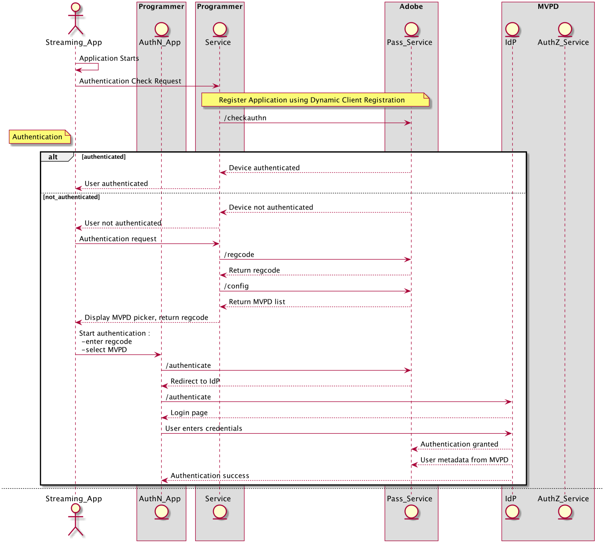
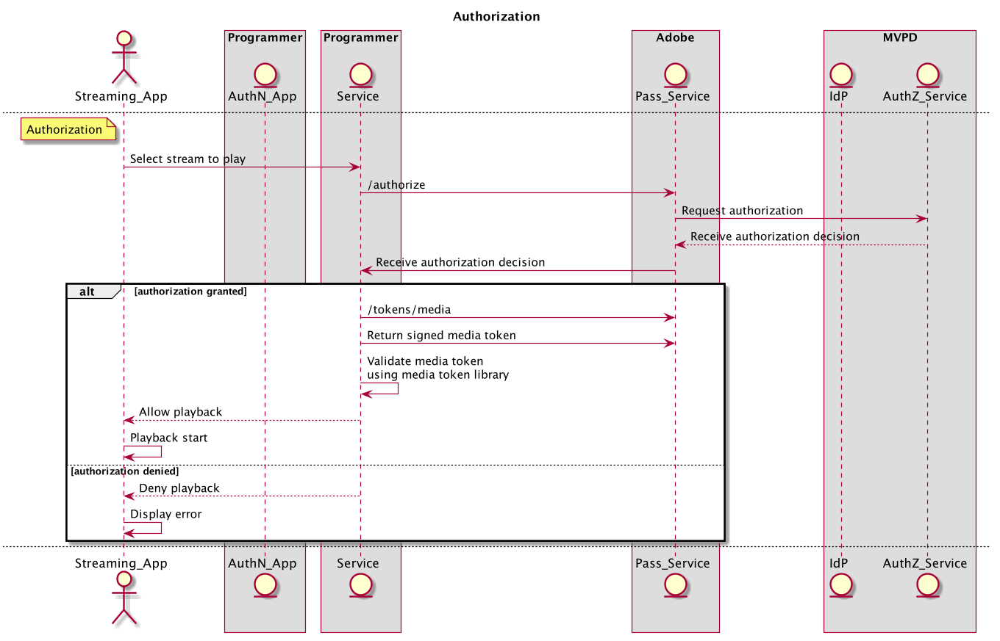
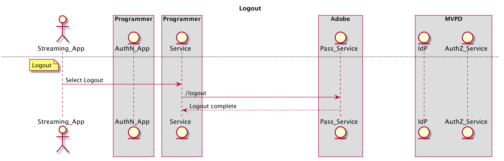
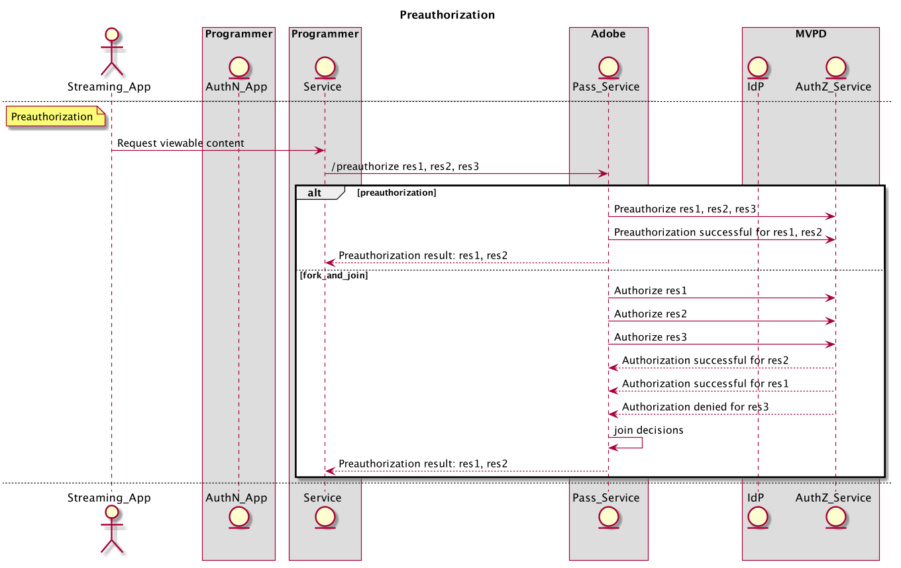
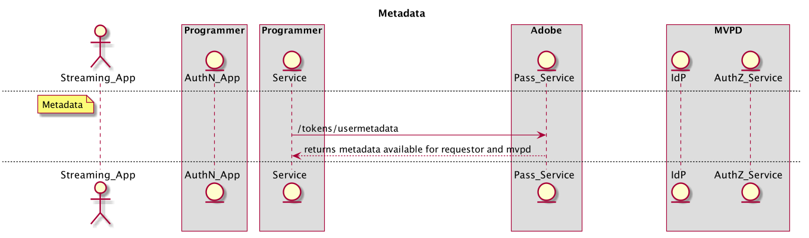

# （レガシー） REST API クックブック （サーバー間） {#rest-api-cookbook-server-to-server}

>[!NOTE]
>
>このページのコンテンツは、情報提供のみを目的として提供されています。 このAPIを使用するには、Adobeの現在のライセンスが必要です。 無断使用は認められません。

>[!IMPORTANT]
>
> [製品のお知らせ](/help/authentication/product-announcements.md) ページに集計されている最新のAdobe Pass認証製品のお知らせと廃止予定について、常に情報を得てください。

## 概要 {#overview}

このクックブックの目的は、サーバー間アーキテクチャを使用したAdobe Pass認証の実装に関するベストプラクティスを詳しく説明することです。  基本的な要件、手順ごとのフローの実装、本番環境と運用に関する一般的な考慮事項について説明します。

### スロットル機構

Adobe Pass Authentication REST APIは、[&#x200B; スロットル メカニズム &#x200B;](/help/authentication/integration-guide-programmers/throttling-mechanism.md)によって管理されます。

## コンポーネント {#components}

サーバー間ソリューションでは、次のコンポーネントを使用します。

| タイプ | コンポーネント | 説明 |
| --- | --- | --- |
| ストリーミングデバイス | ストリーミングアプリ | ユーザーのストリーミングデバイス上に存在し、認証済みビデオを再生するプログラマーアプリケーション。 |
| | \[Optional\] AuthN モジュール | ストリーミングデバイスにUser Agent （Web ブラウザー）がある場合、AuthN ModuleはMVPD IdPでユーザーを認証する責任があります。 |
| \[Optional\] AuthN デバイス | 認証アプリ | ストリーミングデバイスにユーザーエージェント（Web ブラウザーなど）がない場合、AuthN アプリケーションは、Web ブラウザーを使用して別のユーザーのデバイスからアクセスされるプログラマーのWeb アプリケーションです。 |
| プログラマーインフラ | プログラマーサービス | ストリーミングデバイスとAdobe Pass サービスをリンクして、認証および認証の決定を取得するサービス。 |
| Adobe Infrastructure | Adobe Pass Service | MVPD IdPおよびAuthZ サービスと統合し、認証および認証の決定を提供するサービス。 |
| MVPD Infrastructure | MVPD IdP | 資格情報ベースの認証サービスを提供し、ユーザーのIDを検証するMVPD エンドポイント。 |
| | MVPD AuthZ Service | ユーザーのサブスクリプションやペアレンタル制御などに基づいて認証に関する意思決定を行うMVPD エンドポイント。 |

## フロー {#flows}

### 動的クライアント登録（DCR）

Adobe Passでは、DCRを使用して、プログラマーアプリケーションやサーバーとAdobe Passサービス間のクライアントコミュニケーションを保護します。 DCR フローは個別であり、[動的クライアント登録の概要](../../../rest-apis/rest-api-dcr/dynamic-client-registration-overview.md)のドキュメントで説明されています。

### 認証（authN）

認証フローは、ユーザーが自分自身を識別できるようにするために使用されます
MVPDに接続し、利用者が有効なアカウントを持っているかどうかを判断できます。

1. ユーザーはストリーミングデバイスアプリを開始し、保護されたコンテンツのログインまたは表示を試みます。
2. ストリーミングデバイスアプリは、プログラマーサービスに対して、デバイスが既に認証されているかどうかを判断するためのリクエストを行います。
3. プログラマーサービスは、DCRを使用してアプリを登録します。
4. プログラマーサービスは、Adobe Pass サービス **checkauthn** APIを呼び出して、ストリーミングデバイスの認証ステータスを確認します。
5. **checkauthn**&#x200B;呼び出しがユーザーデバイスが認証されたステータスを返す場合、アプリは認証フローに進むことができます。
6. **checkauthn**&#x200B;呼び出しがユーザーデバイスが認証されていないステータスを返す場合、アプリはユーザーリクエストのログインを待つ必要があります。
7. ユーザーが直接ログインを要求した場合（例：ログインボタンを選択した場合）、または間接的にログインを要求した場合（例：未認証の場合に保護されたコンテンツを選択した場合）、ストリーミングデバイスアプリはプログラマーサービスに対してユーザー認証の開始を要求します。 プログラマーサービスは、Adobe Pass サービス **regcode** APIを呼び出して、一意の登録コード （regcode）をリクエストおよび受け取ります。
8. また、プログラマーサービスは、Adobe Pass サービス **config** APIを呼び出して、現在のMVPDと属性のリストを取得します。 注：このAPIは、フローの早い段階で呼び出してキャッシュすることもできます。
9. プログラマーサービスは、ストリーミングデバイスアプリにレグコードを返し、処理されたMVPD リストを手順\#7で要求します。 注意：処理されたMVPDのリストフォーマットはプログラマによって指定され、フィルタリングして特定のMVPD （許可リストまたはブロックリスト）を明示的に許可またはブロックできます。
10. がAuthN デバイス（つまり「2番目の画面」）と異なる場合、選択または必要に応じて（つまり、ストリーミングデバイスがユーザーエージェントをサポートしていない）、ストリーミングデバイスは、ユーザーがAuthN アプリケーションにアクセスするためのレジコードとURIを表示する必要があります。 ユーザーは、AuthN デバイスのユーザーエージェントにURIを入力してAuthN アプリケーションを起動し、そのアプリケーションにレグコードを入力します。 ストリーミングデバイスがAuthN デバイスと同じ場合、レジコードをプログラムによってAuthN モジュールに渡すことができます。
11. AuthN モジュールは、MVPD ピッカーを表示して、MVPDを使用したユーザー認証を開始します。 ユーザーがMVPDを選択すると、AuthN Moduleはregcodeを使用して&#x200B;**authenticate**&#x200B;を呼び出し、User AgentをMVPD IdPにリダイレクトします。 ユーザーがMVPDで正常に認証を行うと、ユーザーエージェントはAdobe Pass サービスを通じてリダイレクトされ、正常な認証はregcodeで記録され、その後AuthN モジュールにリダイレクトされます。
12. ストリーミングデバイスがAuthN デバイスと異なる場合、AuthN デバイスは、ユーザーに対する認証メッセージと続行する手順（例：「Success\!」を表示する必要があります。 ゲームコンソールに戻って、\[...\]&quot;）を続行できるようになりました。 ストリーミングデバイスがAuthN デバイスと同じ場合、ストリーミングデバイスは認証完了をプログラムによって検出する場合があります。

次の図は、認証フローを示しています。

### 認証（authZ）

認証フローは、ユーザーがリクエストされたコンテンツにアクセスする権限があるかどうかを判断するために使用されます。

1. ユーザーがストリーミングデバイスアプリで保護されたコンテンツを表示しようとすると、ストリーミングデバイスアプリがプログラマーサービスを呼び出して、コンテンツを識別し、ストリームの開始に必要な権限と情報を要求します。
1. プログラマーサービスは、リソース IDとその他の必須パラメーターを渡すために、Adobe Pass **authorize** APIを呼び出します。 Adobe サービスは、リソース IDを使用してMVPD AuthZ サービスを呼び出し、その後、プログラマーサービスに渡される認証の判断を受け取ります。 この認証の決定は、設定可能な期間、Adobe Pass サービスによってキャッシュされます。 プログラマーサービスからAdobe Pass サービスへの後続の&#x200B;**authorize**&#x200B;呼び出しでは、キャッシュされた値は有効な限り返されます。
1. 認証が付与された場合、プログラマーサービスはAdobe Pass **/tokens/media** APIを呼び出す必要があり、これにより署名済みメディアトークンが返されます。 プログラマサービスは、メディアトークン検証ライブラリ（JAR）を使用してメディアトークンを検証する必要があります。 有効な場合、プログラマーサービスは権限を返し、手順\#1で要求されたストリーム（ストリーム URLなど）を開始するために必要な権限を返す必要があります。
1. 認証が拒否された場合、**authorize**&#x200B;呼び出しは、エラーコードと説明をプログラマーサービスに返します。 プログラマーサービスは、エラーコードと説明（またはプログラマーが変更したメッセージ）を手順\#1のリクエストに返す必要があります。

次の図は、認証フローを示しています。

### ログアウト

ログアウトフローでは、ユーザーは現在IDを削除できます
カスタムオブジェクトがひとつありました。

1. ユーザーがログアウトをリクエストすると（つまり、アプリケーションに関連付けられている現在のMVPD アカウントをデバイスから削除する）、ストリーミングデバイスアプリはプログラマーサービスを呼び出して、デバイスのログアウトを指示します。
1. プログラマーサービスは、Adobe Pass **ログアウト** APIを呼び出す必要があります。

次の図は、ログアウトフローを示しています。

### \[ オプション\]事前認証（フライト前）

事前認証を使用すると、ユーザーがアクセスできる可能性のあるリソースのセットからすばやく判断できます。  この呼び出しの結果は、通常、個々のユーザーのUIをカスタマイズするために使用されます。

1. ユーザーが認証されると、ストリーミングデバイスはプログラマーサービスを呼び出して、ユーザーがストリーミングする権限を持つコンテンツをリクエストできます。

1. プログラマーサービスは、リソース IDのリストを含むAdobe Pass **preauthorize** APIを呼び出す必要があります。これは、ユーザーがストリームを受ける権限を持つ可能性のあるチャネルを表す単純な文字列です。 *メモ：現在、* ***事前承認*** *呼び出しは、リストを5つの（5）リソース IDに制限するように設定されています。 5つ以上のリソースが必要な場合は、複数の* ***事前承認*** *呼び出しを行うか、MVPDからの契約書で5つ以上のリソースを受け入れるように呼び出しを設定できます。 実装者は、* ***事前承認*** *MVPD リソースへの呼び出しコストと、プログラマーへの応答時間を考慮し、呼び出しの使用を慎重に構造化する必要があります。*

1. **preauthorize**&#x200B;呼び出しは、ユーザーが関連するチャネルに対する権限を持っているかどうかを示す、リクエスト内の各リソース IDに対するTRUEまたはFALSE値を含むJSON オブジェクトを使用してプログラマーサービスに応答します。 *注意：MVPDが指定されたリソース IDに対する回答を提供しない場合（ネットワークエラーやタイムアウトなど）、値はデフォルトでFALSEになります。*

1. プログラマーサービスは、**事前承認**&#x200B;呼び出し応答を使用して、ストリーミングデバイスに対するプログラマー定義のカスタム応答を作成する必要があります。通常、使用権限に基づいてユーザーに対するプレゼンテーションをパーソナライズします。

次の図は、事前認証フローを示しています。

### \[Optional\] メタデータ

メタデータを使用して、MVPDで共有されているユーザー情報を取得できます。
例えば、ユーザーID、郵便番号などが挙げられます。

1. 利用者が認証されると、プログラマーサービスはAdobe Pass **usermetadata** APIを呼び出して、認証済み利用者に関する情報をリクエストする場合があります。

1. 応答には、特定のユーザーで使用可能なすべてのメタデータが含まれます。 プログラマとMVPDの統合ごとに、特定のフィールドが個別に設定されます。

次の図は、事前認証フローを示しています。

## 環境と機能要件{#environments}

プログラマーは、少なくとも2つの環境（実稼動用に1つ、ステージング用に1つ以上）を作成する必要があります。

### 本番

本番環境は、可用性が高く、大規模なスパイクや予期せぬスパイク（ライブスポーツ、ブレイキングなど）に合わせて適切に拡張されている必要があります
ニュース）。

Adobe Passサービスは、米国内に分散する複数のデータセンターで稼働します。  Adobe Pass サービスからの最適な応答時間（すなわち、低遅延）を達成するために、プログラマは、同様の地理的に分散したサービスも作成する必要があります
メール基盤：

Adobeがトラフィックを再ルーティングする必要がある場合に備えて、プログラマーサービスはDNS キャッシュを最大30に制限する必要があります。 これは、データセンターが利用できなくなった場合に発生する可能性があります。

プログラマは、実稼動環境のパブリック IP範囲を提供する必要があります。 これらは、Adobe Pass インフラストラクチャの許可リストに入力してアクセスできるようにし、Adobeの公正なAPI使用ポリシーによって管理されます。

### ステージング

ステージング環境は最小限ですが、すべてのシステムコンポーネントとビジネスロジックを含める必要があります。 本番環境と同様に機能し、本番環境外でもリリースをテストできるようにしなければなりません。 ステージング環境は、プログラマが使用するAdobe Passのテスト環境に接続でき、必要に応じてAdobeで接続できるので、テストとトラブルシューティングを支援できます。

### 機能要件

プログラマサービスは、フローを実行しているデバイスの正確なデバイス識別情報を渡す必要があります。 さらに、プログラマーサービスは、フローを実行しているデバイスのIP （x転送用ヘッダー）と、接続ソースポート（デバイス情報フィールド）を渡す必要があります。

    **X-Forwarded-For :\&lt;client\_ip\>**
    
    ここで\&lt;client\_ip\>はクライアントのパブリック IP アドレス 
    
    
    
     ヘッダーを&#x200B;**regcode**&#x200B;および&#x200B;**authorize**&#x200B;呼び出しに追加する必要があります
    
    例：
    
    POST /reggie/v1/{req\_id}/regcode HTTP/1.1
    
    X-Forwarded-For:203.45.101.20
    
    
    
    GET /api/v1/authorize HTTP/1.1
    
    X-Forwarded-For:203.45.101.20

プログラマーサービスは、個々のMVPDまたは統合アプリケーション（デバイス IP、ソースポート、デバイス情報、MRSS、ECIDなどのオプションデータなど）で必要なデータとフォーマットを送信する必要があります。 <!--Please see the documentation for [Passing Device and Connection Information Cookbook](http://tve.helpdocsonline.com/passing-device-information-cookbook)-->.

プログラマーサービスは、キャッシュ時にauthNおよびauthZ TTLを尊重し、通知されたときにauthNまたはauthZ セッションを無効化する必要があります。

プログラマは、Adobeと共有されている証明書を管理する必要があります。
