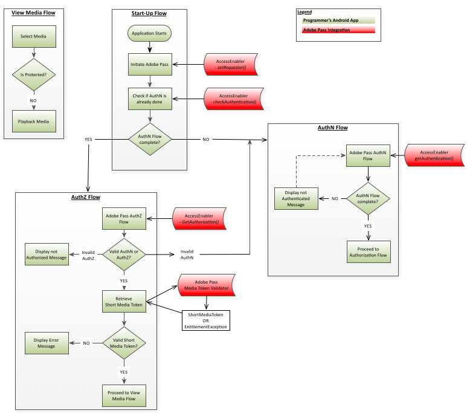

# （レガシー） Android SDK クックブック {#android-sdk-cookbook}

>[!NOTE]
>
>このページのコンテンツは、情報提供のみを目的として提供されています。 このAPIを使用するには、Adobeの現在のライセンスが必要です。 無断使用は認められません。

>[!IMPORTANT]
>
> [製品のお知らせ](/help/authentication/product-announcements.md) ページに集計されている最新のAdobe Pass認証製品のお知らせと廃止予定について、常に情報を得てください。

 

## 概要 {#intro}

このドキュメントでは、Android AccessEnabler ライブラリが公開するAPIを通じて、プログラマーの上位レベルのアプリケーションが実装できる使用権限ワークフローについて説明します。

Android用のAdobe Pass認証エンタイトルメントソリューションは、最終的に2つのドメインに分かれています。

- UI ドメイン – これは、UIを実装し、AccessEnabler ライブラリが提供するサービスを使用して制限付きコンテンツへのアクセスを提供する上位レベルのアプリケーション層です。
- AccessEnabler ドメイン – これは、使用権限ワークフローが次の形式で実装される場所です。
   - Adobeのバックエンドサーバーへのネットワーク呼び出し
   - 認証ワークフローと承認ワークフローに関連するビジネス論理ルール
   - 様々なリソースの管理とワークフロー状態（トークンキャッシュなど）の処理

AccessEnabler ドメインの目的は、使用権限ワークフローのすべての複雑さを非表示にし、使用権限ワークフローを実装する簡単な使用権限プリミティブのセットを（AccessEnabler ライブラリを通じて）上位アプリケーションに提供することです。

1. 依頼者IDを設定します。

1. 特定のID プロバイダーに対する認証を確認して取得します。

1. 特定のリソースの認証を確認して取得します。

1. ログアウト：

AccessEnablerのネットワーク アクティビティは別のスレッドで実行されるため、UI スレッドがブロックされることはありません。 その結果、2つのアプリケーションドメイン間の双方向通信チャネルは、完全非同期パターンに従う必要があります。

- UI アプリケーション層は、AccessEnabler ライブラリによって公開されたAPI呼び出しを介して、AccessEnabler ドメインにメッセージを送信します。
- AccessEnablerは、UI レイヤーがAccessEnabler ライブラリに登録するAccessEnabler プロトコルに含まれるコールバック メソッドを介してUI レイヤーに応答します。

## 使用権限フロー {#entitlement}

1. [前提条件](#prereqs)
1. [起動フロー](#startup_flow)
1. [認証フロー](#authn_flow)
1. [承認フロー](#authz_flow)
1. [メディアフローの表示](#media_flow)
1. [ログアウトフロー](#logout_flow)

### A.前提条件 {#prereqs}

1. コールバック関数を作成します。
   - [`setRequestorComplete()`](#$setRequestorComplete)

     `setRequestor()`によってトリガーされ、成功または失敗を返します。\
     成功とは、使用権限の呼び出しを続行できることを示します。

   - [displayProviderDialog （mvpds）](#$displayProviderDialog)

     プロバイダー（MVPD）を選択しておらず、まだ認証されていない場合にのみ、`getAuthentication()`によってトリガーされます。\
     `mvpds` パラメーターは、ユーザーが利用できるプロバイダーの配列です。

   - [`setAuthenticationStatus(status, errorcode)`](#$setAuthNStatus)

     毎回`checkAuthentication()`によってトリガーされます。\
     ユーザーが既に認証され、プロバイダーを選択した場合にのみ`getAuthentication()`によってトリガーされます。

     返されるステータスが「成功」または「失敗」の場合、エラーコードは失敗のタイプを表します。

   - [navigateToUrl （url）](#$navigateToUrl)

     ユーザーがMVPDを選択した後に`getAuthentication()`によってトリガーされます。 `url` パラメーターは、MVPDのログインページの場所を提供します。

   - [`sendTrackingData(event, data)`](#$sendTrackingData)

     トリガー：`checkAuthentication(), getAuthentication(), checkAuthorization(), getAuthorization(), setSelectedProvider()`\
     `event` パラメーターは、どのエンタイトルメントイベントが発生したかを示します。`data` パラメーターは、イベントに関連する値のリストです。

   - [`setToken(token, resource)`](#$setToken)

     リソースを表示するための認証が成功した後、`checkAuthorization()`および`getAuthorization()`によってトリガーされます。\
     `token` パラメーターは短期間有効なメディアトークンです。`resource` パラメーターは、ユーザーが表示を許可されているコンテンツです。

   - [`tokenRequestFailed(resource, code, description)`](#$tokenRequestFailed)

     認証に失敗した後に`checkAuthorization()`および`getAuthorization()`によってトリガーされました。\
     `resource` パラメーターは、ユーザーが表示しようとしたコンテンツです。`code` パラメーターは、どのタイプのエラーが発生したかを示すエラーコードです。`description` パラメーターは、エラーコードに関連するエラーを説明します。

   - [`selectedProvider(mvpd)`](#$selectedProvider)

     トリガー：`getSelectedProvider()`\
     `mvpd` パラメーターは、ユーザーが選択したプロバイダーに関する情報を提供します。

   - [`setMetadataStatus(metadata, key, arguments)`](#$setMetadataStatus)

     トリガー：`getMetadata().`\
     `metadata` パラメーターは要求した特定のデータを提供します。`key` パラメーターは`getMetadata()` リクエストで使用されるキーであり、`arguments` パラメーターは`getMetadata()`に渡された同じディクショナリーです。

   - [`preauthorizedResources(resources)`](#$preauthResources)

     トリガー：`checkPreauthorizedResources()`\
     `authorizedResources` パラメーターは、ユーザーが表示を許可されているリソースを表示します。

### ロ。起動フロー {#startup_flow}

1. 上位レベルのアプリケーションを開始します。
1. Adobe Pass認証の開始

   a.  [`getInstance`](#$getInstance)を呼び出して、Adobe Pass Authentication AccessEnablerの1つのインスタンスを作成します。

   - **依存関係：** Adobe Pass Authentication Native
Android Library （AccessEnabler）

   b.  呼び出し` setRequestor()`を実行してプログラマーのIDを確認します。プログラマーの`requestorID`と（オプションで）Adobe Pass認証エンドポイントの配列を渡します。

   - **依存関係：**&#x200B;有効なAdobe Pass Authentication RequestorID\
     （Adobe Pass Authentication Account Managerと連携して設定します）。

   - **トリガー:** setRequestorComplete （） コールバック

   | メモ |     |
   | --- | --- |
   |  | 要求者IDが完全に確立されるまで、使用権限の要求は完了できません。 これは、setRequestor （）がまだ実行中の間、後続のすべての使用権限リクエスト（例：`checkAuthentication()`）がブロックされることを意味します。  実装オプションは2つあります。依頼者の識別情報がバックエンドサーバーに送信されると、UI アプリケーション層で、次の2つのアプローチのいずれかを選択できます。  1.  `setRequestorComplete()` コールバック （AccessEnabler デリゲートの一部）のトリガーを待ちます。  このオプションは、`setRequestor()`が完了した最も確実な結果を提供するので、ほとんどの実装では推奨されます。 2。  `setRequestorComplete()` コールバックのトリガーを待たずに続行し、使用権限リクエストの発行を開始します。 これらの呼び出し（checkAuthentication、checkAuthorization、getAuthorization、checkPreauthorizedResource、getMetadata、logout）はAccessEnabler ライブラリによってキューに入れられ、`setRequestor(). `の後に実際のネットワーク呼び出しが行われます。たとえば、ネットワーク接続が不安定な場合、このオプションが中断されることがあります。 |

   <!--Removed bad image link from first note cell above.  -->

1. [checkAuthentication （） ](#$checkAuthN)を呼び出して、完全な認証フローを開始せずに既存の認証を確認します。   この呼び出しが成功した場合は、認証フローに直接進むことができます。  そうでない場合は、認証フローに進みます。

   - **依存関係：** `setRequestor()`への呼び出しが成功しました（この依存関係は、以降のすべての呼び出しにも適用されます）。

   - **トリガー:** setAuthenticationStatus （） コールバック

### ハ。認証のフロー {#authn_flow}

1. [`getAuthentication()`](#$getAuthN)を呼び出して、認証フローを開始するか、ユーザーが既に認証されていることを確認します。\
   **トリガー:**
   - ユーザーが既に認証されている場合は、setAuthenticationStatus （） コールバックを返します。  この場合、[認証フロー](#authz_flow)に直接進みます。
   - displayProviderDialog （） コールバックは、ユーザーがまだ認証されていない場合に使用します。

1. `displayProviderDialog()`に送信されたプロバイダーのリストをユーザーに提示します。

1. ユーザーがプロバイダーを選択した後、`navigateToUrl()` コールバックからユーザーのMVPDのURLを取得します。  WebViewを開き、そのWebView コントロールをURLにダイレクトします。

1. 前の手順でインスタンス化したWebViewを通じて、ユーザーはMVPDのログインページにアクセスし、ログイン資格情報を入力します。 WebView内では、いくつかのリダイレクト操作が行われます。

   **メモ：**&#x200B;この時点で、ユーザーは認証フローをキャンセルできます。 これが発生した場合、UI レイヤーは、パラメーターとして`null`を指定して`setSelectedProvider()`を呼び出すことでこのイベントをAccessEnablerに通知する責任があります。 これにより、AccessEnablerは内部状態をクリーンアップし、認証フローをリセットできます。

1. ユーザーが正常にログインすると、アプリケーション層で「カスタムリダイレクト URL」（例：`http://adobepass.android.app`）の読み込みが検出されます。 このカスタム URLは、WebViewの読み込みを意図しない無効なURLです。 認証フローが完了し、WebViewを閉じる必要があることを示すシグナルです。

1. WebView コントロールを閉じて`getAuthenticationToken()`を呼び出します。これにより、AccessEnablerにバックエンド サーバーから認証トークンを取得するように指示します。

1. [ オプション ] ユーザーが表示を許可されているリソースを確認するには、[`checkPreauthorizedResources(resources)`](#$checkPreauth)を呼び出します。 `resources` パラメーターは、ユーザーの認証トークンに関連付けられた、保護されたリソースの配列です。\
   **トリガー:** `preAuthorizedResources()` コールバック\
   **実行ポイント：**&#x200B;完了した認証フローの後

1. 認証が成功した場合は、認証フローに進みます。

### ニ。認可の流れ {#authz_flow}

1. [getAuthorization （） ](#$getAuthZ)を呼び出して、認証を開始します
フロー。

   依存関係：MVPDで合意された有効なResourceID。

   **注：** リソース IDは、他のデバイスまたはプラットフォームで使用されるものと同じである必要があり、MVPD間で同じになります。

1. 認証と認証を検証する。

   - `getAuthorization()`呼び出しが成功した場合：ユーザーには有効なAuthN トークンとAuthZ トークンがあります（ユーザーは認証され、要求されたメディアを視聴する権限を持っています）。
   - `getAuthorization()`が失敗した場合：タイプ （AuthN、AuthZなど）を判断するためにスローされた例外を調べます：
      - 認証（AuthN）エラーの場合は、認証フローを再起動します。
      - 認証（AuthZ）エラーの場合、ユーザーは要求されたメディアを視聴する権限がなく、何らかのエラーメッセージがユーザーに表示されます。
      - 他のタイプのエラー（接続エラー、ネットワークエラーなど）が発生した場合 その後、ユーザーに適切なエラーメッセージを表示します。

1. ショートメディアトークンを検証します。\
   Adobe Pass Authentication Media Token Verifier ライブラリを使用して、上記の`getAuthorization()`呼び出しから返された短期間有効なメディアトークンを検証します。

   - 検証が成功した場合：要求されたメディアをユーザーに対して再生します。
   - 検証が失敗した場合：AuthZ トークンが無効で、メディアリクエストが拒否され、エラーメッセージがユーザーに表示されます。

1. 通常のアプリケーションフローに戻ります。

### E. メディアフローの表示 {#media_flow}

1. ユーザーが表示するメディアを選択します。
2. メディアは保護されていますか？  アプリケーションは、選択したメディアが保護されているかどうかを確認します。
- 選択したメディアが保護されている場合、アプリケーションは上記の[認証フロー](#authz_flow)を開始します。
- 選択したメディアが保護されていない場合は、ユーザーのメディアを再生します。

### F. ログアウトフロー {#logout_flow}

1. ユーザーをログアウトするには、[`logout()`](#$logout)に電話してください。\
   AccessEnablerは、現在のMVPDのキャッシュされた値とトークンを、現在の依頼者とシングルサインオンの依頼者に対してすべてクリアします。 キャッシュをクリアした後、AccessEnablerはサーバーサイドのセッションをクリーンアップするためにサーバーコールを実行します。  サーバー呼び出しはIdPへのSAML リダイレクトにつながる可能性があるため（これにより、IdP側でセッションクリーンアップが可能になります）、この呼び出しはすべてのリダイレクトに従う必要があります。 このため、この呼び出しはWebView コントロール内で処理する必要があります。

   a.  認証ワークフローと同じパターンに従って、AccessEnabler ドメインは（0} コールバックを介して） UI アプリケーション レイヤーにWebView コントロールを作成するようにリクエストし、そのコントロールにバックエンド サーバー上のログアウトエンドポイントのURLを読み込むように指示します。`navigateToUrl()`

   b.  繰り返しますが、UIはWebView コントロールのアクティビティを監視し、コントロールが複数のリダイレクトを通過する際に、アプリケーションのカスタム URL （つまり、`http://adobepass.android.app/`）を読み込む瞬間を検出する必要があります。 このイベントが発生すると、UI アプリケーションレイヤーがWebViewを閉じ、ログアウトプロセスが完了します。

   **注：** ログアウト フローは、ユーザーがWebViewとやり取りする必要がないという点で、認証フローとは異なります。 UI アプリケーションレイヤーでは、WebViewを使用して、すべてのリダイレクトに従っていることを確認します。 したがって、ログアウトプロセス中にWebView コントロールを非表示にすることが可能（および推奨）です。

### 複数のMVPDとログアウトを使用したログインのユーザーフロー {#user_flows}

[ここ](https://dzf8vqv24eqhg.cloudfront.net/userfiles/258/326/ckfinder/files/AndroidSSOUserFlows.pdf)には、複数のMVPDを使用する場合の動作と、ユーザーがアプリケーションからログアウトしたときに何が起こるかを説明するドキュメントがあります。

Android SDKのバージョン >= 2.0.0を使用する場合は、このビヘイビアーを使用できます。
