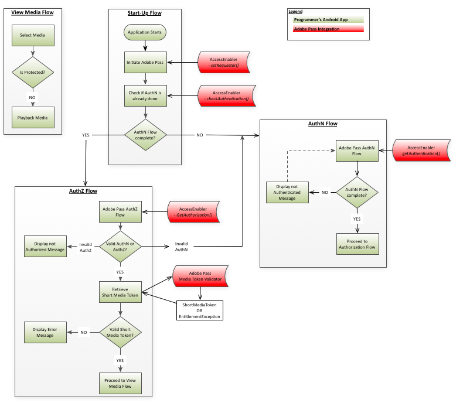

# （レガシー） Amazon FireOS統合クックブック {#amazon-fireos-integration-cookbook}

>[!NOTE]
>
>このページのコンテンツは、情報提供のみを目的として提供されています。 このAPIを使用するには、Adobeの現在のライセンスが必要です。 無断使用は認められません。

>[!IMPORTANT]
>
> [製品のお知らせ](/help/authentication/product-announcements.md) ページに集計されている最新のAdobe Pass認証製品のお知らせと廃止予定について、常に情報を得てください。

 

## 概要 {#intro}

このドキュメントでは、Amazon FireOS `AccessEnabler` ライブラリが公開するAPIを通じて、プログラマーの上位レベルのアプリケーションが実装できる使用権限ワークフローについて説明します。

Amazon FireOS用のAdobe Pass認証資格ソリューションは、最終的に2つのドメインに分かれています。

- UI ドメイン – これは、UIを実装し、`AccessEnabler` ライブラリが提供するサービスを使用して、制限されたコンテンツへのアクセスを提供する上位レベルのアプリケーション層です。
- `AccessEnabler` ドメイン – これは、次の形式で使用権限ワークフローを実装する場所です。
  - Adobeのバックエンドサーバーへのネットワーク呼び出し
  - 認証ワークフローと承認ワークフローに関連するビジネス論理ルール
  - 様々なリソースの管理とワークフロー状態（トークンキャッシュなど）の処理

`AccessEnabler` ドメインの目的は、使用権限ワークフローのすべての複雑さを非表示にし、（ライブラリ `AccessEnabler`を通じて）上位アプリケーションに簡単な使用権限プリミティブのセットを提供することです。 このプロセスでは、次の使用権限ワークフローを実装できます。

1. 依頼者IDを設定します。
1. 特定のID プロバイダーに対する認証を確認して取得します。
1. 特定のリソースの認証を確認して取得します。
1. ログアウト：

`AccessEnabler`のネットワーク アクティビティは別のスレッドで実行されるので、UI スレッドがブロックされることはありません。 その結果、2つのアプリケーションドメイン間の双方向通信チャネルは、完全非同期パターンに従う必要があります。

- UI アプリケーション層は、`AccessEnabler` ライブラリによって公開されたAPI呼び出しを介して、`AccessEnabler` ドメインにメッセージを送信します。
- `AccessEnabler`は、UI レイヤーが`AccessEnabler` ライブラリに登録する`AccessEnabler` プロトコルに含まれるコールバック メソッドを通じてUI レイヤーに応答します。

## 使用権限フロー {#entitlement}

1. [前提条件](#prereqs)
1. [起動フロー](#startup_flow)
1. [認証フロー](#authn_flow)
1. [承認フロー](#authz_flow)
1. [メディアフローの表示](#media_flow)
1. [ログアウトフロー](#logout_flow)

### A.前提条件 {#prereqs}

1. コールバック関数を作成します。
   - [`setRequestorComplete()`](#$setRequestorComplete)

     - `setRequestor()`によってトリガーされ、成功または失敗を返します。     成功とは、使用権限の呼び出しを続行できることを示します。

   - [displayProviderDialog （mvpds）](#$displayProviderDialog)

     - プロバイダー（MVPD）を選択しておらず、まだ認証されていない場合にのみ、`getAuthentication()`によってトリガーされます。 `mvpds` パラメーターは、ユーザーが利用できるプロバイダーの配列です。

   - [`setAuthenticationStatus(status, reason)`](#$setAuthNStatus)

     - 毎回`checkAuthentication()`によってトリガーされます。 ユーザーが既に認証され、プロバイダーを選択した場合にのみ`getAuthentication()`によってトリガーされます。

     - 返されたステータスが認証済みまたは未認証の場合、その理由は認証失敗またはログアウトアクションを表します。

   - [navigateToUrl （url）](#$navigateToUrl)

     - AmazonFireOS SDKでは無視され、ユーザーがMVPDを選択した後に`getAuthentication()`によってトリガーされるAndroid プラットフォームでメソッドが使用されます。  `url` パラメーターは、MVPDのログインページの場所を提供します。

   - [`sendTrackingData(event, data)`](#$sendTrackingData)

     - トリガー：`checkAuthentication(), getAuthentication(), checkAuthorization(), getAuthorization(), setSelectedProvider()`
       `event` パラメーターは、どのエンタイトルメントイベントが発生したかを示します。`data` パラメーターは、イベントに関連する値のリストです。

   - [`setToken(token, resource)`](#$setToken)

     - リソースを表示するための認証が成功した後、`checkAuthorization()`および`getAuthorization()`によってトリガーされます。
     - `token` パラメーターは短期間有効なメディアトークンです。`resource` パラメーターは、ユーザーが表示を許可されているコンテンツです。

   - [`tokenRequestFailed(resource, code, description)`](#$tokenRequestFailed)

     - 認証に失敗した後に`checkAuthorization()`および`getAuthorization()`によってトリガーされました。
     - `resource` パラメーターは、ユーザーが表示しようとしたコンテンツです。`code` パラメーターは、どのタイプのエラーが発生したかを示すエラーコードです。`description` パラメーターは、エラーコードに関連するエラーを説明します。

   - [`selectedProvider(mvpd)`](#$selectedProvider)

     - トリガー：`getSelectedProvider()`
     - `mvpd` パラメーターは、ユーザーが選択したプロバイダーに関する情報を提供します。

   - [`setMetadataStatus(metadata, key, arguments)`](#$setMetadataStatus)

     - トリガー：`getMetadata().`
     - `metadata` パラメーターは要求した特定のデータを提供します。`key` パラメーターは`getMetadata()` リクエストで使用されるキーであり、`arguments` パラメーターは`getMetadata()`に渡された同じディクショナリーです。

   - [`preauthorizedResources(resources)`](#$preauthResources)

     - トリガー：`checkPreauthorizedResources()`
     - `authorizedResources` パラメーターは、ユーザーが表示を許可されているリソースを表示します。

### ロ。起動フロー {#startup_flow}

1. 上位レベルのアプリケーションを開始します。
1. Adobe Pass認証を開始します。

   1. [`getInstance`](#$getInstance)を呼び出して、Adobe Pass認証`AccessEnabler`の1つのインスタンスを作成します。

      - **依存関係：** Adobe Pass Authentication Native Amazon FireOS Library （`AccessEnabler`）

   1. 呼び出し` setRequestor()`を実行してプログラマーのIDを確認します。プログラマーの`requestorID`と（オプションで）Adobe Pass認証エンドポイントの配列を渡します。

      - **依存関係：**&#x200B;有効なAdobe Pass Authentication RequestorID （Adobe Pass Authentication Account Managerと連携して設定します）

      - **トリガー:** setRequestorComplete （） コールバック

   要求者IDが完全に確立されるまで、使用権限の要求は完了できません。 これは、setRequestor （）がまだ実行中の間に、後続のすべての使用権限リクエスト（例：`checkAuthentication()`）がブロックされることを意味します。

   2つの実装オプションがあります。依頼者識別情報がバックエンドサーバーに送信されると、UI アプリケーションレイヤーは、次の2つのアプローチのいずれかを選択できます。

   1. `setRequestorComplete()` コールバックのトリガー（`AccessEnabler` デリゲートの一部）を待ちます。  このオプションは、`setRequestor()`が完了した最も確実な結果を提供するので、ほとんどの実装で推奨されます。
   1. `setRequestorComplete()` コールバックのトリガーを待たずに続行し、使用権限リクエストの発行を開始します。 これらの呼び出し（checkAuthentication、checkAuthorization、getAuthentication、getAuthorization、checkPreauthorizedResource、getMetadata、logout）は`AccessEnabler` ライブラリによってキューに入れられ、`setRequestor()`の後に実際のネットワーク呼び出しが行われます。 例えば、ネットワーク接続が不安定な場合、このオプションが中断されることがあります。

1. [checkAuthentication （） &#x200B;](#$checkAuthN)を呼び出して、完全な認証フローを開始せずに既存の認証を確認します。  この呼び出しが成功した場合は、認証フローに直接進むことができます。  そうでない場合は、認証フローに進みます。

- **依存関係：** `setRequestor()`への呼び出しが成功しました（この依存関係は、以降のすべての呼び出しにも適用されます）。

- **トリガー:** setAuthenticationStatus （） コールバック

### ハ。認証のフロー {#authn_flow}

1. [`getAuthentication()`](#$getAuthN)を呼び出して、認証フローを開始するか、ユーザーが既に認証されていることを確認します。

   **トリガー:**

   - ユーザーが既に認証されている場合は、setAuthenticationStatus （） コールバックを返します。  この場合、[認証フロー](#authz_flow)に直接進みます。
   - displayProviderDialog （） コールバックは、ユーザーがまだ認証されていない場合に使用します。

1. `displayProviderDialog()`に送信されたプロバイダーのリストをユーザーに提示します。
1. ユーザーがプロバイダーを選択すると、WebViewはプロバイダーページを開いてユーザーがログインできるようにします

   >[!NOTE]
   >
   >この時点で、ユーザーは認証フローをキャンセルする機会があります。 これが発生すると、`AccessEnabler`は内部状態をクリーンアップし、認証フローをリセットします。

1. ユーザーが正常にログインすると、WebViewが閉じます。
1. バックエンドサーバーから認証トークンを取得するよう`AccessEnabler`に指示する`getAuthenticationToken(),`を呼び出します。
1. [ オプション ] ユーザーが表示を許可されているリソースを確認するには、[`checkPreauthorizedResources(resources)`](#$checkPreauth)を呼び出します。 `resources` パラメーターは、ユーザーの認証トークンに関連付けられた、保護されたリソースの配列です。

   **トリガー:** `preAuthorizedResources()` コールバック\
   **実行ポイント：**&#x200B;完了した認証フローの後

1. 認証が成功した場合は、認証フローに進みます。

### ニ。認可の流れ {#authz_flow}

1. [`getAuthorization()`](#$getAuthZ)を呼び出して、認証フローを開始します。

   依存関係：MVPDで合意された有効なResourceID。

   **注：** リソース IDは、他のデバイスまたはプラットフォームで使用されるものと同じである必要があり、MVPD間で同じになります。

1. 認証と認証を検証する。

   - `getAuthorization()`呼び出しが成功した場合：ユーザーには有効なAuthN トークンとAuthZ トークンがあります（ユーザーは認証され、要求されたメディアを視聴する権限を持っています）。
   - `getAuthorization()`が失敗した場合：タイプ （AuthN、AuthZなど）を判断するためにスローされた例外を調べます：
     - 認証（AuthN）エラーの場合は、認証フローを再起動します。
     - 認証（AuthZ）エラーの場合、ユーザーは要求されたメディアを視聴する権限がなく、何らかのエラーメッセージがユーザーに表示されます。
     - 他のタイプのエラー（接続エラー、ネットワークエラーなど）が発生した場合 その後、ユーザーに適切なエラーメッセージを表示します。

1. ショートメディアトークンを検証します。

   Adobe Pass Authentication Media Token Verifier ライブラリを使用して、上記の`getAuthorization()`呼び出しから返された短期間有効なメディアトークンを検証します。

   - 検証が成功した場合：要求されたメディアをユーザーに対して再生します。
   - 検証が失敗した場合：AuthZ トークンが無効で、メディアリクエストが拒否され、エラーメッセージがユーザーに表示されます。

1. 通常のアプリケーションフローに戻ります。

### E. メディアフローの表示 {#media_flow}

1. ユーザーが表示するメディアを選択します。
1. メディアは保護されていますか？  アプリケーションは、選択したメディアが保護されているかどうかを確認します。
   - 選択したメディアが保護されている場合、アプリケーションは上記の[認証フロー](#authz_flow)を開始します。
   - 選択したメディアが保護されていない場合は、ユーザーのメディアを再生します。

### F. ログアウトフロー {#logout_flow}

1. ユーザーをログアウトするには、[`logout()`](#$logout)に電話してください。 `AccessEnabler`は、現在のMVPDでユーザーが取得したすべてのキャッシュ値とトークンを、シングルサインオン経由でログインを共有しているすべての依頼者に対して消去します。 キャッシュをクリアした後、`AccessEnabler`はサーバーサイド セッションをクリーンアップするためのサーバーコールを実行します。  サーバー呼び出しはIdPへのSAML リダイレクトにつながる可能性があるため（これにより、IdP側でセッションクリーンアップが可能になります）、この呼び出しはすべてのリダイレクトに従う必要があります。 このため、この呼び出しはWebView コントロール内で処理され、ユーザーには表示されません。

   **注：** ログアウト フローは、ユーザーがWebViewとやり取りする必要がないという点で、認証フローとは異なります。 したがって、ログアウトプロセス中にWebView コントロールを非表示にすることが可能（および推奨）です。
