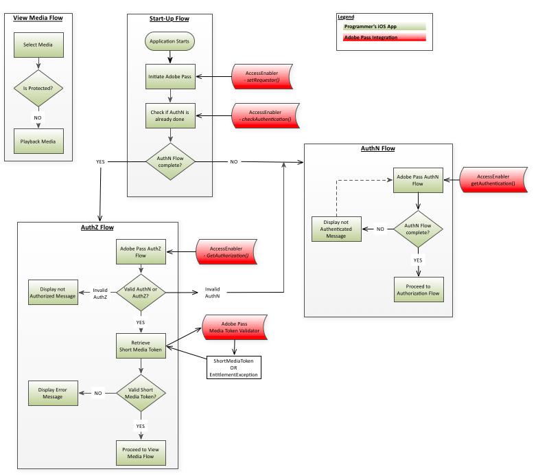

# （レガシー） iOS/tvOS SDK Cookbook {#iostvos-sdk-cookbook}

>[!NOTE]
>
>このページのコンテンツは、情報提供のみを目的として提供されています。 このAPIを使用するには、Adobeの現在のライセンスが必要です。 無断使用は認められません。

>[!IMPORTANT]
>
> [製品のお知らせ](/help/authentication/product-announcements.md) ページに集計されている最新のAdobe Pass認証製品のお知らせと廃止予定について、常に情報を得てください。

## 概要 {#intro}

このドキュメントでは、iOS/tvOS AccessEnabler ライブラリが公開するAPIを通じて、プログラマーの上位レベルのアプリケーションが実装できる使用権限ワークフローについて説明します。

IOS/tvOS用のAdobe Pass認証エンタイトルメントソリューションは、最終的に次の2つのドメインに分かれています。

* UI ドメイン – これは、UIを実装し、AccessEnabler ライブラリが提供するサービスを使用して制限付きコンテンツへのアクセスを提供する上位レベルのアプリケーション層です。

* AccessEnabler ドメイン – これは、使用権限ワークフローが次の形式で実装される場所です。

  * Adobeのバックエンドサーバーへのネットワーク呼び出し
  * 認証ワークフローと承認ワークフローに関連するビジネス論理ルール
  * 様々なリソースの管理とワークフロー状態（トークンキャッシュなど）の処理

AccessEnabler ドメインの目的は、使用権限ワークフローのすべての複雑さを非表示にし、使用権限ワークフローを実装する簡単な使用権限プリミティブのセットを（AccessEnabler ライブラリを通じて）上位アプリケーションに提供することです。

1. 依頼者IDの設定
1. 特定のID プロバイダーに対する認証の確認と取得
1. 特定のリソースの認証を確認して取得
1. ログアウト
1. Apple VSA フレームワークのプロキシを使用したApple SSO フロー

AccessEnablerのネットワーク アクティビティは独自のスレッドで実行されるので、UI スレッドはブロックされません。 その結果、2つのアプリケーションドメイン間の双方向通信チャネルは、完全非同期パターンに従う必要があります。

* UI アプリケーション層は、AccessEnabler ライブラリによって公開されたAPI呼び出しを介して、AccessEnabler ドメインにメッセージを送信します。
* AccessEnablerは、UI レイヤーがAccessEnabler ライブラリに登録するAccessEnabler プロトコルに含まれるコールバック メソッドを介してUI レイヤーに応答します。

## Experience Cloud ID サービス（訪問者ID）の設定 {#visitorIDSetup}

[Experience Cloud ID](https://experienceleague.adobe.com/docs/id-service/using/home.html)値の設定は、[!DNL Analytics]の観点から重要です。 `visitorID`の値が設定されると、SDKはネットワーク呼び出しごとにこの情報を送信し、[!DNL Adobe Pass]認証サーバーはこの情報を収集します。 Adobe Pass Authentication Serviceの分析を、他のアプリケーションやweb サイトから取得した他の分析レポートと関連付けることができます。 visitorIDの設定方法に関する情報については、[こちら](#setOptions)を参照してください。

## 使用権限フロー {#entitlement}

A.  [前提条件](#prereqs)  
B.  [起動フロー](#startup_flow)  
C.  [Apple SSOを使用した認証フロー](#authn_flow_wo_applesso)   
D.  [iOS上のApple SSOを使用した認証フロー](#authn_flow_with_applesso)  
E.  [tvOSでのApple SSOによる認証フロー](#authn_flow_with_applesso_tvOS)  
F.  [承認フロー](#authz_flow)  
G.  [&#x200B; メディアフローを表示](#media_flow)  
H.  [Apple SSOのないログアウトフロー](#logout_flow_wo_AppleSSO)  
私は。  [Apple SSOを使用したログアウトフロー](#logout_flow_with_AppleSSO)  

### A.前提条件 {#prereqs}

1. コールバック関数を作成します。
   * `setRequestorComplete()`  
   * [setRequestor （） &#x200B;](#$setReq)によってトリガーされ、成功または失敗を返します。 
   * 成功とは、使用権限の呼び出しを続行できることを示します。

   * [`displayProviderDialog(mvpds)`](#$dispProvDialog)  
     * プロバイダー（MVPD）を選択しておらず、まだ認証されていない場合にのみ、[`getAuthentication()`](#$getAuthN)によってトリガーされます。 
     * `mvpds` パラメーターは、ユーザーが利用できるプロバイダーの配列です。

   * `setAuthenticationStatus(status, errorcode)`  
     * 毎回`checkAuthentication()`によってトリガーされます。 
     * ユーザーが既に認証され、プロバイダーを選択した場合にのみ[`getAuthentication()`](#$getAuthN)によってトリガーされます。 
     * 返されるステータスが「成功」または「失敗」の場合、エラーコードは失敗のタイプを表します。

   * [`navigateToUrl(url)`](#$nav2url)  
     * ユーザーがMVPDを選択した後に[`getAuthentication()`](#$getAuthN)によってトリガーされます。 `url` パラメーターは、MVPDのログインページの場所を提供します。

   * `sendTrackingData(event, data)`  
     * トリガー：`checkAuthentication()`、[`getAuthentication()`](#$getAuthN)、`checkAuthorization()`、[`getAuthorization()`](#$getAuthZ)、`setSelectedProvider()`。
     * `event` パラメーターは、どのエンタイトルメントイベントが発生したかを示します。`data` パラメーターは、イベントに関連する値のリストです。

   * `setToken(token, resource)`

     * リソースの表示に成功した後、[checkAuthorization （） &#x200B;](#checkAuthZ)および[getAuthorization （） &#x200B;](#$getAuthZ)によってトリガーされます。
     * `token` パラメーターは短期間有効なメディアトークンです。`resource` パラメーターは、ユーザーが表示を許可されているコンテンツです。

   * `tokenRequestFailed(resource, code, description)`  
     * 失敗した認証の後、[checkAuthorization （） &#x200B;](#checkAuthZ)および[getAuthorization （） &#x200B;](#$getAuthZ)によってトリガーされます。
     * `resource` パラメーターは、ユーザーが表示しようとしたコンテンツです。`code` パラメーターは、どのタイプのエラーが発生したかを示すエラーコードです。`description` パラメーターは、エラーコードに関連するエラーを説明します。

   * `selectedProvider(mvpd)`  
     * トリガー：[`getSelectedProvider()`](#getSelProv)
     * `mvpd` パラメーターは、ユーザーが選択したプロバイダーに関する情報を提供します。

   * `setMetadataStatus(metadata, key, arguments)`
     * トリガー：`getMetadata().`
     * `metadata` パラメーターは要求した特定のデータを提供します。`key` パラメーターは[getMetadata （） &#x200B;](#getMeta) リクエストで使用されるキーです。`arguments` パラメーターは、[getMetadata （） &#x200B;](#getMeta)に渡された同じディクショナリーです。

   * [`preauthorizedResources(authorizedResources)`](#preauthResources)

     * トリガー：[`checkPreauthorizedResources()`](#checkPreauth)

     * `authorizedResources` パラメーターは、ユーザーが指定したリソースを表示します
       は表示権限を持っています。

   * [`presentTvProviderDialog(viewController)`](#presentTvDialog)

     * 現在の依頼者が少なくともSSO サポートを持つMVPDでサポートしている場合、[getAuthentication （） &#x200B;](#getAuthN)によってトリガーされます。
     * viewController パラメーターはApple SSO ダイアログであり、メインビューコントローラーで表示する必要があります。

   * [`dismissTvProviderDialog(viewController)`](#dismissTvDialog)

     * ユーザーのアクションによってトリガーされます（Apple SSO ダイアログから「キャンセル」または「その他のテレビプロバイダー」を選択します）。
     * viewController パラメーターはApple SSO ダイアログであり、メインビューコントローラーから除外する必要があります。

### ロ。起動フロー {#startup_flow}

1. 上位レベルのアプリケーションを開始します。 
1. Adobe Pass認証を開始 

   a.  [`init`](#$init)を呼び出して、Adobe Pass Authentication AccessEnablerの1つのインスタンスを作成します。
   * **依存関係：** Adobe Pass Authentication Native iOS/tvOS Library （AccessEnabler）

   b.  `setRequestor()`を呼び出して、プログラマーのIDを確立します。プログラマーの`requestorID`と（オプションで）Adobe Pass認証エンドポイントの配列を渡します。 tvOSの場合は、公開鍵と秘密鍵を指定する必要があります。 詳しくは、[&#x200B; クライアントレスのドキュメント &#x200B;](#create_dev)を参照してください。

   * **依存関係：**&#x200B;有効なAdobe Pass Authentication RequestorID （Adobe Pass Authentication Accountで作業する）
     マネージャーがこれを手配します）。

   * **トリガー:**
     [setRequestorComplete （） &#x200B;](#$setReqComplete) コールバック。

   >[!NOTE]
   >
   >要求者IDが完全に確立されるまで、使用権限の要求は完了できません。 これは、[`setRequestor()`](#$setReq)がまだ実行中でありながら、その後のすべての使用権限リクエストを有効に意味します。 例えば、[`checkAuthentication()`](#checkAuthN)はブロックされています。

   2つの実装オプションがあります。依頼者識別情報がバックエンドサーバーに送信されると、UI アプリケーション層は次の2つのアプローチのいずれかを選択できます。 

   1. [`setRequestorComplete()`](#setReqComplete) コールバック （AccessEnabler デリゲートの一部）のトリガーを待ちます。 このオプションは、[`setRequestor()`](#$setReq)が完了した最も確実な結果を提供するので、ほとんどの実装で推奨されます。

   1. [`setRequestorComplete()`](#setReqComplete) コールバックのトリガーを待たずに続行し、使用権限リクエストの発行を開始します。 これらの呼び出し（checkAuthentication、checkAuthorization、getAuthentication、getAuthorization、checkPreauthorizedResource、getMetadata、logout）は、AccessEnabler ライブラリによってキューに入れられ、[`setRequestor()`](#$setReq)の後に実際のネットワーク呼び出しが行われます。 このオプションは、ネットワーク接続が不安定な場合などに中断されることがあります。

1. `checkAuthentication()`を呼び出して、完全な認証フローを開始せずに既存の認証を確認します。  この呼び出しが成功した場合は、認証フローに直接進むことができます。 そうでない場合は、認証フローに進みます。

   * **依存関係：** [setRequestor （） &#x200B;](#$setReq)への呼び出しが成功しました（この依存関係は、以降のすべての呼び出しにも適用されます）。

   * **トリガー:** [setAuthenticationStatus （） &#x200B;](#$setAuthNStatus) コールバック。

### C. Apple SSOを使用しない認証フロー {#authn_flow_wo_applesso}

1. [`getAuthentication()`](#$getAuthN)を呼び出して認証フローを開始するか、ユーザーが既に存在することを確認します
認証済み：

   **トリガー:**

   * ユーザーが既に認証されている場合は、[setAuthenticationStatus （） &#x200B;](#$setAuthNStatus) コールバック。 この場合、[認証フロー](#authz_flow)に直接進みます。

   * ユーザーがまだ認証されていない場合は、[displayProviderDialog （） &#x200B;](#$dispProvDialog) コールバック。

1. 送信先のプロバイダーのリストをユーザーに提示する
   [`displayProviderDialog()`](#dispProvDialog).

1. ユーザーがプロバイダーを選択した後、`navigateToUrl:`または`navigateToUrl:useSVC:` コールバックからユーザーのMVPDのURLを取得し、`UIWebView/WKWebView`または`SFSafariViewController` コントローラーを開いて、そのコントローラーをURLに誘導します。

1. 前の手順でインスタンス化した`UIWebView/WKWebView`または`SFSafariViewController`を通じて、ユーザーはMVPDのログインページにアクセスし、ログイン資格情報を入力します。 コントローラ内で複数のリダイレクト操作が行われます。 

>[!NOTE]
>
>この時点で、ユーザーは認証フローをキャンセルする機会があります。 これが発生した場合、UI レイヤーは、[setSelectedProvider （） &#x200B;](#setSelProv)を`null`をパラメーターとして呼び出して、AccessEnablerにこのイベントを通知する責任があります。 これにより、AccessEnablerは内部状態をクリーンアップし、認証フローをリセットできます。

1. ユーザーが正常にログインすると、アプリケーションレイヤーによって特定のカスタム URLの読み込みが検出されます。 この特定のカスタム URLは実際には無効であり、コントローラが実際に読み込むことを意図していないことに注意してください。 認証フローが完了し、`UIWebView/WKWebView`または`SFSafariViewController` コントローラーを安全に閉じることができることを示すシグナルとしてのみ、アプリケーションで解釈する必要があります。 `SFSafariViewController` コントローラーを使用する必要がある場合、特定のカスタム URLは&#x200B;**`application's custom scheme`** （例：`adbe.u-XFXJeTSDuJiIQs0HVRAg://adobe.com`）によって定義されます。定義されていない場合、この特定のカスタム URLは&#x200B;**`ADOBEPASS_REDIRECT_URL`**&#x200B;定数（つまり、`adobepass://ios.app`）によって定義されます。

1. UIWebView/WKWebViewまたはSFSafariViewController コントローラーを閉じ、AccessEnablerの`handleExternalURL:url` API メソッドを呼び出して、AccessEnablerにバックエンドサーバーから認証トークンを取得するように指示します。

1. （オプション） [`checkPreauthorizedResources(resources)`](#$checkPreauth)を呼び出して、ユーザーが表示を許可されているリソースを確認します。 `resources` パラメーターは、ユーザーの認証トークンに関連付けられた、保護されたリソースの配列です。 ユーザーのMVPDから取得した認証情報の使用の1つは、UIを装飾することです（例えば、保護されたコンテンツの横にロックされた/ロック解除されたシンボル）。

   * **トリガー:** [`preauthorizedResources()`](#preauthResources) コールバック
   * **実行ポイント：**&#x200B;完了した認証フローの後

1. 認証が成功した場合は、認証フローに進みます。

### D. iOS上のApple SSOによる認証フロー {#authn_flow_with_applesso}

1. [`getAuthentication()`](#$getAuthN)を呼び出して、認証フローを開始するか、ユーザーが既に認証されていることを確認します。
   **トリガー:**

   * ユーザーが認証されておらず、現在の依頼者が少なくともSSOをサポートするMVPD上に存在する場合、[presentTvProviderDialog （） &#x200B;](#presentTvDialog) コールバック。 MVPDがSSOをサポートしていない場合は、クラシック認証フローが使用されます。

1. ユーザーがプロバイダーを選択すると、AccessEnabler ライブラリは、AppleのVSA フレームワークによって提供された情報を含む認証トークンを取得します。

1. [setAuthenticationStatus （） &#x200B;](#setAuthNStatus) コールバックがトリガーされます。 この時点で、Apple SSOでユーザーを認証する必要があります。

1. [ オプション ] ユーザーが表示を許可されているリソースを確認するには、[`checkPreauthorizedResources(resources)`](#$checkPreauth)を呼び出します。 `resources` パラメーターは、ユーザーの認証トークンに関連付けられた、保護されたリソースの配列です。 ユーザーのMVPDから取得した認証情報の使用の1つは、UIを装飾することです（例えば、保護されたコンテンツの横にロックされたシンボルやロック解除されたシンボルなど）。

   * **トリガー:** [`preauthorizedResources()`](#preauthResources) コールバック
   * **実行ポイント：**&#x200B;完了した認証フローの後

1. 認証が成功した場合は、認証フローに進みます。

### E. tvOSでのApple SSOによる認証フロー {#authn_flow_with_applesso_tvOS}

1. [`getAuthentication()`](#$getAuthN)を呼び出して、を開始します
認証フローを選択するか、ユーザーが既に認証されていることを確認する
認証済み：
   **トリガー:**
   * ユーザーが認証されておらず、現在の依頼者が少なくともSSOをサポートするMVPD上に存在する場合、[`presentTvProviderDialog()`](#presentTvDialog) コールバック。 MVPDがSSOをサポートしていない場合は、クラシック認証フローが使用されます。

1. ユーザーがプロバイダーを選択すると、[`status()`](#status_callback_implementation) コールバックが呼び出されます。 登録コードが提供され、AccessEnabler ライブラリが2回目の画面認証に成功するためにサーバーのポーリングを開始します。

1. 提供された登録コードが2番目の画面で正常に認証するために使用された場合、[`setAuthenticatiosStatus()`](#setAuthNStatus) コールバックがトリガーされます。 この時点で、Apple SSOでユーザーを認証する必要があります。
1. [ オプション ] ユーザーが表示を許可されているリソースを確認するには、[`checkPreauthorizedResources(resources)`](#$checkPreauth)を呼び出します。 `resources` パラメーターは、ユーザーの認証トークンに関連付けられた、保護されたリソースの配列です。 ユーザーのMVPDから取得した認証情報の使用の1つは、UIを装飾することです（例えば、保護されたコンテンツの横にロックされたシンボルやロック解除されたシンボルなど）。

   * **トリガー:** [`preauthorizedResources()`](#preauthResources) コールバック

   * **実行ポイント：**&#x200B;完了した認証フローの後
1. 認証が成功した場合は、認証フローに進みます。

### ヘ。認証のフロー {#authz_flow}

1. [getAuthorization （） &#x200B;](#$getAuthZ)を呼び出して、認証フローを開始します。

   * **依存関係：**&#x200B;個の有効なResourceIDがMVPDと合意されました。
   * リソース IDは、他のデバイスまたはプラットフォームで使用されるものと同じである必要があり、MVPD間で同じになります。 リソース IDについて詳しくは、[&#x200B; リソース識別子](/help/authentication/integration-guide-programmers/features-standard/entitlements/decisions.md#resource-identifier)を参照してください

1. 認証と認証を検証する。

   * [getAuthorization （） &#x200B;](#$getAuthZ)呼び出しが成功した場合：ユーザーには有効なAuthN トークンとAuthZ トークンがあります（ユーザーは認証され、要求されたメディアを視聴する権限を持っています）。

   * [getAuthorization （） &#x200B;](#$getAuthZ)が失敗した場合：スローされた例外を調べて、そのタイプ（AuthN、AuthZなど）を判断します。
     * 認証（AuthN）エラーの場合は、認証フローを再起動します。
     * 認証（AuthZ）エラーの場合、ユーザーは要求されたメディアを視聴する権限がなく、何らかのエラーメッセージがユーザーに表示されます。
     * 他のタイプのエラー（接続エラー、ネットワークエラーなど）が発生した場合 その後、ユーザーに適切なエラーメッセージを表示します。

1. ショートメディアトークンを検証します。\
   Adobe Pass Authentication Media Token Verifier ライブラリを使用して、上記の[getAuthorization （） &#x200B;](#$getAuthZ)呼び出しから返された短期間有効なメディアトークンを検証します。

   * 検証が成功した場合：要求されたメディアをユーザーに対して再生します。
   * 検証が失敗した場合：AuthZ トークンが無効で、メディアリクエストが拒否され、エラーメッセージがユーザーに表示されます。

1. 通常のアプリケーションフローに戻ります。

### G. メディアのフローの表示 {#media_flow}

1. ユーザーが表示するメディアを選択します。
1. メディアは保護されていますか？ アプリケーションは、選択したメディアが保護されているかどうかを確認します。

   * 選択したメディアが保護されている場合、アプリケーションは上記の[認証フロー](#authz_flow)を開始します。

   * 選択したメディアが保護されていない場合は、のメディアを再生します
     ユーザー：

### H. Apple SSOを使用しないログアウトフロー {#logout_flow_wo_AppleSSO}

1. ユーザーをログアウトするには、[`logout()`](#$logout)に電話してください。 AccessEnablerは、キャッシュされたすべての値とトークンをクリアします。 キャッシュをクリアした後、AccessEnablerはサーバーサイドのセッションをクリーンアップするためにサーバーコールを実行します。 サーバー呼び出しはIdPへのSAML リダイレクトにつながる可能性があるため（これにより、IdP側でセッションクリーンアップが可能になります）、この呼び出しはすべてのリダイレクトに従う必要があります。 このため、この呼び出しは、UIWebView/WKWebViewまたはSFSafariViewController コントローラ内で処理する必要があります。

   a.  認証ワークフローと同じパターンに従って、AccessEnabler ドメインは、`navigateToUrl:`または`navigateToUrl:useSVC:` コールバックを介してUI アプリケーションレイヤーに対して、UIWebView/WKWebViewまたはSFSafariViewController コントローラーを作成し、コールバックの`url` パラメーターで指定されたURLを読み込むよう指示します。 これは、バックエンドサーバー上のログアウトエンドポイントのURLです。

   b.  アプリケーションは、`UIWebView/WKWebView or SFSafariViewController` コントローラーのアクティビティを監視し、特定のカスタム URLを複数のリダイレクトを経由して読み込む瞬間を検出する必要があります。 この特定のカスタム URLは実際には無効であり、コントローラが実際に読み込むことを意図していないことに注意してください。 ログアウトフローが完了し、`UIWebView/WKWebView`または`SFSafariViewController` コントローラーを安全に閉じることができることを示すシグナルとしてのみ、アプリケーションで解釈する必要があります。 コントローラーがこの特定のカスタム URLを読み込むと、アプリケーションは`UIWebView/WKWebView or SFSafariViewController` コントローラーを閉じ、AccessEnablerの`handleExternalURL:url`API メソッドを呼び出す必要があります。 `SFSafariViewController` コントローラーを使用する必要がある場合、特定のカスタム URLは&#x200B;**`application's custom scheme`** （例えば、`adbe.u-XFXJeTSDuJiIQs0HVRAg://adobe.com`）によって定義されます。それ以外の場合、この特定のカスタム URLは&#x200B;**`ADOBEPASS_REDIRECT_URL`**&#x200B;定数（つまり、`adobepass://ios.app`）によって定義されます。

   >[!NOTE]
   >
   >ログアウトフローは、UIWebView/WKWebViewまたはSFSafariViewControllerを何らかの方法で操作する必要がないという点で、認証フローとは異なります。 UI アプリケーションレイヤーでは、UIWebView/WKWebViewまたはSFSafariViewControllerを使用して、すべてのリダイレクトに従っていることを確認します。 したがって、ログアウトプロセス中にコントローラを非表示にすることは可能です（推奨されます）。

### I. Apple SSOによるログアウトフロー {#logout_flow_with_AppleSSO}

1. ユーザーをログアウトするには、[`logout()`](#$logout)に電話してください。
1. [status （） &#x200B;](#status_callback_implementation) コールバックがID VSA203で呼び出されます。
1. また、システム設定からログインするようにユーザーに指示する必要があります。 そうしないと、アプリケーションが再起動したときに再認証が行われます。

<!--
### Related Information {#related}

- [iOS API Reference](#)

- [iOS Technical Overview](#)

- [Generating Digital Certificates](#)

- [Identifying Protected Resources](#)

- [Handling MVPDs with 'Not Trusted Certificates' in Adobe Pass
  authentication native SDK (Tech Note)](#)

- [iOS Authentication error - adobepass.ios.app cannot be found (Tech
  Note)](#)
-->
