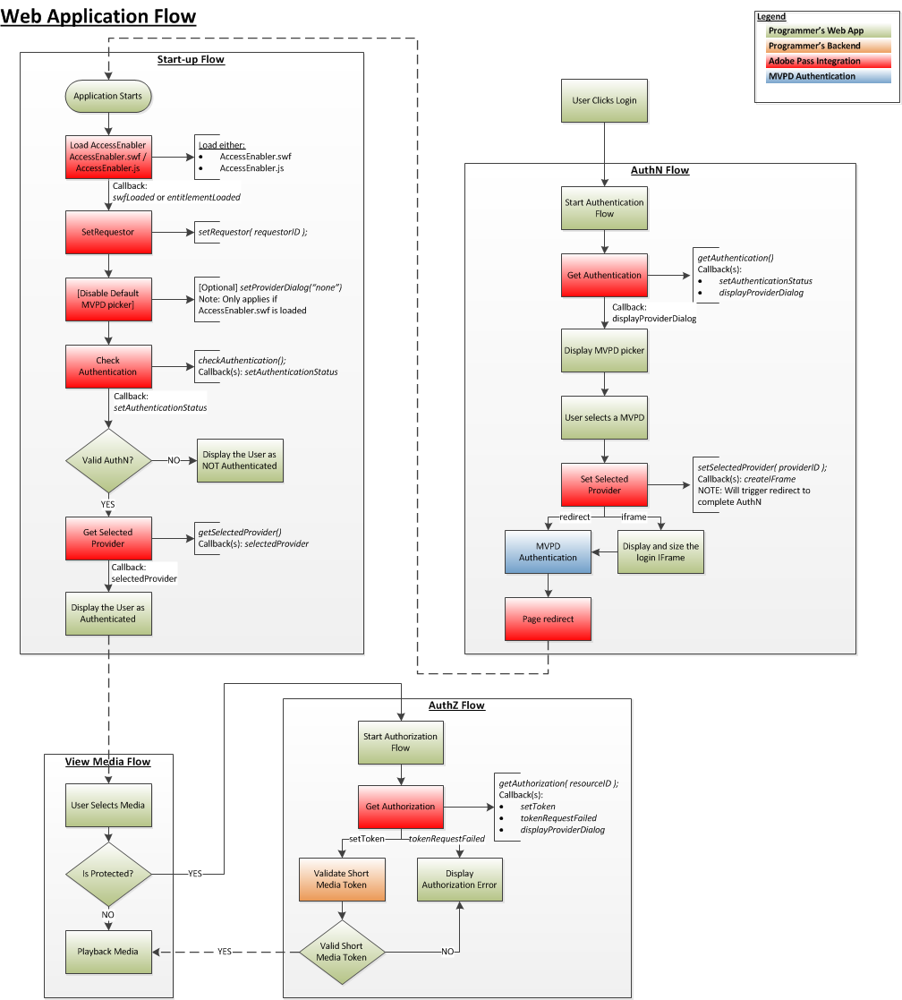

# （レガシー） JavaScript SDK クックブック {#javascript-sdk-cookbook}

>[!NOTE]
>
>このページのコンテンツは、情報提供のみを目的として提供されています。 このAPIを使用するには、Adobeの現在のライセンスが必要です。 無断使用は認められません。

>[!IMPORTANT]
>
> [製品のお知らせ](/help/authentication/product-announcements.md) ページに集計されている最新のAdobe Pass認証製品のお知らせと廃止予定について、常に情報を得てください。

## 概要 {#intro}

このドキュメントでは、プログラマーの上位レベルのアプリケーションが、JavaScriptとAdobe Pass Authentication サービスの統合のために実装する使用権限ワークフローについて説明します。 JavaScript API リファレンスへのリンクは、全体に含まれています。

また、[関連情報](#related) セクションには、
JavaScript コードサンプルのセットへのリンク。

## 使用権限フロー {#entitlement}

1. [前提条件](#prereq)
2. [起動フロー](#startup)
3. [認証フロー](#authn)
4. [承認フロー](#authz)
5. [メディアフローの表示](#logout)

</br>




## 前提条件 {#prereq}

**依存関係：**

- Adobe Pass Authentication Library （AccessEnabler）を利用している場合は、Adobe Pass Authentication Account Managerと連携して設定を行います。
- 有効なAdobe Pass Authentication requestorIdです。Adobe Pass Authentication Account Managerと連携して設定してください。

コールバック関数を作成します。

- `entitlementLoaded`
</br>

**トリガー:** AccessEnablerが読み込まれ、初期化が完了しました。

- `displayProviderDialog(mvpds)`

  **トリガー:** `getAuthentication(),`は、利用者がプロバイダー（MVPD）を選択しておらず、まだ認証されていない場合にのみ適用されます
  mvpds パラメーターは、ユーザーが使用できるプロバイダーの配列です。

- `setAuthenticationStatus(status, errorcode)`

  **トリガー:**
  - 毎回`checkAuthentication()`回。
  - ユーザーが既に認証され、プロバイダーを選択している場合にのみ`getAuthentication()`。

  返されるステータスは成功または失敗です。エラーコードは、失敗のタイプを表します。

- `createIFrame(width, height)`

  **トリガー:** `setSelectedProvider(providerID)`。選択したプロバイダーがIFrameで表示するように設定されている場合のみ。

  >[!NOTE]
  >
  >プロバイダーは、認証画面をリダイレクトまたはiFrameでレンダリングするように設定されており、プログラマーはその両方を考慮する必要があります。

- `sendTrackingData(event, data)`

  **トリガー:** `checkAuthentication(), getAuthentication(),checkAuthorization(), getAuthorization(), setSelectedProvider()`。  `event` パラメーターは、どのエンタイトルメントイベントが発生したかを示します。`data` パラメーターは、イベントに関連する値のリストです。
- `setToken(token, resource)`
  **トリガー:** `checkAuthorization()`および`getAuthorization()`が、リソースの表示に成功した後に発生しました。   `token` パラメーターは短期間有効なメディアトークンです。`resource` パラメーターは、ユーザーが表示を許可されているコンテンツです。

- `tokenRequestFailed(resource, code, description)`
  認証に失敗した後の&#x200B;**トリガー:**`checkAuthorization()`&#x200B;および`getAuthorization()`。\
  `resource` パラメーターは、ユーザーが表示しようとしたコンテンツです。`code` パラメーターは、どのタイプのエラーが発生したかを示すエラーコードです。`description` パラメーターは、エラーコードに関連するエラーを説明します。

- `selectedProvider(mvpd)`

  **トリガー:** [`getSelectedProvider()`] （`mvpd` パラメーターは#$getSelProvによって選択されたプロバイダーに関する情報を提供します
  ユーザー：

- `setMetadataStatus(metadata, key, arguments)`

  **トリガー:** `getMetadata().`\
  `metadata` パラメーターは要求した特定のデータを提供します。キーパラメーターは`getMetadata()` リクエストで使用されたキーです。`arguments` パラメーターは、`getMetadata()`に渡された同じディクショナリーです。


## &#x200B;2. 起動フロー

**I。  AccessEnabler JavaScriptを読み込みます：**

ステージング プロファイル **の**

```JSON
<script type="text/javascript"         
src="https://entitlement.auth-staging.adobe.com/entitlement/v4/AccessEnabler.js">
</script>"
```

それとも…

**実稼動プロファイル用**

```JSON
<script type="text/javascript"         
src="https://entitlement.auth.adobe.com/entitlement/v4/AccessEnabler.js">
</script>"
```

**トリガー:**&#x200B;初期化が完了すると、Adobe Pass
認証は`entitlementLoaded()` コールバック関数を呼び出します。 これは、アプリケーションとAccessEnablerとの通信のエントリポイントです。


**II.** `setRequestor()`を呼び出して、次の情報を確立します
プログラマーのID。プログラマーの`requestorID`に渡し、
（オプション）Adobe Pass認証エンドポイントの配列。

**トリガー:**&#x200B;なし。ただし、必要に応じて`displayProviderDialog()`を呼び出すことができます。


**III.** `checkAuthentication()`を呼び出して、完全な[認証フロー]を開始せずに既存の認証を確認します。  この呼び出しが成功した場合は、直接`authorization flow`に進むことができます。  そうでない場合は、`authentication flow`に進みます。

**依存関係：** `setRequestor()`への呼び出しが成功しました（この依存関係は、以降のすべての呼び出しにも適用されます）。

**トリガー:** `setAuthenticationStatus()` コールバック

</br>

## &#x200B;3. 認証フロー</span>


**依存関係：** `setRequestor()`への呼び出しが成功しました（この依存関係は、以降のすべての呼び出しにも適用されます）。


`getAuthentication()`を呼び出して、認証ステータス ORを取得し、プロバイダー認証フローをトリガーします。

**トリガー：**

- `displayProviderDialog()` ユーザーがまだ認証されていない場合
- 認証が既に行われた場合は`setAuthenticationStatus()`

AccessEnablerが`setAuthenticationStatus()`と`isAuthenticated == 1`を呼び出すと、認証フローが完了します。

## &#x200B;4. 承認フロー {#authz}

**依存関係：**

- `setRequestor()`への呼び出しが成功しました（この依存関係は、以降のすべての呼び出しにも適用されます）。
- MVPDで合意された有効なResourceID。 ResourceIDは、他のデバイスやプラットフォームで使用されるものと同じである必要があり、MVPD間で同じであることに注意してください。

`getAuthorization()`を呼び出して、要求されたメディアのResourceIDを渡します。 呼び出しが成功すると、ショートメディアトークンが返され、ユーザーが要求されたメディアを表示する権限があることを確認します。

- 呼び出しが合格した場合：ユーザーには有効なAuthN トークンがあり、ユーザーはリクエストされたメディアを視聴する権限を持っています。
- 呼び出しが失敗した場合：タイプ（AuthN、AuthZなど）を判断するためにスローされた例外を調べます。
- 呼び出しがAuthN エラーの場合は、AuthN フローを再起動します。
- 呼び出しがAuthZ エラーの場合、ユーザーは要求されたメディアを視聴する権限がなく、何らかのエラーメッセージがユーザーに表示されます。
- 他のエラー（接続エラー、ネットワークエラーなど）が発生した場合 その後、ユーザーに適切なエラーメッセージを表示します。

メディア トークン検証機能を使用して、正常な`getAuthorization()`呼び出しから返されたshortMediaTokenを検証します。


**依存関係：** ショート メディア トークン検証機能（
AccessEnabler ライブラリ）

- 検証が成功した場合：ユーザーの要求されたメディアを表示/再生します。
- 失敗した場合：AuthZ トークンが無効で、メディアリクエストを拒否し、エラーメッセージをユーザーに表示する必要があります。

## &#x200B;5. メディアフローの表示 {#logout}

- ユーザーは表示するメディアを選択します。
  - メディアは保護されていますか？
    - アプリは、メディアが保護されているかどうかを確認します。
      - メディアが保護されている場合、アプリは上記の認証（AuthZ）フローを開始します。
      - メディアが保護されていない場合は、「メディアを表示」フローに進みます。
      - 再生メディア

## 訪問者IDの設定 {#visitorID}

[Experience Cloud visitorID](https://experienceleague.adobe.com/docs/id-service/using/home.html)値の設定は、分析の観点から非常に重要です。 EC visitorIDの値が設定されると、SDKはネットワーク呼び出しごとにこの情報を送信し、Adobe Pass Authentication サービスはこの情報を収集します。 これにより、Adobe Pass Authentication サービスから取得した分析データを、他のアプリケーションやweb サイトから取得した他の分析レポートと関連付けることができます。 EC visitorIDの設定方法に関する情報については、[こちら](https://experienceleague.adobe.com/docs/id-service/using/home.html?lang=en)を参照してください。


>[!NOTE]
>
>この機能のサポートは、JS SDK バージョン 3.1.0以降で利用できます。

<!--
### Related Information (#related)

* [JavaScript SDK Overview](/help/authentication/javascript-sdk-overview.md)
* [JavaScript SDK API Reference](/help/authentication/javascript-sdk-api-reference.md)
* **JavaScript SDK Code Samples**
-->
