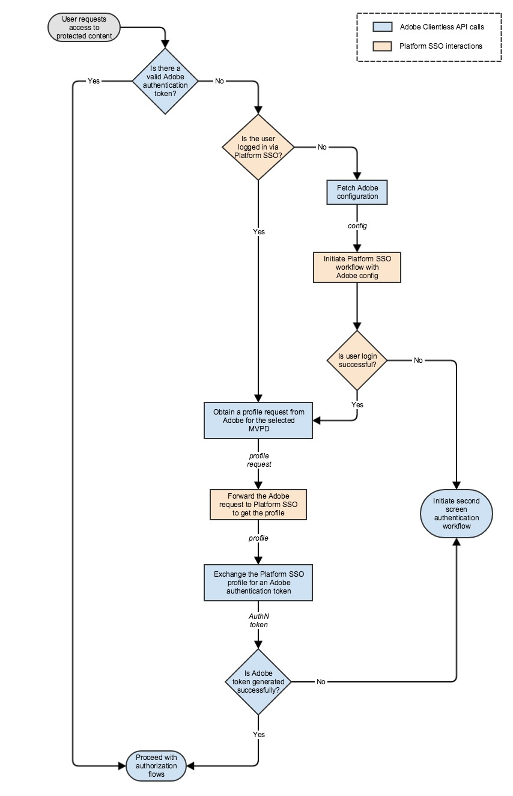

# （レガシー） Apple SSO クックブック （REST API V1） {#apple-sso-cookbook-rest-api-v1}

>[!IMPORTANT]
>
>このページのコンテンツは、情報提供のみを目的として提供されています。 このAPIを使用するには、Adobeの現在のライセンスが必要です。 無断使用は認められません。

>[!IMPORTANT]
>
> [製品のお知らせ](/help/authentication/product-announcements.md) ページに集計されている最新のAdobe Pass認証製品のお知らせと廃止予定について、常に情報を得てください。

Adobe Pass Authentication REST API V1は、iOS、iPadOS、またはtvOSで動作するクライアントアプリケーションのエンドユーザー向けに、パートナーシングルサインオン（SSO）をサポートしています。

このドキュメントは、既存のREST API V1 ドキュメントの拡張機能として機能します。このドキュメントは、[こちら](/help/authentication/integration-guide-programmers/legacy/rest-api-v1/rest-api-reference.md)にあります。

## Cookbook {#apple-sso-cookbook-rest-api-v1-cookbook}

Apple SSO ユーザーエクスペリエンスを活用するには、Appleが開発した[ ビデオ サブスクライバーのアカウントフレームワーク ](https://developer.apple.com/documentation/videosubscriberaccount)をアプリケーションに統合する必要がありますが、Adobe Pass Authentication REST API V1 コミュニケーションでは、次の手順に従う必要があります。

### 権限 {#apple-sso-cookbook-rest-api-v1-permission}

>[!TIP]
>
> **<u>プロのヒント：</u>** ストリーミングアプリケーションは、デバイスのカメラやマイクへのアクセスを提供するのと同様に、デバイスレベルで保存されたユーザーのサブスクリプション情報へのアクセスをリクエストする必要があります。この場合、ユーザーはアプリケーションに続行する権限を付与する必要があります。 この権限は、Appleの[Video Subscriber Account Framework](https://developer.apple.com/documentation/videosubscriberaccount)を使用してアプリケーションごとに要求する必要があり、デバイスはユーザーの選択内容を保存します。

>[!TIP]
>
> **<u>Pro ヒント：</u>** Apple シングルサインオンのユーザーエクスペリエンスのメリットを説明することで、サブスクリプション情報へのアクセスを拒否するユーザーにインセンティブを提供することをお勧めしますが、アプリケーションの設定（TV プロバイダーのアクセス権）に移動するか、iOSおよびiPadOSの&#x200B;*`Settings -> TV Provider`*&#x200B;またはtvOSの&#x200B;*`Settings -> Accounts -> TV Provider`*&#x200B;に移動することで、ユーザーの判断を変えることができます。

>[!TIP]
>
> **<u>Pro ヒント：</u>** アプリケーションがフォアグラウンド状態に入ったときに、ユーザーの権限を要求することをお勧めします。ユーザー認証を要求する前に、アプリケーションが[ ユーザーの購読情報にアクセスする権限](https://developer.apple.com/documentation/videosubscriberaccount/vsaccountmanager/1949763-checkaccessstatus)を任意の時点で確認できるからです。

### 認証 {#apple-sso-cookbook-rest-api-v1-authentication}

* [有効なAdobe認証トークンはありますか？](#step1)
* [ユーザーはパートナーSSO経由でログインしていますか？](#step2)
* [Adobe設定の取得](#step3)
* [Adobe設定を使用したパートナーSSO ワークフローの開始](#step4)
* [ユーザーログインは成功しますか？](#step5)
* [選択したMVPDのAdobeからプロファイルリクエストを取得します](#step6)
* [Adobe リクエストをパートナーSSOに転送して、プロファイルを取得します](#step7)
* [Adobe認証トークンのパートナーSSO プロファイルの交換](#step8)
* [Adobe トークンは正常に生成されますか？](#step9)
* [通常の認証ワークフローを開始](#step10)
* [認証フローを続行](#step11)



#### 手順：「有効なAdobe認証トークンはありますか？」 {#step1}

>[!TIP]
>
> **<u>ヒント：</u>** Adobe Pass Authentication [Check Authentication Token](/help/authentication/integration-guide-programmers/legacy/rest-api-v1/apis/check-authentication-token.md) API サービスを使用して、これを実装します。

#### 手順：「ユーザーはパートナーSSO経由でログインしていますか？」 {#step2}

>[!TIP]
>
> **<u>ヒント：</u>** [ ビデオ購読者アカウントフレームワーク ](https://developer.apple.com/documentation/videosubscriberaccount)のメディアを通じてこれを実装します。

* アプリケーションは、ユーザーのサブスクリプション情報](https://developer.apple.com/documentation/videosubscriberaccount/vsaccountmanager/1949763-checkaccessstatus)にアクセスするための[権限を確認し、ユーザーが許可した場合にのみ続行する必要があります。
* アプリケーションは、購読者アカウント情報の[ リクエスト ](https://developer.apple.com/documentation/videosubscriberaccount/vsaccountmetadatarequest)を送信する必要があります。
* アプリケーションは、[ メタデータ ](https://developer.apple.com/documentation/videosubscriberaccount/vsaccountmetadata)情報を待機して処理する必要があります。

>[!TIP]
>
> **<u>プロ向けのヒント：</u>** コードスニペットに従い、コメントに細心の注意を払います。

```swift
...
let videoSubscriberAccountManager: VSAccountManager = VSAccountManager();

videoSubscriberAccountManager.checkAccessStatus(options: [VSCheckAccessOption.prompt: true]) { (accessStatus, error) -> Void in
            switch (accessStatus) {
            // The user allows the application to access subscription information.
            case VSAccountAccessStatus.granted:
                    // Construct the request for subscriber account information.
                    let vsaMetadataRequest: VSAccountMetadataRequest = VSAccountMetadataRequest();

                    // This is actually the SAML Issuer not the channel ID.
                    vsaMetadataRequest.channelIdentifier = "https://saml.sp.auth.adobe.com";
    
                    // This is the subscription account information needed at this step.
                    vsaMetadataRequest.includeAccountProviderIdentifier = true;
                    
                    // This is the subscription account information needed at this step.
                    vsaMetadataRequest.includeAuthenticationExpirationDate = true;
                    
                    // This is going to make the Video Subscriber Account Framework to refrain from prompting the user with the providers picker at this step. 
                    vsaMetadataRequest.isInterruptionAllowed = false;
                    
                    // Submit the request for subscriber account information - accountProviderIdentifier.
                    videoSubscriberAccountManager.enqueue(vsaMetadataRequest) { vsaMetadata, vsaError in        
                        if (vsaMetadata != nil && vsaMetadata!.accountProviderIdentifier != nil) {
                            // The vsaMetadata!.authenticationExpirationDate will contain the expiration date for current authentication session.
                            // The vsaMetadata!.authenticationExpirationDate should be compared against current date.
                            ...
                            // The vsaMetadata!.accountProviderIdentifier will contain the provider identifier as it is known for the platform configuration.
                            // The vsaMetadata!.accountProviderIdentifier represents the platformMappingId in terms of Adobe Pass Authentication configuration.
                            ...
                            // The application must determine the MVPD id property value based on the platformMappingId property value obtained above.
                            // The application must use the MVPD id further in its communication with Adobe Pass Authentication services.
                            ...
                            // Continue with the "Obtain a profile request from Adobe for the selected MVPD" step.
                            ...
                            // Continue with the "Forward the Adobe request to Partner SSO to obtain the profile" step.
                            ...
                        } else {
                            // The user is not authenticated at platform level, continue with the "Fetch Adobe configuration" step.
                            ...
                        }
                    }
        
            // The user has not yet made a choice or does not allow the application to access subscription information.
            default:
                // Continue with the "Initiate regular authentication workflow" step.
                ...
            }
}
...  
```

#### 手順：「Adobe設定を取得」 {#step3}

>[!TIP]
>
> **<u>ヒント：</u>** Adobe Pass Authentication [MVPD List](/help/authentication/integration-guide-programmers/legacy/rest-api-v1/apis/provide-mvpd-list.md) API サービスを提供するメディアを通じてこれを実装します。

>[!TIP]
>
> **<u>プロ向けのヒント：</u>** MVPDのプロパティ：*`enablePlatformServices`*、*`boardingStatus`*、*`displayInPlatformPicker`*、*`platformMappingId`*、*`requiredMetadataFields`*&#x200B;に注意し、他の手順でコードスニペットに表示されるコメントに特に注意してください。

#### 手順「Adobe設定を使用したパートナーSSO ワークフローの開始」 {#step4}

>[!TIP]
>
> **<u>ヒント：</u>** [ ビデオ購読者アカウントフレームワーク ](https://developer.apple.com/documentation/videosubscriberaccount)のメディアを通じてこれを実装します。

* アプリケーションは、ユーザーのサブスクリプション情報](https://developer.apple.com/documentation/videosubscriberaccount/vsaccountmanager/1949763-checkaccessstatus)にアクセスするための[権限を確認し、ユーザーが許可した場合にのみ続行する必要があります。
* アプリケーションは、VSAccountManagerに[ デリゲート ](https://developer.apple.com/documentation/videosubscriberaccount/vsaccountmanagerdelegate)を提供する必要があります。
* アプリケーションは、購読者アカウント情報の[ リクエスト ](https://developer.apple.com/documentation/videosubscriberaccount/vsaccountmetadatarequest)を送信する必要があります。
* アプリケーションは、[ メタデータ ](https://developer.apple.com/documentation/videosubscriberaccount/vsaccountmetadata)情報を待機して処理する必要があります。

>[!TIP]
>
> **<u>プロ向けのヒント：</u>** コードスニペットに従い、コメントに細心の注意を払います。

```swift
    ...
    let videoSubscriberAccountManager: VSAccountManager = VSAccountManager();
    
    // This must be a class implementing the VSAccountManagerDelegate protocol.
    let videoSubscriberAccountManagerDelegate: VideoSubscriberAccountManagerDelegate = VideoSubscriberAccountManagerDelegate();
    
    videoSubscriberAccountManager.delegate = videoSubscriberAccountManagerDelegate;
    
    videoSubscriberAccountManager.checkAccessStatus(options: [VSCheckAccessOption.prompt: true]) { (accessStatus, error) -> Void in
                switch (accessStatus) {
                // The user allows the application to access subscription information.
                case VSAccountAccessStatus.granted:
                        // Construct the request for subscriber account information.
                        let vsaMetadataRequest: VSAccountMetadataRequest = VSAccountMetadataRequest();
    
                        // This is actually the SAML Issuer not the channel ID.
                        vsaMetadataRequest.channelIdentifier = "https://saml.sp.auth.adobe.com";
        
                        // This is the subscription account information needed at this step.
                        vsaMetadataRequest.includeAccountProviderIdentifier = true;
                        
                        // This is the subscription account information needed at this step.
                        vsaMetadataRequest.includeAuthenticationExpirationDate = true;
                        
                        // This is going to make the Video Subscriber Account Framework to prompt the user with the providers picker at this step. 
                        vsaMetadataRequest.isInterruptionAllowed = true;
                        
                        // This can be computed from the [Adobe Pass Authentication](/help/authentication/provide-mvpd-list.md) service response in order to filter the TV providers from the Apple picker.
                        vsaMetadataRequest.supportedAccountProviderIdentifiers = supportedAccountProviderIdentifiers;
    
                        // This can be computed from the [Adobe Pass Authentication](/help/authentication/provide-mvpd-list.md) service response in order to sort the TV providers from the Apple picker.
                        if #available(iOS 11.0, tvOS 11, *) {
                            vsaMetadataRequest.featuredAccountProviderIdentifiers = featuredAccountProviderIdentifiers;
                        }
                        
                        // Submit the request for subscriber account information - accountProviderIdentifier.
                        videoSubscriberAccountManager.enqueue(vsaMetadataRequest) { vsaMetadata, vsaError in                        
                            // This represents the checks for the "Is user login successful?" step.
                            if (vsaMetadata != nil && vsaMetadata!.accountProviderIdentifier != nil) {
                                // The vsaMetadata!.authenticationExpirationDate will contain the expiration date for current authentication session.
                                // The vsaMetadata!.authenticationExpirationDate should be compared against current date.
                                ...
                                // The vsaMetadata!.accountProviderIdentifier will contain the provider identifier as it is known for the platform configuration.
                                // The vsaMetadata!.accountProviderIdentifier represents the platformMappingId in terms of Adobe Pass Authentication configuration.
                                ...
                                // The application must determine the MVPD id property value based on the platformMappingId property value obtained above.
                                // The application must use the MVPD id further in its communication with Adobe Pass Authentication services.
                                ...
                                // Continue with the "Obtain a profile request from Adobe for the selected MVPD" step.
                                ...
                                // Continue with the "Forward the Adobe request to Partner SSO to obtain the profile" step.
                                ...
                            } else {
                                // The user is not authenticated at platform level.
                                if (vsaError != nil) {
                                    // The application can check to see if the user selected a provider which is present in Apple picker, but the provider is not onboarded in platform SSO.
                                    if let error: NSError = (vsaError! as NSError), error.code == 1, let appleMsoId = error.userInfo["VSErrorInfoKeyUnsupportedProviderIdentifier"] as! String? {
                                        var mvpd: Mvpd? = nil;
    
                                        // The requestor.mvpds must be computed during the "Fetch Adobe configuration" step. 
                                        for provider in requestor.mvpds {
                                            if provider.platformMappingId == appleMsoId {
                                                mvpd = provider;
                                                break;
                                            }
                                        }
                                        
                                        if mvpd != nil {
                                            // Continue with the "Initiate regular authentication workflow" step, but you can skip prompting the user with your MVPD picker and use the mvpd selection, therefore creating a better UX.
                                            ...
                                        } else {
                                            // Continue with the "Initiate regular authentication workflow" step.
                                            ...
                                        }
                                    } else {
                                        // Continue with the "Initiate regular authentication workflow" step.
                                        ...
                                    }
                                } else {
                                    // Continue with the "Initiate regular authentication workflow" step.
                                    ...
                                }
                            }
                        }
            
                // The user has not yet made a choice or does not allow the application to access subscription information.
                default:
                    // Continue with the "Initiate regular authentication workflow" step.
                    ...
                }
    }
    ...
```

#### 手順：「ユーザーログインは成功しますか？」 {#step5}

>[!TIP]
>
> **<u>プロ向けのヒント：</u>** 「[」の「Adobe設定を使用してパートナーSSO ワークフローを開始」ステップ ](#step4)のコードスニペットに注意してください。 *`vsaMetadata!.accountProviderIdentifier`*&#x200B;に有効な値が含まれており、現在の日付が&#x200B;*`vsaMetadata!.authenticationExpirationDate`*&#x200B;値を渡していない場合、ユーザーログインは成功します。

#### 手順「選択したMVPDのAdobeからのプロファイルリクエストの取得」 {#step6}

>[!TIP]
>
> **<u>ヒント：</u>** Adobe Pass Authentication [Profile Request](/help/authentication/integration-guide-programmers/legacy/rest-api-v1/apis/retrieve-profilerequest.md) API サービスを通じてこれを実装します。

>[!TIP]
>
> **<u>プロ向けのヒント：</u>** ビデオ購読者アカウントフレームワークから取得したプロバイダーIDが、Adobe Pass認証の設定に関して&#x200B;*`platformMappingId`*&#x200B;を表していることに注意してください。 したがって、MVPD ID プロパティ値は、Adobe Pass Authentication [Provide MVPD List](/help/authentication/integration-guide-programmers/legacy/rest-api-v1/apis/provide-mvpd-list.md) API サービスのメディアを通じて&#x200B;*`platformMappingId`*&#x200B;値を使用して判断する必要があります。

#### 手順：「Adobe リクエストをパートナーSSOに転送してプロファイルを取得する」 {#step7}

>[!TIP]
>
> **<u>ヒント：</u>** [ ビデオ購読者アカウントフレームワーク ](https://developer.apple.com/documentation/videosubscriberaccount)のメディアを通じてこれを実装します。


* アプリケーションは、ユーザーのサブスクリプション情報](https://developer.apple.com/documentation/videosubscriberaccount/vsaccountmanager/1949763-checkaccessstatus)にアクセスするための[権限を確認し、ユーザーが許可した場合にのみ続行する必要があります。
* アプリケーションは、購読者アカウント情報の[ リクエスト ](https://developer.apple.com/documentation/videosubscriberaccount/vsaccountmetadatarequest)を送信する必要があります。
* アプリケーションは、[ メタデータ ](https://developer.apple.com/documentation/videosubscriberaccount/vsaccountmetadata)情報を待機して処理する必要があります。

>[!TIP]
>
> **<u>プロ向けのヒント：</u>** コードスニペットに従い、コメントに細心の注意を払います。

```swift
    ...
    let videoSubscriberAccountManager: VSAccountManager = VSAccountManager();
    
    videoSubscriberAccountManager.checkAccessStatus(options: [VSCheckAccessOption.prompt: true]) { (accessStatus, error) -> Void in
                switch (accessStatus) {
                // The user allows the application to access subscription information.
                case VSAccountAccessStatus.granted:
                        // Construct the request for subscriber account information.
                        let vsaMetadataRequest: VSAccountMetadataRequest = VSAccountMetadataRequest();
    
                        // This is actually the SAML Issuer not the channel ID.
                        vsaMetadataRequest.channelIdentifier = "https://saml.sp.auth.adobe.com";
        
                        // This is going to include subscription account information which should match the provider determined in a previous step.
                        vsaMetadataRequest.includeAccountProviderIdentifier = true;
                        
                        // This is going to include subscription account information which should match the provider determined in a previous step.
                        vsaMetadataRequest.includeAuthenticationExpirationDate = true;
                        
                        // This is going to make the Video Subscriber Account Framework to refrain from prompting the user with the providers picker at this step. 
                        vsaMetadataRequest.isInterruptionAllowed = false;
    
                        // This are the user metadata fields expected to be available on a successful login and are determined from the [Adobe Pass Authentication](/help/authentication/provide-mvpd-list.md) service. Look for the requiredMetadataFields associated with the provider determined in a previous step.
                        vsaMetadataRequest.attributeNames = requiredMetadataFields;
    
                        // This is the payload from [Adobe Pass Authentication](/help/authentication/retrieve-profilerequest.md) service.
                        vsaMetadataRequest.verificationToken = profileRequestPayload;
                        
                        // Submit the request for subscriber account information.
                        videoSubscriberAccountManager.enqueue(vsaMetadataRequest) { vsaMetadata, vsaError in
                            if (vsaMetadata != nil && vsaMetadata!.samlAttributeQueryResponse != nil) {
                                var samlResponse: String? = vsaMetadata!.samlAttributeQueryResponse!;
                                
                                // Remove new lines, new tabs and spaces.
                                samlResponse = samlResponse?.replacingOccurrences(of: "[ \\t]+", with: " ", options: String.CompareOptions.regularExpression);
                                samlResponse = samlResponse?.components(separatedBy: CharacterSet.newlines).joined(separator: "");
                                samlResponse = samlResponse?.trimmingCharacters(in: CharacterSet.whitespacesAndNewlines);
                                
                                // Base64 encode.
                                samlResponse = samlResponse?.data(using: .utf8)?.base64EncodedString(options: []);
                                
                                // URL encode. Please be aware not to double URL encode it further.
                                samlResponse = samlResponse?.addingPercentEncoding(withAllowedCharacters: CharacterSet.init(charactersIn: "!*'();:@&=+$,/?%#[]").inverted);
                                
                                // Continue with the "Exchange the Partner SSO profile for an Adobe authentication token" step.
                                ...
                            } else {
                                // Continue with the "Initiate regular authentication workflow" step.
                                ...
                            }
                        }
                        
                // The user has not yet made a choice or does not allow the application to access subscription information.
                default:
                    // Continue with the "Initiate regular authentication workflow" step.
                    ...
                }
    }
    ...
```

#### 手順：「Adobe認証トークンのパートナーSSO プロファイルの交換」 {#step8}

>[!TIP]
>
> **<u>ヒント：</u>** Adobe Pass Authentication [Token Exchange](/help/authentication/integration-guide-programmers/legacy/rest-api-v1/apis/token-exchange.md) API サービスのメディアを通じてこれを実装します。

>[!TIP]
>
> **<u>プロからのヒント：</u>** 「[」のコードスニペットに注意してください。「Adobe リクエストをパートナーSSOに転送してプロファイルを取得する」 ](#step7) ステップ。 この&#x200B;*`vsaMetadata!.samlAttributeQueryResponse!`*&#x200B;は&#x200B;*`SAMLResponse`*&#x200B;を表します。これは[Token Exchange](/help/authentication/integration-guide-programmers/legacy/rest-api-v1/apis/token-exchange.md)で渡す必要があり、呼び出しを行う前に文字列の操作とエンコード（*Base64*&#x200B;でエンコードされ、*URL*）が必要です。

#### 手順：「Adobe トークンは正常に生成されますか？」 {#step9}

>[!TIP]
>
> **<u>ヒント：</u>** トークンが正常に作成され、認証フローに使用する準備ができていることを示す&#x200B;*`204 No Content`*&#x200B;の正常な応答であるAdobe Pass Authentication [Token Exchange](/help/authentication/integration-guide-programmers/legacy/rest-api-v1/apis/token-exchange.md)を通じて、これを実装します。

#### 手順：「通常の認証ワークフローの開始」 {#step10}

>[!TIP]
>
> **<u>ヒント：</u>** Adobe Pass認証[登録コード要求](/help/authentication/integration-guide-programmers/legacy/rest-api-v1/apis/registration-code-request.md)、[認証の開始](/help/authentication/integration-guide-programmers/legacy/rest-api-v1/apis/initiate-authentication.md)、[認証トークンの取得](/help/authentication/integration-guide-programmers/legacy/rest-api-v1/apis/retrieve-authentication-token.md)または[認証トークンの確認](/help/authentication/integration-guide-programmers/legacy/rest-api-v1/apis/check-authentication-token.md) API サービスを使用して、これを実装します。

>[!TIP]
>
> **<u>Pro ヒント：</u>** tvOSの実装については、次の手順に従ってください。

* アプリケーションは[登録コード ](/help/authentication/integration-guide-programmers/legacy/rest-api-v1/apis/registration-code-request.md)を取得し、1番目のデバイス（画面）でエンドユーザーに提示する必要があります。
* 登録コードを取得した後、1番目のデバイス（画面）で認証状態](/help/authentication/integration-guide-programmers/legacy/rest-api-v1/apis/retrieve-authentication-token.md)を確認するために、アプリケーションは[ ポーリングを開始する必要があります。
* 登録コードを使用する場合、別のアプリケーションでは、2番目のデバイス（画面）で[認証を開始する](/help/authentication/integration-guide-programmers/legacy/rest-api-v1/apis/initiate-authentication.md)必要があります。
* 認証トークンが生成されると、アプリケーションは、1番目のデバイス（画面）で[ ポーリング ](/help/authentication/integration-guide-programmers/legacy/rest-api-v1/apis/retrieve-authentication-token.md)を停止する必要があります。

>[!TIP]
>
> **<u>Pro ヒント：</u>** iOS/iPadOSの実装については、次の手順に従ってください。

* アプリケーションは、1番目のデバイス（画面）でエンドユーザーに表示しない登録コード ](/help/authentication/integration-guide-programmers/legacy/rest-api-v1/apis/registration-code-request.md)を[取得する必要があります。
* アプリケーションは、登録コードと[WKWebView](https://developer.apple.com/documentation/webkit/wkwebview)または[SFSafariViewController](https://developer.apple.com/documentation/safariservices/sfsafariviewcontroller) コンポーネントを使用して、1番目のデバイス（画面）で[認証を開始する必要があります](/help/authentication/integration-guide-programmers/legacy/rest-api-v1/apis/initiate-authentication.md)。
* アプリケーションは、[WKWebView](https://developer.apple.com/documentation/webkit/wkwebview)または[SFSafariViewController](https://developer.apple.com/documentation/safariservices/sfsafariviewcontroller) コンポーネントが閉じた後、1番目のデバイス（画面）で[ ポーリングを開始して認証状態](/help/authentication/integration-guide-programmers/legacy/rest-api-v1/apis/retrieve-authentication-token.md)を把握する必要があります。
* 認証トークンが生成されると、アプリケーションは、1番目のデバイス（画面）で[ ポーリング ](/help/authentication/integration-guide-programmers/legacy/rest-api-v1/apis/retrieve-authentication-token.md)を停止する必要があります。

#### 手順：「認証フローを続行」 {#step11}

>[!TIP]
>
> **<u>ヒント：</u>** Adobe Pass Authentication [Initiate Authorization](/help/authentication/integration-guide-programmers/legacy/rest-api-v1/apis/initiate-authorization.md)および[Get Short Media Token](/help/authentication/integration-guide-programmers/legacy/rest-api-v1/apis/obtain-short-media-token.md) API サービスを使用して、これを実装します。

### ログアウト {#apple-sso-cookbook-rest-api-v1-logout}

[Video Subscriber Account Framework](https://developer.apple.com/documentation/videosubscriberaccount)では、デバイス システム レベルでテレビ プロバイダーのアカウントにサインインしたユーザーをプログラムでログアウトするためのAPIが提供されていません。 したがって、ログアウトを完全に有効にするには、iOS/iPadOSの&#x200B;*`Settings -> TV Provider`*&#x200B;から明示的にログアウトするか、tvOSの&#x200B;*`Settings -> Accounts -> TV Provider`*&#x200B;から明示的にログアウトする必要があります。 ユーザーが持つもう1つのオプションは、特定のアプリケーション設定セクション（テレビプロバイダーへのアクセス）からユーザーの購読情報にアクセスする権限を取り消すことです。

>[!TIP]
>
> **<u>ヒント：</u>** Adobe Pass Authentication [User Metadata Call](/help/authentication/integration-guide-programmers/legacy/rest-api-v1/apis/user-metadata.md)および[Logout](/help/authentication/integration-guide-programmers/legacy/rest-api-v1/apis/initiate-logout.md) API サービスを通じてこれを実装します。

>[!TIP]
>
> **<u>Pro ヒント：</u>** tvOSの実装については、次の手順に従ってください。

* Adobe Pass Authentication サービスの「*tokenSource」* [ ユーザーメタデータ ](/help/authentication/integration-guide-programmers/legacy/rest-api-v1/apis/user-metadata.md)を使用して、パートナーSSOを介したログインの結果として認証が行われたかどうかを判断する必要があります。
* *&quot;tokenSource&quot;*&#x200B;の値が&quot;*Apple&quot;と等しい場合、tvOS **only**で&#x200B;*`Settings -> Accounts -> TV Provider`*から明示的にログアウトするようにユーザーに指示または指示する必要があります。*
* アプリケーションは、ダイレクト HTTP呼び出しを使用して、Adobe Pass Authentication サービスから[ ログアウト ](/help/authentication/integration-guide-programmers/legacy/rest-api-v1/apis/initiate-logout.md)を開始する必要があります。 これは、MVPD側のセッションのクリーンアップを容易にするものではありません。

>[!TIP]
>
> **<u>Pro ヒント：</u>** iOS/iPadOSの実装については、次の手順に従ってください。

* Adobe Pass Authentication サービスの「*tokenSource」* [ ユーザーメタデータ ](/help/authentication/integration-guide-programmers/legacy/rest-api-v1/apis/user-metadata.md)を使用して、パートナーSSOを介したログインの結果として認証が行われたかどうかを判断する必要があります。
* *「tokenSource」*&#x200B;の値が&#x200B;*「Apple」*&#x200B;に等しい場合、iOS/iPadOS **only**&#x200B;で&#x200B;*`Settings -> TV Provider`*&#x200B;から明示的にログアウトするように指示または指示する必要があります。
* アプリケーションは、[WKWebView](https://developer.apple.com/documentation/webkit/wkwebview)または[SFSafariViewController](https://developer.apple.com/documentation/safariservices/sfsafariviewcontroller) コンポーネントを使用して、Adobe Pass Authentication サービスから[ ログアウト ](/help/authentication/integration-guide-programmers/legacy/rest-api-v1/apis/initiate-logout.md)を開始する必要があります。 これにより、MVPD側のセッションのクリーンアップが容易になります。
