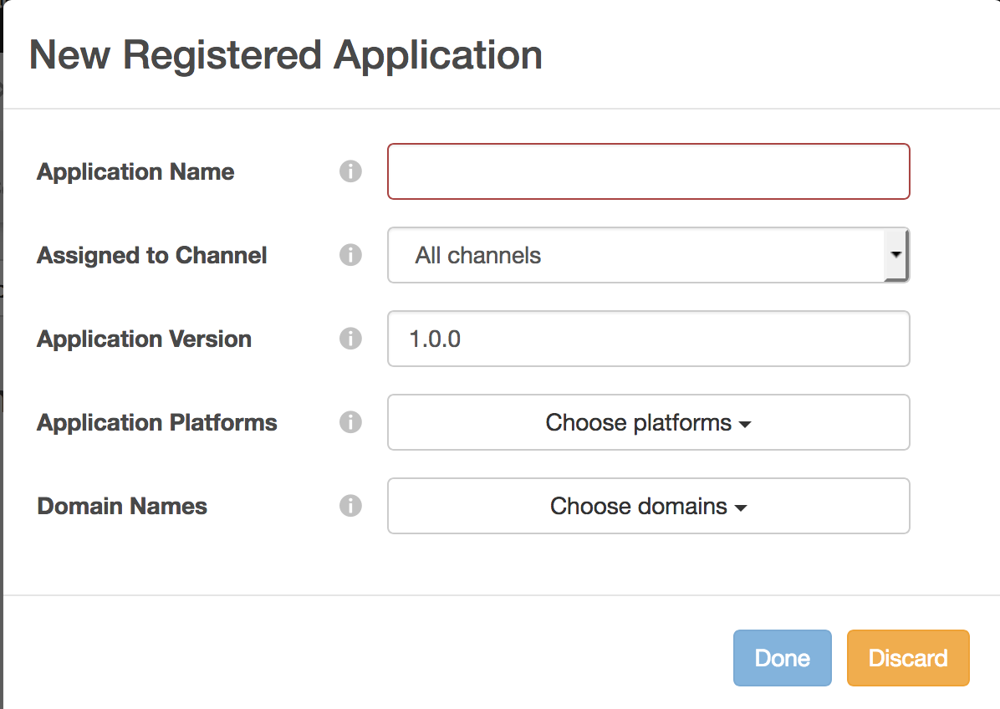

# （レガシー） Primetime TVE ダッシュボードユーザーガイド {#tve-db-user-guide}

>[!NOTE]
>
>このページのコンテンツは情報提供のみを目的としています。 この API を使用するには、Adobeから現在のライセンスが必要です。 無許可の使用は許可されていません。

>[!IMPORTANT]
>
> [ 製品のお知らせ ](/help/authentication/product-announcements.md) ページに集約された最新のAdobe Pass認証製品のお知らせや廃止予定タイムラインについて、常に情報を提供するようにします。

## 概要 {#tve-db-intro}

[[!DNL Adobe] TVE ダッシュボード（TVE ダッシュボード） ](https://console.auth.adobe.com/) は、Adobe Pass Authentication 製品チームとビジネス上の関係を持つメディア会社（プログラマー）に勤務するユーザーを対象としたセルフサービスダッシュボードです。

アクセス権を取得するには、テクニカルアカウントマネージャー（TAM）にお問い合わせください。 アクセスするには、2 つの新しいユーザーグループをAdobe Marketing Cloud組織で設定する必要があります。

* TVE ダッシュボードの読み取り/書き込み – このグループのメンバーは、ダッシュボードのすべての編集可能なセクションに対する完全な権限を持ちます
* TVE ダッシュボード読み取り専用 – このグループのメンバーは、ダッシュボード全体での表示権限のみを持ちます

このユーザーガイドを詳しく説明する前に、次の資料を確認して、Adobe Pass Authentication 製品チームが提供するフローと機能を理解し、このドキュメントで使用される用語について理解しておくことをお勧めします。

* [TVE テクニカルペーパー](/help/authentication/kickstart/technical-paper.md)
* [プログラマ キックスタートガイド](/help/authentication/kickstart/programmer-kickstart-guide.md)

このユーザーガイドの次の節に進み、会社のチャネル、プログラマー、またはチャネルと MVPD （マルチチャネルビデオプログラムディストリビューター）間の統合に関する様々な設定を管理する方法を確認します。

>[!IMPORTANT]
>TVE ダッシュボードでは、基本ダッシュボードと高度なWorkspaceを切り替えることができます。 それには、右上隅のアイコンを切り替えます。 Advanced Workspaceは、Adobe Pass Authentication product team が提供する機能に関する高度な知識と十分な技術的知識を持つユーザーを対象としています。

*図 1:Adobe Primetime TVE ダッシュボードの「基本/詳細Workspace」ドロップダウン*

## 環境 {#authn-environments}

ユーザーが実行する必要のあるタスクに応じて、Adobe Pass Authentication 環境を切り替える必要が生じる場合があります。 Adobe Pass認証環境について詳しくは、「Adobe Pass認証環境について [ を参照してください ](/help/authentication/notes-technical/environments/understanding-the-adobe-environments.md)。

TVE ダッシュボードには、次に示すように、Prequalification （事前選定）および Release という 2 つの環境が用意されています。各環境には、Staging および Production という 2 つのプロファイルがあります。

* [ 初期病期分類 ](https://console-prequal.auth-staging.adobe.com/)
* [ 初期生成 ](https://console-prequal.auth.adobe.com/)
* [ リリースステージング ](https://console.auth-staging.adobe.com/)
* [ 実稼動をリリース ](https://console.auth.adobe.com/)

環境を切り替えるには、以下に示すドロップダウン要素から、エントリで表される目的の環境をクリックします。

*図 2:Adobe Pass TVE ダッシュボード環境ドロップダウン*

>[!IMPORTANT]
>
>TVE Dashboard を使用してAdobe Pass Authentication 設定に管理上の変更を加える場合、適切に機能させるために、以下の手順に従うことを強くお勧めします。

TVE ダッシュボードを使用してAdobe Pass Authentication 設定に管理上の変更を加えるには：

* [ リリースステージング ](http://sp.auth-staging.adobe.com/apitest/api.html) で変更を実行し、検証します。
* [ 初期実稼動 ](http://sp.auth-staging.adobe.com/apitest/api.html) で変更を実行し、検証します。
* [ 実稼動をリリース ](http://sp.auth-staging.adobe.com/apitest/api.html) で変更を実行し、検証します。

>[!IMPORTANT]
>
>管理変更を有効にするには、ユーザーは、サイドバーの左下に表示されるボタンを選択して「変更を確認およびプッシュ」セクションに移動する必要があります。変更を確認するには、新しく作成した変更の説明を追加し、「プッシュ設定」を選択して設定の更新を確認します。

*図 3:Adobe Primetime TVE ダッシュボードの「Review and Push Changes」通知*

## セクション {#sections}

メディア会社（プログラマー）で作業するユーザーは、サイドバーから TVE ダッシュボードの次のセクションにアクセスできます。

* **チャネル** - コンテンツプロバイダーに関連する設定が含まれます
* **プログラマー** - 1 つまたは複数の **チャネル** を集計する親組織に関連する設定が含まれます
* **統合** - **チャネル** と **MVPD** 間の統合に関連する設定が含まれます
* **MVPDs** – 利用可能な **MVPD** に関連する設定が含まれます
* **Reports** - AuthN TTL、AuthZ TTL、SSO の 3 種類のレポートの集計データが含まれます
* **変更ログ** - TVE ダッシュボード設定に適用された最新の変更が含まれています

*図 4:Adobe Primetimeの TVE ダッシュボードセクション*

### チャネル {#tve-db-channels-section}

このセクションでは、使用可能なチャネルの設定を表示および編集したり、新しい設定を作成したりできます。 使用可能なチャネルの 1 つをクリックすると、次のタブを含む画面が返されます。

* **チャネルデータ**
   * **チャネル ID** – 当社のシステムで使用されるチャネルの一意の ID。「リクエスター ID」とも呼ばれます。
   * **表示名** - チャネルの商品名。
* **一般設定**
   * **Analytics 設定** - Adobe Analyticsに転送されるAdobe Pass認証イベントを設定します。 この機能を有効にする前に、レポートスイート ID （RSID）を設定する必要がある方法について詳しくは、Adobeにお問い合わせください。
* **証明書**

  認証フローで使用される証明書のリストが、発行組織、発行日、有効期限と共に含まれます。 これらの証明書は、秘密鍵または公開鍵として機能し、検証目的で使用されます。
* **ドメイン**

  それぞれのチャネルがAdobe Pass Authentication と通信するドメインのリストが含まれます。
* **統合**

  使用可能な MVPD との統合のリストが、有効になっているかどうかにかかわらず、各統合のステータスと共に含まれます。 特定のエントリをクリックすると、統合ページに移動できます。
* **登録の申請**

  アプリケーション登録のリストが含まれます。 詳しくは、ドキュメント [ 動的なクライアント登録管理 ](/help/authentication/integration-guide-programmers/rest-apis/rest-api-dcr/dynamic-client-registration-overview.md#dynamic-client-registration-management) を参照してください。

* **カスタムスキーム**

  カスタムスキームのリストが含まれます。 詳しくは、[iOS/tvOS アプリケーションの登録 ](/help/authentication/integration-guide-programmers/legacy/sdks/ios-tvos-sdk/iostvos-application-registration.md) および [Dynamic Client Registration Management](/help/authentication/integration-guide-programmers/rest-apis/rest-api-dcr/dynamic-client-registration-overview.md#dynamic-client-registration-management) を参照してください

#### ドメインの追加/削除 {#add-delete-domains}

選択したチャネルに対して新しいドメインを追加するプロセスを開始するには、ドメイン リストの下の「新しいドメインを追加」ボタンをクリックする必要があります。 これにより、ドメイン名を指定できる新しいドメインエントリが作成されます。 より一般的なドメインがドメインリストに既に存在する場合は、新しいサブドメインを追加しないでください。

*図：チャネルの「ドメイン」タブ*

#### チャネルレベルでの登録済みアプリケーションの作成 {#create-registered-application-channel-level}

チャネルレベルで登録されたアプリケーションを作成するには、「チャネル」メニューに移動し、アプリケーションを作成するメニューを選択します。 次に、「登録済みアプリケーション」タブに移動した後、「新しいアプリケーションの追加」ボタンをクリックします。

次の画像に示すように、入力が必要なフィールドは次のとおりです。

* **アプリケーション名** - アプリケーションの名前

* **チャネルに割り当て** – 以下に示すように、プログラマーレベルで実行される同じアクションと比較して、ここで少し異なるのは、「割り当てられたチャネル」ドロップダウンです。このドロップダウンは有効になっていないので、登録されたアプリケーションを現在のチャネル以外にバインドするオプションはありません。

* **アプリケーションバージョン** - デフォルトでは「1.0.0」に設定されていますが、独自のアプリケーションバージョンで変更することを強くお勧めします。 ベストプラクティスとして、アプリケーションのバージョンを変更する場合は、新しい登録アプリケーションを作成して反映します。

* **アプリケーションプラットフォーム** - リンクするアプリケーションのプラットフォーム。 すべての値または複数の値を選択することもできます。

* **ドメイン名** - リンク先のアプリケーションのドメイン。 ドロップダウンリスト内のドメインは、すべてのチャネルのすべてのドメインを統合的に選択したものです。 リストから複数のドメインを選択することもできます。 ドメインの意味は、リダイレクト URL[RFC6749](https://tools.ietf.org/html/rfc6749) です。 クライアント登録プロセスでは、認証フローの最終処理にリダイレクト URL を使用することをクライアントアプリケーションに許可するリクエストを実行できます。 クライアントアプリケーションが特定のリダイレクト URL をリクエストすると、ソフトウェア文に関連付けられたこの登録済みアプリケーションにホワイトリストに登録されているドメインに対して検証されます。

適切な値をフィールドに入力した後、アプリケーションを設定に保存するには、「完了」をクリックする必要があります。

**作成済みのアプリケーションを変更するオプションはありません** のでご注意ください。 作成した項目が要件を満たしていないことが判明した場合は、新しい登録アプリケーションを作成し、要件を満たすクライアントアプリケーションと共に使用する必要があります。

##### ソフトウェアのステートメントのダウンロード {#download-software-statement-channel-level}

ソフトウェア ステートメントが必要なリスト エントリの [ ダウンロード ] ボタンをクリックすると、テキスト ファイルが生成されます。 このファイルには、以下のサンプル出力に似たものが含まれます。

ファイル名は、先頭に「software_statement」を付け、現在のタイムスタンプを追加することによって、一意に識別されます。

同じ登録済みアプリケーションの場合、ダウンロードボタンがクリックされるたびに異なるソフトウェア明細書が受信されますが、これにより以前に取得したソフトウェア明細書がこのアプリケーションで無効になることはありません。 これは、アクションのリクエストに応じて、その場で生成されるからです。

ダウンロードアクションに関しては、1 つ **制限** があります。 登録されたアプリケーションの作成後すぐに「ダウンロード」ボタンをクリックしてソフトウェアのステートメントを要求されたものの、それがまだ保存されておらず、設定 json が同期されていない場合、次のエラーメッセージがページ下部に表示されます。

登録されたアプリケーションの ID がまだ反映されておらず、コアに認識されていないので、コアから受信した HTTP 404 Not Found エラーコードがラップされます。

解決策は、登録されたアプリケーションを作成した後、設定が同期されるまで最大 2 分待つことです。 これが発生すると、エラーメッセージは受信されなくなり、ソフトウェアのステートメントを含むテキストファイルをダウンロードできるようになります。

### プログラマー {#tve-db-programmers-section}

このセクションでは、使用可能なプログラマーの設定を表示および編集したり、新しい設定を作成したりできます。 利用可能なプログラマーの 1 つをクリックすると、次のタブを含む画面が返されます。

* **プログラマーデータ**
   * **プログラマー ID** - システムで使用されるプログラマーの一意の ID。
   * **表示名** - プログラマーの商品名。
   * **Logo Url** - プログラマーの商用ロゴ URL （Uniform Resource Locator）。
   * **ロゴのプレビュー** – 上記の Uniform Resource Locator （URL）からダウンロードした、プログラマーの商用ロゴのプレビュー。

* **証明書**

  認証フローで使用される証明書のリストが、発行組織、発行日、有効期限と共に含まれます。 これらの証明書は、秘密鍵または公開鍵として機能し、検証目的で使用されます。

* **チャネル**

  この特定のプログラマーに属するチャネルのリストが含まれます。 特定のエントリをクリックすると、「チャネル」セクションに移動できます。

* **登録の申請**

  アプリケーション登録のリストが含まれます。 詳しくは、[ 動的なクライアント登録管理 ](/help/authentication/integration-guide-programmers/rest-apis/rest-api-dcr/dynamic-client-registration-overview.md#dynamic-client-registration-management) を参照してください。

* **カスタムスキーム**

  カスタムスキームのリストが含まれます。 詳しくは、[iOS/tvOS アプリケーションの登録 ](/help/authentication/integration-guide-programmers/legacy/sdks/ios-tvos-sdk/iostvos-application-registration.md) を参照してください。

#### プログラマーレベルでの登録済みアプリケーションの作成 {#create-registered-application-programmer-level}

**プログラマー**/**登録済みアプリケーション** タブに移動します。

「登録済みアプリケーション」タブで、「**新しいアプリケーションを追加**」をクリックします。 新しいウィンドウで必須フィールドに入力します。

次の画像に示すように、入力が必要なフィールドは次のとおりです。

* **アプリケーション名** - アプリケーションの名前

* **チャネルに割り当て** – このアプリケーションがリンクされているチャネルの名前 o。 ドロップダウンマスクのデフォルト設定は **すべてのチャネル」です。** インターフェイスでは、1 つのチャネルまたはすべてのチャネルを選択できます。

* **アプリケーションバージョン** - デフォルトでは「1.0.0」に設定されていますが、独自のアプリケーションバージョンで変更することを強くお勧めします。 ベストプラクティスとして、アプリケーションのバージョンを変更する場合は、新しい登録アプリケーションを作成して反映します。

* **アプリケーションプラットフォーム** - リンクするアプリケーションのプラットフォーム。 すべての値または複数の値を選択することもできます。

* **ドメイン名** - リンク先のアプリケーションのドメイン。 ドロップダウンリスト内のドメインは、すべてのチャネルのすべてのドメインを統合的に選択したものです。 リストから複数のドメインを選択することもできます。 ドメインの意味は、リダイレクト URL[RFC6749](https://tools.ietf.org/html/rfc6749) です。 クライアント登録プロセスでは、認証フローの最終処理にリダイレクト URL を使用することをクライアントアプリケーションに許可するリクエストを実行できます。 クライアントアプリケーションが特定のリダイレクト URL をリクエストすると、ソフトウェア文に関連付けられたこの登録済みアプリケーションにホワイトリストに登録されているドメインに対して検証されます。

適切な値をフィールドに入力した後、アプリケーションを設定に保存するには、「完了」をクリックする必要があります。

**作成済みのアプリケーションを変更するオプションはありません** のでご注意ください。 作成した項目が要件を満たしていないことが判明した場合は、新しい登録アプリケーションを作成し、要件を満たすクライアントアプリケーションと共に使用する必要があります。

##### ソフトウェアのステートメントのダウンロード {#download-software-statement-programmer-level}

ソフトウェア ステートメントが必要なリスト エントリの [ ダウンロード ] ボタンをクリックすると、テキスト ファイルが生成されます。 このファイルには、以下のサンプル出力に似たものが含まれます。

ファイル名は、先頭に「software_statement」を付け、現在のタイムスタンプを追加することによって、一意に識別されます。

同じ登録済みアプリケーションの場合、ダウンロードボタンがクリックされるたびに異なるソフトウェア明細書が受信されますが、これにより以前に取得したソフトウェア明細書がこのアプリケーションで無効になることはありません。 これは、アクションのリクエストに応じて、その場で生成されるからです。

ダウンロードアクションに関しては、1 つ **制限** があります。 登録されたアプリケーションの作成後すぐに「ダウンロード」ボタンをクリックしてソフトウェアのステートメントを要求されたものの、それがまだ保存されておらず、設定 json が同期されていない場合、次のエラーメッセージがページ下部に表示されます。

登録されたアプリケーションの ID がまだ反映されておらず、コアに認識されていないので、コアから受信した HTTP 404 Not Found エラーコードがラップされます。

解決策は、登録されたアプリケーションを作成した後、設定が同期されるまで最大 2 分待つことです。 これが発生すると、エラーメッセージは受信されなくなり、ソフトウェアのステートメントを含むテキストファイルをダウンロードできるようになります。

### 統合 {#tve-db-integrations-sec}

このセクションでは、チャネルと使用可能な MVPD の間の統合の設定を表示および編集したり、新しい設定を作成したりできます。 利用可能ないずれかの統合をクリックすると、基本Workspaceを使用している場合は 1 ページが返され、詳細Workspaceを使用している場合は次のタブを含む画面が返されます。

* **統合データ**
   * **統合 ID** - MVPD の一意の ID をチャネルの一意の ID に追加した結果を「_」文字で区切ったもの。
   * **チャネル表示名** - チャネルの商品名。
   * **チャネル ID** – 当社のシステムで使用されるチャネルの一意の ID。「リクエスター ID」とも呼ばれます。
   * **MVPDの表示名** - MVPDの商品名。
   * **MVPD ID** - システムで使用されるMVPDの一意の ID。
* **一般設定**
   * **ユーザーメタデータキー** – 特定の統合に使用できるメタデータキーを設定します。
   * **プラットフォーム固有の設定** – 特定のプラットフォームに異なる設定を指定します（例：TTL、SSO、IFrames）。

* **認証の設定**
   * Adobe Pass認証機能に関連する設定が含まれます。
* **認証設定**
   * Adobe Pass認証認証機能に関連する設定が含まれます。
* **ログアウト設定**
   * Adobe Pass認証ログアウト機能に関する設定が含まれます。

#### 統合を作成 {#create-integration}

新しい統合を作成するには、次の手順に従ってください。

* 「Add New Integration」ボタンをクリックします。
* チャネルを検索して選択
* MVPDを検索して選択
* tve ダッシュボードが「Integration Id」を計算し、使用可能なMVPD エンドポイントを表示するまで待ちます。
* 認証、承認、ログアウトの各エンドポイントを選択するか、デフォルト値を使用します。
* 「統合を作成」ボタンをクリック
* MVPDの設定に応じて、ポップアップが表示されて追加のプロパティを求めることができます。これらのプロパティはMVPDから事前に提供されているはずですが、提供されていない場合は、新しく作成された統合ページへのリダイレクトが行われます

*図表 5. Adobe Primetime TVE ダッシュボードの新規統合ウィンドウ*

#### 統合を更新 {#update-integration}

既存の統合を更新するには、「統合」セクションまたは「統合」タブを含む「チャネル」セクションから、その特定の統合のテーブルエントリをクリックします。

基本的なWorkspace モードを使用する場合、このセクションでは、認証および認証トークン TTL （time-to-live）や iFrame 設定など、最も一般的に更新される設定を表示および編集できます。 動的に定義されるトークン永続性 TTL をサポートする MVPD との統合では、TTL 設定が欠落する場合があることに注意してください（[MVPD Integration Requirements](/help/authentication/integration-guide-mvpds/mvpd-integr-features.md) のエントリ 1.19 を参照）。

詳細Workspace モードを使用する場合、このセクションでは、あまり一般的でない設定を表示および編集できます。

Workspaceの基本モードと詳細モードの両方の場合、これらの設定はプラットフォームレベルで変更できます（例えば、Androidの認証 TTL トークンのカスタム値を選択します。その他のすべてのプラットフォームではデフォルトです）。

>[!IMPORTANT]
>MVPD/MVPD エンドポイント/統合/Platform （Platform が最も具体的な値を持ち、MVPDが最も一般的なデフォルト）の設定継承チェーンを理解することが重要です。

*図表 6. Adobe Primetime TVE Dashboard プロパティ継承チェーンコンポーネント*

#### Platform 固有の設定 {#platform-sp-settings}

このサブセクションは、特定のプラットフォームの設定を上書きするために使用できます。 使用可能なプラットフォームは次のとおりです。

* **すべてのプラットフォーム** – 特定のプラットフォームに他の値が設定されていない場合に、プログラマーの実装に関係なく、すべてのプラットフォームに適用される値を設定します。
* **Android** - Adobe Pass Authentication Android SDKを介してプログラマー実装に適用される値を設定します。
* **クライアントレス REST API** - Adobe Pass認証 REST API を使用して、プログラマー実装に適用される値を設定します。
* **Fire TV** - Adobe Pass認証の FireTV SDKでプログラマーの実装に適用される値を設定します。
* **SDKのFlash** – このプラットフォームは非推奨（廃止予定）となりました。 **非推奨**
* **JavaScript SDK** - Adobe Pass Authentication JavaScript SDKを介してプログラマー実装に適用される値を設定します。
* **Roku** - Adobe Pass認証 REST API 経由でプログラマーの実装に適用され、デバイスタイプとして「Roku」を送信する値を設定します。 これは、Roku デバイスの場合は、クライアントレス REST API プラットフォームに設定された値よりも優先されます。
* **Xbox ネイティブ SDK** – このプラットフォームは非推奨です。 **非推奨**
* **Xbox 360 REST API** - Adobe Pass認証 REST API を介してプログラマー実装に適用され、デバイスタイプとして「xbox」を送信する値を設定します。 Xbox 360 デバイスの場合、クライアントレス REST API プラットフォームで設定した値よりも優先されます。
* **Xbox One REST API** - Adobe Pass認証 REST API を介してプログラマー実装に適用され、デバイスタイプとして「xboxOne」を送信する値を設定します。 これは、XboxOne デバイスの場合、クライアントレス REST Api プラットフォームで設定された値よりも優先されます。
* **iOS** - Adobe Pass Authentication iOS SDKを介してプログラマー実装に適用される値を設定します。
* **tvOS** - Adobe Pass Authentication tvOS SDKを介してプログラマー実装に適用される値を設定します。

*図 7. Adobe Primetime TVE Dashboard Platform 固有の設定*

#### Platform シングルサインオンを有効にする {#enable-platform-sso}

特定の統合とプラットフォームについてシングルサインオンを有効/無効にするには、以下の手順に従ってください。

* 高度なWorkspace モードを使用していることを確認します
* 目的の統合に移動します
* **一般設定** タブに移動します。
* シングル サインオンを有効または無効にするプラットフォームを選択してください
* **シングルサインオンを有効にする** フラグを目的の値（はい/いいえ）に切り替えます

  >[!IMPORTANT]
  >**シングルサインオンを有効にする** フラグは、iOS、tvOS、Roku、FireTV の各プラットフォームと、シングルサインオンをサポートする MVPD との統合でのみ使用できます。

* **プラットフォーム権限の適用** フラグを目的の値に切り替えます（「はい/いいえ」）

  >[!IMPORTANT]
  >**プラットフォーム権限を適用** フラグは、ユーザーの TV プロバイダー購読へのプラットフォームアクセスを許可または拒否する決定を適用するかどうかを制御する点に注意してください。 **シングルサインオンを有効にする** フラグが「はい」に設定されている場合、**プラットフォーム権限を強制する** フラグも「はい」に設定されており、ユーザーが TV プロバイダーのサブスクリプションへのプラットフォームアクセスを拒否することを選択した場合、それぞれのアプリ（チャンネル）は、別のアプリ（チャンネル）から取得したAdobe Pass認証トークンを使用できません。

#### ホームベースの認証を有効にする {#enable-hba}

**OAuth2** ベースの MVPD のホームベース認証を有効/無効にするには、次の手順に従います。

* 高度なWorkspace モードを使用していることを確認します
* 目的の統合に移動します
* **認証設定** タブに移動します。
* 「**AuthN 動的ルール**」サブタブに移動します
* **Attempt HBA** フラグを目的の値に切り替えます（はい/いいえ）。

>[!IMPORTANT]
>「HBA AuthN TTL」の値は決して上書きしないでください。上書きすると、認証フローが予期せず失敗する可能性があります。

SAML ベースの MVPD のホームベース認証を有効にする方法については、**tve-support@adobe.com** にお問い合わせください。

### MVPD {#tve-db-mvpds-sec}

このセクションでは、使用可能な MVPD の設定を表示できます。 利用可能な MVPD のいずれかをクリックすると、次のタブを含む画面が返されます。

* **MVPD データ**
   * **MVPD ID** - システムで使用されるMVPDの一意の ID。
   * **表示名** - ユーザーのピッカーで使用される可能性のあるMVPDの商品名。
   * **ロゴ URL** - MVPDの商用ロゴの Uniform Resource Locator （URL）。
   * **ロゴのプレビュー** – 上記の Uniform Resource Locator （URL）からダウンロードした、MVPDの商用ロゴのプレビュー。
* **一般設定**
   * **ユーザーメタデータキー**
      * 特定のMVPDで使用可能なメタデータキー。
   * **クライアントデータのプロパティ**
      * **認証/アグリゲータ** - 「はい」に設定すると、ユーザーがアクセスしようとしている新しいチャネルごとに新しい認証トークンが必要になります。
      * **パッシブ AuthN を有効にする** - 「認証/集約」フラグが「はい」に設定され、「パッシブ AuthN を有効にする」が「はい」に設定されている場合、ブラウザーの完全なリダイレクトやピッカーの表示を使用しなくても、別のチャネルを使用した認証プロセスがバックグラウンドで実行されます。
      * **認証/ブラウザーセッション** - 「はい」に設定すると、ブラウザーを閉じた後にユーザーがログアウトされます。 「いいえ」に設定した場合、ユーザーはブラウザーを再起動して、ログイン状態を維持できます。
      * **IFrame Required** - 「Yes」に設定した場合は、MVPD ログインウィンドウに iFrame が必要であることを示します。 「iFrame の幅」フィールドと「iFrame の高さ」フィールドは、MVPD ログインページを読み込む iFrame に必要なサイズを表します。
* **認証の設定**
   * **エンドポイントを選択**
      * このフィールドは、MVPDによって公開される認証エンドポイントを示します。 エンドポイントは、使用する認証プロトコルによって異なる可能性があります。
   * **AuthN 一般設定**
      * このサブタブには、MVPDで使用される認証プロトコルと、プロトコルに関する情報が表示されます。
   * **AuthN 証明書**
      * このサブタブには、MVPDが認証フローで使用する証明書が、発行者組織、発行日、有効期限と共に表示されます。 これらの証明書は、秘密鍵または公開鍵として機能し、検証目的で使用されます。
   * **AuthN 動的ルール**
      * このサブタブには、認証プロセスに適用されるルールが表示されます。 図のリクエスト/応答/トークンを押すと、認証フローのその部分に適用されたパラメーターがハイライト表示されているのを確認できます。
* **認証設定**
   * **エンドポイントを選択**
      * このフィールドは、MVPDによって公開される認証エンドポイントを示します。 エンドポイントは、使用する認証プロトコルによって異なる可能性があります。 使用可能な認証プロトコルは、SOAP、REST （クライアントレスデバイス用）、SAML、XACML および OAUTH です。
   * **AuthZ 一般設定**
      * このサブタブには、MVPDで使用される認証プロトコルと、プロトコルに関する情報が表示されます。
      * **プリフライト設定**
         * 1 回の呼び出しでMVPDから事前認証できるリソースの数、使用される PreFlight モデル、タイムアウトしきい値について説明します。 場合によっては、特定の統合でリソースの数が異なることがあります。 これは、「一般設定」タブにある「**プリフライトリソースの最大数**」プロパティを編集することで管理できます。 このプロパティは特定の統合に対してのみ使用でき、設定されている場合は、認証設定/PreFlight 設定/PreFlight 最大リソースで定義された値の代わりに使用されます。
      * **DOS 保護**
         * MVPD認証エンドポイントでのサービス拒否対策について説明します。 各フィールドの正確な説明については、DOS 保護フィールドにカーソルを合わせてツールチップを確認してください。
      * MVPDが **TempPass** の場合、**AuthZ 一般設定** にも TempPass 期間に関する情報が含まれます。
      * MVPDが **FlexibleTempPass** である場合、**AuthZ 一般設定** には、TempPass の期間、最大リソース数、識別フィールドに関する情報も含まれます（以下の画像を参照）。
   * **AuthZ 証明書**
      * このサブタブには、MVPDが認証フローで使用する証明書が、発行者組織、発行日、有効期限と共に表示されます。 これらの証明書は、秘密鍵または公開鍵として機能し、検証目的で使用されます。
   * **AuthZ 動的ルール**
      * このサブタブには、認証プロセスに適用されるルールが表示されます。 図の **リクエスト/応答/トークン** をクリックすると、認証フローのその部分に適用されたパラメーターがハイライト表示されているのを確認できます。
* **ログアウト設定**
   * **エンドポイントを選択**
      * このフィールドは、MVPDによって公開されるログアウトエンドポイントを示します。 指定されるプロトコルは、SAML または OAuth2 のいずれかです。
      * **ログアウトの一般設定**
         * このサブタブには、MVPDで使用されるログアウトプロトコルと、プロトコルに関する情報が表示されます。
         * **ログアウト応答の署名を要求** - 「はい」に設定した場合、応答は信頼された証明書によって署名される必要があります。
      * **ログアウト証明書**
         * このサブタブには、MVPDがログアウトフローで使用する証明書が、発行者組織、発行日、有効期限と共に表示されます。 これらの証明書は、秘密鍵または公開鍵として機能し、検証目的で使用されます。
      * **動的ルールをログアウト**
         * このサブタブには、ログアウトプロセスに適用されるルールが表示されます。 ダイアグラムの **リクエスト/応答/トークン** をクリックすると、ログアウトフローのその部分に適用されたパラメーターがハイライト表示されていることがわかります。

### レポート {#tve-db-reports-sec}

このセクションに移動するには、「ダッシュボードセクション [ メニューの「レポート」をクリック ](#sections) てください。 これにより、3 つのタブを持つ画面に移動します。この画面の詳細については、次のサブセクションで説明します。[AuthN TTL レポート ](#authn-ttl-reports)、[AuthZ TTL レポート ](#authz-ttl-reports)、[SSO レポート ](#sso-reports)。

このセクションでは、すべてのプラットフォームにわたる様々な MVPD を使用したチャネル/s 統合の複数のタイプのレポートの集計データを表示および書き出すことができます。

#### プラットフォーム {#report-platforms}

すべてのレポートで、次のプラットフォームの値が集計されます。

**ブラウザー**
Adobe Pass Authentication JavaScript SDKを介してプログラマー実装に適用される値を表示します。

**モバイル：IOS**
Adobe Pass Authentication iOS SDKを介してプログラマー実装に適用される値を表示します。

**モバイル：ANDROID**
Adobe Pass Authentication Android SDKを介してプログラマー実装に適用される値を表示します。

**モバイル：その他**
モバイルデバイス用に開発されたAdobe Pass認証 REST API を使用して、プログラマーの実装に適用される値を表示します。

**TVCD: ROKU**
Adobe Pass認証 REST API 経由でプログラマーの実装に適用され、デバイスタイプとして「Roku」を送信する値を表示します。

**TVCD: FIRETV**
Adobe Pass認証の FireTV SDKでプログラマーの実装に適用される値を表示します。

**TVCD: APPLETV**
Adobe Pass認証 tvOS SDKでプログラマー実装に適用される値を表示します。

**TVCD：その他**
テレビに接続されたデバイス用に開発されたAdobe Pass認証 REST API を使用したプログラマー実装に適用される値を表示します。

**プラットフォーム：不明**
Adobe Pass Authentication Services が不明なデバイスタイプを検出するプログラマー実装に適用される値を表示します。

目的のデバイスタイプ ](/help/authentication/integration-guide-programmers/legacy/client-information/passing-client-information-device-connection-and-application.md) 例えば「Roku」など）を送信する方法について詳しくは、Adobe Pass認証 REST API または SDK への [ クライアント情報の受け渡し）のメカニズムを参照してください。

すべてのレポートは、Adobe Pass認証環境ごとに固有の設定に基づいて計算された値を集計します。 したがって、異なる TVE ダッシュボード環境に切り替えると、異なるレポートデータが予想される可能性があります。

使用可能なAdobe Pass認証 ](#authn-environments) 境に関する詳細については、「[ 環境」の節を参照してください。

##### 特定のチャネル/MVPD の選択 {#selecting-specific-channels-mvpds}

すべてのレポートでは、特定のチャネルを選択するか、結果のレポートに含める特定の MVPD を選択することで、フィルターを使用できます。

1 つまたは複数のチャネルを選択するには、「レポート用に選択したチャネル **ラベルの後に配置される** ドロップダウンリスト」を使用してください。 図 8 を参照してください。/9。/10。 下の画像。

1 つまたは複数のMVPDを選択するには、「レポート用に選択された MVPD **ラベルの後に配置される** ドロップダウンリスト」を使用してください。 図 8 を参照してください。/9。/10。 下の画像。

デフォルトでは、データは会社のすべてのチャネル（「すべてのチャネル」）と、それらが統合されている MVPD （「すべての MVPD」）にわたって集計されます。

特定のオプションを選択せずに「すべてのチャネル」または「すべての MVPD」の選択を解除した場合、UI に「データがありません」プレースホルダーが表示されます。

##### 報告書のエクスポート {#export-report}

すべてのレポートで、データをコンマ区切り値（CSV）形式のファイルで書き出すことができます。

データをエクスポートする場合は、ウィンドウの右上隅にある「レポートをエクスポート」ボタンを使用してください。 図 8 を参照してください。/9。/10。 下の画像。

**Report.csv** という名前のファイルがコンピューターに自動的にダウンロードされます。 そのため、ブラウザの設定でファイルのダウンロードが許可されていることを確認してください。

「データのエクスポート」読み込みアイコンが画面に表示されますが、Report.csv ファイルが計算されます。エクスポートするデータのサイズによっては、このアイコンの処理に **数分** かかる場合があります。

#### AuthN TTL レポート （#authn-ttl-reports）

このレポートは、すべてのプラットフォームにわたる様々な MVPD を使用したチャネル/s 統合用に設定された認証トークンの有効期限（TTL）を表示します。

認証トークンの有効期間（**AuthN TTL** とも呼ばれます）は、**日、時間、分、秒** などの人間が読み取れる値で表示されます。

ユーザーエクスペリエンスに関しては、AuthN TTL レポートを使用すると、ユーザーが認証される時間を、特定のMVPDと特定のプラットフォームを考慮して視覚的に調べることができます。

このタイプのレポートに移動するには、「レポート」セクションの「AuthN TTL レポート」タブをクリックします。

*図 8: Adobe Primetime TVE ダッシュボードの AuthN TTL レポートタブ*

AuthN TTL レポート テーブルにはページが含まれ、画面サイズに応じて水平および垂直方向にスクロールできます。

AuthN TTL 値の変更を検討する場合は、[ 統合 ](#tve-db-integrations-sec) の節を参照してください。

>[!IMPORTANT]
>「**MVPDで設定**」プレースホルダーは、Adobe Pass認証設定ではなく、AuthN TTL 値を適用するMVPDとなる場合に使用されます。

#### AuthZ TTL レポート {#authz-ttl-reports}

このレポートは、すべてのプラットフォームにわたる、様々な MVPD を使用したチャネル/s 統合用に設定された認証トークンの有効期限（TTL）を表示します。

認証トークンの有効期間（**AuthZ TTL** とも呼ばれます）は、**日、時間、分、秒** などの人間が読み取れる値で表示されます。

ユーザーエクスペリエンスに関しては、AuthZ TTL レポートを使用すると、特定のMVPDとプラットフォームを考慮して、ユーザーが認証される時間を視覚的に調べることができます。

このタイプのレポートに移動するには、「レポート」セクションの「AuthZ TTL レポート」タブをクリックします。

*図表 9. Adobe Primetime TVE ダッシュボードの「AuthZ TTL レポート」タブ*

AuthZ TTL レポート テーブルにはページが含まれ、画面サイズに応じて水平および垂直方向にスクロールできます。

AuthZ TTL 値の変更を検討する場合は、「[ 統合 ](#tve-db-integrations-sec)」の節を参照してください。

>[!IMPORTANT]
>「**MVPDで設定**」プレースホルダーは、Adobe Pass認証設定ではなく、AuthZ TTL 値を適用するMVPDとなる場合に使用されます。

#### SSO レポート {#sso-reports}

このレポートは、すべてのプラットフォームにわたる様々な MVPD を使用したチャネル統合に設定されたシングルサインオン（SSO）ステータスを表示します。

シングルサインオンステータス（**SSO ステータス** とも呼ばれます）は、次の値を含む 3 つの状態として表示されます。**SSO が無効、SSO が有効、SSO が不明**。

ユーザーエクスペリエンスに関しては、SSO レポートを使用すると、特定のMVPDと特定のプラットフォームを考慮して、期待されるユーザー認証 SSO エクスペリエンスを視覚的に調べることができます。

このタイプのレポートに移動するには、「**レポート**」セクションの「**SSO レポート**」タブをクリックします。

*図 10: Adobe Primetime TVE ダッシュボードの「SSO レポート」タブ*

SSO レポート テーブルにはページが含まれており、画面サイズに応じて水平および垂直にスクロールできます。

SSO ステータスに変更を加えることを検討する場合は、「[ 統合 ](#tve-db-integrations-sec)」の節を確認してください。

>[!IMPORTANT]
>「**SSO Uncertain**」プレースホルダーは、SSO が有効で可能な場合に使用されますが、ユーザープラットフォームの設定/ユーザーの決定（例えば、サードパーティ cookie をブロックするユーザーブラウザーオプション、TV プロバイダーのサブスクリプションへのプラットフォームアクセスを拒否するユーザー）またはMVPDの設定（例えば、各チャンネルに対して認証をリクエストするMVPD）によって SSO が実行されない場合があります。

### 変更ログ {#tve-db-changelog-sec}

このセクションには、TVE ダッシュボードを通じてAdobe Pass Authentication 環境および設定にプッシュされたすべての変更のリストが表示されます。

プッシュの日付、変更を操作したユーザー、プッシュのステータスを示す列があります。

また、このセクションでは、検査する特定の変更を絞り込み、メールアイテムとして比較を共有するために、2 つのテーブルエントリを比較することもできます。

### Feedback {#tve-db-feedback-sec}

このセクションでは、ユーザーがフィードバックを送信できます。 次の手順に従って、Adobe Pass認証製品チームにフィードバックを提供します。

* 画面右側の「フィードバック」ボタンをクリックします
* 件名を入力
* メッセージを入力
* 必要に応じて、「スクリーンショットをアップロード」ボタンをクリックして、メッセージにスクリーンショットをアップロードします。
* 「送信」ボタンをクリックします

*図 11: Adobe Primetime TVE ダッシュボードのフィードバックセクション*

スクリーンショットの取得方法については、以下のリンクを参照してください。

* [Windows でスクリーンショットをキャプチャする方法 ](https://support.microsoft.com/en-us/windows/use-snipping-tool-to-capture-screenshots-00246869-1843-655f-f220-97299b865f6b#1TC=windows-7)

* [Macでスクリーンショットを取得する方法 ](https://support.apple.com/en-us/HT201361)

## トラブルシューティング {#tve-db-troubleshoot}

### メンテナンスモード {#maintenance-mode}

*図：メンテナンスモードの TVE アプリ*

TVE ダッシュボードが「メンテナンスモード」の場合、ユーザーは表示や新しい変更を行うことができません。

この場合は、Adobe Pass Authentication エンジニアリングチームが TVE Dashboard のメンテナンス作業を完了するのを待つ必要があります。

### 縮退状態 {#degraded-state}

*図：機能縮退状態の TVE アプリ*

TVE ダッシュボードが「機能縮退状態」の場合、ユーザーは検索および並べ替え機能を使用できませんが、表示や新しい変更は可能です。

この場合は、Adobe Pass Authentication エンジニアリングチームが TVE Dashboard のメンテナンス作業を完了するのを待つ必要があります。
