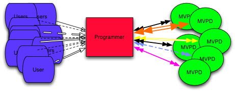
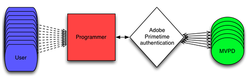

# プログラマー統合ガイド {#programmer-integration-guide}

>[!IMPORTANT]
>
> このページのコンテンツは、情報提供のみを目的として提供されています。 このAPIを使用するには、Adobeの現在のライセンスが必要です。 無断使用は認められません。

この統合ガイドは、Adobe® Pass Authenticationとの統合を計画しているコンテンツプロバイダー（プログラマー）を対象としています。

今日のデジタル環境では、視聴者はいつでもどこでもインターネットにアクセスし、保護されたコンテンツへのアクセスを要求することができます。 1回限りのイベントでの視聴を検討している場合や、TV シリーズ全体のストリーミング権を求めている場合などです。

保護されたコンテンツへのアクセス権を付与する前に、ビューアに権限があるかどうかを判断する必要があります。 主な質問は次のとおりです。

* **視聴者は、マルチチャネル ビデオ プログラミング ディストリビューター（MVPD）とのアクティブなサブスクリプションを持っていますか？**
* **そのサブスクリプションにはプログラミングが含まれていますか？**

## TV Everywhere向けAdobe Pass認証 {#adobe-pass-authentication-for-tv-everywhere}

プログラマーにとって、使用権限の決定は必ずしも簡単ではありません。 MVPDは、顧客の識別データとアクセス権限を管理する役割を果たします。 さらに複雑な問題は、プログラマーの視聴者は、それぞれ独自のシステムで動作する多種多様なMVPDを購読する可能性があります。 これらの複雑さにより、資格情報の検証は技術的に困難で、リソースを集約する必要があります。

{align="center"}

*ユーザーの使用権限がプログラマーによって直接決定されました*

Adobe Pass認証により、プログラマーとMVPD間のエンタイトルメント取引が安全に促進され、保護されたコンテンツを対象視聴者に迅速かつ容易に提供できます。

{align="center"}

*Adobe Pass認証を介したユーザー使用権限*

Adobe Pass Authenticationは、プロキシとして機能し、両当事者に安全で一貫性のあるインターフェイスを提供することで、プログラマーとMVPD間の資格フローを促進します。

プログラマーの場合、Adobe Pass Authenticationは&#x200B;**Standard**&#x200B;または&#x200B;**Premium**&#x200B;層の一部としてAPIを提供します。

* 標準のAdobe Pass認証API:
  * [REST API DCR](/help/authentication/integration-guide-programmers/rest-apis/rest-api-dcr/dynamic-client-registration-overview.md)
  * [REST API V2](/help/authentication/integration-guide-programmers/rest-apis/rest-api-v2/apis/rest-api-v2-apis-overview.md)

* プレミアム Adobe Pass認証API:
  * [Temp Pass APIのリセット](/help/authentication/integration-guide-programmers/features-premium/temporary-access/temp-pass-feature.md#reset-tempass-api-access)
    * [TempPass機能](/help/authentication/integration-guide-programmers/features-premium/temporary-access/temp-pass-feature.md)
  * [劣化API](/help/authentication/integration-guide-programmers/features-premium/degraded-access/degradation-feature.md#degradation-api-access)
    * [デグラデーション機能](/help/authentication/integration-guide-programmers/features-premium/degraded-access/degradation-feature.md)
  * [使用権限サービス監視API](/help/authentication/integration-guide-programmers/features-premium/esm/entitlement-service-monitoring-api.md)

### ユースケース {#use-cases}

この節では、Adobe Pass Authenticationでサポートされるプログラマー統合のユースケースの概要を説明します。

* 単一チャネルネットワークを備えたプログラマー（TVE）アプリケーション

  これにより、プログラマーは、TVE アプリケーション内の単一ブランドのチャネルネットワークからコンテンツへのアクセスを視聴者に提供することができます。

* 複数のチャネルネットワークを持つプログラマー（TVE）アプリケーション

  これにより、1つのTVE アプリケーション内で複数のチャネル ネットワークからコンテンツにアクセスする機能を視聴者に提供できます。

* 特別なイベントのためのプログラマー（TVE）アプリケーション

  これにより、通常のチャンネルのようにMVPDの使用権限データベースにあるリソースではない可能性のある特別なイベントのコンテンツにアクセスできるようになります。

| **フェーズ** | **優先度** | **ユースケース** | **ドキュメント** |
|----------------------|--------------|-------------------------------------------------------------------------|----------------------------------------------------------------------------------------------------------------------------------------------------------------------------------|
| **認証** | **高** | 認証 | 詳しくは、[認証フェーズ &#x200B;](#authentication-phase) セクションで集計されたドキュメントを参照してください。 |
|                      | **高** | ホームベース認証（HBA） | 詳細については、[&#x200B; ホームベースの認証](/help/authentication/integration-guide-programmers/features-standard/hba-access/home-based-authentication.md)を参照してください。 |
|                      | **高** | シングルサインオン（SSO） | 詳細については、「[&#x200B; シングルサインオン （SSO） &#x200B;](#sso)」セクションで集計されたドキュメントを参照してください。 |
|                      | **高** | MVPDを選択 | 詳しくは、[設定フェーズ &#x200B;](#configuration-phase) セクションで集計されたドキュメントを参照してください。 |
|                      | **Medium** | MVPDにログインします | MVPDが、デフォルトの言語設定のサポートを含め、プログラマーまたはサービスプロバイダーに固有のブランディングをログインページに提供できるようにします。 |
|                      | **高** | プラットフォームごとのTime-To-Live （TTL）値の設定 | 詳しくは、[TVE ダッシュボード統合ユーザーガイド &#x200B;](/help/authentication/user-guide-tve-dashboard/tve-dashboard-integrations.md#most-used-flows)を参照してください。 |
| **事前認証** | **低** | 事前認証（プリフライト認証） | 詳しくは、[事前認証フェーズ &#x200B;](#preauthorization-phase) セクションで集計されたドキュメントを参照してください。 |
|                      | **Medium** | 強化されたエラーコード | 詳しくは、[強化エラーコード &#x200B;](/help/authentication/integration-guide-programmers/features-standard/error-reporting/enhanced-error-codes.md)を参照してください。 |
| **認証** | **高** | 認証 | 詳しくは、[認証フェーズ &#x200B;](#authorization-phase) セクションで集計されたドキュメントを参照してください。 |
|                      | **高** | 個別のチャネル認証 | ユーザーが1つのTVE アプリケーション内で複数のチャネル ネットワークからコンテンツにアクセスできるようにします。 プログラマーは、チャンネル固有の認証呼び出しを行って、使用権限を検証できます。 |
|                      | **低** | アセットレベルの認証 | MVPDが、承認時に個々のコンテンツアセットの詳細な分析を収集できるようにします。 |
|                      | **Medium** | 強化されたエラーコード | 詳しくは、[強化エラーコード &#x200B;](/help/authentication/integration-guide-programmers/features-standard/error-reporting/enhanced-error-codes.md)を参照してください。 |
|                      | **高** | プログラマーFederated Player - ページレベルの承認付き | 詳しくは、[&#x200B; メディアトークン &#x200B;](/help/authentication/integration-guide-programmers/features-standard/entitlements/media-tokens.md)を参照してください。 |
|                      | **Medium** | プログラマーFederated Player – 内部プレイヤー認証を使用 | 詳しくは、[&#x200B; メディアトークン &#x200B;](/help/authentication/integration-guide-programmers/features-standard/entitlements/media-tokens.md)を参照してください。 |
|                      | **高** | 同時配信プレーヤー – ページレベルの認証を使用してMVPD ポータルでホスト | 詳しくは、[&#x200B; メディアトークン &#x200B;](/help/authentication/integration-guide-programmers/features-standard/entitlements/media-tokens.md)を参照してください。 |
|                      | **低** | ペアレンタルコントロール – 承認要求のコンテンツレーティング | アセットレベルの認証に役立つMVPDへの認証リクエストの一部として、コンテンツレーティングをプログラマーに含めることができます。 |
|                      | **低** | ペアレンタルコントロール – ユーザー属性に基づくコンテンツフィルタリング | プログラマがユーザーに許可されている最大コンテンツレーティングを確認し、それに応じて利用可能なコンテンツをフィルタリングできるようにします。 |
| **ログアウト** | **Medium** | ログアウト | 詳細については、「[&#x200B; ログアウトフェーズ &#x200B;](#logout-phase)」セクションで集計されたドキュメントを参照してください。 |

## 使用権限のフロー {#entitlement-flow}

エンタイトルメントフローは、保護されたコンテンツをストリーミングするためにプログラマー（TVE）アプリケーションが完了する必要がある一連の手順です。 フローは次のフェーズで構成されます。

* [登録フェーズ](#registration-phase)
* [設定フェーズ](#configuration-phase)
* [認証フェーズ](#authentication-phase)
* [（オプション）事前認証フェーズ](#preauthorization-phase)
* [承認フェーズ](#authorization-phase)
* [ログアウトフェーズ](#logout-phase)

ユーザーがプログラマー（TVE）アプリケーションに初めてアクセスすると、エンタイトルメントフローは概説されたシーケンスに従います。 ただし、その後の訪問では、登録または認証のステータスと該当する視聴ポリシーに基づいて、アプリケーションが特定の手順をバイパスする場合があります。

エンタイトルメントフローとそのフェーズについて詳しくは、このドキュメントを引き続き読み、付随するクッキーブックガイドを参照して追加のインサイトを得てください。

* [REST API V2 クックブック （クライアント間）](/help/authentication/integration-guide-programmers/rest-apis/rest-api-v2/cookbooks/rest-api-v2-cookbook-client-server.md)
* [REST API V2 クックブック （サーバー間）](/help/authentication/integration-guide-programmers/rest-apis/rest-api-v2/cookbooks/rest-api-v2-cookbook-server-server.md)

>[!NOTE]
>
> このドキュメントでは、プログラマ（TVE）アプリケーションを使用して、様々なプラットフォーム（ブラウザー、モバイルデバイス、テレビ接続デバイスなど）で実行されるアプリケーションの種類をまとめて示します。 Adobe Pass Authenticationによるサポート。

### 登録フェーズ {#registration-phase}

登録フェーズの目的は、[Dynamic Client Registration （DCR） &#x200B;](/help/authentication/integration-guide-programmers/rest-apis/rest-api-dcr/dynamic-client-registration-overview.md) プロセスを通じて、Adobe Pass Authenticationに対してクライアントアプリケーションを登録することです。

動的クライアント登録（DCR）プロセスでは、クライアントアプリケーションが登録フェーズの最終目標として、1組のクライアント資格情報を取得し、アクセストークンを取得する必要があります。

**API**

* [クライアント資格情報の取得](/help/authentication/integration-guide-programmers/rest-apis/rest-api-dcr/apis/dynamic-client-registration-apis-retrieve-client-credentials.md)
* [アクセストークンの取得](/help/authentication/integration-guide-programmers/rest-apis/rest-api-dcr/apis/dynamic-client-registration-apis-retrieve-access-token.md)

**フロー**

* [動的なクライアント登録フロー](/help/authentication/integration-guide-programmers/rest-apis/rest-api-dcr/flows/dynamic-client-registration-flow.md)

**FAQ**

* [登録フェーズに関するFAQ](/help/authentication/integration-guide-programmers/rest-apis/rest-api-v2/rest-api-v2-faqs.md#registration-phase-faqs-general)。

### 設定フェーズ {#configuration-phase}

設定フェーズの目的は、各MVPDのAdobe Pass Authenticationによって保存された設定の詳細と共に、クライアントアプリケーションにアクティブに統合されるMVPDのリストを提供することです。

設定フェーズは、クライアントアプリケーションがユーザーにTV プロバイダーの選択を依頼する必要がある場合に、認証フェーズの前提条件ステップとして機能します。

**API**

* [特定のサービスプロバイダーの設定の取得](/help/authentication/integration-guide-programmers/rest-apis/rest-api-v2/apis/configuration-apis/rest-api-v2-configuration-apis-retrieve-configuration-for-specific-service-provider.md)

**FAQ**

* [設定フェーズに関するFAQ](/help/authentication/integration-guide-programmers/rest-apis/rest-api-v2/rest-api-v2-faqs.md#configuration-phase-faqs-general)。

>[!TIP]
>
> TVE アプリケーションには、MVPDの選択インターフェイスが含まれている必要があります。これにより、ユーザーはTV プロバイダーを簡単に識別して選択できます。

### 認証フェーズ {#authentication-phase}

認証フェーズの目的は、クライアントアプリケーションに、MVPDでユーザーのIDを検証し、ユーザーメタデータ情報を取得する機能を提供することです。

認証フェーズは、クライアントアプリケーションでコンテンツを再生する必要がある場合に、事前認証フェーズまたは認証フェーズの前提条件ステップとして機能します。

認証が成功すると、アプリケーション、デバイス、サービスプロバイダーに関連付けられたプロファイルが生成され、ユーザーメタデータ情報も含まれます。

**高度な手順**

次の手順は、SAML統合の場合の大まかな手順の概要です。

1. **プログラマーのアプリケーション （Web サイト）の読み込み**\
   Adobe Pass Authentication [REST API V2](/help/authentication/integration-guide-programmers/rest-apis/rest-api-v2/rest-api-v2-overview.md)を統合するプログラマーのアプリケーション（web サイト）に移動します。

1. **保護されたコンテンツ要求**\
   ユーザーが保護されたコンテンツにアクセスしようとすると、プログラマーのアプリケーションに、ユーザーが選択できるMVPDのリストが表示されます。

1. **認証要求の初期化**\
   MVPDを選択すると、ユーザーはAdobe Pass認証サーバーにリダイレクトされます。 ここでは、SAML統合の場合、選択したMVPDに対する暗号化されたSAML認証リクエストが生成されます。 このリクエストは、プログラマの代理としてMVPDに送信されます。 MVPDのシステムによっては、ユーザーのブラウザーがMVPDのログインページにリダイレクトされるか、ログイン iFrameがプログラマーのアプリケーション内に埋め込まれます。

1. **MVPD ログイン**\
   MVPDはリクエストを受け入れ、リダイレクトまたはiFrameを使用してログインインターフェイスを表示します。

1. **ユーザーのログインと検証**\
   ユーザーはMVPDの資格情報でログインします。 MVPDは、ユーザーのサブスクリプションステータスを検証し、独自のHTTP セッションを確立します。

1. **Adobe Pass認証に対するMVPDの応答**\
   検証が完了すると、MVPDはSAML応答（暗号化）を生成し、Adobe Pass Authenticationに返します。

1. **プロファイル生成**\
   Adobe Pass認証は、SAML応答を検証し、キャッシュされるユーザープロファイルを生成し、ユーザーをプログラマーアプリケーション（web サイト）にリダイレクトします。

**API**

* [認証セッションの作成](/help/authentication/integration-guide-programmers/rest-apis/rest-api-v2/apis/sessions-apis/rest-api-v2-sessions-apis-create-authentication-session.md)
* [認証セッションを再開](/help/authentication/integration-guide-programmers/rest-apis/rest-api-v2/apis/sessions-apis/rest-api-v2-sessions-apis-resume-authentication-session.md)
* [認証セッションの取得](/help/authentication/integration-guide-programmers/rest-apis/rest-api-v2/apis/sessions-apis/rest-api-v2-sessions-apis-retrieve-authentication-session-information-using-code.md)
* [ユーザーエージェントで認証を実行する](/help/authentication/integration-guide-programmers/rest-apis/rest-api-v2/apis/sessions-apis/rest-api-v2-sessions-apis-perform-authentication-in-user-agent.md)
* [プロファイルの取得](/help/authentication/integration-guide-programmers/rest-apis/rest-api-v2/apis/profiles-apis/rest-api-v2-profiles-apis-retrieve-profiles.md)
* [特定のmvpdのプロファイルの取得](/help/authentication/integration-guide-programmers/rest-apis/rest-api-v2/apis/profiles-apis/rest-api-v2-profiles-apis-retrieve-profile-for-specific-mvpd.md)
* [特定のコードのプロファイルの取得](/help/authentication/integration-guide-programmers/rest-apis/rest-api-v2/apis/profiles-apis/rest-api-v2-profiles-apis-retrieve-profile-for-specific-code.md)

**フロー**

* [プライマリアプリケーション内で実行される基本認証フロー](/help/authentication/integration-guide-programmers/rest-apis/rest-api-v2/flows/basic-access-flows/rest-api-v2-basic-authentication-primary-application-flow.md)
* [セカンダリアプリケーション内で実行される基本認証フロー](/help/authentication/integration-guide-programmers/rest-apis/rest-api-v2/flows/basic-access-flows/rest-api-v2-basic-authentication-secondary-application-flow.md)
* [プライマリアプリケーション内で実行される基本プロファイルフロー](/help/authentication/integration-guide-programmers/rest-apis/rest-api-v2/flows/basic-access-flows/rest-api-v2-basic-profiles-primary-application-flow.md)
* [セカンダリアプリケーション内で実行される基本的なプロファイルフロー](/help/authentication/integration-guide-programmers/rest-apis/rest-api-v2/flows/basic-access-flows/rest-api-v2-basic-profiles-secondary-application-flow.md)

**FAQ**

* [認証フェーズに関するFAQ](/help/authentication/integration-guide-programmers/rest-apis/rest-api-v2/rest-api-v2-faqs.md#authentication-phase-faqs-general)

>[!TIP]
>
> 例えば、保護されたコンテンツのアクセシビリティを示すために、MVPDのロゴを「ロック」または「ロック解除」アイコンと一緒に表示することで、ユーザーの認証ステータスを明確に伝える必要があります。

#### シングルサインオン（SSO） {#single-sign-on}

**API**

* [パートナー認証リクエストの取得](/help/authentication/integration-guide-programmers/rest-apis/rest-api-v2/apis/partner-single-sign-on-apis/rest-api-v2-partner-single-sign-on-apis-retrieve-partner-authentication-request.md)
* [パートナー認証応答を使用したプロファイルの作成と取得](/help/authentication/integration-guide-programmers/rest-apis/rest-api-v2/apis/partner-single-sign-on-apis/rest-api-v2-partner-single-sign-on-apis-retrieve-profile-using-partner-authentication-response.md)

**フロー**

* [パートナーフローを使用したシングルサインオン](/help/authentication/integration-guide-programmers/rest-apis/rest-api-v2/flows/single-sign-on-access-flows/rest-api-v2-single-sign-on-partner-flows.md)
* [プラットフォーム ID フローを使用したシングルサインオン](/help/authentication/integration-guide-programmers/rest-apis/rest-api-v2/flows/single-sign-on-access-flows/rest-api-v2-single-sign-on-platform-identity-flows.md)
* [サービストークンのフローを使用したシングルサインオン](/help/authentication/integration-guide-programmers/rest-apis/rest-api-v2/flows/single-sign-on-access-flows/rest-api-v2-single-sign-on-service-token-flows.md)

### （オプション）事前認証フェーズ {#preauthorization-phase}

事前認証フェーズの目的は、クライアントアプリケーションに、ユーザーがアクセスする権限を持つリソースのサブセットをカタログから提示する機能を提供することです。

事前認証フェーズでは、ユーザーが初めてクライアントアプリケーションを開いたり、新しいセクションに移動したりすると、ユーザーエクスペリエンスが向上します。

**API**

* [事前認証の決定の取得](/help/authentication/integration-guide-programmers/rest-apis/rest-api-v2/apis/decisions-apis/rest-api-v2-decisions-apis-retrieve-preauthorization-decisions-using-specific-mvpd.md)

**フロー**

* [プライマリアプリケーション内で実行される基本的な事前認証フロー](/help/authentication/integration-guide-programmers/rest-apis/rest-api-v2/flows/basic-access-flows/rest-api-v2-basic-preauthorization-primary-application-flow.md)

**FAQ**

* [事前認証フェーズに関するFAQ](/help/authentication/integration-guide-programmers/rest-apis/rest-api-v2/rest-api-v2-faqs.md#preauthorization-phase-faqs-general)

>[!TIP]
>
> TVE アプリケーションは、制限付きコンテンツの「ロック済み」アイコンや承認済みコンテンツの「ロック解除」アイコンなどの視覚的指標を使用して、制限付きコンテンツと承認済みコンテンツを明確に区別する必要があります。

### 承認フェーズ {#authorization-phase}

認証フェーズの目的は、MVPDでユーザーの権利を検証した後、クライアントアプリケーションにユーザーがリクエストしたリソースを再生する機能を提供することです。

認証が成功すると、決定が生成され、セキュリティ目的でプログラマー（TVE）アプリケーションに提供されるメディアトークンも含まれます。

**高度な手順**

次の手順は、大まかな手順の概要を示しています。

1. **リソース Idの処理**\
   保護されたコンテンツは、[&#x200B; リソース識別子](/help/authentication/integration-guide-programmers/features-standard/entitlements/decisions.md#resource-identifier)によって識別されます。これは、単純な文字列または複雑な構造である可能性があります。 このIDは、プログラマとMVPDによって事前に定義され、合意されています。 プログラマーのアプリケーションは、リソース IDをAdobe Pass Authentication [REST API V2](/help/authentication/integration-guide-programmers/rest-apis/rest-api-v2/rest-api-v2-overview.md)に送信します。

1. **MVPD認証チェック**\
   Adobe Pass Authentication Serverは、標準化されたプロトコルを使用してMVPDの認証エンドポイントと通信します。

1. **Adobe Pass認証に対するMVPDの応答**\
   検証が完了すると、MVPDは、ユーザーがコンテンツにアクセスする権限を持っているかどうかを確認し、Adobe Pass Authenticationに返信を送信します。

1. **決定およびメディアトークンの生成**\
   Adobe Pass認証は、応答を検証し、キャッシュされる[decision](/help/authentication/integration-guide-programmers/features-standard/entitlements/decisions.md)を生成し、メディアトークンを含む決定をプログラマーのアプリケーション（web サイト）に返します。

1. **コンテンツアクセスの確認**\
   プログラマーのアプリケーションは、[Media Token Verifier](/help/authentication/integration-guide-programmers/features-standard/entitlements/media-tokens.md#media-token-verifier)を使用して、正しいユーザーが正しいコンテンツにアクセスしていることを確認します。 検証が完了すると、保護されたコンテンツを表示するためのアクセス権がユーザーに付与されます。

**API**

* [認証の決定の取得](/help/authentication/integration-guide-programmers/rest-apis/rest-api-v2/apis/decisions-apis/rest-api-v2-decisions-apis-retrieve-authorization-decisions-using-specific-mvpd.md)

**フロー**

* [プライマリアプリケーション内で実行される基本的な認証フロー](/help/authentication/integration-guide-programmers/rest-apis/rest-api-v2/flows/basic-access-flows/rest-api-v2-basic-authorization-primary-application-flow.md)

**FAQ**

* [承認フェーズに関するFAQ](/help/authentication/integration-guide-programmers/rest-apis/rest-api-v2/rest-api-v2-faqs.md#authorization-phase-faqs-general)

>[!TIP]
>
> TVE アプリケーションは、制限付きコンテンツの「ロック済み」アイコンや承認済みコンテンツの「ロック解除」アイコンなどの視覚的指標を使用して、制限付きコンテンツと承認済みコンテンツを明確に区別する必要があります。

### ログアウトフェーズ {#logout-phase}

ログアウトフェーズの目的は、ユーザーリクエストに応じて、Adobe Pass認証内でユーザーの認証プロファイルを終了する機能をクライアントアプリケーションに提供することです。

**API**

* [特定のmvpdのログアウトを開始](/help/authentication/integration-guide-programmers/rest-apis/rest-api-v2/apis/logout-apis/rest-api-v2-logout-apis-initiate-logout-for-specific-mvpd.md)

**フロー**

* [プライマリアプリケーション内で実行される基本的なログアウトフロー](/help/authentication/integration-guide-programmers/rest-apis/rest-api-v2/flows/basic-access-flows/rest-api-v2-basic-logout-primary-application-flow.md)

**FAQ**

* [ログアウトフェーズのFAQ](/help/authentication/integration-guide-programmers/rest-apis/rest-api-v2/rest-api-v2-faqs.md#logout-phase-faqs-general)

#### シングルログアウト（SLO） {#single-logout}

**フロー**

* [単一ログアウトフロー](/help/authentication/integration-guide-programmers/rest-apis/rest-api-v2/flows/single-sign-on-access-flows/rest-api-v2-single-sign-on-logout-flow.md)

## 使用権限について {#understanding-entitlements}

Adobe Passの認証ソリューションでは、認証ワークフローと承認ワークフローが正常に完了したときに生成される、特定のデータであるエンタイトルメントの作成を中心に展開します。 これらの使用権限は、保護されたコンテンツへのアクセスを許可しますが、有効期間は限られています。 使用権限が期限切れになると、認証または承認プロセスを再度開始して更新する必要があります。

使用権限について詳しくは、次のドキュメントを参照してください。

* **プロファイル**

  認証に成功すると、Adobe Pass Authenticationは、リクエスト側のアプリケーション、デバイス、サービスプロバイダーの識別子（依頼者識別子）に関連付けられた認証済みプロファイル（「長期間有効」）を作成します。

* **[ユーザーメタデータ](/help/authentication/integration-guide-programmers/features-standard/entitlements/user-metadata.md)**

  認証が成功すると（場合によっては認証後も）、Adobe Pass AuthenticationはMVPDからユーザーメタデータを受け取り、リクエスト側のアプリケーションに公開できます。

* **[決定](/help/authentication/integration-guide-programmers/features-standard/entitlements/decisions.md)**

  認証が成功すると、Adobe Pass Authenticationは、リクエスト側のアプリケーション、デバイス、サービスプロバイダー識別子（依頼者識別子）および特定の保護されたリソース（リソース識別子）に関連付けられた認証決定（「長期間有効」）を作成します。

* **[メディアトークン](/help/authentication/integration-guide-programmers/features-standard/entitlements/media-tokens.md)**

  認証が成功すると、Adobe Pass Authenticationは、成功した再生リクエストに関連付けられたメディアトークン（「短期間有効」）を作成し、不正を軽減するための業界のベストプラクティス（ストリームリッピングなど）をサポートします。

プロファイルと決定の有効期間（「TTL」）値は、プログラマーと有料テレビ事業者の間の合意に基づいて設定され、関係者全員に最もサービスを提供する価値に同意します。
