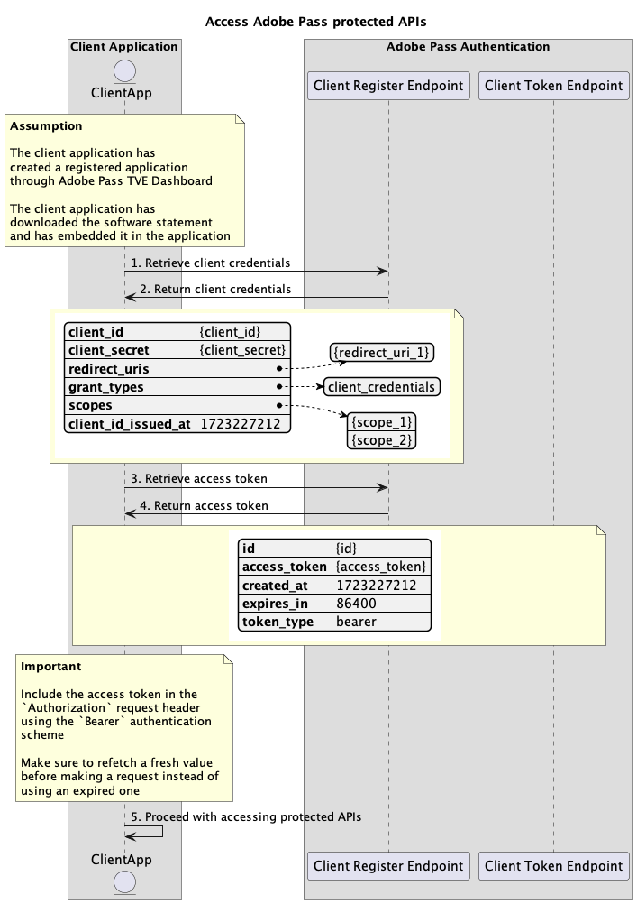

# 動的なクライアント登録フロー {#dynamic-client-registration-flow}

>[!IMPORTANT]
>
> このページのコンテンツは、情報提供のみを目的として提供されています。 このAPIを使用するには、Adobeの現在のライセンスが必要です。 無断使用は認められません。

>[!IMPORTANT]
>
> 動的クライアント登録APIの実装は、[ スロットル メカニズム ](/help/authentication/integration-guide-programmers/throttling-mechanism.md)のドキュメントによって制限されています。

## Adobe Passで保護されたAPIへのアクセス {#access-adobe-pass-protected-apis}

### 前提条件 {#prerequisites-access-adobe-pass-protected-apis}

Adobe Passで保護されたAPIにアクセスする前に、次の前提条件が満たされていることを確認します。

* クライアント担当者は、[登録アプリケーションの管理](../dynamic-client-registration-overview.md#manage-registered-applications) セクションの説明に従って、登録アプリケーションを作成する必要があります。
* クライアントの担当者は、[ ソフトウェアステートメントの管理](../dynamic-client-registration-overview.md#manage-software-statements) セクションの説明に従って、ソフトウェアステートメントをダウンロードして埋め込む必要があります。

>[!IMPORTANT]
>
> Adobe Pass Authentication SDKは、クライアントアプリケーションの代理として、クライアント資格情報とアクセストークンを取得および更新する責任があります。
> 
> その他のすべてのAdobe Passで保護されているAPIの場合、クライアントアプリケーションは以下のワークフローに従う必要があります。

### ワークフロー {#workflow-access-adobe-pass-protected-apis}

次の図に示すように、指定された手順に従って、Adobe Passで保護されたAPIにアクセスします。

*Adobe Passで保護されたAPIへのアクセス*

1. **クライアント資格情報の取得：** クライアント アプリケーションは、クライアント登録エンドポイントを呼び出して、クライアント資格情報を取得するために必要なすべてのデータを収集します。

   >[!IMPORTANT]
   >
   > 詳しくは、[ クライアント資格情報の取得](../apis/dynamic-client-registration-apis-retrieve-client-credentials.md#request) API ドキュメントを参照してください。
   >
   > * `software_statement`など、すべての&#x200B;_必須_ パラメーター
   > * `Content-Type`、`X-Device-Info`など、_必須_ ヘッダーすべて
   > * すべての&#x200B;_optional_ パラメーターとヘッダー

1. **クライアント資格情報を返します：** クライアント登録エンドポイントの応答には、受信したパラメーターとヘッダーに関連付けられたクライアント資格情報に関する情報が含まれます。

   >[!IMPORTANT]
   >
   > クライアント認証情報レスポンスで提供される情報の詳細については、[ クライアント認証情報の取得](../apis/dynamic-client-registration-apis-retrieve-client-credentials.md#success) API ドキュメントを参照してください。
   >
   >  
   >
   > クライアントレジスタは、基本的な条件が満たされていることを確認するために、リクエストデータを検証します。
   >
   > * _必須_ パラメーターとヘッダーは有効である必要があります。
   >
   >  
   >
   > 検証が失敗すると、エラー応答が生成され、[ クライアント資格情報の取得](../apis/dynamic-client-registration-apis-retrieve-client-credentials.md#error) API ドキュメントに準拠する追加情報が提供されます。

   >[!TIP]
   >
   > クライアントの資格情報はキャッシュして無期限に使用する必要があります。

1. **アクセストークンの取得：** クライアントアプリケーションは、クライアントトークンエンドポイントを呼び出して、アクセストークンを取得するために必要なすべてのデータを収集します。

   >[!IMPORTANT]
   >
   > 詳細については、[ アクセストークンの取得](../apis/dynamic-client-registration-apis-retrieve-access-token.md#request) API ドキュメントを参照してください。
   >
   > * `client_id`、`client_secret`、`grant_type`など、_必須_&#x200B;のすべてのパラメーター
   > * `Content-Type`、`X-Device-Info`など、_必須_ ヘッダーすべて
   > * すべての&#x200B;_optional_ パラメーターとヘッダー

1. **戻りアクセストークン：** クライアントトークンエンドポイントの応答には、受信したパラメーターとヘッダーに関連付けられたアクセストークンに関する情報が含まれます。

   >[!IMPORTANT]
   >
   > アクセストークン応答で提供される情報について詳しくは、[ アクセストークンの取得](../apis/dynamic-client-registration-apis-retrieve-access-token.md#success) API ドキュメントを参照してください。
   >
   >  
   >
   > クライアントトークンは、基本的な条件が満たされていることを確認するために、リクエストデータを検証します。
   >
   > * _必須_ パラメーターとヘッダーは有効である必要があります。
   >
   >  
   >
   > 検証が失敗すると、エラー応答が生成され、[ アクセストークンの取得](../apis/dynamic-client-registration-apis-retrieve-access-token.md#error) API ドキュメントに準拠する追加情報が提供されます。

   >[!TIP]
   >
   > アクセストークンはキャッシュされ、指定された期間内（24時間の有効期間など）にのみ使用する必要があります。 有効期限が切れた後、クライアントアプリケーションは新しいアクセストークンをリクエストする必要があります。

1. **保護されたAPIへのアクセスを続行：** クライアントアプリケーションは、アクセストークンを使用して他のAdobe Pass保護されたAPIにアクセスします。 クライアントアプリケーションは、`Bearer`認証方式（つまり、`Authorization: Bearer <access_token>`）を使用して、`Authorization` リクエストヘッダーにアクセストークンを含める必要があります。

   >[!IMPORTANT]
   >
   > Adobe Passで保護されたAPIは、アクセストークンを検証し、基本的な条件が満たされていることを確認します。
   >
   > * _access_ token_は有効である必要があります。
   > * _access_ token _は、有効な_ client _id_&#x200B;および_client_secret_に関連付けられている必要があります。
   > * _access_ token _は、有効な_ software_statement_に関連付ける必要があります。
   >
   >  
   >
   > 検証が失敗すると、エラー応答が生成され、[拡張エラーコード ](../../../features-standard/error-reporting/enhanced-error-codes.md)のドキュメントに準拠する追加情報が提供されます。
