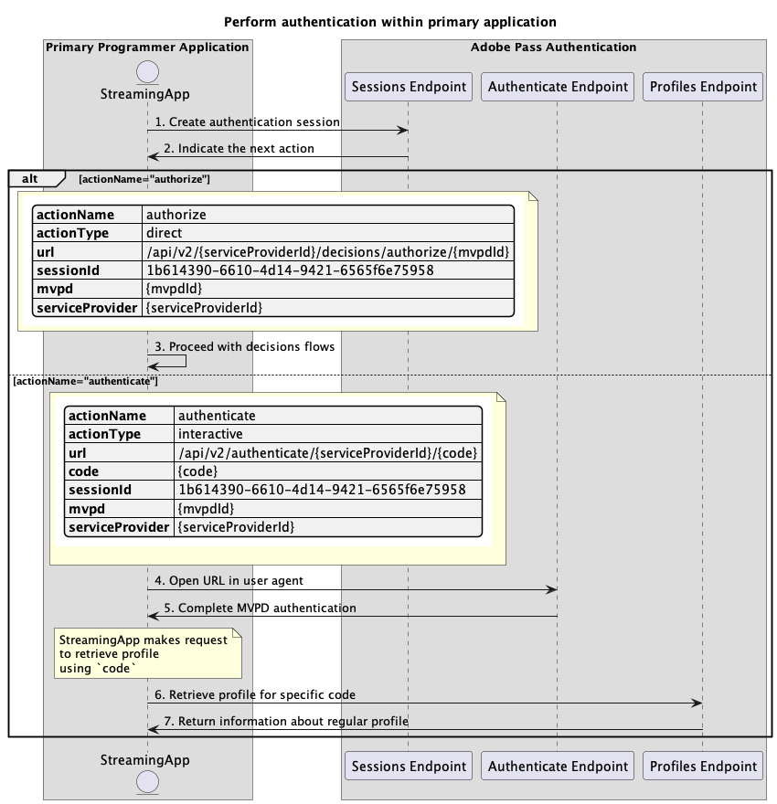

# プライマリアプリケーション内で実行される基本認証フロー {#basic-authentication-flow-performed-within-primary-application}

>[!IMPORTANT]
>
> このページのコンテンツは、情報提供のみを目的として提供されています。 このAPIを使用するには、Adobeの現在のライセンスが必要です。 無断使用は認められません。

>[!IMPORTANT]
>
> REST API V2の実装は、[&#x200B; スロットル メカニズム &#x200B;](/help/authentication/integration-guide-programmers/throttling-mechanism.md)のドキュメントによって制限されています。

>[!MORELIKETHIS]
>
> また、[REST API V2 FAQ](/help/authentication/integration-guide-programmers/rest-apis/rest-api-v2/rest-api-v2-faqs.md#authentication-phase-faqs-general)にもアクセスしてください。

Adobe Pass認証権限内の&#x200B;**認証フロー**&#x200B;により、ストリーミングアプリケーションは、ユーザーが有効なMVPD アカウントを持っていることを確認できます。 このプロセスでは、ユーザーがアクティブなMVPD アカウントを持ち、MVPD ログインページに有効なログイン資格情報を入力する必要があります。

認証フローは、次の場合に必要です。

* ユーザーが初めてアプリケーションを開いたとき。
* ユーザーの以前の認証が期限切れになった場合。
* ユーザーがMVPD アカウントからログアウトすると。
* 別のMVPDで認証する場合。

これらすべての場合において、任意のプロファイルエンドポイントを呼び出すアプリケーションは、空の応答または1つ以上のプロファイルを受信しますが、異なるMVPDに対して受信します。

**認証フロー**&#x200B;では、ユーザーエージェント （ブラウザー）がアプリケーションからAdobe Pass バックエンド、次にMVPD ログインページ、最後にアプリケーションに戻る一連の呼び出しを完了する必要があります。 このフローには、MVPDシステムへの複数のリダイレクトや、各ドメインに保存されたCookieまたはセッションの管理が含まれる場合があります。これらは、ユーザーエージェントなしでは達成や保護が困難な場合があります。

MVPDを選択し、ユーザーエージェントで選択したMVPDを使用して認証するためのユーザーインタラクションをサポートするプライマリアプリケーション（ストリーミングアプリケーション）機能に基づいて、認証シナリオは次のとおりです。

* [プライマリアプリケーション内で認証を実行](./rest-api-v2-basic-authentication-primary-application-flow.md)
* [事前に選択したmvpdを使用して、セカンダリアプリケーション内で認証を実行します](rest-api-v2-basic-authentication-secondary-application-flow.md)
* [事前に選択したmvpdを使用せずに、セカンダリアプリケーション内で認証を実行します](rest-api-v2-basic-authentication-secondary-application-flow.md)

## プライマリアプリケーション内で認証を実行 {#perform-authentication-within-primary-application}

### 前提条件 {#prerequisites-perform-authentication-within-primary-application}

プライマリアプリケーション内でユーザーインタラクションを介して認証を実行する前に、次の前提条件が満たされていることを確認します。

* ストリーミングアプリケーションでMVPDを選択する必要があります。
* 選択したMVPDでログインするには、ストリーミングアプリケーションで認証セッションを開始する必要があります。
* ストリーミングアプリケーションは、ユーザーエージェントで選択したMVPDで認証する必要があります。

>[!IMPORTANT]
>
> 前提条件
>
>  
> 
> * ストリーミングアプリケーションは、MVPDを選択するためのユーザーインタラクションをサポートしています。
> * ストリーミングアプリケーションは、ユーザーエージェントで選択したMVPDで認証するためのユーザーインタラクションをサポートしています。

### ワークフロー {#workflow-perform-authentication-completed-on-primary-application}

次の図に示すように、プライマリアプリケーション内で実行される基本認証フローを実装するには、次の手順に従います。

*プライマリアプリケーション内で認証を実行*

1. **認証セッションの作成：** ストリーミングアプリケーションは、Sessions エンドポイントを呼び出して、認証セッションを開始するために必要なすべてのデータを収集します。

   >[!IMPORTANT]
   >
   > 詳細については、[認証セッションの作成](../../apis/sessions-apis/rest-api-v2-sessions-apis-create-authentication-session.md) API ドキュメントを参照してください。
   > 
   > * `serviceProvider`、`mvpd`、`domainName`、`redirectUrl`など、_必須_&#x200B;のすべてのパラメーター
   > * `Authorization`、`AP-Device-Identifier`など、_必須_ ヘッダーすべて
   > * すべての&#x200B;_optional_ パラメーターとヘッダー
   > 
   >  
   > 
   > ストリーミングアプリケーションは、認証セッションの作成時に、1回の呼び出しで必要なすべてのパラメーターを提供する必要があります。

1. **次のアクションを示します：** セッションエンドポイントの応答には、次のアクションに関するストリーミングアプリケーションを導くために必要なデータが含まれています。

   >[!IMPORTANT]
   >
   > セッション応答で提供される情報について詳しくは、[認証セッションの作成](../../apis/sessions-apis/rest-api-v2-sessions-apis-create-authentication-session.md) API ドキュメントを参照してください。
   > 
   >  
   > 
   > セッションエンドポイントは、基本的な条件が満たされていることを確認するために、リクエストデータを検証します。
   >
   > * _必須_ パラメーターとヘッダーは有効である必要があります。
   > * 指定された`serviceProvider`と`mvpd`の統合はアクティブである必要があります。
   > 
   >  
   > 
   > 検証が失敗すると、エラー応答が生成され、[拡張エラーコード &#x200B;](../../../../features-standard/error-reporting/enhanced-error-codes.md)のドキュメントに準拠する追加情報が提供されます。

1. **決定フローで続行：** セッションエンドポイントの応答には、次のデータが含まれます。
   * `actionName`属性が「authorize」に設定されています。
   * `actionType`属性が「direct」に設定されています。

   Adobe Pass バックエンドが有効なプロファイルを識別する場合、後続の意思決定フローに使用できるプロファイルが既に存在するため、ストリーミングアプリケーションは選択したMVPDで再認証する必要がありません。

1. **ユーザーエージェントでURLを開く：** セッションエンドポイントの応答には、次のデータが含まれます。
   * MVPD ログインページ内でインタラクティブ認証を開始するために使用できる`url`。
   * `actionName`属性が「authenticate」に設定されています。
   * `actionType`属性が「インタラクティブ」に設定されています。

   Adobe Pass バックエンドが有効なプロファイルを識別しない場合、ストリーミングアプリケーションはユーザーエージェントを開いて、指定された`url`を読み込み、認証エンドポイントにリクエストを行います。 このフローには複数のリダイレクトが含まれる場合があり、最終的にはユーザーがMVPD ログインページに移動し、有効な資格情報を提供します。

1. **MVPD認証を完了：**&#x200B;認証フローが成功した場合、ユーザーエージェントのインタラクションはAdobe Pass バックエンドに通常のプロファイルを保存し、指定された`redirectUrl`に到達します。

1. **特定のコードのプロファイルの取得：** ストリーミングアプリケーションは、プロファイルエンドポイントにリクエストを送信することで、プロファイル情報を取得するために必要なすべてのデータを収集します。

   >[!IMPORTANT]
   >
   > 次の詳細については、特定のコードの[&#x200B; プロファイルの取得](../../apis/profiles-apis/rest-api-v2-profiles-apis-retrieve-profile-for-specific-code.md) API ドキュメントを参照してください。
   >
   > * `serviceProvider`、`code`など、_必須_&#x200B;のすべてのパラメーター
   > * `Authorization`、`AP-Device-Identifier`など、_必須_ ヘッダーすべて
   > * すべての&#x200B;_optional_ パラメーターとヘッダー

   >[!TIP]
   >
   > ストリーミングアプリケーションは、ユーザーエージェントが指定された`redirectUrl`に到達するのを待ち、通常のプロファイルが正常に生成され、保存されたかどうかを確認する必要があります。

1. **通常のプロファイルに関する情報を返します：** プロファイル エンドポイントの応答には、受信したパラメーターとヘッダーに関連付けられた通常のプロファイルに関する情報が含まれます。

   >[!IMPORTANT]
   >
   > プロファイル応答で提供される情報の詳細については、[特定のコードのプロファイルの取得](../../apis/profiles-apis/rest-api-v2-profiles-apis-retrieve-profile-for-specific-code.md) API ドキュメントを参照してください。
   > 
   >  
   > 
   > プロファイルエンドポイントは、基本的な条件が満たされていることを確認するために、リクエストデータを検証します。
   >
   > * _必須_ パラメーターとヘッダーは有効である必要があります。
   >
   >  
   > 
   > 検証が失敗すると、エラー応答が生成され、[拡張エラーコード &#x200B;](../../../../features-standard/error-reporting/enhanced-error-codes.md)のドキュメントに準拠する追加情報が提供されます。
