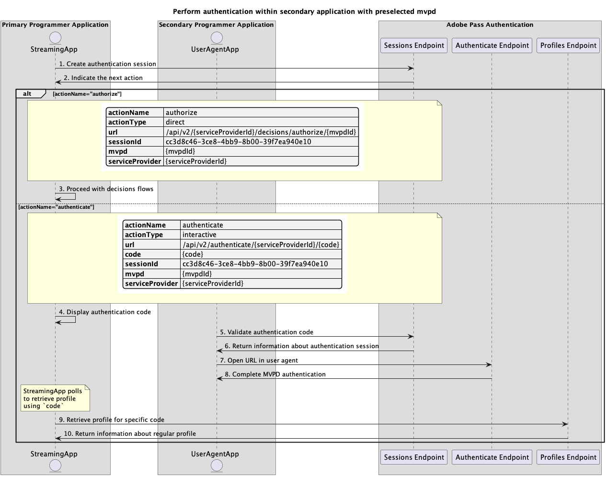
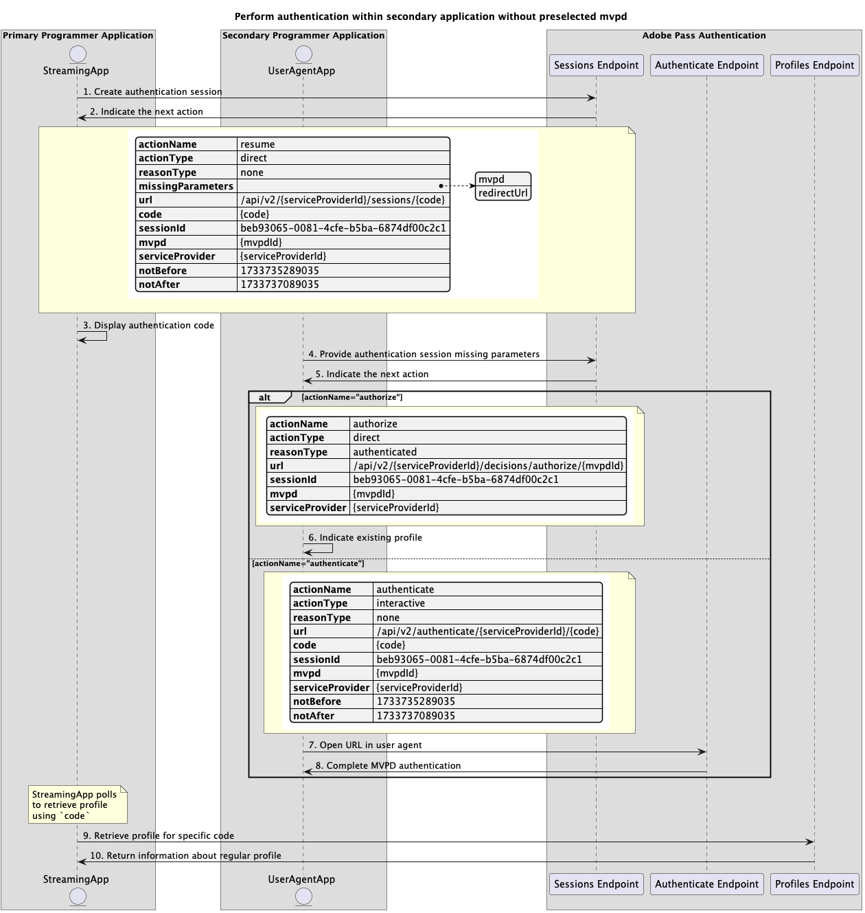

# セカンダリアプリケーション内で実行される基本認証フロー {#basic-authentication-flow-performed-within-secondary-application}

>[!IMPORTANT]
>
> このページのコンテンツは、情報提供のみを目的として提供されています。 このAPIを使用するには、Adobeの現在のライセンスが必要です。 無断使用は認められません。

>[!IMPORTANT]
>
> REST API V2の実装は、[&#x200B; スロットル メカニズム &#x200B;](/help/authentication/integration-guide-programmers/throttling-mechanism.md)のドキュメントによって制限されています。

>[!MORELIKETHIS]
>
> また、[REST API V2 FAQ](/help/authentication/integration-guide-programmers/rest-apis/rest-api-v2/rest-api-v2-faqs.md#authentication-phase-faqs-general)にもアクセスしてください。

Adobe Pass認証権限内の&#x200B;**認証フロー**&#x200B;により、ストリーミングアプリケーションは、ユーザーが有効なMVPD アカウントを持っていることを確認できます。 このプロセスでは、ユーザーがアクティブなMVPD アカウントを持ち、MVPD ログインページに有効なログイン資格情報を入力する必要があります。

認証フローは、次の場合に必要です。

* ユーザーが初めてアプリケーションを開いたとき。
* ユーザーの以前の認証が期限切れになった場合。
* ユーザーがMVPD アカウントからログアウトすると。
* 別のMVPDで認証する場合。

これらすべての場合において、任意のプロファイルエンドポイントを呼び出すアプリケーションは、空の応答または1つ以上のプロファイルを受信しますが、異なるMVPDに対して受信します。

**認証フロー**&#x200B;では、ユーザーエージェント （ブラウザー）がアプリケーションからAdobe Pass バックエンド、次にMVPD ログインページ、最後にアプリケーションに戻る一連の呼び出しを完了する必要があります。 このフローには、MVPDシステムへの複数のリダイレクトや、各ドメインに保存されたCookieまたはセッションの管理が含まれる場合があります。これらは、ユーザーエージェントなしでは達成や保護が困難な場合があります。

MVPDを選択し、ユーザーエージェントで選択したMVPDを使用して認証するためのユーザーインタラクションをサポートするプライマリアプリケーション（ストリーミングアプリケーション）機能に基づいて、認証シナリオは次のとおりです。

* [プライマリアプリケーション内で認証を実行](rest-api-v2-basic-authentication-primary-application-flow.md)
* [事前に選択したmvpdを使用して、セカンダリアプリケーション内で認証を実行します](./rest-api-v2-basic-authentication-secondary-application-flow.md)
* [事前に選択したmvpdを使用せずに、セカンダリアプリケーション内で認証を実行します](./rest-api-v2-basic-authentication-secondary-application-flow.md)

## 事前に選択したmvpdを使用して、セカンダリアプリケーション内で認証を実行します {#perform-authentication-within-secondary-application-with-preselected-mvpd}

### 前提条件 {#prerequisites-perform-authentication-within-secondary-application-with-preselected-mvpd}

プライマリアプリケーション内で認証フローを開始し、セカンダリアプリケーション内でユーザーインタラクションを通じて認証フローを終了する前に、次の前提条件が満たされていることを確認します。

* ストリーミングアプリケーションでMVPDを選択する必要があります。
* 選択したMVPDでログインするには、ストリーミングアプリケーションで認証セッションを開始する必要があります。
* セカンダリアプリケーションは、ユーザーエージェントで選択したMVPDで認証する必要があります。

>[!IMPORTANT]
>
> 前提条件
>
>  
> 
> * ストリーミングアプリケーションは、MVPDを選択するためのユーザーインタラクションをサポートしています。
> * セカンダリアプリケーション（通常はセカンダリデバイス）は、ユーザーエージェントで選択したMVPDを使用して認証するためのユーザーインタラクションをサポートします。

### ワークフロー {#workflow-perform-authentication-within-secondary-application-with-preselected-mvpd}

次の図に示すように、事前選択されたMVPDを使用してセカンダリアプリケーション内で実行される基本認証フローを実装するには、次の手順に従います。

を使用して、セカンダリアプリケーション内で認証を実行します

*事前に選択したmvpd*&#x200B;を使用して、セカンダリアプリケーション内で認証を実行します

1. **認証セッションの作成：** ストリーミングアプリケーションは、Sessions エンドポイントを呼び出して、認証セッションを開始するために必要なすべてのデータを収集します。

   >[!IMPORTANT]
   >
   > 詳細については、[認証セッションの作成](../../apis/sessions-apis/rest-api-v2-sessions-apis-create-authentication-session.md) API ドキュメントを参照してください。
   > 
   > * `serviceProvider`、`mvpd`、`domainName`、`redirectUrl`など、_必須_&#x200B;のすべてのパラメーター
   > * `Authorization`、`AP-Device-Identifier`など、_必須_ ヘッダーすべて
   > * すべての&#x200B;_optional_ パラメーターとヘッダー
   >
   >  
   > 
   > ストリーミングアプリケーションは、認証セッションの作成時に、1回の呼び出しで必要なすべてのパラメーターを提供する必要があります。

1. **次のアクションを示します：** セッションエンドポイントの応答には、次のアクションに関するストリーミングアプリケーションを導くために必要なデータが含まれています。

   >[!IMPORTANT]
   >
   > セッション応答で提供される情報について詳しくは、[認証セッションの作成](../../apis/sessions-apis/rest-api-v2-sessions-apis-create-authentication-session.md) API ドキュメントを参照してください。
   > 
   >  
   > 
   > セッションエンドポイントは、基本的な条件が満たされていることを確認するために、リクエストデータを検証します。
   >
   > * _必須_ パラメーターとヘッダーは有効である必要があります。
   > * 指定された`serviceProvider`と`mvpd`の統合はアクティブである必要があります。
   >
   >  
   > 
   > 検証が失敗すると、エラー応答が生成され、[拡張エラーコード &#x200B;](../../../../features-standard/error-reporting/enhanced-error-codes.md)のドキュメントに準拠する追加情報が提供されます。

1. **決定フローで続行：** セッションエンドポイントの応答には、次のデータが含まれます。
   * `actionName`属性が「authorize」に設定されています。
   * `actionType`属性が「direct」に設定されています。

   Adobe Pass バックエンドが有効なプロファイルを識別する場合、後続の意思決定フローに使用できるプロファイルが既に存在するため、ストリーミングアプリケーションは選択したMVPDで再認証する必要がありません。

1. **認証コードを表示：** セッション エンドポイントの応答には、次のデータが含まれています。
   * セカンダリ アプリケーション内で認証セッションを再開するために使用できる`code`。
   * `actionName`属性が「authenticate」に設定されています。
   * `actionType`属性が「インタラクティブ」に設定されています。

   Adobe Pass バックエンドが有効なプロファイルを識別しない場合、ストリーミングアプリケーションには、セカンダリアプリケーション内で認証セッションを再開するために使用できる`code`が表示されます。

1. **認証コードの検証：** セカンダリ アプリケーションは、指定された`code`のユーザーを検証し、ユーザーエージェントでMVPD認証を続行できるようにします。

   >[!IMPORTANT]
   >
   > 詳細については、[認証セッション情報の取得](../../apis/sessions-apis/rest-api-v2-sessions-apis-retrieve-authentication-session-information-using-code.md) API ドキュメントを参照してください。
   >
   > * `serviceProvider`や`code`など、_必須_&#x200B;のすべてのパラメーター
   > * `Authorization`など、すべての&#x200B;_必須_ ヘッダー
   > * すべての&#x200B;_optional_ パラメーターとヘッダー

1. **認証セッションに関する情報を返します。** セッションエンドポイントの応答には、次のデータが含まれます。
   * `existing`属性には、既に指定されている既存のパラメーターが含まれています。
   * `missing`属性には、認証フローを完了するために指定する必要があるパラメーターが含まれています。

   >[!IMPORTANT]
   >
   > セッション検証応答で提供される情報の詳細については、[認証セッション情報の取得](../../apis/sessions-apis/rest-api-v2-sessions-apis-retrieve-authentication-session-information-using-code.md) API ドキュメントを参照してください。
   >
   >  
   >
   > セッションエンドポイントは、基本的な条件が満たされていることを確認するために、リクエストデータを検証します。
   >
   > * _必須_ パラメーターとヘッダーは有効である必要があります。
   >
   >  
   >
   > 検証が失敗すると、エラー応答が生成され、[拡張エラーコード &#x200B;](../../../../features-standard/error-reporting/enhanced-error-codes.md)のドキュメントに準拠する追加情報が提供されます。

   >[!TIP]
   >
   > セカンダリ アプリケーションは、認証セッションが欠落していることを示すエラー応答が発生した場合に、使用されている`code`が無効であることをユーザーに通知し、新しい認証セッションを使用して再試行するようにユーザーに通知できます。

1. **ユーザーエージェントでURLを開く：** セカンダリアプリケーションは、自己計算`url`を読み込むためにユーザーエージェントを開き、認証エンドポイントにリクエストを行います。 このフローには複数のリダイレクトが含まれる場合があり、最終的にはユーザーがMVPD ログインページに移動し、有効な資格情報を提供します。

   >[!IMPORTANT]
   >
   > 詳細については、[&#x200B; ユーザーエージェント &#x200B;](../../apis/sessions-apis/rest-api-v2-sessions-apis-perform-authentication-in-user-agent.md) APIでの認証の実行に関するドキュメントを参照してください。
   >
   > * `serviceProvider`や`code`など、_必須_&#x200B;のすべてのパラメーター
   > * すべての&#x200B;_optional_ パラメーターとヘッダー

1. **MVPD認証を完了：**&#x200B;認証フローが成功した場合、ユーザーエージェントのインタラクションはAdobe Pass バックエンドに通常のプロファイルを保存し、指定された`redirectUrl`に到達します。

1. **特定のコードのプロファイルの取得：** ストリーミングアプリケーションは、プロファイルエンドポイントにリクエストを送信することで、プロファイル情報を取得するために必要なすべてのデータを収集します。

   >[!IMPORTANT]
   >
   > 次の詳細については、特定のコードの[&#x200B; プロファイルの取得](../../apis/profiles-apis/rest-api-v2-profiles-apis-retrieve-profile-for-specific-code.md) API ドキュメントを参照してください。
   > 
   > * `serviceProvider`や`code`など、_必須_&#x200B;のすべてのパラメーター
   > * `Authorization`、`AP-Device-Identifier`など、_必須_ ヘッダーすべて
   > * すべての&#x200B;_optional_ パラメーターとヘッダー

   >[!TIP]
   >
   > ストリーミングアプリケーションは、`code`を使用してポーリングメカニズムを実装し、通常のプロファイルが正常に生成され、保存されたかどうかを確認する必要があります。

1. **通常のプロファイルに関する情報を返します：** プロファイル エンドポイントの応答には、受信したパラメーターとヘッダーに関連付けられた通常のプロファイルに関する情報が含まれます。

   >[!IMPORTANT]
   >
   > プロファイル応答で提供される情報の詳細については、[特定のコードのプロファイルの取得](../../apis/profiles-apis/rest-api-v2-profiles-apis-retrieve-profile-for-specific-code.md) API ドキュメントを参照してください。
   > 
   >  
   > 
   > プロファイルエンドポイントは、基本的な条件が満たされていることを確認するために、リクエストデータを検証します。
   >
   > * _必須_ パラメーターとヘッダーは有効である必要があります。
   >
   >  
   > 
   > 検証が失敗すると、エラー応答が生成され、[拡張エラーコード &#x200B;](../../../../features-standard/error-reporting/enhanced-error-codes.md)のドキュメントに準拠する追加情報が提供されます。

## 事前に選択したmvpdを使用せずに、セカンダリアプリケーション内で認証を実行します {#perform-authentication-within-secondary-application-without-preselected-mvpd}

### 前提条件 {#prerequisites-perform-authentication-within-secondary-application-without-preselected-mvpd}

プライマリアプリケーション内で認証フローを開始し、セカンダリアプリケーション内でユーザーインタラクションを通じて認証フローを終了する前に、次の前提条件が満たされていることを確認します。

* ストリーミングアプリケーションは、ログインが必要なときに認証セッションを開始する必要があります。
* セカンダリアプリケーションでMVPDを選択する必要があります。
* セカンダリアプリケーションは、ユーザーエージェントで選択したMVPDで認証する必要があります。

>[!IMPORTANT]
>
> 前提条件
>
>  
> 
> * セカンダリアプリケーション（通常はセカンダリデバイス）は、MVPDを選択するためのユーザーインタラクションをサポートしています。
> * セカンダリアプリケーション（通常はセカンダリデバイス）は、ユーザーエージェントで選択したMVPDを使用して認証するためのユーザーインタラクションをサポートします。

### ワークフロー {#workflow-perform-authentication-within-secondary-application-without-preselected-mvpd}

次の図に示すように、事前選択されたMVPDを使用せずにセカンダリアプリケーション内で実行される基本認証フローを実装するには、次の手順に従います。

を使用せずに、セカンダリアプリケーション内で認証を実行する

*事前に選択したmvpd*&#x200B;を使用せずに、セカンダリアプリケーション内で認証を実行する

1. **認証セッションの作成：** ストリーミング アプリケーションは、セッション エンドポイントを呼び出して、認証セッションを開始するために必要なデータの一部を収集します。

   >[!IMPORTANT]
   >
   > 詳細については、[認証セッションの作成](../../apis/sessions-apis/rest-api-v2-sessions-apis-create-authentication-session.md) API ドキュメントを参照してください。
   >
   > * `serviceProvider`など、すべての&#x200B;_必須_ パラメーター
   > * `Authorization`、`AP-Device-Identifier`など、_必須_ ヘッダーすべて
   > * すべての&#x200B;_optional_ パラメーターとヘッダー
   >
   >  
   > 
   > ストリーミングアプリケーションは、認証セッションの作成時に、1回の呼び出しで必要なすべてのパラメーターを提供することはできません。

1. **次のアクションを示します。** セッション エンドポイントの応答には、次のアクションに関するストリーミング アプリケーションをガイドするために必要なデータが含まれています。
   * セカンダリ アプリケーション内で認証セッションを再開するために使用できる`code`。
   * `actionName`属性が「resume」に設定されています。
   * `actionType`属性が「direct」に設定されています。

   >[!IMPORTANT]
   >
   > セッション応答で提供される情報について詳しくは、[認証セッションの作成](../../apis/sessions-apis/rest-api-v2-sessions-apis-create-authentication-session.md) API ドキュメントを参照してください。
   > 
   >  
   > 
   > セッションエンドポイントは、基本的な条件が満たされていることを確認するために、リクエストデータを検証します。
   >
   > * _必須_ パラメーターとヘッダーは有効である必要があります。
   >
   >  
   > 
   > 検証が失敗すると、エラー応答が生成され、[拡張エラーコード &#x200B;](../../../../features-standard/error-reporting/enhanced-error-codes.md)のドキュメントに準拠する追加情報が提供されます。

1. **認証コードを表示：** ストリーミング アプリケーションには、セカンダリ アプリケーション内で認証セッションを再開するために使用できる`code`が表示されます。

1. **認証セッションに不足しているパラメーターを指定：** セカンダリ アプリケーションは、認証セッションを再開するために必要なすべての不足しているデータを収集し、セッション エンドポイントを呼び出します。

   >[!IMPORTANT]
   >
   > 次の詳細については、[認証セッションの再開](../../apis/sessions-apis/rest-api-v2-sessions-apis-resume-authentication-session.md) API ドキュメントを参照してください。
   >
   > * `serviceProvider`、`mvpd`、`domainName`、`redirectUrl`など、_必須_&#x200B;のすべてのパラメーター
   > * `Authorization`、`AP-Device-Identifier`など、_必須_ ヘッダーすべて
   > * すべての&#x200B;_optional_ パラメーターとヘッダー

1. **次のアクションを示します：** セッションエンドポイントの応答には、次のアクションに関するストリーミングアプリケーションを導くために必要なデータが含まれています。

   >[!IMPORTANT]
   >
   > セッション応答で提供される情報について詳しくは、[認証セッションの再開](../../apis/sessions-apis/rest-api-v2-sessions-apis-resume-authentication-session.md) API ドキュメントを参照してください。
   > 
   >  
   > 
   > セッションエンドポイントは、基本的な条件が満たされていることを確認するために、リクエストデータを検証します。
   >
   > * _必須_ パラメーターとヘッダーは有効である必要があります。
   > * 指定された`serviceProvider`と`mvpd`の統合はアクティブである必要があります。
   >
   >  
   > 
   > 検証が失敗すると、エラー応答が生成され、[拡張エラーコード &#x200B;](../../../../features-standard/error-reporting/enhanced-error-codes.md)のドキュメントに準拠する追加情報が提供されます。

   >[!TIP]
   >
   > セカンダリ アプリケーションは、認証セッションが欠落していることを示すエラー応答が発生した場合に、使用されている`code`が無効であることをユーザーに通知し、新しい認証セッションを使用して再試行するようにユーザーに通知できます。

1. **既存のプロファイルを示します：** セッションエンドポイントの応答には、次のデータが含まれます。
   * `actionName`属性が「authorize」に設定されています。
   * `actionType`属性が「direct」に設定されています。

   Adobe Pass バックエンドが有効なプロファイルを識別する場合、後続の意思決定フローに使用できるプロファイルが既に存在するため、ストリーミングアプリケーションは選択したMVPDで再認証する必要がありません。

1. **ユーザーエージェントでURLを開く：** セッションエンドポイントの応答には、次のデータが含まれます。
   * MVPD ログインページ内でインタラクティブ認証を開始するために使用できる`url`。
   * `actionName`属性が「authenticate」に設定されています。
   * `actionType`属性が「インタラクティブ」に設定されています。

   Adobe Pass バックエンドが有効なプロファイルを識別しない場合、セカンダリアプリケーションはユーザーエージェントを開いて、指定された`url`を読み込み、認証エンドポイントにリクエストを行います。 このフローには複数のリダイレクトが含まれる場合があり、最終的にはユーザーがMVPD ログインページに移動し、有効な資格情報を提供します。

1. **MVPD認証を完了：**&#x200B;認証フローが成功した場合、ユーザーエージェントのインタラクションはAdobe Pass バックエンドに通常のプロファイルを保存し、指定された`redirectUrl`に到達します。

1. **特定のコードのプロファイルの取得：** ストリーミングアプリケーションは、プロファイルエンドポイントにリクエストを送信することで、プロファイル情報を取得するために必要なすべてのデータを収集します。

   >[!IMPORTANT]
   >
   > 次の詳細については、特定のコードの[&#x200B; プロファイルの取得](../../apis/profiles-apis/rest-api-v2-profiles-apis-retrieve-profile-for-specific-code.md) API ドキュメントを参照してください。
   >
   > * `serviceProvider`や`code`など、_必須_&#x200B;のすべてのパラメーター
   > * `Authorization`、`AP-Device-Identifier`など、_必須_ ヘッダーすべて
   > * すべての&#x200B;_optional_ パラメーターとヘッダー

   >[!TIP]
   >
   > ストリーミングアプリケーションは、`code`を使用してポーリングメカニズムを実装し、通常のプロファイルが正常に生成され、保存されたかどうかを確認する必要があります。

1. **通常のプロファイルに関する情報を返します：** プロファイル エンドポイントの応答には、受信したパラメーターとヘッダーに関連付けられた通常のプロファイルに関する情報が含まれます。

   >[!IMPORTANT]
   >
   > プロファイル応答で提供される情報の詳細については、[特定のコードのプロファイルの取得](../../apis/profiles-apis/rest-api-v2-profiles-apis-retrieve-profile-for-specific-code.md) API ドキュメントを参照してください。
   > 
   >  
   > 
   > プロファイルエンドポイントは、基本的な条件が満たされていることを確認するために、リクエストデータを検証します。
   >
   > * _必須_ パラメーターとヘッダーは有効である必要があります。
   >
   >  
   > 
   > 検証が失敗すると、エラー応答が生成され、[拡張エラーコード &#x200B;](../../../../features-standard/error-reporting/enhanced-error-codes.md)のドキュメントに準拠する追加情報が提供されます。
