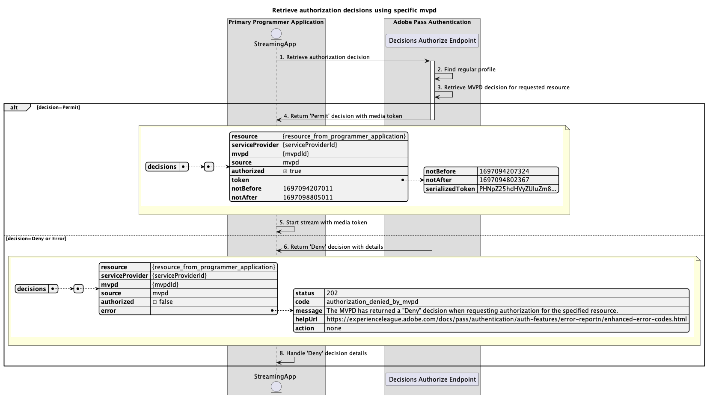

# プライマリアプリケーション内で実行される基本的な認証フロー {#basic-authorization-flow-performed-within-primary-application}

>[!IMPORTANT]
>
> このページのコンテンツは、情報提供のみを目的として提供されています。 このAPIを使用するには、Adobeの現在のライセンスが必要です。 無断使用は認められません。

>[!IMPORTANT]
>
> REST API V2の実装は、[&#x200B; スロットル メカニズム &#x200B;](/help/authentication/integration-guide-programmers/throttling-mechanism.md)のドキュメントによって制限されています。

Adobe Pass認証権限内の&#x200B;**認証フロー**&#x200B;により、ストリーミングアプリケーションは、MVPDがコンテンツのストリーミングに対するユーザーのリクエストを許可するかどうかを判断できます。 決定が`Permit`の場合、応答にはメディアトークンが含まれます。 Adobe Pass サーバーはメディアトークンに署名し、ストリーミングアプリケーションがメディアトークン検証ライブラリを使用して、ストリームがリリースされる前に信頼性を確認できるようにします。

メディアトークン検証ライブラリを使用した検証は、CDNからストリームを解放するための権限チェーンにリンクされているストリーミングアプリケーションバックエンドサービスで実行する必要があります。

## 特定のmvpdを使用して認証の決定を取得する {#retrieve-authorization-decisions-using-specific-mvpd}

### 前提条件 {#prerequisites-retrieve-authorization-decisions-using-specific-mvpd}

特定のMVPDを使用して認証に関する決定を取得する前に、次の前提条件を満たしていることを確認してください。

* ストリーミングアプリケーションには、基本的な認証フローのいずれかを使用してMVPD用に正常に作成された有効な通常プロファイルが必要です。
  * [プライマリアプリケーション内で認証を実行](rest-api-v2-basic-authentication-primary-application-flow.md)
  * [事前に選択したmvpdを使用して、セカンダリアプリケーション内で認証を実行します](rest-api-v2-basic-authentication-secondary-application-flow.md)
  * [事前に選択したmvpdを使用せずに、セカンダリアプリケーション内で認証を実行します](rest-api-v2-basic-authentication-secondary-application-flow.md)
* ストリーミングアプリケーションは、ユーザーが選択したリソースを再生する前に、認証決定を取得する必要があります。

### ワークフロー {#workflow-retrieve-authorization-decisions-using-specific-mvpd}

次の図に示すように、プライマリアプリケーション内で実行される特定のMVPDを使用して、基本的な認証フローを実装するには、次の手順に従います。

*特定のmvpdを使用して承認決定を取得*

1. **承認決定の取得：** ストリーミングアプリケーションは、「決定の承認」エンドポイントを呼び出して、特定のリソースの承認決定を取得するために必要なすべてのデータを収集します。

   >[!IMPORTANT]
   >
   > 詳しくは、特定のmvpd[&#128279;](../../apis/decisions-apis/rest-api-v2-decisions-apis-retrieve-authorization-decisions-using-specific-mvpd.md) API ドキュメントを使用した承認決定の取得を参照してください。
   >
   > * `serviceProvider`、`mvpd`、`resources`など、_必須_&#x200B;のすべてのパラメーター
   > * `Authorization`や`AP-Device-Identifier`など、_必須_ ヘッダーすべて
   > * すべての&#x200B;_optional_ パラメーターとヘッダー

1. **通常のプロファイルを検索：** Adobe Pass サーバーは、受信したパラメーターとヘッダーに基づいて有効なプロファイルを識別します。

1. **要求されたリソースに対するMVPDの決定を取得：** Adobe Pass サーバーは、MVPD認証エンドポイントを呼び出して、ストリーミングアプリケーションから受信した特定のリソースに対する`Permit`または`Deny`の決定を取得します。

1. **メディアトークンを使用して`Permit`の決定を返します：**&#x200B;決定承認エンドポイント応答には、`Permit`の決定とメディアトークンが含まれています。

   >[!IMPORTANT]
   >
   > 決定応答で提供される情報について詳しくは、[特定のmvpd](../../apis/decisions-apis/rest-api-v2-decisions-apis-retrieve-authorization-decisions-using-specific-mvpd.md) API ドキュメントを使用した承認決定の取得を参照してください。
   > 
   >  
   > 
   > 決定承認エンドポイントは、基本的な条件が満たされていることを確認するために、リクエストデータを検証します。
   >
   > * _必須_ パラメーターとヘッダーは有効である必要があります。
   > * 指定された`serviceProvider`と`mvpd`の統合はアクティブである必要があります。
   >
   >  
   > 
   > 検証が失敗すると、エラー応答が生成され、[拡張エラーコード &#x200B;](../../../../features-standard/error-reporting/enhanced-error-codes.md)のドキュメントに準拠する追加情報が提供されます。

1. **メディアトークンを使用してストリームを開始：** ストリーミングアプリケーションは、メディアトークンを使用してコンテンツを再生します。

1. **詳細を含む`Deny`の決定を返します：** 「決定を承認」エンドポイント応答には、`Deny`の決定と、[拡張エラーコード &#x200B;](../../../../features-standard/error-reporting/enhanced-error-codes.md) ドキュメントに準拠するエラーペイロードが含まれています。

   >[!IMPORTANT]
   >
   > 決定応答で提供される情報について詳しくは、[特定のmvpd](../../apis/decisions-apis/rest-api-v2-decisions-apis-retrieve-authorization-decisions-using-specific-mvpd.md) API ドキュメントを使用した承認決定の取得を参照してください。
   > 
   >  
   > 
   > 決定承認エンドポイントは、基本的な条件が満たされていることを確認するために、リクエストデータを検証します。
   >
   > * _必須_ パラメーターとヘッダーは有効である必要があります。
   > * 指定された`serviceProvider`と`mvpd`の統合はアクティブである必要があります。
   >
   >  
   > 
   > 検証が失敗すると、エラー応答が生成され、[拡張エラーコード &#x200B;](../../../../features-standard/error-reporting/enhanced-error-codes.md)のドキュメントに準拠する追加情報が提供されます。

1. **Handle `Deny`決定の詳細：** ストリーミングアプリケーションは、応答からのエラー情報を処理し、オプションでユーザーインターフェイスに特定のメッセージを表示するために使用できます。
