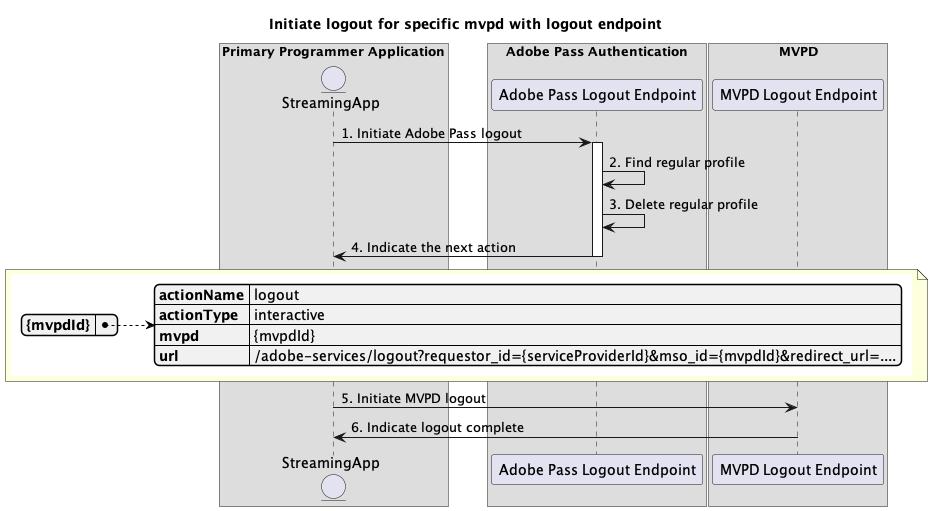
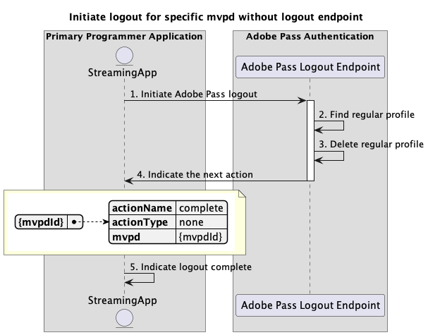

# プライマリアプリケーション内で実行される基本的なログアウトフロー {#basic-logout-flow-performed-within-primary-application}

>[!IMPORTANT]
>
> このページのコンテンツは、情報提供のみを目的として提供されています。 このAPIを使用するには、Adobeの現在のライセンスが必要です。 無断使用は認められません。

>[!IMPORTANT]
>
> REST API V2の実装は、[ スロットル メカニズム ](/help/authentication/integration-guide-programmers/throttling-mechanism.md)のドキュメントによって制限されています。

Adobe Pass認証権限内の&#x200B;**ログアウトフロー**&#x200B;では、ストリーミングアプリケーションで次の2つの主な手順を実行できます。

* Adobe Pass バックエンドに保存されている通常のプロファイルを削除します。
* ユーザーエージェント（ブラウザー）を使用してMVPD ログアウトエンドポイントに移動し、MVPD バックエンドでクリーンアップをトリガーします。

基本的なログアウトフローでは、次のシナリオについてクエリを実行できます。

* [ログアウトエンドポイントを使用して、特定のmvpdのログアウトを開始する](#initiate-logout-for-specific-mvpd-with-logout-endpoint)
* [ログアウトエンドポイントを使用せずに、特定のmvpdのログアウトを開始する](#initiate-logout-for-specific-mvpd-without-logout-endpoint)

## ログアウトエンドポイントを持つ特定のmvpdのログアウトを開始する {#initiate-logout-for-specific-mvpd-with-logout-endpoint}

### 前提条件 {#prerequisites-initiate-logout-for-specific-mvpd-with-logout-endpoint}

ログアウトエンドポイントを使用して特定のMVPDのログアウトを開始する前に、次の前提条件が満たされていることを確認します。

* ストリーミングアプリケーションには、基本的な認証フローのいずれかを使用してMVPD用に正常に作成された有効な通常プロファイルが必要です。
  * [プライマリアプリケーション内で認証を実行](rest-api-v2-basic-authentication-primary-application-flow.md)
  * [事前に選択したmvpdを使用して、セカンダリアプリケーション内で認証を実行します](rest-api-v2-basic-authentication-secondary-application-flow.md)
  * [事前に選択したmvpdを使用せずに、セカンダリアプリケーション内で認証を実行します](rest-api-v2-basic-authentication-secondary-application-flow.md)
* ストリーミングアプリケーションは、MVPDからログアウトする必要がある場合に、ログアウトフローを開始する必要があります。

>[!IMPORTANT]
>
> 前提条件
>
>  
> 
> * MVPDは、ログアウトフローをサポートし、ログアウトエンドポイントを備えています。

### ワークフロー {#workflow-initiate-logout-for-specific-mvpd-with-logout-endpoint}

次の図に示すように、プライマリアプリケーション内で実行されるログアウトエンドポイントを使用して、特定のMVPDの基本的なログアウトフローを実装するには、次の手順に従います。

を使用して特定のmvpdのログアウトを開始

*ログアウトエンドポイント*&#x200B;を使用して特定のmvpdのログアウトを開始

1. **Adobe Pass ログアウトの開始：** ストリーミング アプリケーションは、Adobe Pass ログアウトエンドポイントを呼び出して、ログアウトフローを開始するために必要なすべてのデータを収集します。

   >[!IMPORTANT]
   >
   > 詳しくは、[特定のmvpd](../../apis/logout-apis/rest-api-v2-logout-apis-initiate-logout-for-specific-mvpd.md) API ドキュメントのログアウトの開始を参照してください。
   >
   > * `serviceProvider`、`mvpd`、`redirectUrl`など、_必須_&#x200B;のすべてのパラメーター
   > * `Authorization`、`AP-Device-Identifier`など、_必須_ ヘッダーすべて
   > * すべての&#x200B;_optional_ パラメーターとヘッダー

1. **通常のプロファイルを検索：** Adobe Pass サーバーは、受信したパラメーターとヘッダーに基づいて有効なプロファイルを識別します。

1. **通常のプロファイルを削除：** Adobe Pass サーバーは、識別された通常のプロファイルをAdobe Pass バックエンドから削除します。

1. **次のアクションを示します。** Adobe Pass ログアウトエンドポイントの応答には、次のアクションに関するストリーミングアプリケーションをガイドするために必要なデータが含まれています。
   * MVPDがログアウトフローをサポートしているので、`url`属性が存在します。
   * `actionName`属性が「ログアウト」に設定されています。
   * `actionType`属性が「インタラクティブ」に設定されています。

   >[!IMPORTANT]
   >
   > ログアウト応答で提供される情報について詳しくは、特定のmvpd](../../apis/logout-apis/rest-api-v2-logout-apis-initiate-logout-for-specific-mvpd.md) API ドキュメントの[ ログアウトの開始を参照してください。
   > 
   >  
   > 
   > Adobe Pass ログアウトエンドポイントは、基本的な条件が満たされていることを確認するために、リクエストデータを検証します。
   >
   > * _必須_ パラメーターとヘッダーは有効である必要があります。
   > * 指定された`serviceProvider`と`mvpd`の統合はアクティブである必要があります。
   >
   >  
   > 
   > 検証が失敗すると、エラー応答が生成され、[拡張エラーコード ](../../../../features-standard/error-reporting/enhanced-error-codes.md)のドキュメントに準拠する追加情報が提供されます。

1. **MVPD ログアウトの開始：** ストリーミングアプリケーションは`url`を読み取り、ユーザーエージェントを使用してMVPDでログアウトフローを開始します。 フローには、MVPD システムへの複数のリダイレクトが含まれる場合があります。 その結果、MVPDは内部クリーンアップを実行し、最終的なログアウト確認をAdobe Pass バックエンドに送り返します。

1. **ログアウト完了を示します：** ストリーミングアプリケーションは、ユーザーエージェントが指定された`redirectUrl`に到達するのを待つことができ、オプションでユーザーインターフェイスに特定のメッセージを表示するためのシグナルとして使用できます。

## ログアウトエンドポイントを使用せずに、特定のmvpdのログアウトを開始する {#initiate-logout-for-specific-mvpd-without-logout-endpoint}

### 前提条件 {#prerequisites-initiate-logout-for-specific-mvpd-without-logout-endpoint}

ログアウトエンドポイントを使用せずに特定のMVPDのログアウトを開始する前に、次の前提条件を満たしていることを確認してください。

* ストリーミングアプリケーションには、基本的な認証フローのいずれかを使用してMVPD用に正常に作成された有効な通常プロファイルが必要です。
  * [プライマリアプリケーション内で認証を実行](rest-api-v2-basic-authentication-primary-application-flow.md)
  * [事前に選択したmvpdを使用して、セカンダリアプリケーション内で認証を実行します](rest-api-v2-basic-authentication-secondary-application-flow.md)
  * [事前に選択したmvpdを使用せずに、セカンダリアプリケーション内で認証を実行します](rest-api-v2-basic-authentication-secondary-application-flow.md)
* ストリーミングアプリケーションは、MVPDからログアウトする必要がある場合に、ログアウトフローを開始する必要があります。

>[!IMPORTANT]
>
> 前提条件
>
>  
> 
> * MVPDはログアウトフローをサポートしておらず、ログアウトエンドポイントはありません。

### ワークフロー {#workflow-initiate-logout-for-specific-mvpd-without-logout-endpoint}

次の図に示すように、プライマリアプリケーション内で実行されるログアウトエンドポイントを使用せずに、特定のMVPDの基本的なログアウトフローを実装するには、次の手順に従います。

*ログアウトエンドポイントを使用せずに、特定のmvpdのログアウトを開始*

1. **Adobe Pass ログアウトの開始：** ストリーミング アプリケーションは、Adobe Pass ログアウトエンドポイントを呼び出して、ログアウトフローを開始するために必要なすべてのデータを収集します。

   >[!IMPORTANT]
   >
   > 詳しくは、[特定のmvpd](../../apis/logout-apis/rest-api-v2-logout-apis-initiate-logout-for-specific-mvpd.md) API ドキュメントのログアウトの開始を参照してください。
   >
   > * `serviceProvider`、`mvpd`、`redirectUrl`など、_必須_&#x200B;のすべてのパラメーター
   > * `Authorization`、`AP-Device-Identifier`など、_必須_ ヘッダーすべて
   > * すべての&#x200B;_optional_ パラメーターとヘッダー

1. **通常のプロファイルを検索：** Adobe Pass サーバーは、受信したパラメーターとヘッダーに基づいて有効なプロファイルを識別します。

1. **正規プロファイルを削除：** Adobe Pass サーバーは、識別された正規プロファイルを削除します。

1. **次のアクションを示します。** Adobe Pass ログアウトエンドポイントの応答には、次のアクションに関するストリーミングアプリケーションをガイドするために必要なデータが含まれています。
   * MVPDがログアウトフローをサポートしていないため、`url`属性がありません。
   * `actionName`属性は「完了」に設定されています。
   * `actionType`属性は「none」に設定されています。

   >[!IMPORTANT]
   >
   > ログアウト応答で提供される情報について詳しくは、特定のmvpd](../../apis/logout-apis/rest-api-v2-logout-apis-initiate-logout-for-specific-mvpd.md) API ドキュメントの[ ログアウトの開始を参照してください。
   > 
   >  
   > 
   > Adobe Pass ログアウトエンドポイントは、基本的な条件が満たされていることを確認するために、リクエストデータを検証します。
   >
   > * _必須_ パラメーターとヘッダーは有効である必要があります。
   > * 指定された`serviceProvider`と`mvpd`の統合はアクティブである必要があります。
   >
   >  
   > 
   > 検証が失敗すると、エラー応答が生成され、[拡張エラーコード ](../../../../features-standard/error-reporting/enhanced-error-codes.md)のドキュメントに準拠する追加情報が提供されます。

1. **ログアウト完了を示します：** ストリーミングアプリケーションは応答を処理し、オプションでユーザーインターフェイスに特定のメッセージを表示するために使用できます。
