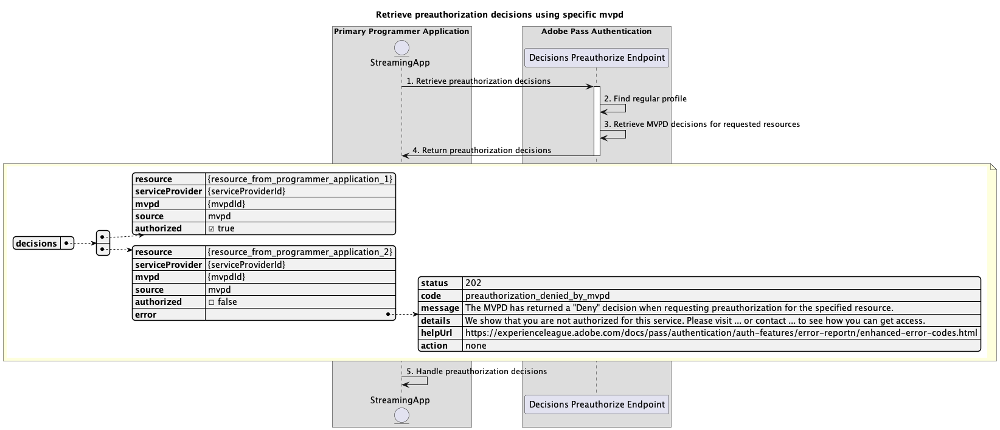

# プライマリアプリケーション内で実行される基本的な事前認証フロー {#basic-preauthorization-flow-performed-within-primary-application}

>[!IMPORTANT]
>
> このページのコンテンツは情報提供のみを目的としています。 この API を使用するには、Adobeの最新ライセンスが必要です。 無許可の使用は許可されていません。

>[!IMPORTANT]
>
> REST API V2 の実装については、[&#x200B; スロットルメカニズム &#x200B;](/help/authentication/integration-guide-programmers/throttling-mechanism.md) のドキュメントで制限されています。

Adobe Pass認証使用権内の **事前認証フロー** により、ストリーミングアプリケーションは、MVPDがリソースのリストへのユーザーのアクセスを許可または拒否できるかどうかを判断できます。 この検証により、アプリケーションが、閲覧資格のあるコンテンツに関する正確な情報をユーザーに提示できるようになります。

## 特定の mvpd を使用した事前認証決定の取得 {#retrieve-preauthorization-decisions-using-specific-mvpd}

### 前提条件 {#prerequisites-retrieve-preauthorization-decisions-using-specific-mvpd}

特定のMVPDを使用して事前認証の決定を取得する前に、次の前提条件が満たされていることを確認してください。

* ストリーミングアプリケーションには、次のいずれかの基本認証フローを使用してMVPD用に正常に作成された有効な標準プロファイルが必要です。
   * [プライマリアプリケーション内での認証の実行](rest-api-v2-basic-authentication-primary-application-flow.md)
   * [事前に選択された mvpd を使用して、セカンダリ・アプリケーション内で認証を実行](rest-api-v2-basic-authentication-secondary-application-flow.md)
   * [事前に選択された mvpd を使用せずに、セカンダリ・アプリケーション内で認証を実行](rest-api-v2-basic-authentication-secondary-application-flow.md)
* ストリーミングアプリケーションは、リソースのリストを表示する事前認証の決定と、関連するステータスを取得したいと考えています。

### ワークフロー {#workflow-retrieve-preauthorization-decisions-using-specific-mvpd}

次の図に示すように、プライマリアプリケーション内で実行される特定のMVPDを使用して基本的な事前認証フローを実装するには、以下の手順に従います。

*特定の mvpd を使用した事前認証決定の取得*

1. **事前認証決定の取得：** ストリーミングアプリケーションは、決定の事前認証エンドポイントを呼び出すことにより、リソースのリストに対する事前認証決定を取得するために必要なすべてのデータを収集します。

   >[!IMPORTANT]
   >
   > 次の項目について詳しくは、[&#x200B; 特定の mvpd を使用した事前認証の決定の取得 &#x200B;](../../apis/decisions-apis/rest-api-v2-decisions-apis-retrieve-preauthorization-decisions-using-specific-mvpd.md) API ドキュメントを参照してください。
   >
   > * `serviceProvider`、`mvpd`、`resources` など、すべての _必須_ パラメーター
   > * `Authorization` や `AP-Device-Identifier` など、すべての _必須_ ヘッダー
   > * すべての _オプション_ パラメーターおよびヘッダー

1. **標準プロファイルを検索：** Adobe Pass サーバーは、受信したパラメーターとヘッダーに基づいて有効なプロファイルを識別します。

1. **リクエストされたリソースのMVPD決定を取得：** Adobe Pass サーバーは、MVPD事前認証エンドポイントを呼び出して、ストリーミングアプリケーションから受信した各リソースに関する `Permit` 定または `Deny` 定の決定を取得します。

1. **再来訪の事前認証の決定：** 決定の事前認証エンドポイント応答には、各リソースの `Permit` または `Deny` の決定が含まれています。
   * `Permit` の決定は、リソースが再生可能であることを意味します。 事前認証フローはリソースの再生に使用できないので、応答にはメディアトークンが含まれていません。
   * `Deny` の決定は、リソースが再生可能でないことを意味します。 応答には、[&#x200B; 拡張エラーコード &#x200B;](../../../../features-standard/error-reporting/enhanced-error-codes.md) ドキュメントに従ったエラーペイロードが含まれています。

   >[!IMPORTANT]
   >
   > 決定応答で提供される情報について詳しくは、[&#x200B; 特定の mvpd を使用した事前認証の決定の取得 &#x200B;](../../apis/decisions-apis/rest-api-v2-decisions-apis-retrieve-preauthorization-decisions-using-specific-mvpd.md) API ドキュメントを参照してください。
   > 
   >  
   > 
   > 決定の事前認証エンドポイントは、基本条件が満たされていることを確認するためにリクエストデータを検証します。
   >
   > * _required_ パラメーターおよびヘッダーは有効である必要があります。
   > * 指定した `serviceProvider` と `mvpd` の統合はアクティブである必要があります。
   >
   >  
   > 
   > 検証に失敗した場合は、エラー応答が生成され、[&#x200B; 拡張エラーコード &#x200B;](../../../../features-standard/error-reporting/enhanced-error-codes.md) ドキュメントに従った追加情報が提供されます。

1. **事前認証の決定を処理：** ストリーミングアプリケーションは応答を処理し、それを使用して、オプションでユーザーインターフェイス上の各リソースの適切なステータスを表示できます。
