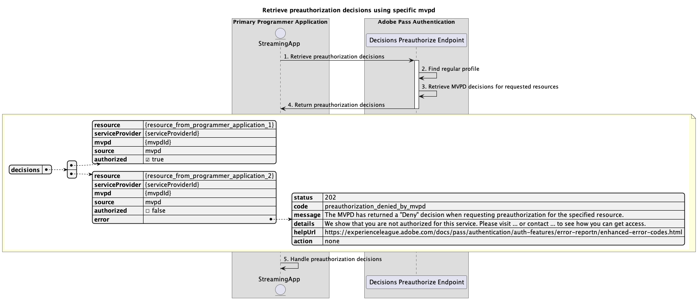

# プライマリアプリケーション内で実行される基本的な事前認証フロー {#basic-preauthorization-flow-performed-within-primary-application}

>[!IMPORTANT]
>
> このページのコンテンツは、情報提供のみを目的として提供されています。 このAPIを使用するには、Adobeの現在のライセンスが必要です。 無断使用は認められません。

>[!IMPORTANT]
>
> REST API V2の実装は、[ スロットル メカニズム ](/help/authentication/integration-guide-programmers/throttling-mechanism.md)のドキュメントによって制限されています。

Adobe Pass認証権限内の&#x200B;**事前認証フロー**&#x200B;により、ストリーミングアプリケーションは、MVPDがリソースのリストへのユーザーのアクセスを許可するか拒否するかを判断できます。 この検証により、アプリケーションは、表示する資格があるコンテンツに関する正確な情報をユーザーに提示できるようになります。

## 特定のmvpdを使用して事前承認決定を取得する {#retrieve-preauthorization-decisions-using-specific-mvpd}

### 前提条件 {#prerequisites-retrieve-preauthorization-decisions-using-specific-mvpd}

特定のMVPDを使用して事前認証の決定を取得する前に、次の前提条件を満たしていることを確認してください。

* ストリーミングアプリケーションには、基本的な認証フローのいずれかを使用してMVPD用に正常に作成された有効な通常プロファイルが必要です。
  * [プライマリアプリケーション内で認証を実行](rest-api-v2-basic-authentication-primary-application-flow.md)
  * [事前に選択したmvpdを使用して、セカンダリアプリケーション内で認証を実行します](rest-api-v2-basic-authentication-secondary-application-flow.md)
  * [事前に選択したmvpdを使用せずに、セカンダリアプリケーション内で認証を実行します](rest-api-v2-basic-authentication-secondary-application-flow.md)
* ストリーミングアプリケーションは、事前承認決定を取得して、リソースのリストと関連するステータスを表示します。

### ワークフロー {#workflow-retrieve-preauthorization-decisions-using-specific-mvpd}

次の図に示すように、プライマリアプリケーション内で実行される特定のMVPDを使用して、基本的な事前認証フローを実装するには、次の手順に従います。

*特定のmvpdを使用して事前承認決定を取得*

1. **事前認証の決定を取得：** ストリーミングアプリケーションは、「決定の事前認証エンドポイント」を呼び出して、リソースのリストに対する事前認証の決定を取得するために必要なすべてのデータを収集します。

   >[!IMPORTANT]
   >
   > 詳しくは、[特定のmvpd](../../apis/decisions-apis/rest-api-v2-decisions-apis-retrieve-preauthorization-decisions-using-specific-mvpd.md) API ドキュメントを使用した事前承認決定の取得を参照してください。
   >
   > * `serviceProvider`、`mvpd`、`resources`など、_必須_&#x200B;のすべてのパラメーター
   > * `Authorization`や`AP-Device-Identifier`など、_必須_ ヘッダーすべて
   > * すべての&#x200B;_optional_ パラメーターとヘッダー

1. **通常のプロファイルを検索：** Adobe Pass サーバーは、受信したパラメーターとヘッダーに基づいて有効なプロファイルを識別します。

1. **要求されたリソースに対するMVPDの決定を取得：** Adobe Pass サーバーは、MVPD事前認証エンドポイントを呼び出して、ストリーミングアプリケーションから受信した各リソースに対する`Permit`または`Deny`の決定を取得します。

1. **事前承認の決定を返します：** 「決定事前承認」エンドポイント応答には、各リソースに対する`Permit`または`Deny`の決定が含まれています。
   * `Permit`の決定は、リソースが再生可能であることを意味します。 応答にはメディアトークンが含まれていません。事前承認フローを使用してリソースを再生することはできません。
   * `Deny`の決定は、リソースが再生できないことを意味します。 応答には、[拡張エラーコード ](../../../../features-standard/error-reporting/enhanced-error-codes.md)のドキュメントに準拠するエラーペイロードが含まれます。

   >[!IMPORTANT]
   >
   > 決定応答で提供される情報について詳しくは、[特定のmvpd](../../apis/decisions-apis/rest-api-v2-decisions-apis-retrieve-preauthorization-decisions-using-specific-mvpd.md) API ドキュメントを使用した事前承認決定の取得を参照してください。
   > 
   >  
   > 
   > 決定事前認証エンドポイントは、基本的な条件が満たされていることを確認するために、リクエストデータを検証します。
   >
   > * _必須_ パラメーターとヘッダーは有効である必要があります。
   > * 指定された`serviceProvider`と`mvpd`の統合はアクティブである必要があります。
   >
   >  
   > 
   > 検証が失敗すると、エラー応答が生成され、[拡張エラーコード ](../../../../features-standard/error-reporting/enhanced-error-codes.md)のドキュメントに準拠する追加情報が提供されます。

1. **事前認証の決定を処理します：** ストリーミングアプリケーションは応答を処理し、オプションでユーザーインターフェイス上の各リソースの適切なステータスを表示するために使用できます。
