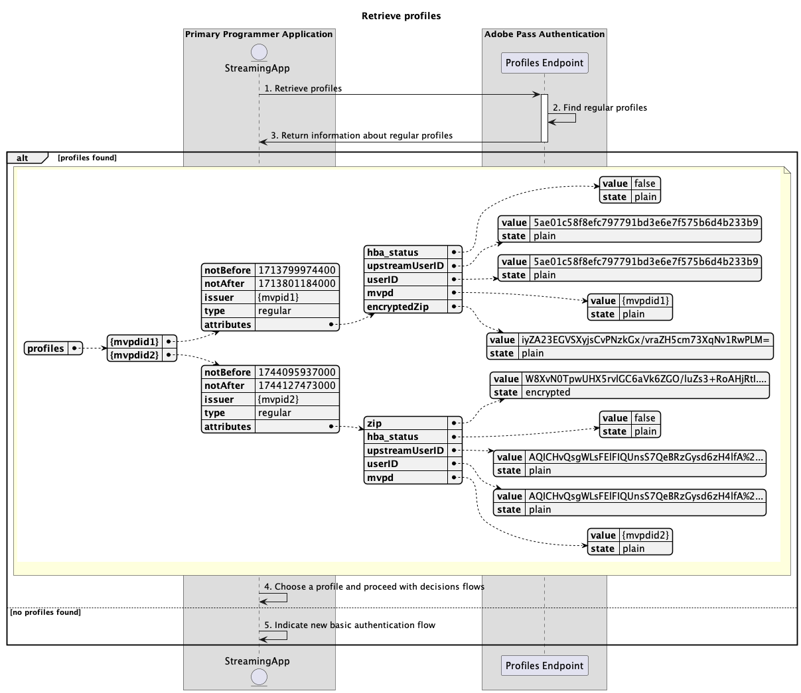
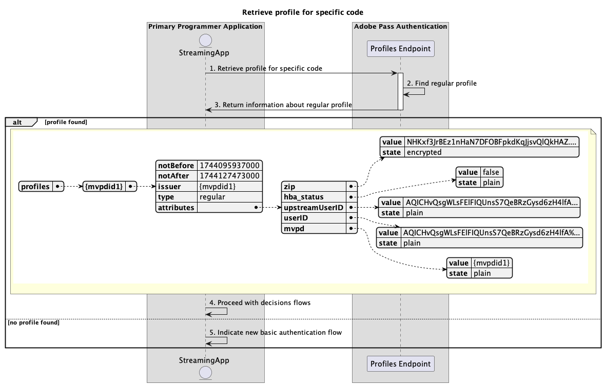

# プライマリアプリケーション内で実行される基本プロファイルフロー {#basic-profiles-flow-primary-application}

>[!IMPORTANT]
>
> このページのコンテンツは、情報提供のみを目的として提供されています。 このAPIを使用するには、Adobeの現在のライセンスが必要です。 無断使用は認められません。

>[!IMPORTANT]
>
> REST API V2の実装は、[ スロットル メカニズム ](/help/authentication/integration-guide-programmers/throttling-mechanism.md)のドキュメントによって制限されています。

>[!MORELIKETHIS]
>
> また、[REST API V2 FAQ](/help/authentication/integration-guide-programmers/rest-apis/rest-api-v2/rest-api-v2-faqs.md#authentication-phase-faqs-general)にもアクセスしてください。

Adobe Pass認証権限内の&#x200B;**プロファイルフロー**&#x200B;により、ストリーミングアプリケーションはアクティブユーザーログインに関する情報にアクセスできます。

基本プロファイルフローでは、次のシナリオについてクエリを実行できます。

* [プロファイルの取得](#retrieve-profiles)
* [特定のmvpdのプロファイルの取得](#retrieve-profile-for-specific-mvpd)
* [特定のコードのプロファイルの取得](#retrieve-profile-for-specific-code)

## プロファイルの取得 {#retrieve-profiles}

### 前提条件 {#prerequisites-retrieve-profiles}

プロファイルを取得する前に、次の前提条件が満たされていることを確認します。

* ストリーミングアプリケーションは、すべての通常のプロファイルを取得したいと考えています。

### ワークフロー {#workflow-retrieve-profiles}

次の図に示すように、プライマリアプリケーション内で実行される基本的なプロファイル取得フローを実装するには、次の手順に従います。

*プロファイルの取得*

1. **プロファイルの取得：** ストリーミングアプリケーションは、プロファイルエンドポイントにリクエストを送信して、すべてのプロファイル情報を取得するために必要なすべてのデータを収集します。

   >[!IMPORTANT]
   >
   > 詳細については、[ プロファイルの取得](../../apis/profiles-apis/rest-api-v2-profiles-apis-retrieve-profiles.md) API ドキュメントを参照してください。
   >
   > * `serviceProvider`など、すべての&#x200B;_必須_ パラメーター
   > * `Authorization`、`AP-Device-Identifier`など、_必須_ ヘッダーすべて
   > * すべての&#x200B;_optional_ パラメーターとヘッダー

1. **通常のプロファイルを検索：** Adobe Pass サーバーは、受信したパラメーターとヘッダーに基づいて、すべての有効なプロファイルを識別します。

1. **通常のプロファイルに関する情報を返します：** プロファイル エンドポイントの応答には、受信したパラメーターとヘッダーに関連付けられた見つかったプロファイルに関する情報が含まれます。

   >[!IMPORTANT]
   >
   > プロファイル応答で提供される情報について詳しくは、[ プロファイルの取得](../../apis/profiles-apis/rest-api-v2-profiles-apis-retrieve-profiles.md) API ドキュメントを参照してください。
   > 
   >  
   > 
   > プロファイルエンドポイントは、基本的な条件が満たされていることを確認するために、リクエストデータを検証します。
   >
   > * _必須_ パラメーターとヘッダーは有効である必要があります。
   >
   >  
   >
   > 検証が失敗すると、エラー応答が生成され、[拡張エラーコード ](../../../../features-standard/error-reporting/enhanced-error-codes.md)のドキュメントに準拠する追加情報が提供されます。

1. **プロファイルを選択し、決定フローに進みます：** プロファイル エンドポイントの応答にプロファイルが含まれている場合、ストリーミング アプリケーションは内部ロジック（最終的にはエンドユーザーとのやり取り）を使用して、使用可能なプロファイルの1つを選択し、その後の決定フローを続行します。

1. **新しい基本認証フローを示します：** プロファイル エンドポイントの応答にプロファイルが含まれていない場合、ストリーミング アプリケーションはユーザーに新しい基本認証フローを開始することを示します。

## 特定のmvpdのプロファイルの取得 {#retrieve-profile-for-specific-mvpd}

### 前提条件 {#prerequisites-retrieve-profile-for-specific-mvpd}

特定のMVPDのプロファイルを取得する前に、次の前提条件が満たされていることを確認します。

* 選択またはキャッシュされた`mvpd`識別子を持つストリーミングアプリケーションは、特定のMVPDの通常のプロファイルを取得したいと考えています。

### ワークフロー {#workflow-retrieve-profile-for-specific-mvpd}

次の図に示すように、プライマリアプリケーション内で実行される特定のMVPDの基本プロファイル取得フローを実装するには、次の手順に従います。

*特定のmvpdのプロファイルを取得*

1. **特定のmvpdのプロファイルの取得：** ストリーミングアプリケーションは、プロファイルエンドポイントにリクエストを送信することで、特定のMVPDのプロファイル情報を取得するために必要なすべてのデータを収集します。

   >[!IMPORTANT]
   >
   > 次の詳細については、特定のmvpd](../../apis/profiles-apis/rest-api-v2-profiles-apis-retrieve-profile-for-specific-mvpd.md) API ドキュメントの[ プロファイルの取得を参照してください。
   >
   > * `serviceProvider`や`mvpd`など、_必須_&#x200B;のすべてのパラメーター
   > * `Authorization`、`AP-Device-Identifier`など、_必須_ ヘッダーすべて
   > * すべての&#x200B;_optional_ パラメーターとヘッダー

1. **通常のプロファイルを検索：** Adobe Pass サーバーは、受信したパラメーターとヘッダーに基づいて有効なプロファイルを識別します。

1. **通常のプロファイルに関する情報を返します：** プロファイル エンドポイントの応答には、受信したパラメーターとヘッダーに関連付けられた見つかったプロファイルに関する情報が含まれます。

   >[!IMPORTANT]
   >
   > プロファイル応答で提供される情報について詳しくは、特定のmvpd](../../apis/profiles-apis/rest-api-v2-profiles-apis-retrieve-profile-for-specific-mvpd.md) API ドキュメントの[ プロファイルの取得を参照してください。
   > 
   >  
   > 
   > プロファイルエンドポイントは、基本的な条件が満たされていることを確認するために、リクエストデータを検証します。
   >
   > * _必須_ パラメーターとヘッダーは有効である必要があります。
   > * 指定された`serviceProvider`と`mvpd`の統合はアクティブである必要があります。
   >
   >  
   > 
   > 検証が失敗すると、エラー応答が生成され、[拡張エラーコード ](../../../../features-standard/error-reporting/enhanced-error-codes.md)のドキュメントに準拠する追加情報が提供されます。

1. **決定フローで進む：** プロファイル エンドポイント応答にプロファイルが含まれている場合、ストリーミング アプリケーションはプロファイル情報を使用して後続の決定フローを続行します。

1. **新しい基本認証フローを示します：** プロファイル エンドポイントの応答にプロファイルが含まれていない場合、ストリーミング アプリケーションはユーザーに新しい基本認証フローを開始することを示します。

## 特定のコードのプロファイルの取得 {#retrieve-profile-for-specific-code}

### 前提条件 {#prerequisites-retrieve-profile-for-specific-code}

特定の認証コードのプロファイルを取得する前に、次の前提条件が満たされていることを確認します。

* ストリーミングアプリケーションは、MVPDでインタラクティブ認証を実行するために使用される`code`を持ち、特定の認証コードのプロファイルを取得します。

### ワークフロー {#workflow-retrieve-profile-for-specific-code}

次の図に示すように、プライマリアプリケーション内で実行される特定の認証コードに対する基本的なプロファイル取得フローを実装するには、次の手順に従います。

*特定のコードのプロファイルを取得*

1. **特定のコードのプロファイルの取得：** ストリーミングアプリケーションは、プロファイルエンドポイントにリクエストを送信することで、特定の認証コードのプロファイル情報を取得するために必要なすべてのデータを収集します。

   >[!IMPORTANT]
   >
   > 次の詳細については、特定のコードの[ プロファイルの取得](../../apis/profiles-apis/rest-api-v2-profiles-apis-retrieve-profile-for-specific-code.md) API ドキュメントを参照してください。
   >
   > * `serviceProvider`や`code`など、すべての&#x200B;_必須_ パラメーター
   > * `Authorization`など、すべての&#x200B;_必須_ ヘッダー
   > * すべての&#x200B;_optional_ パラメーターとヘッダー

1. **通常のプロファイルを検索：** Adobe Pass サーバーは、受信したパラメーターとヘッダーに基づいて有効なプロファイルを識別します。

1. **通常のプロファイルに関する情報を返します：** プロファイル エンドポイントの応答には、受信したパラメーターとヘッダーに関連付けられた見つかったプロファイルに関する情報が含まれます。

   >[!IMPORTANT]
   >
   > プロファイル応答で提供される情報の詳細については、[特定のコードのプロファイルの取得](../../apis/profiles-apis/rest-api-v2-profiles-apis-retrieve-profile-for-specific-code.md) API ドキュメントを参照してください。
   > 
   >  
   > 
   > プロファイルエンドポイントは、基本的な条件が満たされていることを確認するために、リクエストデータを検証します。
   >
   > * _必須_ パラメーターとヘッダーは有効である必要があります。
   >
   >  
   >
   > 検証が失敗すると、エラー応答が生成され、[拡張エラーコード ](../../../../features-standard/error-reporting/enhanced-error-codes.md)のドキュメントに準拠する追加情報が提供されます。

1. **決定フローで進む：** プロファイル エンドポイント応答にプロファイルが含まれている場合、ストリーミング アプリケーションはプロファイル情報を使用して後続の決定フローを続行します。

1. **新しい基本認証フローを示します：** プロファイル エンドポイント応答にプロファイルが含まれていない場合、プライマリ アプリケーションはユーザーに新しい基本認証フローを開始することを示します。
