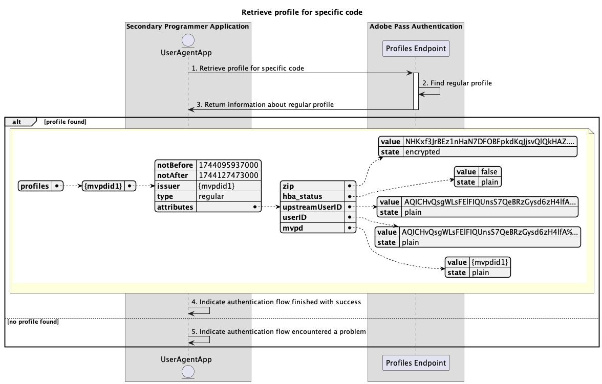

# セカンダリアプリケーション内で実行される基本的なプロファイルフロー {#basic-profiles-flow-secondary-application}

>[!IMPORTANT]
>
> このページのコンテンツは、情報提供のみを目的として提供されています。 このAPIを使用するには、Adobeの現在のライセンスが必要です。 無断使用は認められません。

>[!IMPORTANT]
>
> REST API V2の実装は、[ スロットル メカニズム ](/help/authentication/integration-guide-programmers/throttling-mechanism.md)のドキュメントによって制限されています。

>[!MORELIKETHIS]
>
> また、[REST API V2 FAQ](/help/authentication/integration-guide-programmers/rest-apis/rest-api-v2/rest-api-v2-faqs.md#authentication-phase-faqs-general)にもアクセスしてください。

Adobe Pass認証権限内の&#x200B;**プロファイルフロー**&#x200B;により、セカンダリアプリケーションはアクティブユーザーログインに関する情報にアクセスできます。

基本プロファイルフローでは、次のシナリオについてクエリを実行できます。

* [特定のコードのプロファイルの取得](#retrieve-profile-for-specific-code)

## 特定のコードのプロファイルの取得 {#retrieve-profile-for-specific-code}

### 前提条件 {#prerequisites-retrieve-profile-for-specific-code}

特定の認証コードのプロファイルを取得する前に、次の前提条件が満たされていることを確認します。

* セカンダリ アプリケーションは、MVPDとのインタラクティブ認証を実行するために使用される`code`を持ち、特定の認証コードのプロファイルを取得します。

### ワークフロー {#workflow-retrieve-profile-for-specific-code}

次の図に示すように、セカンダリアプリケーション内で実行される特定の認証コードに対する基本的なプロファイル取得フローを実装するには、次の手順に従います。

*特定のコードのプロファイルを取得*

1. **特定のコードのプロファイルの取得：** セカンダリ アプリケーションは、プロファイルエンドポイントにリクエストを送信することで、その特定の認証コードのプロファイル情報を取得するために必要なすべてのデータを収集します。

   >[!IMPORTANT]
   >
   > 次の詳細については、特定のコードの[ プロファイルの取得](../../apis/profiles-apis/rest-api-v2-profiles-apis-retrieve-profile-for-specific-code.md) API ドキュメントを参照してください。
   >
   > * `serviceProvider`や`code`など、すべての&#x200B;_必須_ パラメーター
   > * `Authorization`など、すべての&#x200B;_必須_ ヘッダー
   > * すべての&#x200B;_optional_ パラメーターとヘッダー

1. **通常のプロファイルを検索：** Adobe Pass サーバーは、受信したパラメーターとヘッダーに基づいて有効なプロファイルを識別します。

1. **通常のプロファイルに関する情報を返します：** プロファイル エンドポイントの応答には、受信したパラメーターとヘッダーに関連付けられた見つかったプロファイルに関する情報が含まれます。

   >[!IMPORTANT]
   >
   > プロファイル応答で提供される情報の詳細については、[特定のコードのプロファイルの取得](../../apis/profiles-apis/rest-api-v2-profiles-apis-retrieve-profile-for-specific-code.md) API ドキュメントを参照してください。
   > 
   >  
   > 
   > プロファイルエンドポイントは、基本的な条件が満たされていることを確認するために、リクエストデータを検証します。
   >
   > * _必須_ パラメーターとヘッダーは有効である必要があります。
   >
   >  
   > 
   > 検証が失敗すると、エラー応答が生成され、[拡張エラーコード ](../../../../features-standard/error-reporting/enhanced-error-codes.md)のドキュメントに準拠する追加情報が提供されます。

1. **成功で終了した認証フローを示します：** プロファイル エンドポイント応答にプロファイルが含まれている場合、セカンダリ アプリケーションは応答を処理し、オプションでユーザーインターフェイスに特定のメッセージを表示するために使用できます。

1. **認証フローで問題が発生したことを示します：** プロファイル エンドポイント応答にプロファイルが含まれていない場合、セカンダリ アプリケーションは応答を処理し、オプションでユーザーインターフェイスに特定のメッセージを表示するために使用できます。
