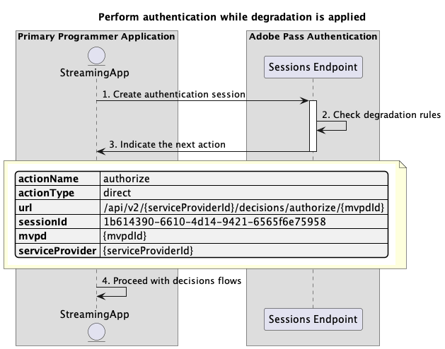
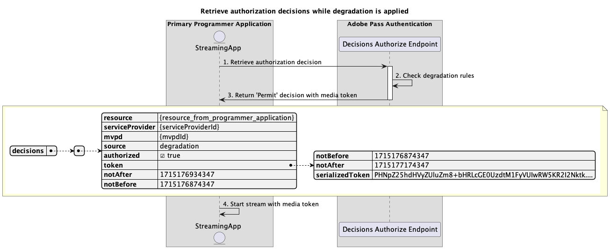
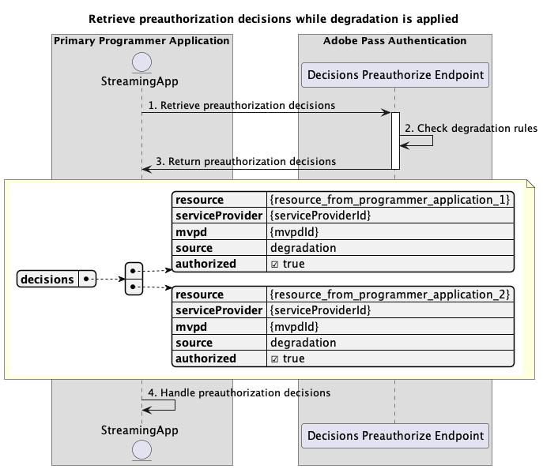
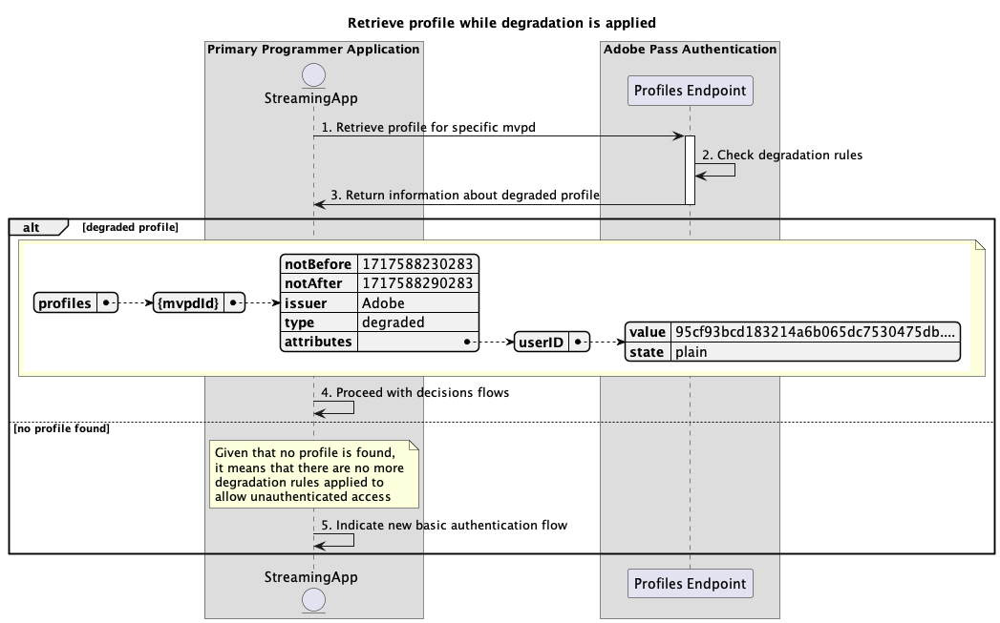

# 劣化したアクセスフロー {#degraded-access-flows}

>[!IMPORTANT]
>
> このページのコンテンツは、情報提供のみを目的として提供されています。 このAPIを使用するには、Adobeの現在のライセンスが必要です。 無断使用は認められません。

>[!IMPORTANT]
>
> REST API V2の実装は、[ スロットル メカニズム ](/help/authentication/integration-guide-programmers/throttling-mechanism.md)のドキュメントによって制限されています。

>[!MORELIKETHIS]
>
> また、[REST API V2 FAQ](/help/authentication/integration-guide-programmers/rest-apis/rest-api-v2/rest-api-v2-faqs.md#authentication-phase-faqs-general)にもアクセスしてください。

デグラデーションは、特定のMVPD認証および認証エンドポイントを一時的にバイパスします。 通常、プログラマーはこのアクションを開始しますが、デグラデーションイベントをトリガーするユーザーに関係なく、このアクションは、影響を受けるMVPDとの事前の取り決めによって異なります。

デグラデーション機能について詳しくは、[ デグラデーション ](../../../../features-premium/degraded-access/degradation-feature.md)のドキュメントを参照してください。

デグレードされたアクセスフローを使用すると、次のシナリオについてクエリを実行できます。

* [劣化が適用されている場合に認証を実行する](#perform-authentication-while-degradation-is-applied)
* [劣化の適用中に認証の決定を取得する](#retrieve-authorization-decisions-while-degradation-is-applied)
* [劣化が適用されている間に事前認証の決定を取得する](#retrieve-preauthorization-decisions-while-degradation-is-applied)
* [劣化の適用中にプロファイルを取得](#retrieve-profile-while-degradation-is-applied)

## 劣化が適用されている場合に認証を実行する {#perform-authentication-while-degradation-is-applied}

### 前提条件 {#prerequisites-perform-authentication-while-degradation-is-applied}

劣化が適用されている間に認証フローを実行する前に、次の前提条件が満たされていることを確認します。

* ストリーミングアプリケーションは、MVPDでログインする必要がある場合に、認証セッションを開始する必要があります。

>[!IMPORTANT]
> 
> 前提条件
> 
>  
> 
> * ストリーミングアプリケーションには、Adobe Pass バックエンドに保存されている特定のMVPDの有効なプロファイルがありません。
> * 指定された`serviceProvider`と`mvpd`の間の統合に適用されたAuthNAll劣化ルールがあります。

### ワークフロー {#workflow-perform-authentication-while-degradation-is-applied}

次の図に示すように、劣化が適用されている間に認証フローを実装するには、次の手順に従います。

*劣化が適用されている間に認証を実行する*

1. **認証セッションの作成：** ストリーミングアプリケーションは、Sessions エンドポイントを呼び出して、認証セッションを開始するために必要なすべてのデータを収集します。

   >[!IMPORTANT]
   >
   > 詳細については、[認証セッションの作成](../../apis/sessions-apis/rest-api-v2-sessions-apis-create-authentication-session.md) API ドキュメントを参照してください。
   > 
   > * `serviceProvider`、`mvpd`、`domainName`、`redirectUrl`など、_必須_&#x200B;のすべてのパラメーター
   > * `Authorization`や`AP-Device-Identifier`など、_必須_ ヘッダーすべて
   > * すべての&#x200B;_optional_ パラメーターとヘッダー

1. **劣化ルールを確認：** Adobe Pass サーバーは、指定された`serviceProvider`と`mvpd`の間の統合に適用されたAuthNAll劣化ルールがあるかどうかを確認します。

1. **次のアクションを示します。** セッション エンドポイントの応答には、次のアクションに関するストリーミング アプリケーションをガイドするために必要なデータが含まれています。
   * `actionName`属性が「authorize」に設定されています。
   * `actionType`属性が「direct」に設定されています。

   >[!IMPORTANT]
   >
   > セッション応答で提供される情報について詳しくは、[認証セッションの作成](../../apis/sessions-apis/rest-api-v2-sessions-apis-create-authentication-session.md) API ドキュメントを参照してください。
   > 
   >  
   > 
   > セッションエンドポイントは、基本的な条件が満たされていることを確認するために、リクエストデータを検証します。
   >
   > * _必須_ パラメーターとヘッダーは有効である必要があります。
   > * 指定された`serviceProvider`と`mvpd`の統合はアクティブである必要があります。
   >
   >  
   > 
   > 基本的な検証が失敗した場合は、エラー応答が生成され、[拡張エラーコード ](../../../../features-standard/error-reporting/enhanced-error-codes.md)のドキュメントに準拠する追加情報が提供されます。
   >
   >  
   > 
   > セッションエンドポイントは、リクエストデータを使用して、劣化したアクセス条件が満たされているかどうかを確認します。
   >
   > * 指定された`serviceProvider`と`mvpd`の間の統合には、AuthNAll劣化ルールが適用されている必要があります。
   >
   >  
   > 
   > 劣化したアクセス検証が失敗した場合、応答は基本認証フローにデフォルトで送信されます。

1. **決定フローで続行：** ストリーミングアプリケーションは、後続の決定フローで続行できます。

## 劣化の適用中に認証の決定を取得する {#retrieve-authorization-decisions-while-degradation-is-applied}

### 前提条件 {#prerequisites-retrieve-authorization-decisions-while-degradation-is-applied}

劣化が適用されている間に認証の決定を取得する前に、次の前提条件が満たされていることを確認します。

* ストリーミングアプリケーションは、ユーザーが選択したリソースを再生する前に、認証決定を取得する必要があります。

>[!IMPORTANT]
>
> 前提条件
> 
>  
> 
> * ストリーミングアプリケーションには、その特定のMVPDに対する有効なプロファイルがありません。
> * 指定された`serviceProvider`と`mvpd`の間の統合に適用されたAuthZAllまたはAuthNAll劣化ルールがあります。

### ワークフロー {#workflow-retrieve-authorization-decisions-while-degradation-is-applied}

次の図に示すように、劣化が適用されている間に認証フローを実装するには、次の手順に従います。

*劣化が適用されている間に認証の決定を取得する*

1. **承認決定の取得：** ストリーミングアプリケーションは、「決定の承認」エンドポイントを呼び出して、特定のリソースの承認決定を取得するために必要なすべてのデータを収集します。

   >[!IMPORTANT]
   > 
   > 詳しくは、特定のmvpd](../../apis/decisions-apis/rest-api-v2-decisions-apis-retrieve-authorization-decisions-using-specific-mvpd.md) API ドキュメントを使用した承認決定の取得を参照してください。[
   >
   > * `serviceProvider`、`mvpd`、`resources`など、_必須_&#x200B;のすべてのパラメーター
   > * `Authorization`や`AP-Device-Identifier`など、_必須_ ヘッダーすべて
   > * すべての&#x200B;_optional_ パラメーターとヘッダー

1. **劣化ルールを確認：** Adobe Pass サーバーは、指定された`serviceProvider`と`mvpd`の間の統合に適用されたAuthZAllまたはAuthNAll劣化ルールがあるかどうかを確認します。

1. **メディアトークンを使用して`Permit`の決定を返します：**&#x200B;決定承認エンドポイント応答には、`Permit`の決定とメディアトークンが含まれています。

   >[!IMPORTANT]
   >
   > 決定応答で提供される情報について詳しくは、[特定のmvpd](../../apis/decisions-apis/rest-api-v2-decisions-apis-retrieve-authorization-decisions-using-specific-mvpd.md) API ドキュメントを使用した承認決定の取得を参照してください。
   >
   >  
   > 
   > 決定承認エンドポイントは、基本的な条件が満たされていることを確認するために、リクエストデータを検証します。
   >
   > * _必須_ パラメーターとヘッダーは有効である必要があります。
   > * 指定された`serviceProvider`と`mvpd`の統合はアクティブである必要があります。
   >
   >  
   > 
   > 基本的な検証が失敗した場合は、エラー応答が生成され、[拡張エラーコード ](../../../../features-standard/error-reporting/enhanced-error-codes.md)のドキュメントに準拠する追加情報が提供されます。
   >
   >  
   >
   > 決定承認エンドポイントは、リクエストデータを使用して、劣化したアクセス条件が満たされているかどうかを確認します。
   >
   > * 指定された`serviceProvider`と`mvpd`の間の統合には、AuthZAllまたはAuthNAll劣化ルールが適用されている必要があります。
   >
   >  
   > 
   > 劣化したアクセス検証が失敗した場合、応答は基本的な認証フローにデフォルトで送信されます。

1. **メディアトークンを使用してストリームを開始：** ストリーミングアプリケーションは、メディアトークンを使用してコンテンツを再生します。

## 劣化が適用されている間に事前認証の決定を取得する {#retrieve-preauthorization-decisions-while-degradation-is-applied}

### 前提条件 {#prerequisites-retrieve-preauthorization-decisions-while-degradation-is-applied}

劣化が適用されている間に事前認証の決定を取得する前に、次の前提条件が満たされていることを確認します。

* ストリーミングアプリケーションは、事前承認決定を取得して、リソースのリストと関連するステータスを表示します。

>[!IMPORTANT]
>
> 前提条件
>
>  
> 
> * ストリーミングアプリケーションには、その特定のMVPDに対する有効なプロファイルがありません。
> * 指定された`serviceProvider`と`mvpd`の間の統合に適用されたAuthZAllまたはAuthNAll劣化ルールがあります。

### ワークフロー {#workflow-retrieve-preauthorization-decisions-while-degradation-is-applied}

次の図に示すように、劣化が適用されている間に事前認証フローを実装するには、次の手順に従います。

*劣化が適用されている間に事前認証の決定を取得する*

1. **事前認証の決定を取得：** ストリーミングアプリケーションは、「決定の事前認証エンドポイント」を呼び出して、リソースのリストに対する事前認証の決定を取得するために必要なすべてのデータを収集します。

   >[!IMPORTANT]
   >
   > 詳しくは、[特定のmvpd](../../apis/decisions-apis/rest-api-v2-decisions-apis-retrieve-preauthorization-decisions-using-specific-mvpd.md) API ドキュメントを使用した事前承認決定の取得を参照してください。
   >
   > * `serviceProvider`、`mvpd`、`resources`など、_必須_&#x200B;のすべてのパラメーター
   > * `Authorization`や`AP-Device-Identifier`など、_必須_ ヘッダーすべて
   > * すべての&#x200B;_optional_ パラメーターとヘッダー

1. **劣化ルールを確認：** Adobe Pass サーバーは、指定された`serviceProvider`と`mvpd`の間の統合に適用されたAuthZAllまたはAuthNAll劣化ルールがあるかどうかを確認します。

1. **事前承認の決定を返します：** エンドポイントの応答を事前承認する決定には、各リソースに対する`Permit`の決定が含まれます。

   >[!IMPORTANT]
   >
   > 決定応答で提供される情報について詳しくは、[特定のmvpd](../../apis/decisions-apis/rest-api-v2-decisions-apis-retrieve-preauthorization-decisions-using-specific-mvpd.md) API ドキュメントを使用した事前承認決定の取得を参照してください。
   >
   >  
   >
   > 決定事前認証エンドポイントは、基本的な条件が満たされていることを確認するために、リクエストデータを検証します。
   >
   > * _必須_ パラメーターとヘッダーは有効である必要があります。
   > * 指定された`serviceProvider`と`mvpd`の統合はアクティブである必要があります。
   >
   >  
   > 
   > 基本的な検証が失敗した場合は、エラー応答が生成され、[拡張エラーコード ](../../../../features-standard/error-reporting/enhanced-error-codes.md)のドキュメントに準拠する追加情報が提供されます。
   >
   >  
   >
   > 決定事前認証エンドポイントは、リクエストデータを使用して、劣化したアクセス条件が満たされているかどうかを確認します。
   >
   > * 指定された`serviceProvider`と`mvpd`の間の統合には、AuthZAllまたはAuthNAll劣化ルールが適用されている必要があります。
   >
   >  
   > 
   > 劣化したアクセス検証が失敗した場合、応答はデフォルトで基本事前認証フローに戻ります。

1. **事前認証の決定を処理します：** ストリーミングアプリケーションは応答を処理し、オプションでユーザーインターフェイス上の各リソースの適切なステータスを表示するために使用できます。

## 劣化の適用中にプロファイルを取得 {#retrieve-profile-while-degradation-is-applied}

>[!IMPORTANT]
>
> 劣化が適用されている場合、プロファイル エンドポイントクエリはオプションです。
>
>  
> 
> セッションエンドポイントの応答は、劣化が適用されている間に決定フローを続行するようにアプリケーションに指示します。 詳しくは、「[劣化が適用されている間に認証を実行する](#perform-authentication-while-degradation-is-applied)」の節を参照してください。

### 前提条件 {#prerequisites-retrieve-profile-while-degradation-is-applied}

デプロイメントが適用されている場合に、特定のMVPDのプロファイルを取得する前に、次の前提条件を満たしていることを確認してください。

* 選択またはキャッシュされた`mvpd`識別子を持つストリーミングアプリケーションは、特定のMVPDのプロファイルを取得しようとしています。

>[!IMPORTANT]
>
> 前提条件
>
>  
> 
> * ストリーミングアプリケーションには、その特定のMVPDに対する有効なプロファイルがありません。
> * 指定された`serviceProvider`と`mvpd`の間の統合に適用されたAuthNAll劣化ルールがあります。

### ワークフロー {#workflow-retrieve-profile-while-degradation-is-applied}

次の図に示すように、劣化が適用されている場合に特定のMVPDのプロファイル取得フローを実装するには、次の手順に従います。

*劣化が適用されている間にプロファイルを取得*

1. **特定のmvpdのプロファイルの取得：** ストリーミングアプリケーションは、プロファイルエンドポイントにリクエストを送信することで、特定のMVPDのプロファイル情報を取得するために必要なすべてのデータを収集します。

   >[!IMPORTANT]
   >
   > 次の詳細については、特定のmvpd](../../apis/profiles-apis/rest-api-v2-profiles-apis-retrieve-profile-for-specific-mvpd.md) API ドキュメントの[ プロファイルの取得を参照してください。
   >
   > * `serviceProvider`や`mvpd`など、すべての&#x200B;_必須_ パラメーター
   > * `Authorization`や`AP-Device-Identifier`など、_必須_ ヘッダーすべて
   > * すべての&#x200B;_optional_ パラメーターとヘッダー

1. **劣化ルールを確認：** Adobe Pass サーバーは、指定された`serviceProvider`と`mvpd`の間の統合に適用されたAuthNAll劣化ルールがあるかどうかを確認します。

1. **劣化したプロファイルに関する情報を返します：** プロファイル エンドポイントの応答には、劣化したプロファイルに関する情報が含まれており、属性`type`が「劣化」に設定されています。

   >[!IMPORTANT]
   >
   > プロファイル応答で提供される情報について詳しくは、特定のmvpd](../../apis/profiles-apis/rest-api-v2-profiles-apis-retrieve-profile-for-specific-mvpd.md) API ドキュメントの[ プロファイルの取得を参照してください。
   >
   >  
   >
   > プロファイルエンドポイントは、基本的な条件が満たされていることを確認するために、リクエストデータを検証します。
   >
   > * _必須_ パラメーターとヘッダーは有効である必要があります。
   > * 指定された`serviceProvider`と`mvpd`の統合はアクティブである必要があります。
   >
   >  
   > 
   > 基本的な検証が失敗した場合は、エラー応答が生成され、[拡張エラーコード ](../../../../features-standard/error-reporting/enhanced-error-codes.md)のドキュメントに準拠する追加情報が提供されます。
   >
   >  
   > 
   > プロファイルエンドポイントは、リクエストデータを使用して、劣化したアクセス条件が満たされているかどうかを確認します。
   >
   > * 指定された`serviceProvider`と`mvpd`の間の統合には、AuthNAll劣化ルールが適用されている必要があります。
   >
   >  
   > 
   > 劣化したアクセス検証が失敗した場合、応答はデフォルトで基本プロファイル取得フローに送信されます。

1. **決定フローで続行：** プロファイル エンドポイント応答にプロファイルが含まれている場合、ストリーミング アプリケーションは劣化したプロファイル情報を使用して、後続の決定フローを続行します。

1. **新しい基本認証フローを示します：** プロファイル エンドポイントの応答にプロファイルが含まれていない場合、ストリーミング アプリケーションはユーザーに新しい基本認証フローを開始することを示します。

>[!NOTE]
>
> 特定の認証コードのプロファイル取得フローの手順は、使用されるエンドポイントが特定のコードの[取得プロファイル ](../../apis/profiles-apis/rest-api-v2-profiles-apis-retrieve-profile-for-specific-code.md) ドキュメントに記載されているものを除き、上記と同じです。
