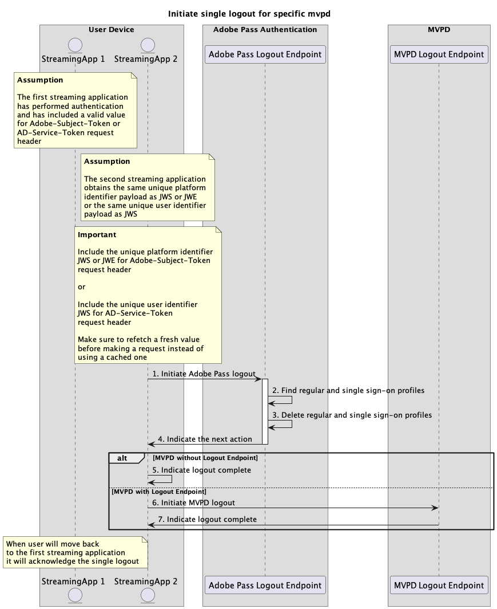

# 単一ログアウトフロー {#single-logout-flow}

>[!IMPORTANT]
>
> このページのコンテンツは、情報提供のみを目的として提供されています。 このAPIを使用するには、Adobeの現在のライセンスが必要です。 無断使用は認められません。

>[!IMPORTANT]
>
> REST API V2の実装は、[&#x200B; スロットル メカニズム &#x200B;](/help/authentication/integration-guide-programmers/throttling-mechanism.md)のドキュメントによって制限されています。

>[!MORELIKETHIS]
>
> また、[REST API V2 FAQ](/help/authentication/integration-guide-programmers/rest-apis/rest-api-v2/rest-api-v2-faqs.md#authentication-phase-faqs-general)にもアクセスしてください。

## 特定のmvpdのシングルログアウトを開始 {#initiate-single-logout-for-specific-mvpd}

### 前提条件 {#prerequisites-initiate-single-logout-for-specific-mvpd}

特定のMVPDのシングルログアウトを開始する前に、次の前提条件を満たしていることを確認してください。

* 2番目のストリーミングアプリケーションには、MVPD用に正常に作成された有効なシングルサインオンプロファイルが、シングルサインオン認証フローのいずれかを使用して必要です。
  * [プラットフォーム IDを使用したシングルサインオンによる認証の実行](rest-api-v2-single-sign-on-platform-identity-flows.md)
  * [サービストークンを使用したシングルサインオンによる認証の実行](rest-api-v2-single-sign-on-service-token-flows.md)
* 2番目のストリーミングアプリケーションは、MVPDからログアウトする必要がある場合に、シングルログアウトフローを開始する必要があります。

>[!IMPORTANT]
> 
> 前提条件
>
>  
> 
> * 1番目と2番目のストリーミングアプリケーションは、`JWS`または`JWE`と同じ一意のプラットフォーム識別子ペイロード、または`JWS`と同じ一意のユーザー識別子ペイロードを取得します。

### ワークフロー {#workflow-initiate-single-logout-for-specific-mvpd}

次の図に示すように、特定のMVPDに対してシングルログアウトフローを実装するには、次の手順を実行します。

に対する単一ログアウトの開始

*特定のmvpd*&#x200B;に対する単一ログアウトの開始

1. **Adobe Pass ログアウトの開始：** ストリーミング アプリケーションは、Adobe Pass ログアウトエンドポイントを呼び出して、ログアウトフローを開始するために必要なすべてのデータを収集します。

   >[!IMPORTANT]
   >
   > 詳しくは、[特定のmvpd](../../apis/logout-apis/rest-api-v2-logout-apis-initiate-logout-for-specific-mvpd.md) API ドキュメントのログアウトの開始を参照してください。
   >
   > * `serviceProvider`、`mvpd`、`redirectUrl`など、_必須_&#x200B;のすべてのパラメーター
   > * `Authorization`、`AP-Device-Identifier`など、_必須_ ヘッダーすべて
   > * すべての&#x200B;_optional_ パラメーターとヘッダー
   >
   >  
   >
   > ストリーミングアプリケーションは、リクエストを行う前に、一意のプラットフォーム識別子または一意のユーザー識別子の有効な値が含まれていることを確認する必要があります。
   >
   >  
   > 
   > `Adobe-Subject-Token` ヘッダーについて詳しくは、[Adobe-Subject-Token](../../appendix/headers/rest-api-v2-appendix-headers-adobe-subject-token.md) ドキュメントを参照してください。
   > 
   >  
   > 
   > `AD-Service-Token` ヘッダーについて詳しくは、[AD-Service-Token](../../appendix/headers/rest-api-v2-appendix-headers-ad-service-token.md) ドキュメントを参照してください。

1. **通常のサインオン プロファイルとシングル サインオン プロファイルを検索：** Adobe Pass サーバーは、受信したパラメーターとヘッダーに基づいて、通常のサインオン プロファイルとシングル サインオンの両方の有効なプロファイルを識別します。

1. **通常のサインオンプロファイルとシングルサインオンプロファイルを削除：** Adobe Pass サーバーは、識別された通常のサインオンプロファイルとシングルサインオンプロファイルをAdobe Pass バックエンドから削除します。

1. **次のアクションを示します：** Adobe Pass ログアウトエンドポイントの応答には、次のアクションに関するストリーミングアプリケーションをガイドするために必要なデータが含まれています。

   >[!IMPORTANT]
   >
   > ログアウト応答で提供される情報について詳しくは、特定のmvpd[&#128279;](../../apis/logout-apis/rest-api-v2-logout-apis-initiate-logout-for-specific-mvpd.md) API ドキュメントの ログアウトの開始を参照してください。
   > 
   >  
   > 
   > Adobe Pass ログアウトエンドポイントは、基本的な条件が満たされていることを確認するために、リクエストデータを検証します。
   >
   > * _必須_ パラメーターとヘッダーは有効である必要があります。
   > * 指定された`serviceProvider`と`mvpd`の統合はアクティブである必要があります。
   >
   >  
   > 
   > 検証が失敗すると、エラー応答が生成され、[拡張エラーコード &#x200B;](../../../../features-standard/error-reporting/enhanced-error-codes.md)のドキュメントに準拠する追加情報が提供されます。

1. **ログアウト完了を示します：** MVPDがログアウトフローをサポートしていない場合、ストリーミングアプリケーションは応答を処理し、オプションでユーザーインターフェイスに特定のメッセージを表示するために使用できます。

1. **MVPD ログアウトの開始：** MVPDがログアウトフローをサポートしている場合、ストリーミングアプリケーションは応答を処理し、ユーザーエージェントを使用してMVPDでログアウトフローを開始します。 フローには、MVPD システムへの複数のリダイレクトが含まれる場合があります。 その結果、MVPDは内部クリーンアップを実行し、最終的なログアウト確認をAdobe Pass バックエンドに送り返します。

1. **ログアウト完了を示します：** ストリーミングアプリケーションは、ユーザーエージェントが指定された`redirectUrl`に到達するのを待つことができ、オプションでユーザーインターフェイスに特定のメッセージを表示するためのシグナルとして使用できます。

>[!NOTE]
>
> シングルログアウトフローの手順は、最初のストリーミングアプリケーションから開始された場合、上記と同じです。
