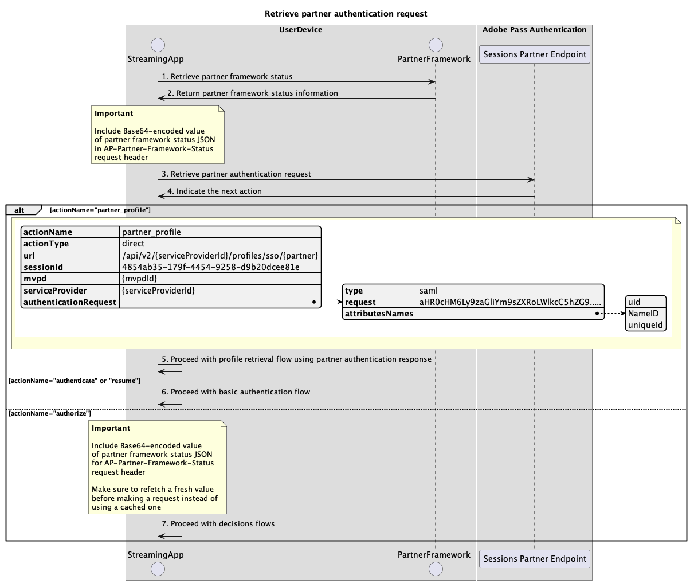
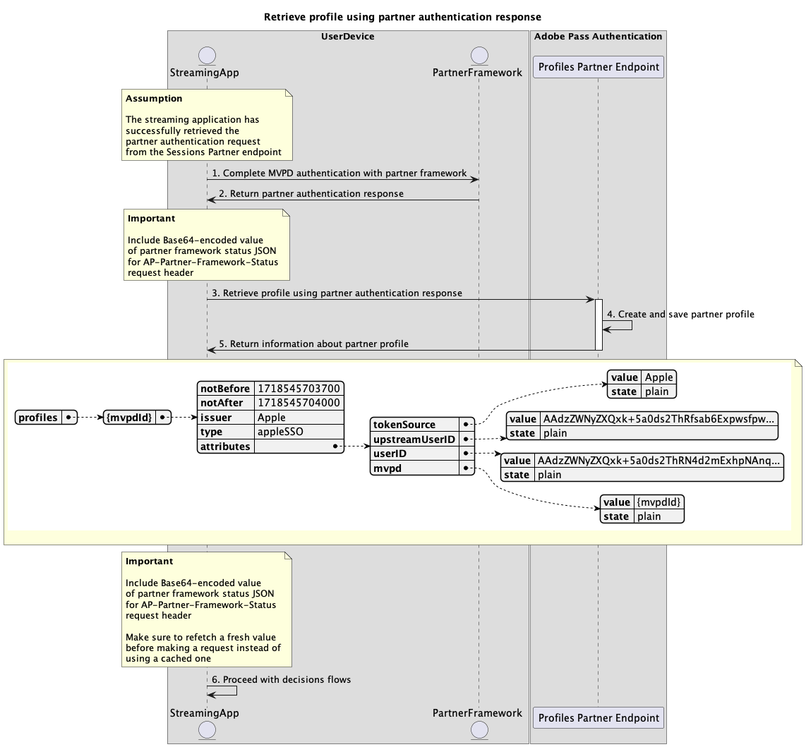

# パートナーフローを使用したシングルサインオン {#single-sign-on-partner-flows}

>[!IMPORTANT]
>
> このページのコンテンツは、情報提供のみを目的として提供されています。 このAPIを使用するには、Adobeの現在のライセンスが必要です。 無断使用は認められません。

>[!IMPORTANT]
>
> REST API V2の実装は、[&#x200B; スロットル メカニズム &#x200B;](/help/authentication/integration-guide-programmers/throttling-mechanism.md)のドキュメントによって制限されています。

>[!MORELIKETHIS]
>
> また、[REST API V2 FAQ](/help/authentication/integration-guide-programmers/rest-apis/rest-api-v2/rest-api-v2-faqs.md#authentication-phase-faqs-general)にもアクセスしてください。

パートナーメソッドを使用すると、複数のアプリケーションでパートナーフレームワークのステータスペイロードを使用して、Adobe Pass サービスを使用する際にデバイスレベルでシングルサインオン（SSO）を実現できます。

アプリケーションは、Adobe Pass システム以外のパートナー固有のフレームワークまたはライブラリを使用して、パートナーフレームワークのステータスペイロードを取得する責任があります。

アプリケーションは、このパートナーフレームワークのステータスペイロードを、それを指定するすべてのリクエストの`AP-Partner-Framework-Status` ヘッダーの一部として含める責任があります。

`AP-Partner-Framework-Status` ヘッダーについて詳しくは、[AP-Partner-Framework-Status](../../appendix/headers/rest-api-v2-appendix-headers-ap-partner-framework-status.md)のドキュメントを参照してください。

Adobe Pass Authentication REST API V2は、iOS、iPadOS、またはtvOSで動作するクライアントアプリケーションのエンドユーザー向けに、パートナーシングルサインオン（SSO）をサポートしています。

Apple プラットフォームのシングルサインオン （SSO）について詳しくは、[Apple SSO Cookbook （REST API V2） &#x200B;](/help/authentication/integration-guide-programmers/features-standard/sso-access/partner-sso/apple-sso/apple-sso-cookbook-rest-api-v2.md)のドキュメントを参照してください。

## パートナー認証リクエストの取得 {#retrieve-partner-authentication-request}

### 前提条件 {#prerequisites-retrieve-partner-authentication-request}

パートナー認証リクエストを取得する前に、次の前提条件が満たされていることを確認します。

* パートナーフレームワークは、MVPDを選択する必要があります。
* ストリーミングアプリケーションは、パートナーフレームワークからパートナーフレームワークのステータス情報を取得し、Adobe Pass サーバーに渡す必要があります。
* ストリーミングアプリケーションは、Adobe Pass サーバーからパートナー認証リクエストを取得し、それをパートナーフレームワークに渡す必要があります。

>[!IMPORTANT]
>
> 前提条件
> 
>  
> 
> * パートナーフレームワークは、MVPDを選択するためのユーザーインタラクションをサポートしています。
> * パートナーフレームワークは、選択したMVPDで認証するためのユーザーインタラクションをサポートしています。
> * パートナーフレームワークは、ユーザー権限とプロバイダー情報を提供します。

### ワークフロー {#workflow-retrieve-partner-authentication-request}

次の図に示すように、指定された手順を実行して、パートナー認証リクエストを取得します。

*パートナー認証要求を取得*

1. **パートナーフレームワークのステータスを取得：** ストリーミングアプリケーションは、Adobe Pass システム以外のパートナーフレームワークを呼び出して、ユーザーの権限とプロバイダー情報を取得します。

1. **パートナーフレームワークのステータス情報を返します：** ストリーミングアプリケーションは、応答データを検証して、基本的な条件が満たされていることを確認します。
   * ユーザー権限のアクセスステータスが付与されます。
   * ユーザープロバイダーマッピング識別子が存在し、有効です。
   * ユーザープロバイダープロファイルの有効期限（使用可能な場合）は有効です。

1. **パートナー認証要求を取得：** ストリーミングアプリケーションは、Sessions パートナーエンドポイントを呼び出して、認証セッションを開始するために必要なすべてのデータを収集します。

   >[!IMPORTANT]
   >
   > 詳細については、[&#x200B; パートナー認証リクエストの取得](../../apis/partner-single-sign-on-apis/rest-api-v2-partner-single-sign-on-apis-retrieve-partner-authentication-request.md) API ドキュメントを参照してください。
   >
   > * `serviceProvider`や`partner`など、_必須_&#x200B;のすべてのパラメーター
   > * _必須_ ヘッダー（`Authorization`、`AP-Device-Identifier`、`Content-Type`、`X-Device-Info`、`AP-Partner-Framework-Status`など）
   > * すべての&#x200B;_optional_ ヘッダーとパラメーター
   >
   >  
   >
   > ストリーミングアプリケーションは、リクエストを行う前に、パートナーフレームワークのステータスに有効な値が含まれていることを確認する必要があります。
   >
   >  
   > 
   > `AP-Partner-Framework-Status` ヘッダーについて詳しくは、[AP-Partner-Framework-Status](../../appendix/headers/rest-api-v2-appendix-headers-ap-partner-framework-status.md)のドキュメントを参照してください。

1. **次のアクションを示します：** セッション パートナーのエンドポイント応答には、次のアクションに関するストリーミングアプリケーションを導くために必要なデータが含まれています。

   >[!IMPORTANT]
   >
   > セッション応答で提供される情報について詳しくは、[&#x200B; パートナー認証リクエストの取得](../../apis/partner-single-sign-on-apis/rest-api-v2-partner-single-sign-on-apis-retrieve-partner-authentication-request.md) API ドキュメントを参照してください。
   > 
   >  
   > 
   > セッションパートナーエンドポイントは、基本的な条件が満たされていることを確認するために、リクエストデータを検証します。
   >
   > * _必須_ パラメーターとヘッダーは有効である必要があります。
   > * 指定された`serviceProvider`と`mvpd`の統合はアクティブである必要があります。
   >
   >  
   > 
   > 基本的な検証が失敗した場合は、エラー応答が生成され、[拡張エラーコード &#x200B;](../../../../features-standard/error-reporting/enhanced-error-codes.md)のドキュメントに準拠する追加情報が提供されます。
   >
   >  
   >
   > セッションパートナーエンドポイントは、パートナーシングルサインオン条件が満たされていることを確認するために、リクエストデータを検証します。
   >
   >  * Adobe Pass サーバーのパートナーシングルサインオン設定は、有効で有効である必要があります。
   >  * [AP-Partner-Framework-Status](../../appendix/headers/rest-api-v2-appendix-headers-ap-partner-framework-status.md) ヘッダーを介して受信したパートナーフレームワークの状態ペイロードは有効である必要があります。
   >
   >  
   >
   > パートナーのシングルサインオンの検証が失敗した場合、応答はデフォルトで基本認証フローになります。

1. **パートナー認証応答を使用してプロファイル取得フローを続行します：** セッション パートナーエンドポイント応答には、次のデータが含まれます。
   * `actionName`属性が「partner_profile」に設定されています。
   * `actionType`属性が「direct」に設定されています。
   * `authenticationRequest - type`属性には、パートナーフレームワークがMVPD ログインに使用するセキュリティプロトコルが含まれます（現在はSAMLのみ）。
   * `authenticationRequest - request`属性には、パートナーフレームワークに渡されるSAML リクエストが含まれます。
   * `authenticationRequest - attributesNames`属性には、パートナーフレームワークに渡されるSAML属性が含まれます。

   Adobe Pass バックエンドが有効なプロファイルを識別せず、パートナーのシングルサインオン検証が合格した場合、ストリーミングアプリケーションは、MVPDで認証フローを開始するためのパートナーフレームワークに渡すアクションとデータを含む応答を受け取ります。

   パートナー認証応答を使用したプロファイル取得フローについて詳しくは、[&#x200B; パートナー認証応答を使用したプロファイルの作成と取得](#create-and-retrieve-profile-using-partner-authentication-response)の節を参照してください。

1. **基本認証フローで続行：** セッション パートナーのエンドポイント応答には、次のデータが含まれています。
   * `actionName`属性が「authenticate」または「resume」に設定されています。
   * `actionType`属性が「インタラクティブ」または「ダイレクト」に設定されています。

   Adobe Pass バックエンドで有効なプロファイルが識別されず、パートナーのシングルサインオン検証が失敗した場合、Adobe Pass サーバーは基本認証フローにフォールバックします。

   基本認証フローについて詳しくは、次のドキュメントを参照してください。
   * [プライマリアプリケーション内で認証を実行](../basic-access-flows/rest-api-v2-basic-authentication-primary-application-flow.md)
   * [事前に選択したmvpdを使用して、セカンダリアプリケーション内で認証を実行します](../basic-access-flows/rest-api-v2-basic-authentication-secondary-application-flow.md)
   * [事前に選択したmvpdを使用せずに、セカンダリアプリケーション内で認証を実行します](../basic-access-flows/rest-api-v2-basic-authentication-secondary-application-flow.md)

1. **決定フローで続行：** セッション パートナーのエンドポイント応答には、次のデータが含まれています。
   * `actionName`属性が「authorize」に設定されています。
   * `actionType`属性が「direct」に設定されています。

   Adobe Pass バックエンドが有効なプロファイルを識別する場合、後続の意思決定フローに使用できるプロファイルが既に存在するため、ストリーミングアプリケーションは選択したMVPDで再認証する必要がありません。

   >[!IMPORTANT]
   >
   > ストリーミングアプリケーションは、リクエストを行う前に、パートナーフレームワークのステータスに有効な値が含まれていることを確認する必要があります。
   >
   >  
   > 
   > `AP-Partner-Framework-Status` ヘッダーについて詳しくは、[AP-Partner-Framework-Status](../../appendix/headers/rest-api-v2-appendix-headers-ap-partner-framework-status.md)のドキュメントを参照してください。

## パートナー認証応答を使用したプロファイルの作成と取得 {#create-and-retrieve-profile-using-partner-authentication-response}

### 前提条件 {#prerequisites-create-and-retrieve-profile-using-partner-authentication-response}

パートナー認証応答を使用してプロファイルを取得する前に、次の前提条件が満たされていることを確認します。

* パートナーフレームワークは、選択したMVPDで認証を実行する必要があります。
* ストリーミングアプリケーションは、パートナーフレームワークからパートナーフレームワークのステータス情報と共にパートナー認証レスポンスを取得し、Adobe Pass サーバーに渡す必要があります。

>[!IMPORTANT]
>
> 仮定
>
> * パートナーフレームワークは、MVPDを選択するためのユーザーインタラクションをサポートしています。
> * パートナーフレームワークは、選択したMVPDで認証するためのユーザーインタラクションをサポートしています。
> * パートナーフレームワークは、ユーザー権限とプロバイダー情報を提供します。

### ワークフロー {#workflow-create-and-retrieve-profile-using-partner-authentication-response}

次の図に示すように、パートナー認証応答を使用してプロファイル取得フローを実装するには、次の手順を実行します。

*パートナー認証応答を使用して、認証されたプロファイルを作成および取得*

1. **パートナーフレームワークでMVPD認証を完了：**&#x200B;認証フローが成功した場合、MVPDとのパートナーフレームワークのインタラクションによって、パートナーフレームワークのステータス情報とともに返されるパートナー認証応答（SAML応答）が生成されます。

1. **パートナー認証応答を返します：** ストリーミングアプリケーションは、応答データを検証して、基本的な条件が満たされていることを確認します。
   * ユーザー権限のアクセスステータスが付与されます。
   * ユーザープロバイダーマッピング識別子が存在し、有効です。
   * ユーザープロバイダープロファイルの有効期限（使用可能な場合）は有効です。

1. **パートナー認証応答を使用したプロファイルの作成と取得：** ストリーミングアプリケーションは、プロファイル パートナーエンドポイントを呼び出して、プロファイルの作成と取得に必要なすべてのデータを収集します。

   >[!IMPORTANT]
   >
   > 詳細については、[&#x200B; パートナー認証応答を使用したプロファイルの作成と取得](../../apis/partner-single-sign-on-apis/rest-api-v2-partner-single-sign-on-apis-retrieve-profile-using-partner-authentication-response.md) API ドキュメントを参照してください。
   >
   > * `serviceProvider`、`partner`、`SAMLResponse`など、_必須_&#x200B;のすべてのパラメーター
   > * `Authorization`、`AP-Device-Identifier`、`Content-Type`、`X-Device-Info`、`AP-Partner-Framework-Status`など、_必須_&#x200B;のすべてのヘッダー
   > * すべての&#x200B;_optional_ ヘッダーとパラメーター
   >
   >  
   > 
   > ストリーミングアプリケーションは、リクエストを行う前に、パートナーフレームワークのステータスに有効な値が含まれていることを確認する必要があります。
   >
   >  
   > 
   > `AP-Partner-Framework-Status` ヘッダーについて詳しくは、[AP-Partner-Framework-Status](../../appendix/headers/rest-api-v2-appendix-headers-ap-partner-framework-status.md)のドキュメントを参照してください。

1. **パートナープロファイルの作成と保存：** Adobe Pass サーバーは、すべての条件を満たしていることを確認した後、パートナープロファイルを作成および保存します。

1. **パートナープロファイルに関する情報を返します：** プロファイルエンドポイントの応答には、パートナープロファイルに関する情報が含まれます。これには、属性`type`が「appleSSO」に設定されていることが含まれます。

   >[!IMPORTANT]
   >
   > プロファイル応答で提供される情報について詳しくは、[&#x200B; パートナー認証応答を使用したプロファイルの作成と取得](../../apis/partner-single-sign-on-apis/rest-api-v2-partner-single-sign-on-apis-retrieve-profile-using-partner-authentication-response.md) API ドキュメントを参照してください。
   > 
   >  
   > 
   > プロファイルパートナーエンドポイントは、基本的な条件が満たされていることを確認するために、リクエストデータを検証します。
   >
   > * _必須_ パラメーターとヘッダーは有効である必要があります。
   > * 指定された`serviceProvider`と`mvpd`の統合はアクティブである必要があります。
   >
   >  
   > 
   > 検証が失敗すると、エラー応答が生成され、[拡張エラーコード &#x200B;](../../../../features-standard/error-reporting/enhanced-error-codes.md)のドキュメントに準拠する追加情報が提供されます。
   >
   >  
   >
   > プロファイルパートナーエンドポイントは、パートナーシングルサインオン条件が満たされていることを確認するために、リクエストデータを検証します。
   >
   >  * Adobe Pass サーバーのパートナーシングルサインオン設定は、有効で有効である必要があります。
   >  * [AP-Partner-Framework-Status](../../appendix/headers/rest-api-v2-appendix-headers-ap-partner-framework-status.md) ヘッダーを介して受信したパートナーフレームワークの状態ペイロードは有効である必要があります。
   >
   >  
   >
   > パートナーシングルサインオンの検証が失敗した場合、応答はデフォルトで基本プロファイル取得フローになります。

1. **決定フローで続行：** ストリーミングアプリケーションは、後続の決定フローで続行できます。

   >[!IMPORTANT]
   >
   > ストリーミングアプリケーションは、リクエストを行う前に、パートナーフレームワークのステータスに有効な値が含まれていることを確認する必要があります。
   >
   >  
   > 
   > `AP-Partner-Framework-Status` ヘッダーについて詳しくは、[AP-Partner-Framework-Status](../../appendix/headers/rest-api-v2-appendix-headers-ap-partner-framework-status.md)のドキュメントを参照してください。
