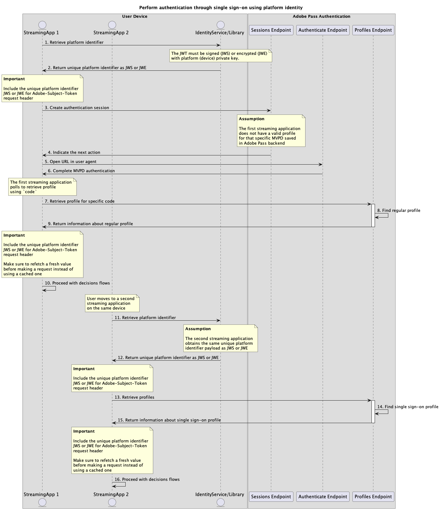
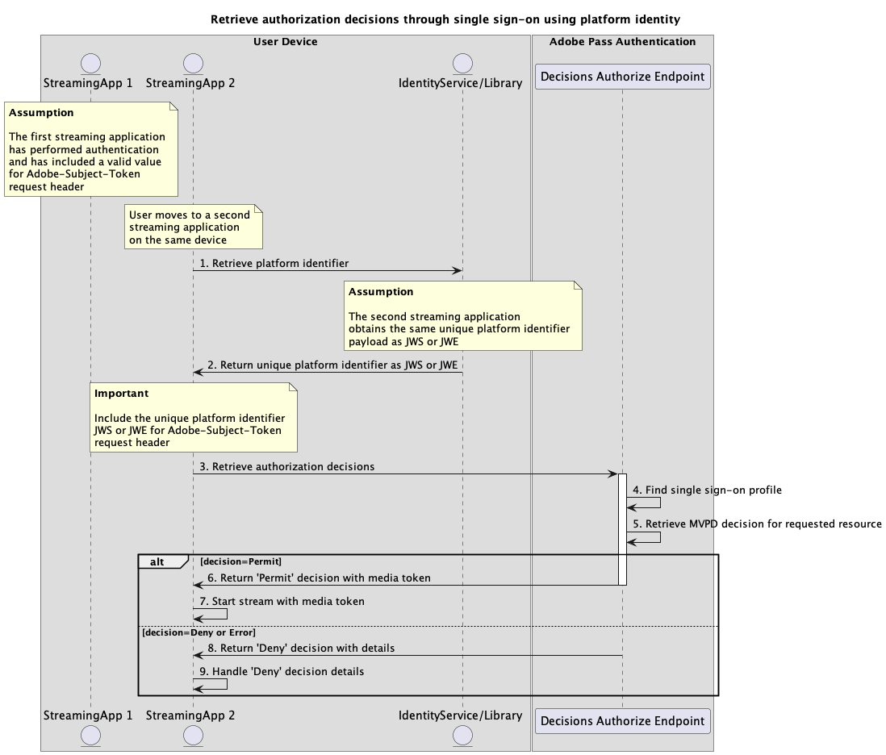

# プラットフォーム ID フローを使用したシングルサインオン {#single-sign-on-platform-identity-full-flows}

>[!IMPORTANT]
>
> このページのコンテンツは、情報提供のみを目的として提供されています。 このAPIを使用するには、Adobeの現在のライセンスが必要です。 無断使用は認められません。

>[!IMPORTANT]
>
> REST API V2の実装は、[&#x200B; スロットル メカニズム &#x200B;](/help/authentication/integration-guide-programmers/throttling-mechanism.md)のドキュメントによって制限されています。

>[!MORELIKETHIS]
>
> また、[REST API V2 FAQ](/help/authentication/integration-guide-programmers/rest-apis/rest-api-v2/rest-api-v2-faqs.md#authentication-phase-faqs-general)にもアクセスしてください。

Platform Identity メソッドを使用すると、複数のアプリケーションで一意のPlatform IDを使用して、Adobe Pass サービスを使用する際に、デバイスまたはプラットフォームレベルでシングルサインオン（SSO）を実現できます。

アプリケーションは、Adobe Pass システム以外のデバイス固有のID サービスまたはライブラリを使用して、一意のプラットフォーム ID ペイロードを取得する責任があります。

アプリケーションは、この一意のプラットフォーム識別子ペイロードを、それを指定するすべてのリクエストの`Adobe-Subject-Token` / `X-Roku-Reserved-Roku-Connect-Token` ヘッダーの一部として含める責任があります。

`Adobe-Subject-Token` / `X-Roku-Reserved-Roku-Connect-Token` ヘッダーについて詳しくは、[Adobe-Subject-Token](../../appendix/headers/rest-api-v2-appendix-headers-adobe-subject-token.md) / [X-Roku-Reserved-Roku-Connect-Token](/help/authentication/integration-guide-programmers/rest-apis/rest-api-v2/appendix/headers/rest-api-v2-appendix-headers-x-roku-reserved-roku-connect-token.md) ドキュメントを参照してください。

>[!MORELIKETHIS]
> 
> * [Amazon SSO クックブック &#x200B;](/help/authentication/integration-guide-programmers/features-standard/sso-access/platform-sso/amazon-single-sign-on/amazon-sso-cookbook-rest-api-v2.md)
> * [Roku SSO クックブック &#x200B;](/help/authentication/integration-guide-programmers/features-standard/sso-access/platform-sso/roku-single-sign-on/roku-sso-cookbook-rest-api-v2.md)

## プラットフォーム IDを使用したシングルサインオンによる認証の実行 {#perform-authentication-through-single-sign-on-using-platform-identity}

### 前提条件 {#prerequisites-perform-authentication-through-single-sign-on-using-platform-identity}

プラットフォーム IDを使用してシングルサインオンの認証フローを実行する前に、次の前提条件が満たされていることを確認します。

* プラットフォームは、同じデバイスまたはプラットフォーム上のすべてのアプリケーションで`JWS`または`JWE` ペイロードとして一貫した情報を返すID サービスまたはライブラリを提供する必要があります。
* 最初のストリーミングアプリケーションは、一意のプラットフォーム IDを取得し、それを指定するすべてのリクエストに対して[Adobe-Subject-Token](../../appendix/headers/rest-api-v2-appendix-headers-adobe-subject-token.md) / [X-Roku-Reserved-Roku-Connect-Token](/help/authentication/integration-guide-programmers/rest-apis/rest-api-v2/appendix/headers/rest-api-v2-appendix-headers-x-roku-reserved-roku-connect-token.md) ヘッダーの一部として`JWS`または`JWE` ペイロードを含める必要があります。
* 最初のストリーミングアプリケーションでMVPDを選択する必要があります。
* 選択したMVPDでログインするには、最初のストリーミングアプリケーションで認証セッションを開始する必要があります。
* 最初のストリーミングアプリケーションは、ユーザーエージェントで選択したMVPDで認証する必要があります。
* 2番目のストリーミングアプリケーションは、一意のプラットフォーム IDを取得し、それを指定するすべてのリクエストに対して[Adobe-Subject-Token](../../appendix/headers/rest-api-v2-appendix-headers-adobe-subject-token.md) / [X-Roku-Reserved-Roku-Connect-Token](/help/authentication/integration-guide-programmers/rest-apis/rest-api-v2/appendix/headers/rest-api-v2-appendix-headers-x-roku-reserved-roku-connect-token.md) ヘッダーの一部として`JWS`または`JWE` ペイロードを含める必要があります。

>[!IMPORTANT]
>
> 前提条件
>
>  
> 
> * 最初のストリーミングアプリケーションは、MVPDを選択するためのユーザーインタラクションをサポートしています。
> * 最初のストリーミングアプリケーションは、ユーザーエージェントで選択したMVPDで認証するためのユーザーインタラクションをサポートしています。

### ワークフロー {#workflow-perform-authentication-through-single-sign-on-using-platform-identity}

次の図に示すように、プラットフォーム IDを使用してシングルサインオンによる認証フローを実装するには、次の手順を実行します。

*プラットフォーム IDを使用してシングルサインオンによる認証を実行*

1. **プラットフォーム IDの取得：**&#x200B;最初のストリーミングアプリケーションは、Adobe Pass システム以外のID サービスまたはライブラリを呼び出して、一意のプラットフォーム IDに関連付けられた`JWS`または`JWE` ペイロードを取得します。

1. **JWSまたはJWE:**&#x200B;として一意のプラットフォーム IDを返す最初のストリーミング アプリケーションは、応答データを検証して、基本的なセキュリティ条件が満たされていることを確認します。
   * ペイロードの有効期限が切れていません。
   * ペイロードは署名または暗号化されています。

1. **認証セッションの作成：**&#x200B;最初のストリーミングアプリケーションは、セッションエンドポイントを呼び出して、認証セッションを開始するために必要なすべてのデータを収集します。

   >[!IMPORTANT]
   >
   > 詳細については、[認証セッションの作成](../../apis/sessions-apis/rest-api-v2-sessions-apis-create-authentication-session.md) API ドキュメントを参照してください。
   > 
   > * `serviceProvider`、`mvpd`、`domainName`、`redirectUrl`など、_必須_&#x200B;のすべてのパラメーター
   > * `Authorization`、`AP-Device-Identifier`など、_必須_ ヘッダーすべて
   > * すべての&#x200B;_optional_ パラメーターとヘッダー
   >
   >  
   > 
   > ストリーミングアプリケーションは、リクエストを行う前に、一意のプラットフォーム識別子の有効な値が含まれていることを確認する必要があります。
   >
   >  
   > 
   > `Adobe-Subject-Token` / `X-Roku-Reserved-Roku-Connect-Token` ヘッダーについて詳しくは、[Adobe-Subject-Token](../../appendix/headers/rest-api-v2-appendix-headers-adobe-subject-token.md) / [X-Roku-Reserved-Roku-Connect-Token](/help/authentication/integration-guide-programmers/rest-apis/rest-api-v2/appendix/headers/rest-api-v2-appendix-headers-x-roku-reserved-roku-connect-token.md) ドキュメントを参照してください。

1. **次のアクションを示します：** セッションエンドポイントの応答には、次のアクションに関する最初のストリーミングアプリケーションを導くために必要なデータが含まれています。

   >[!IMPORTANT]
   >
   > セッション応答で提供される情報について詳しくは、[認証セッションの作成](../../apis/sessions-apis/rest-api-v2-sessions-apis-create-authentication-session.md) API ドキュメントを参照してください。
   > 
   >  
   > 
   > セッションエンドポイントは、基本的な条件が満たされていることを確認するために、リクエストデータを検証します。
   >
   > * _必須_ パラメーターとヘッダーは有効である必要があります。
   > * 指定された`serviceProvider`と`mvpd`の統合はアクティブである必要があります。
   >
   >  
   > 
   > 検証が失敗すると、エラー応答が生成され、[拡張エラーコード &#x200B;](../../../../features-standard/error-reporting/enhanced-error-codes.md)のドキュメントに準拠する追加情報が提供されます。

1. **ユーザーエージェントでURLを開く：** セッションエンドポイントの応答には、次のデータが含まれます。
   * MVPD ログインページ内でインタラクティブ認証を開始するために使用できる`url`。
   * `actionName`属性が「authenticate」に設定されています。
   * `actionType`属性が「インタラクティブ」に設定されています。

   Adobe Pass バックエンドが有効なプロファイルを識別しない場合、最初のストリーミングアプリケーションはユーザーエージェントを開いて、指定された`url`を読み込み、認証エンドポイントにリクエストを行います。 このフローには複数のリダイレクトが含まれる場合があり、最終的にはユーザーがMVPD ログインページに移動し、有効な資格情報を提供します。

1. **MVPD認証を完了：**&#x200B;認証フローが成功した場合、ユーザーエージェントのインタラクションはAdobe Pass バックエンドに通常のプロファイルを保存し、指定された`redirectUrl`に到達します。

1. **特定のコードのプロファイルの取得：**&#x200B;最初のストリーミングアプリケーションは、プロファイルエンドポイントにリクエストを送信することで、プロファイル情報を取得するために必要なすべてのデータを収集します。

   >[!IMPORTANT]
   >
   > 次の詳細については、特定のコードの[&#x200B; プロファイルの取得](../../apis/profiles-apis/rest-api-v2-profiles-apis-retrieve-profile-for-specific-code.md) API ドキュメントを参照してください。
   > 
   > * `serviceProvider`、`code`など、_必須_&#x200B;のすべてのパラメーター
   > * `Authorization`、`AP-Device-Identifier`など、_必須_ ヘッダーすべて
   > * すべての&#x200B;_optional_ パラメーターとヘッダー

   >[!TIP]
   >
   > ストリーミングアプリケーションは、ユーザーエージェントが指定された`redirectUrl`に到達するのを待ち、通常のプロファイルが正常に生成され、保存されたかどうかを確認する必要があります。

1. **通常のプロファイルを検索：** Adobe Pass サーバーは、受信したパラメーターとヘッダーに基づいて有効なプロファイルを識別します。

1. **通常のプロファイルに関する情報を返します：** プロファイル エンドポイントの応答には、受信したパラメーターとヘッダーに関連付けられた見つかったプロファイルに関する情報が含まれます。

   >[!IMPORTANT]
   >
   > プロファイル応答で提供される情報の詳細については、[特定のコードのプロファイルの取得](../../apis/profiles-apis/rest-api-v2-profiles-apis-retrieve-profile-for-specific-code.md) API ドキュメントを参照してください。
   > 
   >  
   > 
   > プロファイルエンドポイントは、基本的な条件が満たされていることを確認するために、リクエストデータを検証します。
   >
   > * _必須_ パラメーターとヘッダーは有効である必要があります。
   >
   >  
   > 
   > 検証が失敗すると、エラー応答が生成され、[拡張エラーコード &#x200B;](../../../../features-standard/error-reporting/enhanced-error-codes.md)のドキュメントに準拠する追加情報が提供されます。

1. **決定フローで続行：**&#x200B;最初のストリーミングアプリケーションは、後続の決定フローで続行できます。

   >[!IMPORTANT]
   >
   > ストリーミングアプリケーションは、リクエストを行う前に、一意のプラットフォーム識別子の有効な値が含まれていることを確認する必要があります。
   >
   >  
   > 
   > `Adobe-Subject-Token` / `X-Roku-Reserved-Roku-Connect-Token` ヘッダーについて詳しくは、[Adobe-Subject-Token](../../appendix/headers/rest-api-v2-appendix-headers-adobe-subject-token.md) / [X-Roku-Reserved-Roku-Connect-Token](/help/authentication/integration-guide-programmers/rest-apis/rest-api-v2/appendix/headers/rest-api-v2-appendix-headers-x-roku-reserved-roku-connect-token.md) ドキュメントを参照してください。

1. **プラットフォーム IDの取得：** 2番目のストリーミング アプリケーションは、Adobe Pass システム以外のID サービスまたはライブラリを呼び出して、一意のプラットフォーム IDに関連付けられた`JWS`または`JWE` ペイロードを取得します。

1. **JWSまたはJWE:**&#x200B;として一意のプラットフォーム IDを返します。2番目のストリーミング アプリケーションは、応答データを検証して、基本的なセキュリティ条件が満たされていることを確認します。
   * ペイロードの有効期限が切れていません。
   * ペイロードは署名または暗号化されています。

1. **プロファイルの取得：** 2番目のストリーミングアプリケーションは、プロファイルエンドポイントにリクエストを送信して、すべてのプロファイル情報を取得するために必要なすべてのデータを収集します。

   >[!IMPORTANT]
   >
   > 詳細については、[&#x200B; プロファイルの取得](../../apis/profiles-apis/rest-api-v2-profiles-apis-retrieve-profiles.md) API ドキュメントを参照してください。
   > 
   > * `serviceProvider`など、すべての&#x200B;_必須_ パラメーター
   > * `Authorization`、`AP-Device-Identifier`など、_必須_ ヘッダーすべて
   > * すべての&#x200B;_optional_ パラメーターとヘッダー
   >
   >  
   > 
   > ストリーミングアプリケーションは、リクエストを行う前に、一意のプラットフォーム識別子の有効な値が含まれていることを確認する必要があります。
   >
   >  
   > 
   > `Adobe-Subject-Token` / `X-Roku-Reserved-Roku-Connect-Token` ヘッダーについて詳しくは、[Adobe-Subject-Token](../../appendix/headers/rest-api-v2-appendix-headers-adobe-subject-token.md) / [X-Roku-Reserved-Roku-Connect-Token](/help/authentication/integration-guide-programmers/rest-apis/rest-api-v2/appendix/headers/rest-api-v2-appendix-headers-x-roku-reserved-roku-connect-token.md) ドキュメントを参照してください。

1. **シングルサインオンプロファイルを検索：** Adobe Pass サーバーは、受信したパラメーターとヘッダーに基づいて、有効なシングルサインオンプロファイルを識別します。

1. **シングルサインオンプロファイルに関する情報を返します：** プロファイルエンドポイントの応答には、受信したパラメーターとヘッダーに関連付けられた見つかったプロファイルに関する情報が含まれます。

   >[!IMPORTANT]
   >
   > プロファイル応答で提供される情報について詳しくは、[&#x200B; プロファイルの取得](../../apis/profiles-apis/rest-api-v2-profiles-apis-retrieve-profiles.md) API ドキュメントを参照してください。
   >
   >  
   > 
   > プロファイルエンドポイントは、基本的な条件が満たされていることを確認するために、リクエストデータを検証します。
   >
   > * _必須_ パラメーターとヘッダーは有効である必要があります。
   >
   >  
   > 
   > 検証が失敗すると、エラー応答が生成され、[拡張エラーコード &#x200B;](../../../../features-standard/error-reporting/enhanced-error-codes.md)のドキュメントに準拠する追加情報が提供されます。

1. **決定フローで続行：** 2番目のストリーミングアプリケーションは、後続の決定フローで続行できます。

   >[!IMPORTANT]
   >
   > ストリーミングアプリケーションは、リクエストを行う前に、一意のプラットフォーム識別子の有効な値が含まれていることを確認する必要があります。
   >
   >  
   > 
   > `Adobe-Subject-Token` / `X-Roku-Reserved-Roku-Connect-Token` ヘッダーについて詳しくは、[Adobe-Subject-Token](../../appendix/headers/rest-api-v2-appendix-headers-adobe-subject-token.md) / [X-Roku-Reserved-Roku-Connect-Token](/help/authentication/integration-guide-programmers/rest-apis/rest-api-v2/appendix/headers/rest-api-v2-appendix-headers-x-roku-reserved-roku-connect-token.md) ドキュメントを参照してください。

## プラットフォーム IDを使用したシングルサインオンによる認証決定の取得{#performing-authorization-flow-using-platform-identity-single-sign-on-method}

### 前提条件 {#prerequisites-scenario-performing-authorization-flow-using-platform-identity-single-sign-on-method}

プラットフォーム IDを使用してシングルサインオンで認証フローを実行する前に、次の前提条件が満たされていることを確認します。

* プラットフォームは、同じデバイスまたはプラットフォーム上のすべてのアプリケーションで`JWS`または`JWE` ペイロードとして一貫した情報を返すID サービスまたはライブラリを提供する必要があります。
* 2番目のストリーミングアプリケーションは、一意のプラットフォーム IDを取得し、それを指定するすべてのリクエストに対して[Adobe-Subject-Token](../../appendix/headers/rest-api-v2-appendix-headers-adobe-subject-token.md) / [X-Roku-Reserved-Roku-Connect-Token](/help/authentication/integration-guide-programmers/rest-apis/rest-api-v2/appendix/headers/rest-api-v2-appendix-headers-x-roku-reserved-roku-connect-token.md) ヘッダーの一部として`JWS`または`JWE` ペイロードを含める必要があります。
* 2番目のストリーミングアプリケーションは、ユーザーが選択したリソースを再生する前に、認証決定を取得する必要があります。

>[!IMPORTANT]
>
> 前提条件
> 
>  
> 
> * 最初のストリーミングアプリケーションが認証を実行し、[Adobe-Subject-Token](../../appendix/headers/rest-api-v2-appendix-headers-adobe-subject-token.md) / [X-Roku-Reserved-Roku-Connect-Token](/help/authentication/integration-guide-programmers/rest-apis/rest-api-v2/appendix/headers/rest-api-v2-appendix-headers-x-roku-reserved-roku-connect-token.md) リクエストヘッダーに有効な値が含まれています。

### ワークフロー {#workflow-scenario-performing-authorization-flow-using-platform-identity-single-sign-on-method}

次の図に示すように、プラットフォーム IDを使用してシングルサインオンによる認証フローを実装するには、次の手順を実行します。

*プラットフォーム IDを使用して、シングルサインオンを通じて承認決定を取得*

1. **プラットフォーム IDの取得：** 2番目のストリーミング アプリケーションは、Adobe Pass システム以外のID サービスまたはライブラリを呼び出して、一意のプラットフォーム IDに関連付けられた`JWS`または`JWE` ペイロードを取得します。

1. **JWSまたはJWE:**&#x200B;として一意のプラットフォーム IDを返します。2番目のストリーミング アプリケーションは、応答データを検証して、基本的なセキュリティ条件が満たされていることを確認します。
   * ペイロードの有効期限が切れていません。
   * ペイロードは署名または暗号化されています。

1. **承認決定の取得：** 2番目のストリーミングアプリケーションは、「決定の承認」エンドポイントを呼び出して、特定のリソースの承認決定を取得するために必要なすべてのデータを収集します。

   >[!IMPORTANT]
   >
   > 詳しくは、特定のmvpd[&#128279;](../../apis/decisions-apis/rest-api-v2-decisions-apis-retrieve-authorization-decisions-using-specific-mvpd.md) API ドキュメントを使用した承認決定の取得を参照してください。
   >
   > * `serviceProvider`、`mvpd`、`resources`など、_必須_&#x200B;のすべてのパラメーター
   > * `Authorization`や`AP-Device-Identifier`など、_必須_ ヘッダーすべて
   > * すべての&#x200B;_optional_ パラメーターとヘッダー
   >
   >  
   > 
   > ストリーミングアプリケーションは、リクエストを行う前に、一意のプラットフォーム識別子の有効な値が含まれていることを確認する必要があります。
   >
   >  
   > 
   > `Adobe-Subject-Token` / `X-Roku-Reserved-Roku-Connect-Token` ヘッダーについて詳しくは、[Adobe-Subject-Token](../../appendix/headers/rest-api-v2-appendix-headers-adobe-subject-token.md) / [X-Roku-Reserved-Roku-Connect-Token](/help/authentication/integration-guide-programmers/rest-apis/rest-api-v2/appendix/headers/rest-api-v2-appendix-headers-x-roku-reserved-roku-connect-token.md) ドキュメントを参照してください。

1. **シングルサインオンプロファイルを検索：** Adobe Pass サーバーは、受信したパラメーターとヘッダーに基づいて、有効なシングルサインオンプロファイルを識別します。

1. **要求されたリソースに対するMVPDの決定を取得：** Adobe Pass サーバーは、MVPD認証エンドポイントを呼び出して、ストリーミングアプリケーションから受信した特定のリソースに対する`Permit`または`Deny`の決定を取得します。

1. **メディアトークンを使用して`Permit`の決定を返します：**&#x200B;決定承認エンドポイント応答には、`Permit`の決定とメディアトークンが含まれています。

   >[!IMPORTANT]
   >
   > 決定応答で提供される情報について詳しくは、[特定のmvpd](../../apis/decisions-apis/rest-api-v2-decisions-apis-retrieve-authorization-decisions-using-specific-mvpd.md) API ドキュメントを使用した承認決定の取得を参照してください。
   > 
   >  
   > 
   > 決定承認エンドポイントは、基本的な条件が満たされていることを確認するために、リクエストデータを検証します。
   >
   > * _必須_ パラメーターとヘッダーは有効である必要があります。
   > * 指定された`serviceProvider`と`mvpd`の統合はアクティブである必要があります。
   >
   >  
   > 
   > 検証が失敗すると、エラー応答が生成され、[拡張エラーコード &#x200B;](../../../../features-standard/error-reporting/enhanced-error-codes.md)のドキュメントに準拠する追加情報が提供されます。

1. **メディアトークンを使用してストリームを開始：** 2番目のストリーミングアプリケーションは、メディアトークンを使用してコンテンツを再生します。

1. **詳細を含む`Deny`の決定を返します：** 「決定を承認」エンドポイント応答には、`Deny`の決定と、[拡張エラーコード &#x200B;](../../../../features-standard/error-reporting/enhanced-error-codes.md) ドキュメントに準拠するエラーペイロードが含まれています。

   >[!IMPORTANT]
   >
   > 決定応答で提供される情報について詳しくは、[特定のmvpd](../../apis/decisions-apis/rest-api-v2-decisions-apis-retrieve-authorization-decisions-using-specific-mvpd.md) API ドキュメントを使用した承認決定の取得を参照してください。
   > 
   >  
   > 
   > 決定承認エンドポイントは、基本的な条件が満たされていることを確認するために、リクエストデータを検証します。
   >
   > * _必須_ パラメーターとヘッダーは有効である必要があります。
   > * 指定された`serviceProvider`と`mvpd`の統合はアクティブである必要があります。
   >
   >  
   > 
   > 検証が失敗すると、エラー応答が生成され、[拡張エラーコード &#x200B;](../../../../features-standard/error-reporting/enhanced-error-codes.md)のドキュメントに準拠する追加情報が提供されます。

1. **Handle `Deny`決定の詳細：** 2番目のストリーミングアプリケーションは、応答からエラー情報を処理し、オプションでユーザーインターフェイスに特定のメッセージを表示するために使用できます。

>[!NOTE]
>
> 事前認証フローの手順は、認証フローの手順と同じですが、使用されるエンドポイントは、[特定のmvpd](../../apis/decisions-apis/rest-api-v2-decisions-apis-retrieve-preauthorization-decisions-using-specific-mvpd.md) ドキュメントを使用した事前認証の決定の取得に記載されているエンドポイントです。
