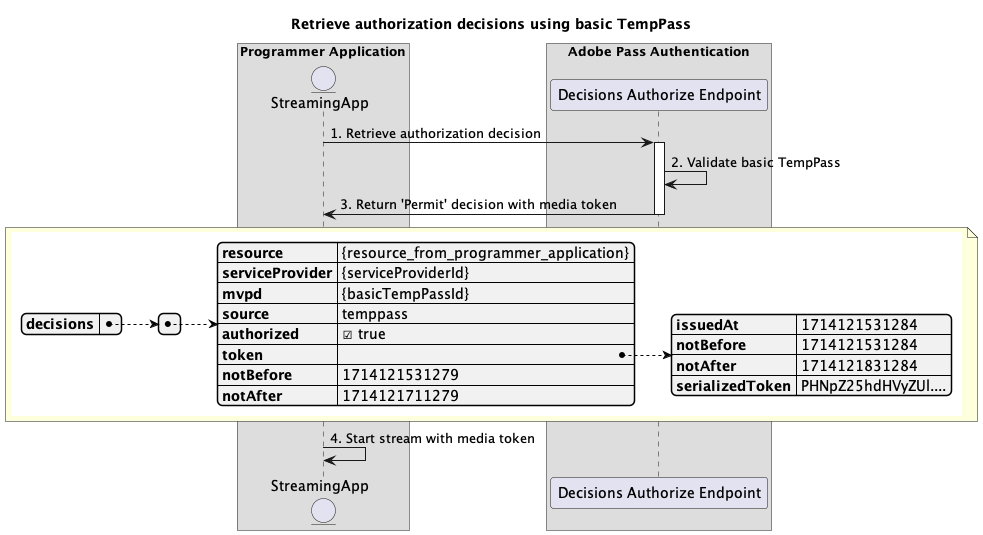
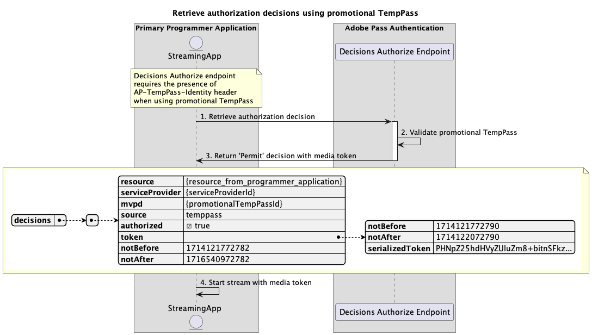
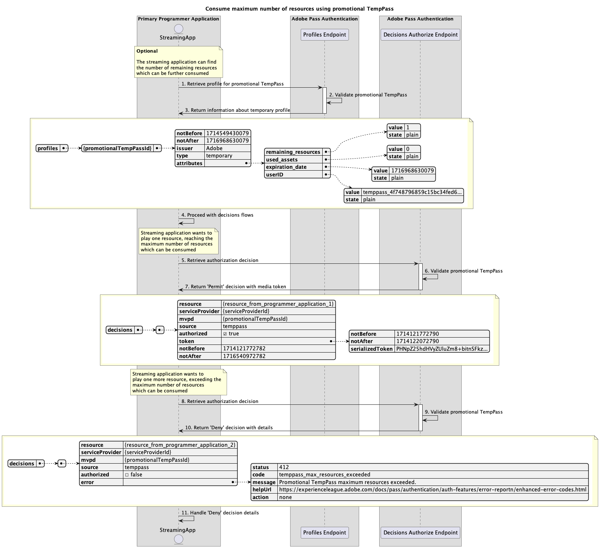
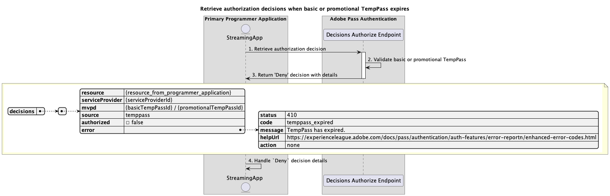
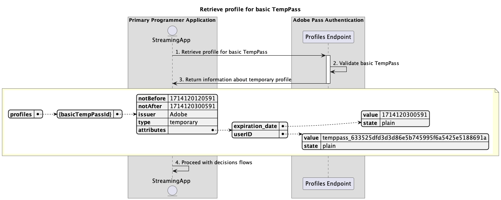
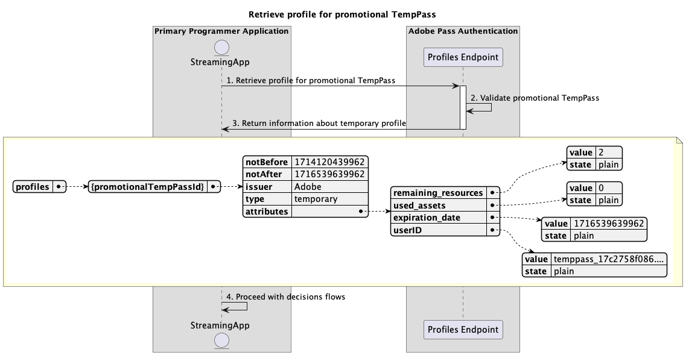

# 一時的なアクセスフロー {#temporary-access-flows}

>[!IMPORTANT]
>
> このページのコンテンツは、情報提供のみを目的として提供されています。 このAPIを使用するには、Adobeの現在のライセンスが必要です。 無断使用は認められません。

>[!IMPORTANT]
>
> REST API V2の実装は、[ スロットル メカニズム ](/help/authentication/integration-guide-programmers/throttling-mechanism.md)のドキュメントによって制限されています。

>[!MORELIKETHIS]
>
> また、[REST API V2 FAQ](/help/authentication/integration-guide-programmers/rest-apis/rest-api-v2/rest-api-v2-faqs.md#authentication-phase-faqs-general)にもアクセスしてください。

TempPassを使用すると、ユーザーに有効なMVPD アカウントでの認証を依頼することなく、保護されたコンテンツに一時的にアクセスできます。

TempPass機能について詳しくは、[TempPass](../../../../features-premium/temporary-access/temp-pass-feature.md)のドキュメントを参照してください。

一時アクセス フローでは、次のシナリオについてクエリを実行できます。

* [基本的なTempPassを使用して認証の決定を取得する](#retrieve-authorization-decisions-using-basic-temppass)
* [プロモーション TempPassを使用して認証の決定を取得](#retrieve-authorization-decisions-using-promotional-temppass)
* [プロモーション TempPassを使用してリソースの最大数を消費する](#consume-maximum-number-of-resources-using-promotional-temppass)
* [基本またはプロモーションのTempPassの有効期限が切れた場合に、認証の決定を取得します](#retrieve-authorization-decisions-when-basic-or-promotional-temppass-expires)
* [基本TempPassのプロファイルを取得](#retrieve-profile-for-basic-temppass)
* [プロモーション TempPassのプロファイルの取得](#retrieve-profile-for-promotional-temppass)

## 基本的なTempPassを使用して認証の決定を取得する {#retrieve-authorization-decisions-using-basic-temppass}

### 前提条件 {#prerequisites-retrieve-authorization-decisions-using-basic-temppass}

基本的なTempPassを使用して認証の決定を取得する前に、次の前提条件が満たされていることを確認します。

* ストリーミングアプリケーションは、ユーザーに認証を依頼することなく、コンテンツを再生するための一時的なアクセスを提供したいと考えています。
* ストリーミングアプリケーションは、ユーザーが選択したリソースを再生する前に、認証決定を取得する必要があります。

>[!IMPORTANT]
>
> 前提条件
> 
>  
> 
> * 指定された`serviceProvider`と`mvpd`の間の統合に適用される基本的なTempPassの有効な設定が必要です。
> * 基本的なTempPass用に設定されたTime-To-Live （TTL）の有効期限が切れていません。

### ワークフロー {#workflow-retrieve-authorization-decisions-using-basic-temppass}

次の図に示すように、基本的なTempPassを使用して認証フローを実装するには、次の手順に従います。

*基本的なTempPassを使用して認証の決定を取得*

1. **承認決定の取得：** ストリーミングアプリケーションは、「決定の承認」エンドポイントを呼び出して、特定のリソースの承認決定を取得するために必要なすべてのデータを収集します。

   >[!IMPORTANT]
   >
   > 詳しくは、特定のmvpd](../../apis/decisions-apis/rest-api-v2-decisions-apis-retrieve-authorization-decisions-using-specific-mvpd.md) API ドキュメントを使用した承認決定の取得を参照してください。[
   > 
   > * `serviceProvider`、`mvpd`、`resources`など、_必須_&#x200B;のすべてのパラメーター
   > * `Authorization`や`AP-Device-Identifier`など、_必須_ ヘッダーすべて
   > * すべての&#x200B;_optional_ パラメーターとヘッダー

1. **基本的なTempPassの検証：** Adobe Pass サーバーは、指定された`serviceProvider`と`mvpd`の間の統合に適用された基本的なTempPassの有効な設定が存在するかどうかを確認します。

1. **メディアトークンを使用して`Permit`の決定を返します：**&#x200B;決定承認エンドポイント応答には、`Permit`の決定とメディアトークンが含まれています。

   >[!IMPORTANT]
   >
   > 決定応答で提供される情報について詳しくは、[特定のmvpd](../../apis/decisions-apis/rest-api-v2-decisions-apis-retrieve-authorization-decisions-using-specific-mvpd.md) API ドキュメントを使用した承認決定の取得を参照してください。
   >
   >  
   > 
   > 決定承認エンドポイントは、基本的な条件が満たされていることを確認するために、リクエストデータを検証します。
   >
   > * _必須_ パラメーターとヘッダーは有効である必要があります。
   > * 指定された`serviceProvider`と`mvpd`の統合はアクティブである必要があります。
   >
   >  
   > 
   > 基本的な検証が失敗した場合は、エラー応答が生成され、[拡張エラーコード ](../../../../features-standard/error-reporting/enhanced-error-codes.md)のドキュメントに準拠する追加情報が提供されます。
   >
   >  
   > 
   > 決定承認エンドポイントは、リクエストデータを使用して、一時的なアクセス条件が満たされているかどうかを確認します。
   >
   > * 基本的なTempPass用に設定されたTime-To-Live （TTL）の有効期限が切れていない必要があります。
   >
   >  
   > 
   > 一時的なアクセス検証が失敗した場合は、エラー応答が生成され、[拡張エラーコード ](../../../../features-standard/error-reporting/enhanced-error-codes.md)のドキュメントに準拠する追加情報が提供されます。

1. **メディアトークンを使用してストリームを開始：** ストリーミングアプリケーションは、メディアトークンを使用してコンテンツを再生します。

## プロモーション TempPassを使用して認証の決定を取得 {#retrieve-authorization-decisions-using-promotional-temppass}

### 前提条件 {#prerequisites-retrieve-authorization-decisions-using-promotional-temppass}

プロモーション TempPassを使用して認証の決定を取得する前に、次の前提条件が満たされていることを確認します。

* ストリーミングアプリケーションは、ユーザーに認証を依頼することなく、最大のリソースを再生するための一時的なアクセスを提供したいと考えています。
* ストリーミングアプリケーションは、承認決定を取得する際に、ユーザーのIDに関する一意の情報を含める必要があります。
* ストリーミングアプリケーションは、ユーザーが選択したリソースを再生する前に、認証決定を取得する必要があります。

>[!IMPORTANT]
>
> 前提条件
>
>  
> 
> * 指定された`serviceProvider`と`mvpd`の間の統合に適用されるプロモーション TempPassの有効な設定が必要です。
> * プロモーション TempPass用に設定されたTime-To-Live （TTL）の有効期限が切れていません。
> * プロモーション TempPass用に設定されたリソースの最大数が消費されていません。

### ワークフロー {#workflow-retrieve-authorization-decisions-using-promotional-temppass}

次の図に示すように、プロモーション TempPassを使用して認証フローを実装するには、次の手順に従います。

*プロモーション TempPassを使用して承認決定を取得*

1. **承認決定の取得：** ストリーミングアプリケーションは、「決定の承認」エンドポイントを呼び出して、特定のリソースの承認決定を取得するために必要なすべてのデータを収集します。

   >[!IMPORTANT]
   >
   > 詳しくは、特定のmvpd](../../apis/decisions-apis/rest-api-v2-decisions-apis-retrieve-authorization-decisions-using-specific-mvpd.md) API ドキュメントを使用した承認決定の取得を参照してください。[
   >
   > * `serviceProvider`、`mvpd`、`resources`など、_必須_&#x200B;のすべてのパラメーター
   > * `Authorization`や`AP-Device-Identifier`など、_必須_ ヘッダーすべて
   > * すべての&#x200B;_optional_ パラメーターとヘッダー
   >
   >  
   >
   > 決定承認エンドポイントでは、プロモーション TempPassを使用する際に`AP-TempPass-Identity` ヘッダーが必要です。 ヘッダーには、コンテンツにアクセスするユーザーのIDに関する一意の情報が含まれます。
   > 
   >  
   > 
   > `AP-TempPass-Identity` ヘッダーについて詳しくは、[AP-TempPass-Identity](../../appendix/headers/rest-api-v2-appendix-headers-ap-temppass-identity.md)のドキュメントを参照してください。

1. **プロモーション TempPassの検証：** Adobe Pass サーバーは、指定された`serviceProvider`と`mvpd`の間の統合にプロモーション TempPassの有効な設定が適用されているかどうかを確認します。

1. **メディアトークンを使用して`Permit`の決定を返します：**&#x200B;決定承認エンドポイント応答には、`Permit`の決定とメディアトークンが含まれています。

   >[!IMPORTANT]
   >
   > 決定応答で提供される情報について詳しくは、[特定のmvpd](../../apis/decisions-apis/rest-api-v2-decisions-apis-retrieve-authorization-decisions-using-specific-mvpd.md) API ドキュメントを使用した承認決定の取得を参照してください。
   > 
   >  
   > 
   > 決定承認エンドポイントは、基本的な条件が満たされていることを確認するために、リクエストデータを検証します。
   >
   > * _必須_ パラメーターとヘッダーは有効である必要があります。
   > * 指定された`serviceProvider`と`mvpd`の統合はアクティブである必要があります。
   >
   >  
   > 
   > 基本的な検証が失敗した場合は、エラー応答が生成され、[拡張エラーコード ](../../../../features-standard/error-reporting/enhanced-error-codes.md)のドキュメントに準拠する追加情報が提供されます。
   >
   >  
   > 
   > 決定承認エンドポイントは、リクエストデータを使用して、一時的なアクセス条件が満たされているかどうかを確認します。
   >
   > * プロモーション TempPass用に設定されたTime-To-Live （TTL）は、期限切れにしないでください。
   > * プロモーション TempPass用に設定されたリソースの最大数を消費することはできません。
   >
   >  
   > 
   > 一時的なアクセス検証が失敗した場合は、エラー応答が生成され、[拡張エラーコード ](../../../../features-standard/error-reporting/enhanced-error-codes.md)のドキュメントに準拠する追加情報が提供されます。

1. **メディアトークンを使用してストリームを開始：** ストリーミングアプリケーションは、メディアトークンを使用してコンテンツを再生します。

## プロモーション TempPassを使用してリソースの最大数を消費する {#consume-maximum-number-of-resources-using-promotional-temppass}

### 前提条件 {#prerequisites-consume-maximum-number-of-resources-using-promotional-temppass}

プロモーション TempPassを使用して最大リソース数を消費する前に、次の前提条件を満たしていることを確認してください。

* ストリーミングアプリケーションは、ユーザーに認証を依頼することなく、最大のリソースを再生するための一時的なアクセスを提供したいと考えています。
* ストリーミングアプリケーションは、承認決定を取得する際に、ユーザーのIDに関する一意の情報を含める必要があります。
* ストリーミングアプリケーションは、ユーザーが選択したリソースを再生する前に、認証決定を取得する必要があります。

>[!IMPORTANT]
>
> 前提条件
>
>  
> 
> * 指定された`serviceProvider`と`mvpd`の間の統合に適用されるプロモーション TempPassの有効な設定が必要です。
> * プロモーション TempPass用に設定されたTime-To-Live （TTL）の有効期限が切れていません。
> * プロモーション TempPass用に設定されたリソースの最大数は1です。

### ワークフロー {#workflow-consume-maximum-number-of-resources-using-promotional-temppass}

次の図に示すように、プロモーション TempPassを使用して最大数のリソースを消費する場合に認証フローを実装するには、指定した手順に従います。

を使用してリソースの最大数を消費します

*プロモーション TempPass*&#x200B;を使用してリソースの最大数を消費します

1. **プロモーション TempPassのプロファイルの取得：** ストリーミングアプリケーションは、プロファイルエンドポイントにリクエストを送信することで、プロモーション TempPassのプロファイル情報を取得するために必要なすべてのデータを収集します。

   >[!IMPORTANT]
   >
   > 次の詳細については、特定のmvpd](../../apis/profiles-apis/rest-api-v2-profiles-apis-retrieve-profile-for-specific-mvpd.md) API ドキュメントの[ プロファイルの取得を参照してください。
   >
   > * `serviceProvider`や`mvpd`など、すべての&#x200B;_必須_ パラメーター
   > * `Authorization`や`AP-Device-Identifier`など、_必須_ ヘッダーすべて
   > * すべての&#x200B;_optional_ パラメーターとヘッダー
   >
   >  
   > 
   > プロファイルエンドポイントクエリはオプションで、プロモーション用TempPassを使用して引き続きどれだけのリソースを再生できるかを決定するために使用できます。

1. **プロモーション TempPassの検証：** Adobe Pass サーバーは、指定された`serviceProvider`と`mvpd`の間の統合にプロモーション TempPassの有効な設定が適用されているかどうかを確認します。

1. **一時プロファイルに関する情報を返します：** プロファイル エンドポイントの応答には、一時プロファイルに関する情報が含まれており、属性`type`が「一時」に設定されています。

   >[!IMPORTANT]
   >
   > プロファイル応答で提供される情報について詳しくは、特定のmvpd](../../apis/profiles-apis/rest-api-v2-profiles-apis-retrieve-profile-for-specific-mvpd.md) API ドキュメントの[ プロファイルの取得を参照してください。
   > 
   >  
   > 
   > プロファイルエンドポイントは、基本的な条件が満たされていることを確認するために、リクエストデータを検証します。
   >
   > * _必須_ パラメーターとヘッダーは有効である必要があります。
   > * 指定された`serviceProvider`と`mvpd`の統合はアクティブである必要があります。
   > 
   >  
   >
   > 基本的な検証が失敗した場合は、エラー応答が生成され、[拡張エラーコード ](../../../../features-standard/error-reporting/enhanced-error-codes.md)のドキュメントに準拠する追加情報が提供されます。
   >
   >  
   > 
   > プロファイルエンドポイントは、リクエストデータを使用して、一時的なアクセス条件が満たされているかどうかを確認します。
   >
   > * プロモーション TempPass用に設定されたTime-To-Live （TTL）は、期限切れにしないでください。
   > * プロモーション TempPass用に設定されたリソースの最大数を消費することはできません。
   >
   >  
   > 
   > 一時的なアクセス検証が失敗した場合は、エラー応答が生成され、[拡張エラーコード ](../../../../features-standard/error-reporting/enhanced-error-codes.md)のドキュメントに準拠する追加情報が提供されます。

1. **決定フローで続行：** プロファイル エンドポイント応答にプロファイルが含まれている場合、ストリーミング アプリケーションは一時的なプロファイル情報を使用して、後続の決定フローを続行します。

1. **承認決定の取得：** ストリーミングアプリケーションは、「決定の承認」エンドポイントを呼び出して、特定のリソースの承認決定を取得するために必要なすべてのデータを収集します。

   >[!IMPORTANT]
   > 
   > 詳しくは、特定のmvpd](../../apis/decisions-apis/rest-api-v2-decisions-apis-retrieve-authorization-decisions-using-specific-mvpd.md) API ドキュメントを使用した承認決定の取得を参照してください。[
   >
   > * `serviceProvider`、`mvpd`、`resources`など、_必須_&#x200B;のすべてのパラメーター
   > * `Authorization`や`AP-Device-Identifier`など、_必須_ ヘッダーすべて
   > * すべての&#x200B;_optional_ パラメーターとヘッダー
   >
   >  
   > 
   > 決定承認エンドポイントでは、プロモーション TempPassを使用する際に`AP-TempPass-Identity` ヘッダーが必要です。 ヘッダーには、コンテンツにアクセスするユーザーのIDに関する一意の情報が含まれます。
   > 
   >  
   > 
   > `AP-TempPass-Identity` ヘッダーについて詳しくは、[AP-TempPass-Identity](../../appendix/headers/rest-api-v2-appendix-headers-ap-temppass-identity.md)のドキュメントを参照してください。

1. **プロモーション TempPassの検証：** Adobe Pass サーバーは、指定された`serviceProvider`と`mvpd`の間の統合にプロモーション TempPassの有効な設定が適用されているかどうかを確認します。

1. **メディアトークンを使用して`Permit`の決定を返します：**&#x200B;決定承認エンドポイント応答には、`Permit`の決定とメディアトークンが含まれています。

   >[!IMPORTANT]
   >
   > 決定応答で提供される情報について詳しくは、[特定のmvpd](../../apis/decisions-apis/rest-api-v2-decisions-apis-retrieve-authorization-decisions-using-specific-mvpd.md) API ドキュメントを使用した承認決定の取得を参照してください。
   > 
   >  
   > 
   > 決定承認エンドポイントは、基本的な条件が満たされていることを確認するために、リクエストデータを検証します。
   >
   > * _必須_ パラメーターとヘッダーは有効である必要があります。
   > * 指定された`serviceProvider`と`mvpd`の統合はアクティブである必要があります。
   >
   >  
   > 
   > 基本的な検証が失敗した場合は、エラー応答が生成され、[拡張エラーコード ](../../../../features-standard/error-reporting/enhanced-error-codes.md)のドキュメントに準拠する追加情報が提供されます。
   > 
   >  
   > 
   > 決定承認エンドポイントは、リクエストデータを使用して、一時的なアクセス条件が満たされているかどうかを確認します。
   >
   > * プロモーション TempPass用に設定されたTime-To-Live （TTL）は、期限切れにしないでください。
   > * プロモーション TempPass用に設定されたリソースの最大数を消費することはできません。
   >
   >  
   > 
   > 一時的なアクセス検証が失敗した場合は、エラー応答が生成され、[拡張エラーコード ](../../../../features-standard/error-reporting/enhanced-error-codes.md)のドキュメントに準拠する追加情報が提供されます。

1. **承認決定の取得：** ストリーミングアプリケーションは、「決定の承認」エンドポイントを呼び出して、特定のリソースの承認決定を取得するために必要なすべてのデータを収集します。

   >[!IMPORTANT]
   >
   > 詳しくは、特定のmvpd](../../apis/decisions-apis/rest-api-v2-decisions-apis-retrieve-authorization-decisions-using-specific-mvpd.md) API ドキュメントを使用した承認決定の取得を参照してください。[
   >
   > * `serviceProvider`、`mvpd`、`resources`など、_必須_&#x200B;のすべてのパラメーター
   > * `Authorization`や`AP-Device-Identifier`など、_必須_ ヘッダーすべて
   > * すべての&#x200B;_optional_ パラメーターとヘッダー
   >
   >  
   > 
   > 決定承認エンドポイントでは、プロモーション TempPassを使用する際に`AP-TempPass-Identity` ヘッダーが必要です。 ヘッダーには、コンテンツにアクセスするユーザーのIDに関する一意の情報が含まれます。
   >
   >  
   > 
   > `AP-TempPass-Identity` ヘッダーについて詳しくは、[AP-TempPass-Identity](../../appendix/headers/rest-api-v2-appendix-headers-ap-temppass-identity.md)のドキュメントを参照してください。

1. **プロモーション TempPassの検証：** Adobe Pass サーバーは、指定された`serviceProvider`と`mvpd`の間の統合にプロモーション TempPassの有効な設定が適用されているかどうかを確認します。

1. **詳細を含む`Deny`の決定を返します：** 「決定を承認」エンドポイント応答には、`Deny`の決定と、[拡張エラーコード ](../../../../features-standard/error-reporting/enhanced-error-codes.md) ドキュメントに準拠するエラーペイロードが含まれています。

   >[!IMPORTANT]
   >
   > 決定応答で提供される情報について詳しくは、[特定のmvpd](../../apis/decisions-apis/rest-api-v2-decisions-apis-retrieve-authorization-decisions-using-specific-mvpd.md) API ドキュメントを使用した承認決定の取得を参照してください。
   > 
   >  
   > 
   > 決定承認エンドポイントは、基本的な条件が満たされていることを確認するために、リクエストデータを検証します。
   >
   > * _必須_ パラメーターとヘッダーは有効である必要があります。
   > * 指定された`serviceProvider`と`mvpd`の統合はアクティブである必要があります。
   >
   >  
   > 
   > 基本的な検証が失敗した場合は、エラー応答が生成され、[拡張エラーコード ](../../../../features-standard/error-reporting/enhanced-error-codes.md)のドキュメントに準拠する追加情報が提供されます。
   >
   >  
   > 
   > 決定承認エンドポイントは、リクエストデータを使用して、一時的なアクセス条件が満たされているかどうかを確認します。
   >
   > * プロモーション TempPass用に設定されたTime-To-Live （TTL）は、期限切れにしないでください。
   > * プロモーション TempPass用に設定されたリソースの最大数を消費することはできません。
   >
   >  
   > 
   > 一時的なアクセス検証が失敗した場合は、エラー応答が生成され、[拡張エラーコード ](../../../../features-standard/error-reporting/enhanced-error-codes.md)のドキュメントに準拠する追加情報が提供されます。

1. **Handle `Deny`決定の詳細：** ストリーミングアプリケーションは、応答からのエラー情報を処理し、オプションでユーザーインターフェイスに特定のメッセージを表示するために使用できます。

   >[!TIP]
   >
   > ストリーミングアプリケーションは、リソースの最大数を超えたことをユーザーに通知し、通常のMVPDを使用して基本認証フローを開始するようユーザーにアドバイスして、引き続き視聴できるようにします。

## 基本またはプロモーションのTempPassの有効期限が切れた場合に、認証の決定を取得します {#retrieve-authorization-decisions-when-basic-or-promotional-temppass-expires}

### 前提条件 {#prerequisites-retrieve-authorization-decisions-when-basic-or-promotional-temppass-expires}

基本またはプロモーションのTempPassの有効期限が切れた場合に認証の決定を取得する前に、次の前提条件を満たしていることを確認してください。

* 基本的なTempPass](#prerequisites-retrieve-authorization-decisions-using-basic-temppass)を使用して認証の決定を取得する前の[前提条件。
* [ プロモーション用TempPass](#prerequisites-retrieve-authorization-decisions-using-promotional-temppass)を使用して認証の決定を取得する前の前提条件。

>[!IMPORTANT]
>
> 前提条件
> 
>  
> 
> * 指定された`serviceProvider`と`mvpd`の間の統合に適用される基本またはプロモーション TempPassの有効な設定が必要です。
> * 基本またはプロモーション用に設定された有効期間（TTL）一時的なアクセス期間の制限を超えました。

### ワークフロー {#workflow-retrieve-authorization-decisions-when-basic-or-promotional-temppass-expires}

次の図に示すように、基本またはプロモーションのTempPassが期限切れになる場合に認証フローを実装するには、指定した手順に従います。

*基本またはプロモーションのTempPassの有効期限が切れた場合に認証の決定を取得*

1. **承認決定の取得：** ストリーミングアプリケーションは、「決定の承認」エンドポイントを呼び出して、特定のリソースの承認決定を取得するために必要なすべてのデータを収集します。

   >[!IMPORTANT]
   >
   > 詳しくは、特定のmvpd](../../apis/decisions-apis/rest-api-v2-decisions-apis-retrieve-authorization-decisions-using-specific-mvpd.md) API ドキュメントを使用した承認決定の取得を参照してください。[
   > 
   > * `serviceProvider`、`mvpd`、`resources`など、_必須_&#x200B;のすべてのパラメーター
   > * `Authorization`や`AP-Device-Identifier`など、_必須_ ヘッダーすべて
   > * すべての&#x200B;_optional_ パラメーターとヘッダー
   >
   >  
   > 
   > 決定承認エンドポイントでは、プロモーション TempPassを使用する際に`AP-TempPass-Identity` ヘッダーが必要です。 ヘッダーには、コンテンツにアクセスするユーザーのIDに関する一意の情報が含まれます。
   > 
   >  
   > 
   > `AP-TempPass-Identity` ヘッダーについて詳しくは、[AP-TempPass-Identity](../../appendix/headers/rest-api-v2-appendix-headers-ap-temppass-identity.md)のドキュメントを参照してください。

1. **基本またはプロモーション用のTempPassを検証：** Adobe Pass サーバーは、指定された`serviceProvider`と`mvpd`の間の統合に適用された基本またはプロモーション用のTempPassの有効な設定が存在するかどうかを確認します。

1. **詳細を含む`Deny`の決定を返します：** 「決定を承認」エンドポイント応答には、`Deny`の決定と、[拡張エラーコード ](../../../../features-standard/error-reporting/enhanced-error-codes.md) ドキュメントに準拠するエラーペイロードが含まれています。

   >[!IMPORTANT]
   >
   > 決定応答で提供される情報について詳しくは、[特定のmvpd](../../apis/decisions-apis/rest-api-v2-decisions-apis-retrieve-authorization-decisions-using-specific-mvpd.md) API ドキュメントを使用した承認決定の取得を参照してください。
   > 
   >  
   > 
   > 決定承認エンドポイントは、基本的な条件が満たされていることを確認するために、リクエストデータを検証します。
   >
   > * _必須_ パラメーターとヘッダーは有効である必要があります。
   > * 指定された`serviceProvider`と`mvpd`の統合はアクティブである必要があります。
   >
   >  
   > 
   > 基本的な検証が失敗した場合は、エラー応答が生成され、[拡張エラーコード ](../../../../features-standard/error-reporting/enhanced-error-codes.md)のドキュメントに準拠する追加情報が提供されます。
   >
   >  
   > 
   > 決定承認エンドポイントは、リクエストデータを使用して、一時的なアクセス条件が満たされているかどうかを確認します。
   >
   > * 基本TempPassまたはプロモーション TempPass用に設定されたTime-To-Live （TTL）の有効期限が切れていない必要があります。
   > * プロモーション TempPass用に設定されたリソースの最大数を消費することはできません。
   >
   >  
   > 
   > 一時的なアクセス検証が失敗した場合は、エラー応答が生成され、[拡張エラーコード ](../../../../features-standard/error-reporting/enhanced-error-codes.md)のドキュメントに準拠する追加情報が提供されます。

1. **Handle `Deny`決定の詳細：** ストリーミングアプリケーションは、応答からのエラー情報を処理し、オプションでユーザーインターフェイスに特定のメッセージを表示するために使用できます。

   >[!TIP]
   >
   > ストリーミングアプリケーションは、一時的なアクセスの有効期限が切れたことをユーザーに通知し、通常のMVPDを使用して基本的な認証フローを開始するようユーザーにアドバイスして、引き続き視聴できます。

## 基本TempPassのプロファイルを取得 {#retrieve-profile-for-basic-temppass}

>[!IMPORTANT]
>
> プロファイルエンドポイントクエリは、基本的なTempPassではオプションです。

### 前提条件 {#prerequisites-retrieve-profile-for-basic-temppass}

基本的なTempPassのプロファイルを取得する前に、次の前提条件が満たされていることを確認します。

* ストリーミングアプリケーションは、一時的なアクセスが期限切れになっていないことを確認するために、一時的なプロファイルを取得します。

>[!IMPORTANT]
>
> 前提条件
> 
>  
> 
> * 指定された`serviceProvider`と`mvpd`の間の統合に適用される基本的なTempPassの有効な設定が必要です。
> * 基本的なTempPass用に設定されたTime-To-Live （TTL）の有効期限が切れていない必要があります。

### ワークフロー {#workflow-retrieve-profile-information-for-basic-temppass}

次の図に示すように、基本的なTempPassのプロファイル取得フローを実装するには、次の手順に従います。

*基本的なTempPassのプロファイルを取得*

1. **基本的なTempPassのプロファイルの取得：** ストリーミングアプリケーションは、プロファイルエンドポイントにリクエストを送信することで、基本的なTempPassのプロファイル情報を取得するために必要なすべてのデータを収集します。

   >[!IMPORTANT]
   >
   > 次の詳細については、特定のmvpd](../../apis/profiles-apis/rest-api-v2-profiles-apis-retrieve-profile-for-specific-mvpd.md) API ドキュメントの[ プロファイルの取得を参照してください。
   > 
   > * `serviceProvider`や`mvpd`など、すべての&#x200B;_必須_ パラメーター
   > * `Authorization`や`AP-Device-Identifier`など、_必須_ ヘッダーすべて
   > * すべての&#x200B;_optional_ パラメーターとヘッダー

1. **基本的なTempPassの検証：** Adobe Pass サーバーは、指定された`serviceProvider`と`mvpd`の間の統合に適用された基本的なTempPassの有効な設定が存在するかどうかを確認します。

1. **一時プロファイルに関する情報を返します：** プロファイル エンドポイントの応答には、一時プロファイルに関する情報が含まれており、属性`type`が「一時」に設定されています。

   >[!IMPORTANT]
   >
   > プロファイル応答で提供される情報について詳しくは、特定のmvpd](../../apis/profiles-apis/rest-api-v2-profiles-apis-retrieve-profile-for-specific-mvpd.md) API ドキュメントの[ プロファイルの取得を参照してください。
   > 
   >  
   > 
   > プロファイルエンドポイントは、基本的な条件が満たされていることを確認するために、リクエストデータを検証します。
   >
   > * _必須_ パラメーターとヘッダーは有効である必要があります。
   > * 指定された`serviceProvider`と`mvpd`の統合はアクティブである必要があります。
   >
   >  
   > 
   > 基本的な検証が失敗した場合は、エラー応答が生成され、[拡張エラーコード ](../../../../features-standard/error-reporting/enhanced-error-codes.md)のドキュメントに準拠する追加情報が提供されます。
   >
   >  
   > 
   > プロファイルエンドポイントは、リクエストデータを使用して、一時的なアクセス条件が満たされているかどうかを確認します。
   >
   > * 基本的なTempPass用に設定されたTime-To-Live （TTL）の有効期限が切れていない必要があります。
   >
   >  
   > 
   > 一時的なアクセス検証が失敗した場合は、エラー応答が生成され、[拡張エラーコード ](../../../../features-standard/error-reporting/enhanced-error-codes.md)のドキュメントに準拠する追加情報が提供されます。

1. **決定フローで続行：** プロファイル エンドポイント応答にプロファイルが含まれている場合、ストリーミング アプリケーションは一時的なプロファイル情報を使用して、後続の決定フローを続行します。

## プロモーション TempPassのプロファイルの取得 {#retrieve-profile-for-promotional-temppass}

>[!IMPORTANT]
>
> プロモーションテンプパスでは、プロファイルエンドポイントクエリはオプションです。

### 前提条件 {#prerequisites-retrieve-profile-for-promotional-temppass}

プロモーション TempPassのプロファイルを取得する前に、次の前提条件が満たされていることを確認します。

* ストリーミングアプリケーションは、一時的なアクセスが期限切れになっていないことを確認したり、まだ再生できるリソース数を決定したりするために、一時的なプロファイルを取得する必要があります。

>[!IMPORTANT]
>
> 前提条件
>
>  
> 
> * 指定された`serviceProvider`と`mvpd`の間の統合に適用されるプロモーション TempPassの有効な設定が必要です。
> * プロモーション TempPass用に設定されたTime-To-Live （TTL）の有効期限が切れていません。
> * プロモーション TempPass用に設定されたリソースの最大数が消費されていません。

### ワークフロー {#workflow-retrieve-profile-information-for-promotional-temppass}

次の図に示すように、プロモーションテンプパスのプロファイル取得フローを実装するには、次の手順に従います。

*プロモーション TempPassのプロファイルを取得*

1. **プロモーション TempPassのプロファイルの取得：** ストリーミングアプリケーションは、プロファイルエンドポイントにリクエストを送信することで、プロモーション TempPassのプロファイル情報を取得するために必要なすべてのデータを収集します。

   >[!IMPORTANT]
   >
   > 次の詳細については、特定のmvpd](../../apis/profiles-apis/rest-api-v2-profiles-apis-retrieve-profile-for-specific-mvpd.md) API ドキュメントの[ プロファイルの取得を参照してください。
   > 
   > * `serviceProvider`や`mvpd`など、すべての&#x200B;_必須_ パラメーター
   > * `Authorization`や`AP-Device-Identifier`など、_必須_ ヘッダーすべて
   > * すべての&#x200B;_optional_ パラメーターとヘッダー

1. **プロモーション TempPassの検証：** Adobe Pass サーバーは、指定された`serviceProvider`と`mvpd`の間の統合にプロモーション TempPassの有効な設定が適用されているかどうかを確認します。

1. **一時プロファイルに関する情報を返します：** プロファイル エンドポイントの応答には、一時プロファイルに関する情報が含まれており、属性`type`が「一時」に設定されています。

   >[!IMPORTANT]
   >
   > プロファイル応答で提供される情報について詳しくは、特定のmvpd](../../apis/profiles-apis/rest-api-v2-profiles-apis-retrieve-profile-for-specific-mvpd.md) API ドキュメントの[ プロファイルの取得を参照してください。
   > 
   >  
   > 
   > プロファイルエンドポイントは、基本的な条件が満たされていることを確認するために、リクエストデータを検証します。
   >
   > * _必須_ パラメーターとヘッダーは有効である必要があります。
   > * 指定された`serviceProvider`と`mvpd`の統合はアクティブである必要があります。
   >
   >  
   > 
   > 基本的な検証が失敗した場合は、エラー応答が生成され、[拡張エラーコード ](../../../../features-standard/error-reporting/enhanced-error-codes.md)のドキュメントに準拠する追加情報が提供されます。
   >
   >  
   > 
   > プロファイルエンドポイントは、リクエストデータを使用して、一時的なアクセス条件が満たされているかどうかを確認します。
   >
   > * プロモーション TempPass用に設定されたTime-To-Live （TTL）は、期限切れにしないでください。
   > * プロモーション TempPass用に設定されたリソースの最大数を消費することはできません。
   >
   >  
   > 
   > 一時的なアクセス検証が失敗した場合は、エラー応答が生成され、[拡張エラーコード ](../../../../features-standard/error-reporting/enhanced-error-codes.md)のドキュメントに準拠する追加情報が提供されます。

1. **決定フローで続行：** プロファイル エンドポイント応答にプロファイルが含まれている場合、ストリーミング アプリケーションは一時的なプロファイル情報を使用して、後続の決定フローを続行します。
