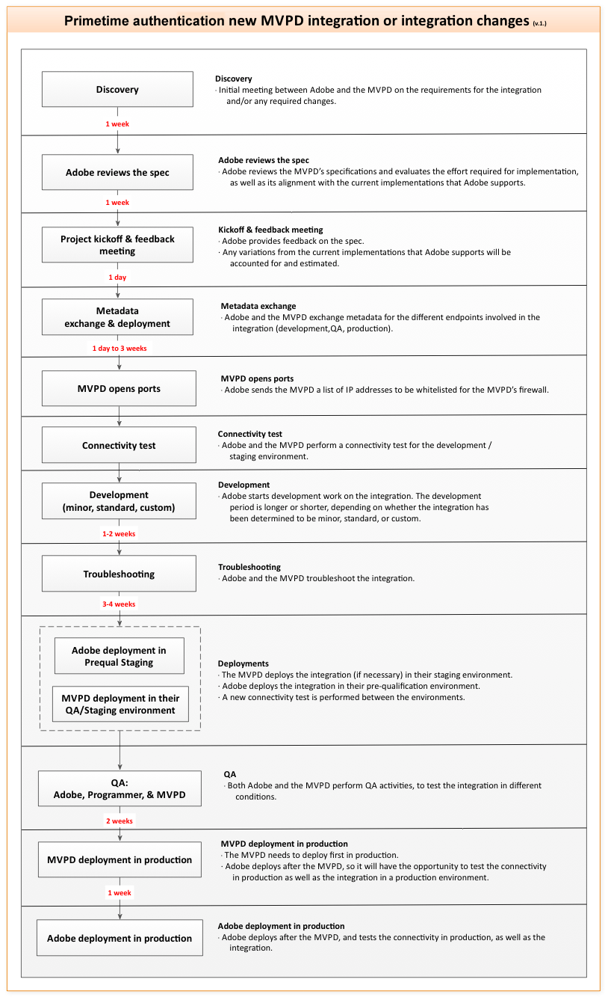

# MVPDのスタートガイド {#mvpd-kickstart-guide}

>[!IMPORTANT]
>
> このページのコンテンツは、情報提供のみを目的として提供されています。 このAPIを使用するには、Adobeの現在のライセンスが必要です。 無断使用は認められません。

このキックスタートガイドは、Adobe® Pass Authenticationとの統合を計画しているマルチチャネルビデオプログラミングディストリビューター（MVPD）を対象としています。

このドキュメントでは、統合プロセスをスムーズかつ効率的に開始するための主要な最初のステップを概説します。 期待を明確にし、統合を成功させるためにパートナーと協力する方法に関するガイダンスを提供することを目的としています。

Adobeには、Adobe Pass認証との統合に役立つ様々なリソースが用意されています。 以下の各セクションの「**」を参照してください。「**&#x200B;と&#x200B;**」Adobeが「**」の説明を提供します。

>[!CAUTION]
>
> ユーザーがエンタイトルメントフローを開始するたびに、ユーザーには1つの不透明な一意のユーザーIDが割り当てられます。 このIDは、MVPDから取得されたもので、プログラマーアプリ内のユーザーを識別するために使用されます。
>
>  
>
> ユーザーIDには、個人を特定できる情報（PII）またはユーザーを識別、連絡、検索するために単独で、または他の詳細と組み合わせて使用できるデータを含めることはできません。

## セットアッププロセス {#setup-process}

セットアッププロセスでは、次の手順を実行します。

*Adobe® Pass Authentication Integration Process*

### キックオフ {#kickoff}

**キックオフフェーズ中に**&#x200B;を提供します：

* **表示名**

  これは、ユーザーに有料テレビ事業者の選択を促す際に、プログラマーのweb サイトまたはアプリケーションに表示される文字列です。

* **ロゴ URL**

  これは112 x 33 ピクセルのファイルで、ユーザーに有料TV プロバイダーの選択を促す際にプログラマーのweb サイトまたはアプリケーションに表示されるロゴが含まれています。

* **Time-to-Live （TTL）**

  TTLは、通常、認証または認証プロセスの一部としてMVPDによって設定される値です。 ただし、Adobeは、これらのTTL値を上書きし、プログラマとMVPDの両方が合意した内容に応じて異なる値を提供できます。

* **資格情報セット**

  これらは、MVPDを使用してユーザーを認証および認証するために使用される資格情報です。 通常、これらの資格情報はユーザー名とパスワードで構成され、両方のプロファイル（ステージングと実稼動）に指定する必要があります。

### メタデータ交換（SAML） {#metadata-exchange-saml}

**Adobeは、メタデータ交換フェーズ中に**&#x200B;を提供します：

* **ステージング環境メタデータ**

  AdobeのSP メタデータは、https://sp.auth-staging.adobe.com/sp/metadataから取得できます。

* **実稼動環境のメタデータ**

  AdobeのSP メタデータは、https://sp.auth.adobe.com/sp/metadataから取得できます。

**メタデータ交換フェーズ中に**&#x200B;を提供します：

* **ステージング メタデータ**

  ステージング環境のMVPDのメタデータ。

* **実稼動メタデータ**

  実稼動環境のMVPD メタデータ。

### 接続性 {#connectivity}

**AdobeからIPを許可リストに加えるする方法を**&#x200B;様に提供します。Adobe Pass Authenticationでは、ファイアウォールでポート 80および443を介したトラフィックを許可し、認証プロセスと認証プロセスの両方で制限されたリソースへのアクセスを有効にする必要があります。

**接続をテストするために、ステージング プロファイルにデプロイメントを**&#x200B;に提供します。

### 開発 {#development}

**Adobeは、**&#x200B;のエンジニアリング部門にMVPDと緊密に連携する時間を提供し、技術的な統合が正しく確立されるようにします。 このプロセスでは、MVPDの固有の要件に合わせたカスタムコードを開発します。

### ステージングでのデプロイ {#deployment-staging}

**Adobeは、PRE-QUAL ステージング環境に最初にデプロイされる必要なコード更新を**&#x200B;に提供します。 このフェーズでは、テスト目的でMVPDを`TestDistributors` サービスプロバイダーと統合するために必要な設定変更も実装されます。

**お客様とAdobeは、**&#x200B;品質保証（QA）の時間を提供し、統合がPRE-QUAL ステージング環境で正常にテストされるようにします。 このフェーズの後、MVPDはリリース ステージング環境に移動され、実際のプログラマーでさらにテストを行います。

### 本番環境への導入 {#deployment-production}

**本番プロファイルにデプロイメントを提供して**&#x200B;接続をテストします。

**Adobeは、PRE-QUAL実稼働環境にデプロイされる必要なコード更新を**&#x200B;に提供します。

**お客様とAdobeは、**&#x200B;品質保証（QA）の時間を提供し、実稼動プロファイルを使用して統合が正常にテストされるようにします。 この時点で問題がなければ、Adobeはインテグレーションをすべてのユーザーが利用できるRELEASE実稼動環境（「ライブ」）に移行できます。

>[!IMPORTANT]
>
> 統合がリリースの本番環境で有効になると、最適な顧客体験を維持することが最も重要になります。 サーバーダウンの問題に効果的に対処するには、MVPDは、このような問題を管理するための詳細なエスカレーション手順ドキュメントをAdobeに提供する必要があります。
>
> その代わりに、Adobeは、MVPDが最新バージョンのAdobe Pass認証エスカレーションプロセスを受け取るようにして、問題を効率的に解決できるようにします。

## 環境アクセス {#access-environments}

**Adobeでは、開発プロセスの様々な段階で**&#x200B;環境へのアクセスが提供されます。

* **事前評価（PRE-QUAL）**

  PRE-QUAL環境は、次のリリース候補をホストし、新しいパートナーの最初の統合プラットフォームとして機能します。 リリース環境に移行する前に、パートナーにはPRE-QUALでの統合をテストする時間が与えられます。

* **リリース（リリース）**

  RELEASE環境は、現在の（安定した）実稼動ビルドをホストします。

これらの環境の使用方法について詳しくは、[Adobe環境について](/help/authentication/notes-technical/environments/understanding-the-adobe-environments.md)のドキュメントを参照してください。

>[!IMPORTANT]
> 
> これらの環境への設定の変更は、確立された変更リクエストプロセスに従って、Adobe担当者を通じて明示的に要求する必要があります。

## カスタマーサポートへのアクセス {#access-customer-support}

**Adobeでは、[Zendesk](https://tve.zendesk.com/home)経由で**&#x200B;のカスタマーサポートシステムへのアクセスを提供します。 Zendeskにアクセスするには、https://tve.zendesk.com/homeでアカウントを登録して作成する必要があります。

Adobe Pass Authentication Teamでは、統合プロセス中に発生する可能性のある質問や技術的な問題について説明します。 [tve-support@adobe.com](mailto:tve-support@adobe.com)までご連絡ください。

## ドキュメントへのアクセス {#access-documentation}

**Adobeでは、[Adobe Experience League](https://experienceleague.adobe.com/en/docs/pass/authentication/home)経由で**&#x200B;の公開ドキュメントへのアクセスを提供します。

Adobe Pass認証チームは、[MVPDの統合ガイド &#x200B;](/help/authentication/integration-guide-mvpds/mvpd-integration-guide-overview.md)の節で利用可能な機能とワークフローに関する包括的なドキュメントを提供しています。 各トピックの詳細については、この節の目次を参照してください。

## テストツールへのアクセス {#access-testing-tool}

**Adobeでは、[Adobe Developer](https://developer.adobe.com/adobe-pass/) web サイト経由で**&#x200B;のAPI探索ツールへのアクセスを提供します。
