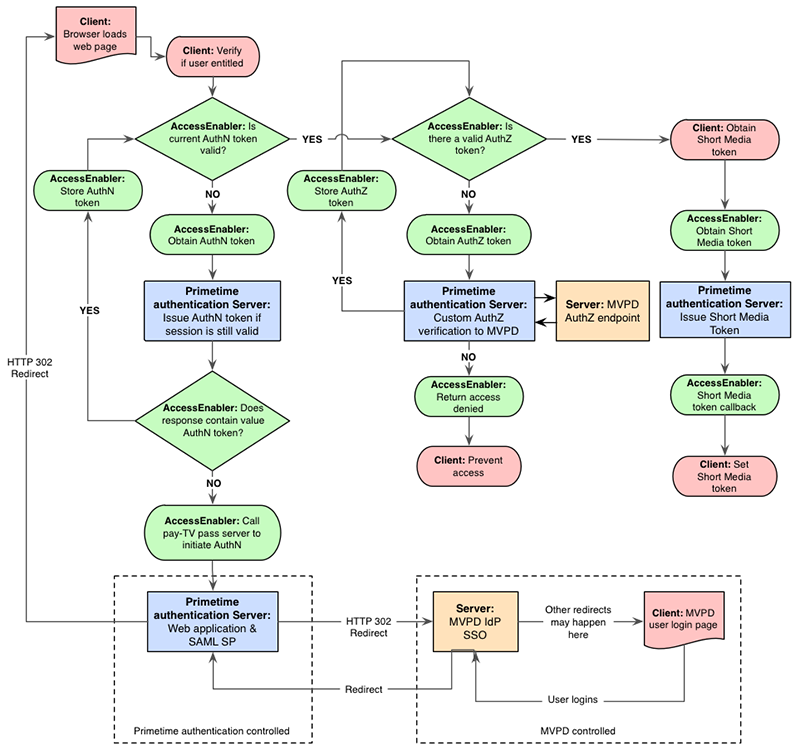

# MVPD の概要 {#mvpd-overview}

>[!NOTE]
>
>このページのコンテンツは情報提供のみを目的としています。 この API を使用するには、Adobeから現在のライセンスが必要です。 無許可の使用は許可されていません。

## 概要 {#intro}

この概要は、Multi-channel Video Programming Distributors （MVPD; マルチチャンネル ビデオ プログラミング ディストリビュータ）向けです。 キックスタート ガイドや統合ガイドなどの追加ドキュメントについては、このドキュメントの最後にある、関連情報の節を参照してください。

TV Everywhere （TVE）は、現在知られている業界動向であり、Pay TV 加入者は、自宅の内外の複数のデバイスをまたいで、既に支払いを済ませているコンテンツにアクセスできます。  TVE は、既存の顧客との関係を維持し、新しい顧客との関係を可能にする新しい機会を提供します。 しかし、こうした機会に加えて、課題も生じています。 TVE では、プログラマーがコンテンツを提供しますが、MVPD は、見込み視聴者が有効な購読者であることを検証するための顧客情報を保持します。

1 人のプログラマーとビューアの認証や承認を調整するのは簡単なこともありますが、数十人から数百人もの異なるプログラマーとの調整はますます複雑になります。 ただし、Adobe® パスを使用すると、NBCUniversal Media、Turner Broadcasting （TBS、TNT、CNN）、Fox Broadcast Networks、Hulu などのプログラマーを含む TVE エコシステム全体にアクセスするために、MVPD は 1 つのシンプルな統合を実装するだけで済みます。  Adobe Pass Authentication は、ユーザーの使用権限を簡単かつ安全に判断できる統合フレームワークを提供します。

結論：Adobe Pass認証は、プログラマーと MVPD の間の権利付与トランザクションを安全に仲介し、サブスクリプションコンテンツへの閲覧者アクセスを促進します。 つまり、Adobe Pass認証を使用すると、適切な顧客が適切なコンテンツに簡単かつ迅速にアクセスできます。

Adobe Pass Authentication を使用すると、MVPD は次を受け取ります。

プログラマとの簡単な統合。  1 つの統合で、複数のコンテンツ所有者から瞬時に接続を提供します。

顧客エンゲージメントの強化。  顧客が複数のプラットフォームやデバイスでコンテンツを表示する際に、ブランド化されたスムーズなエクスペリエンスをサポートします。

認証を保護します。  許可されたユーザーとデバイスのみにプレミアムコンテンツへのアクセス権を付与し、（オプションで）世帯アカウントごとに接続できるデバイスと同時ストリームの数を制限します。

## FAQ {#faq}

Adobe Pass認証のセキュリティ保護 Adobe Pass認証アーキテクチャの第一の優先事項は、許可されたビューアのみが認証され、プレミアムコンテンツへのアクセスが許可されるようにすることです。 Adobe Pass認証は、表示デバイスへのアクセスを厳密にバインドし、特定の世帯のストリーム、セッション、デバイスを制限するのに役立ちます。

Flash Playerは必要ですか？ Adobe Pass Authentication for TV Everywhere は、プレーヤーやプラットフォームに依存せず、Silverlight やHTML5 などの再生アプリケーションと統合されています。 さらに、Adobe Pass認証は、iOSとAndroidを実行する電話やタブレットなどのデバイスのネイティブサポートを提供します。

Adobe Pass Authentication はどのデバイスをサポートしていますか？ Adobe Pass認証は、ブラウザー内表示エクスペリエンス用のHTML5 web キットを備えた、事実上すべてのデバイスでサポートされています。 さらに、Adobe Pass Authentication では、iOS、Android™、Xbox360 （非推奨）、AdobeAir® （非推奨）など、デバイスに固有の様々なプラットフォーム向けに、ネイティブのソフトウェア開発キット（SDK）を引き続き展開しています。 最近、Adobe Pass認証は、ブラウザーページをレンダリングできないデバイス（「スマート」 TV、セットトップボックス、ゲーム機など）向けに、クライアントレスソリューションを発表しました。  ブラウザーページをレンダリングする機能は、MVPD でユーザーを認証するために必要です。

Adobe Pass認証は、TV Everywhere の新しい標準をサポートしていますか？ Adobe Pass Authentication は、CableLabs の OLCA （Online Content Access）仕様に準拠しています。この仕様は、オンライン ソースから有料テレビのお客様にビデオを配信するための技術要件およびアーキテクチャを提供します。 Adobeは、2011 年 6 月に CableLabs 相互運用試験の共同プロジェクトに参加し、サービスプロバイダーの実装に関する試験プロセスに合格しました。 Adobe Pass認証は、認証用の OLCA 仕様に対して検証（完了およびテスト）されます。 認証コンポーネントが完了しましたが、テスト検証は現在 CableLabs テスト環境のリリースを待っています。 また、Adobeは OATC （Open Authentication Technical Consortium）の積極的なメンバーであり、その一部として複数の分科会の仕様策定プロジェクトに参加しています。

認証とは 認証は、MVPD が特定のユーザーが既知の顧客であることを確認するプロセスです。

認証とは 認証とは、MVPD が、認証されたユーザが特定のリソースに対して有効なサブスクリプションを持っていることを確認するプロセスです。

## アーキテクチャ {#architecture}

Adobe Pass Authentication は、MVPD とプログラマーの両方が必要とするビジネスルールに基づいて、バックエンド（サーバーからサーバー）の迅速な統合を可能にするホストサービスです。 つまり、すべての関係者に対する市場投入までの時間の短縮、不正を防ぐための安全な環境、優れた顧客体験を実現し、より多くのプラットフォームでより多くの人が利用できる多くのテレビコンテンツを提供できます。

Adobe Pass認証は、サービスとしてのソフトウェア（SaaS）モデルを通じて提供され、エンドユーザー、MVPD、プログラマーの間で、コンテンツの使用権限を検証するために、より安全な通信を可能にします。 このサービスのコアコンポーネントには、以下が含まれます。

サーバーサイド – ホストされるAdobe Pass認証サーバー。 MVPD の認証系とバックチャネル（サーバ間）通信を行うアプリケーションサーバです。
クライアント側：
クライアント側のアクセス・イネーブラ：アクセス・イネーブラは、プログラマの Web ページまたはプレーヤー・アプリケーションにロードされる小さなファイルです。 プログラマーのコンテンツ表示アプリケーションに使用権限 API を提供し、Adobe Pass Authentication Server と通信します。
クライアントレス Web サービス （Web 非対応デバイス用） – スマート TV、ゲーム機、セットトップボックスなどのデバイスの使用権限 API を提供する RESTful Web サービス。

>[!NOTE]
>
>MVPD の場合、web サービスがAdobe Pass Authentication からの認証および承認リクエストを認識し、必要なデータを想定された形式で応答できる必要があります。
>

Adobe Pass認証を使用すると、Federated Identity Management （SSO）の認証および承認とも呼ばれます）を顧客に提供できます。 Adobe Pass Authentication を使用すると、MVPD によって認証が永続化されている限り、サブスクライバーが最初の認証の後に再度ログインする必要はありません。 （通常は 30 日間）。 これを実現するために、Adobe Pass認証は、お客様に認証トークンの共通ドメインを提供します。 この認証状態情報は、特定の MVPD と統合されているすべての参加サイトで利用できます。

現在、MVPD とのAdobe Pass認証統合のほとんどは、主要な認証標準の 1 つである SAML プロトコルを使用します。 Adobe Pass Authentication は、SAML アーキテクチャではプロキシサービスプロバイダーとして機能し、SAML 認証応答をAdobe共通ドメインのセキュアトークンとして保持します。 Adobe Pass認証は SAML 2.0 に準拠しています。 ただし、現時点では、Adobe Pass Authentication は通常 SAML SSO ソリューションで使用されますが、Adobe Pass Authentication アーキテクチャは特定のプロトコルにはバインドされません。 したがって、OAuth 2.0 ベースのプロトコルやカスタムプロトコルなどの新しいプロトコルのサポートは、時間の経過と共に追加できます。

Adobeは、MVPD の技術チームと連携して、既存の統合のニーズを満たすようにAdobe Pass Authentication を設定します。 「標準」統合と最小限のサポート要件（ドキュメントおよび基本的な電子メールサポート）を前提として、MVPD の統合は無料です。 MVPD が大幅なサポートまたはスケジュールのエスカレーションを必要とする場合、サポート料金が請求される場合があります。または、プロバイダーが Synacor などのソリューションに精通したサードパーティと協力することを希望する場合もあります。

Adobe Pass認証は、次のような MVPD ビジネスロジックの効率的な処理もサポートしています。

自己完結型のビジネスロジックで、MVPD が認可リクエストを受信したときに適用できるものについては、Adobeは、MVPD が認可リクエストを受信したときにビジネスロジックの適用をサポートするために必要なデータを提供する。 このデータには、リクエストを行うユーザーの一意のデバイス ID とデバイスの IP アドレスを含めることができますが、これらに限定されるものではありません。

Adobeソリューションによるユーザー操作や特定の処理が必要なビジネスロジックの場合、Adobeは各 MVPD のカスタムプロパティを維持管理できます。 これらの MVPD 固有の設定やポリシーには、最上位のワークフローの特定のポイントで開始できる事前定義されたワークフローの有効化が含まれます。 カスタムプロパティのサポートについて詳しくは、Adobe担当者にお問い合わせください。

次の図は、MVPD とプログラマーとこれらのAdobe Pass認証コンポーネントの関係を示しています。

*図：アーキテクチャとフローの概要*

## Adobe Pass認証コンポーネント {#components}

Adobe Pass認証エコシステムの主なコンポーネントの一部の概要を次に示します。 これには以下が含まれます。

* [アクセス イネーブラ/クライアントなしの Web サービス](#ae)
* [Adobeがホストするバックエンドサーバー](#backend)
* [トークン](#tokens)

### アクセス イネーブラ/クライアントなしの Web サービス {#ae}

Access Enabler は、ユーザーとのすべての認証および承認のやり取りを容易にし、ユーザーのシステム上でローカルに実行します。 MVPD を使用した実際の使用権限ワークフローを処理するのはアクセスイネーブラです。一方、プログラマーは上位レベルの web ページまたはプレーヤーアプリケーションの責任を維持します。

クライアントレス Web サービスは、Web ページをレンダリングできないデバイスに対してAdobe Pass認証によって提供されます。  これらのデバイスでは、使用権限プロセスが開始され、スマートデバイスでコンテンツが表示されます。一方、MVPD による認証は、web 対応デバイス（PC、スマートフォン、タブレット）で行われます。

アクセス・イネーブラ：

* MVPD 固有の認証および承認ワークフローを開始します。
* プログラマーのリソースまたはチャネルごとに成功した認証応答をキャッシュして、不要なリクエストトラフィックを最小限に抑えます。
* 明示的なデバイス登録など、各 MVPD に固有の定義済みワークフロー用に設定できます。
* 次の形式で使用できます。
   * Flash Playerランタイムが実行できるSWFファイル
   * ブラウザーによって直接実行される JS ファイル
   * iOS、Android、Xbox など、さまざまなプラットフォーム向けのネイティブな Access Enabler。

### Adobeホスト型バックエンドサーバー {#backend}

AdobeがホストするAdobe Pass認証バックエンドサーバー：

* Adobe Pass Authentication とオペレーターの間のサーバー間通信を必要とする MVPD を認証ワークフローおよび承認ワークフローにプロビジョニングします。
* プログラマーサイトおよびアプリケーションの設定を維持します。
* ダウンロード可能な Access Enabler コンポーネント・ファイルをホストします。
* 認証および認証トークンを生成します。

### トークン {#tokens}

Adobe Pass認証使用権限ソリューションは、認証/承認ワークフローが正常に完了したときに取得される特定のデータを生成することに重点を置いています。 これらのデータはトークンと呼ばれます。 寿命は限られており、プラットフォームに依存する場所に安全に保存されます。 有効期限が切れたら、認証ワークフローや承認ワークフローを再開する際に、トークンを再発行する必要があります。

認証/承認ワークフローで発行されるトークンには 3 つのタイプがあります。 2 つは「長期間有効」で、ユーザーの視聴エクスペリエンスの継続性を提供します。 3 つ目は、短期間有効なトークンで、ストリームリッピングを通じて不正を軽減するための業界のベストプラクティスに対するサポートを提供します。 トークンの有効期間（「TTL」）値は、MVPD とプログラマーの間の合意に基づいて設定されます。 ビジネスと顧客に最適な TTL 値を決定します。

**長期間有効な認証トークン**。 お客様がAdobe Pass Authentication を使用して MVPD アカウントに正常にログオンすると、認証が成功します。 次に、Adobe Pass Authentication は、長期間有効な認証（「authN」）トークンを要求元デバイスに関連付け、MVPD に応じて、ユーザーを匿名で識別するグローバル一意識別子（「GUID」）を生成します。

**長期間有効な認証トークン**。 認証に成功すると、Adobe Pass認証は永続的な認証（「authZ」）トークンを作成します。 このトークンは、要求元のデバイスと特定の保護されたリソース（チャネル、シリーズ、エピソードなど）に関連付けられているので、ポータブルではありません。 アクセス イネーブラは、長期間有効な authZ トークンを使用して、実際の表示アクセスに使用される短時間のみ有効なメディア トークンを作成します。

**短時間のみ有効なメディアトークン**。 ユーザーが認証されると、Adobe Pass Authentication によって authZ トークンが生成され、そのトークンを使用して、交換中の改ざんを防ぐためにAdobeによって署名され、暗号化された、1 回限りの短時間のみ有効なメディアトークンが生成されます。 短時間のみ有効なトークンは、Access Enabler API またはクライアントレス Web サービスを通じて埋め込みサイトに公開されるので、保護されたリソースへのアクセスを提供する前に、プログラマーの Media Server は、Adobe Pass認証コンポーネントである Media Token Verifier を使用してトークンを検証する必要があります。

## MVPD 統合のライフサイクル {#lifecycle}

次の図は、Adobe Pass Authentication と MVPD の間の統合のライフサイクルを示しています。

*図：MVPD 統合のライフサイクル*

## 使用権限のフローチャート {#chart}

次のフローチャートに、Adobe Pass認証を使用した使用権限を確認する全体的なプロセスを示します。

*図：Adobe Pass認証を使用した使用権限の確認プロセス*

## 認証手順 {#authn-steps}

次の手順は、Adobe Pass認証認証フローの例を示しています。  これは、ユーザーが MVPD の有効な顧客であるかどうかをプログラマーが判断する使用権限プロセスの一部です。  このシナリオでは、ユーザは MVPD の有効なサブスクライバです。  保護されたコンテンツをプログラマーのFlashアプリケーションを使用して表示しようとしています：

1. ユーザーは、プログラマーの Web ページを参照します。このページは、プログラマーの認証アプリケーションとAdobe PassFlashアクセスイネーブラ コンポーネントをユーザーのマシンに読み込みます。 Flashアプリケーションは、アクセス イネーブラを使用して、プログラマの ID をAdobe Pass Authentication に設定し、Adobe Pass Authentication は、アクセス イネーブラに対して、そのプログラマ（「リクエスタ」）の構成データと状態データを準備します。 アクセス イネーブラは、他の API 呼び出しを実行する前にサーバからこのデータを受信する必要があります。  テクニカル ノート：プログラマは Access Enabler の `setRequestor()` メソッドを使用して ID を設定します。詳細については、「[ プログラマ統合ガイド ](/help/authentication/integration-guide-programmers/programmer-integration-guide-overview.md) を参照してください。
1. ユーザーがプログラマーの保護されたコンテンツを表示しようとすると、プログラマーのアプリケーションがユーザーに MVPD のリストを表示し、ユーザーはそこからプロバイダーを選択します。
1. ユーザーはAdobe Pass Authentication Server にリダイレクトされ、そこでユーザーが選択した MVPD に対する暗号化された SAML リクエストが作成されます。 この要求は、プログラマの代わりに認証要求として MVPD に送信されます。 MVPD のシステムに応じて、ユーザーのブラウザーはログインするために MVPD のサイトにリダイレクトされるか、プログラマーのアプリにログイン iFrame が作成されます。
1. どちらの場合（リダイレクトまたは iFrame）でも、MVPD はリクエストを受け入れ、ログインページを表示します。
1. ユーザーが MVPD を使用してログインすると、MVPD はユーザーのステータスを有料顧客として検証し、MVPD は独自の HTTP セッションを作成します。
1. ユーザーが検証されると、MVPD は応答（SAML および暗号化）を作成し、MVPD はこれをAdobe Pass Authentication に返します。
1. Adobe Pass認証が MVPD 応答を受信し、Adobe Pass認証 HTTP セッションが開いていることを確認し、MVPD からの [SAML](https://en.wikipedia.org/wiki/Security_Assertion_Markup_Language) 応答を検証し、プログラマーのサイトにリダイレクトします。
1. プログラマのサイトが再ロードされ、アクセス イネーブラが再ロードされた後、プログラマは setRequestor （）を再度呼び出します。  現在の構成が変更されているため、setRequestor （）の 2 番目の呼び出しが必要です。サーバで AuthN トークンが生成されるのを待っていることをアクセス イネーブラに通知するフラグが存在します。
1. アクセス イネーブラは、保留中の認証があることを確認し、Adobe Pass Authentication Server からトークンをリクエストします。 トークンは、サーバーの DRM 機能を呼び出すことにより、Flash Playerから取得されます。
1. AuthN トークンはプログラマーのFlash Player LSO キャッシュに格納されます。これで認証が完了し、セッションはAdobe Pass Authentication Server で破棄されます。

## 認証手順 {#authz-steps}

次の手順は、前の節（[ 認証手順 ](#authn-steps)）の続きです。

1. ユーザーがプログラマーの保護されたコンテンツにアクセスしようとすると、プログラマーのアプリケーションはまず、ユーザーのローカルマシンまたはデバイス上の AuthN トークンを確認します。  そのトークンがない場合は、上記の [ 認証手順 ](#authn-steps) に従います。  AuthN トークンが存在する場合、認証フローでは、プログラマのアプリケーションがアクセス イネーブラへの呼び出しを開始し、保護されたコンテンツの特定の項目に対するユーザーの閲覧権限を取得するリクエストを送信します。
1. 保護されたコンテンツの特定の項目は、「リソース識別子」で表されます。  これは、単純な文字列や、より複雑な構造になる可能性がありますが、いずれにせよ、プログラマと MVPD の間でリソース識別子の性質が事前に合意されています。  プログラマのアプリケーションは、リソース識別子をアクセス イネーブラに渡します。  アクセス イネーブラは、ユーザーのローカル マシンまたはデバイス上の AuthZ トークンをチェックします。  AuthZ トークンがない場合、アクセス イネーブラはバックエンドのAdobe Pass Authentication Server にリクエストを渡します。
1. Adobe Pass Authentication Server は、標準化されたプロトコルを使用して MVPD 認証エンドポイントと通信します。  MVPD の応答で、保護されたコンテンツを表示する権限がユーザーに与えられていることが示された場合、Adobe Pass Authentication Server は AuthZ トークンを作成して、ユーザーのマシン上に AuthZ トークンを格納するアクセスイネーブラに戻します。
1. ユーザーのマシンまたはデバイスに保存されている AuthZ トークンを使用して、プログラマーのアプリケーションは、アクセス・イネーブラを呼び出してAdobe Pass認証サーバからメディア・トークンを取得し、そのトークンをプログラマーのアプリケーションに提供します。
1. 最後に、プログラマーのアプリケーションは、メディアトークン検証子コンポーネントを使用して、適切なユーザーが適切なコンテンツを表示していることを確認し、メディアトークンを配置した状態で、ユーザーは保護されたコンテンツを表示できます。

<!--
>![RELATEDINFORMATION]
>
>*   Kickstart Guides, [MVPD kickstart](/help/authentication/mvpd-kickstart-guide.md) and [programmer kickstart](/help/authentication/programmer-kickstart-guide.md). These guides explain the initial steps to take to begin integrating with Adobe Pass Authentication.
>
>*   [MVPD Integration Guide](/help/authentication/mvpd-kickstart-guide.md). This is a lower level technical guide for MVPDs, directed primarily to the software engineers who code and test the applications and systems involved in the integration.
>
>*   [Overview For Programmers](/help/authentication/programmer-overview.md). The same high level of conceptual information as in this MVPD overview, but directed toward the content providers (Programmers).
-->
