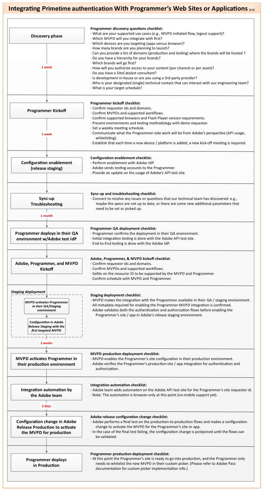

# 番組制作会社向けのスタートガイド {#programmer-kickstart-guide}

>[!IMPORTANT]
>
> このページのコンテンツは、情報提供のみを目的として提供されています。 このAPIを使用するには、Adobeの現在のライセンスが必要です。 無断使用は認められません。

このキックスタートガイドは、Adobe® Pass AuthenticationをWeb サイトまたはアプリケーションに統合する予定のコンテンツプロバイダー（プログラマー）を対象としています。

このドキュメントでは、統合プロセスをスムーズかつ効率的に開始するための主要な最初のステップを概説します。 期待を明確にし、統合を成功させるためにパートナーと協力する方法に関するガイダンスを提供することを目的としています。

Adobeでは、Adobe Pass認証をweb サイトやアプリケーションに統合するのに役立つ様々なリソースを提供しています。 以下の各セクションの「**」を参照してください。「**&#x200B;と&#x200B;**」Adobeが「**」の説明を提供します。

## セットアッププロセス {#setup-process}

セットアッププロセスでは、次の手順を実行します。

*Adobe® Pass Authentication Integration Process*

**キックオフフェーズ中に**&#x200B;を提供します：

* **サービスプロバイダー（依頼者識別子）**

  これは、Adobe Pass Authenticationに対してリクエストを行うweb サイトまたはアプリケーションのブランドを一意に識別する文字列です。 文字列自体は任意ですが、Adobeとプログラマーの間で合意する必要があります

* **チャネル情報**

  これは、サービスプロバイダーが要求したコンテンツチャネルを識別するために使用される一連の文字列です。 多くの場合、チャネルとサービスプロバイダーは同じです。 ただし、1つの識別子で複数のコンテンツチャネルを表すことができます。 これらのチャンネル名の文字列は、対応するケーブルテレビチャンネルに合わせる必要があります。 一部のMVPDは、認証および/または認証プロセス中にこの値を検証する場合があります。

* **ドメイン名**

  このリストには、サービスプロバイダーを表すためにAdobeにリストされている実際のドメイン名が含まれます。 これにより、メタデータを使用して、承認済みのドメインのみがAdobe Pass認証にアクセスできるようになります。 実稼動環境とステージング（テスト）環境の両方にドメイン名を提供し、明確に識別するようにしてください。

**MVPDを使用して**&#x200B;を提供します：

* **資格情報セット**

  これらは、MVPDを使用してユーザーを認証および認証するために使用される資格情報です。 通常、これらの資格情報はユーザー名とパスワードで構成され、MVPDがプロファイル（ステージングと実稼動）の両方に提供します。

* **リソース ID**

  これらは、サービスプロバイダーが保護したいコンテンツチャネル、番組、エピソード、またはアセットに対して一意のIDです。 これらのIDは、認証に関する意思決定を依頼するために使用され、MVPDとの間で合意する必要があります。

>[!IMPORTANT]
>
> プログラマーは、必要な業務契約を締結するためにMVPDと調整する責任があります。 一方、Adobe Pass AuthenticationはMVPDと連携して、技術的な統合が適切に確立されるようにします。
>
> * **新しいMVPD**
>
>     MVPDがAdobeと統合されていない場合は、MVPD固有の要件に基づいてカスタムコードを開発する必要があります。 この開発が完了するまで、MVPDは使用できず、そのMVPDを使用した製品テストは続行できません。
>
> * **既存のMVPD**
>
>     MVPDが既にAdobeと統合されている場合、接続プロセスは大幅に効率化されます。 ほとんどの場合、接続性は、広範な開発ではなく、設定の調整によって迅速に確立できます。
>
> エンドユーザーは最終的にはMVPDのお客様であるため、MVPDによるテストを含め、あらゆる統合には共同品質保証（QA）の取り組みが必要になります。 テストサイクルの調整は、多くの場合、MVPDのリソースの空き状況に応じて異なり、遅延が発生する可能性があります。

## カスタマーサポートへのアクセス {#access-customer-support}

**Adobeでは、[Zendesk](https://tve.zendesk.com/home)経由で**&#x200B;のカスタマーサポートシステムへのアクセスを提供します。 Zendeskにアクセスするには、https://tve.zendesk.com/homeでアカウントを登録して作成する必要があります。 登録できるユーザー数に制限はありません。 登録が完了すると、送信されたチケットに対するコメントを表示したり共有したりできます。

Adobe Pass認証チームは、統合プロセス中に発生する可能性のある質問や技術的な問題についてサポートします。 [tve-support@adobe.com](mailto:tve-support@adobe.com)までご連絡ください。

## ドキュメントへのアクセス {#access-documentation}

**Adobeでは、[Adobe Experience League](https://experienceleague.adobe.com/en/docs/pass/authentication/home)経由で**&#x200B;の公開ドキュメントへのアクセスを提供します。

Adobe Pass認証チームは、「[ プログラマー向け統合ガイド ](/help/authentication/integration-guide-programmers/programmer-integration-guide-overview.md)」のセクションで、利用可能な機能とAPIに関する包括的なドキュメントを提供しています。 各トピックの詳細については、この節の目次を参照してください。

## テストツールへのアクセス {#access-testing-tool}

**Adobeでは、[Adobe Developer](https://developer.adobe.com/adobe-pass/) web サイト経由で**&#x200B;のAPI探索ツールへのアクセスを提供します。

## 構成管理ツールへのアクセス {#access-configuration-management-tool}

**Adobeは、[Adobe Pass TVE ダッシュボード ](https://experience.adobe.com/pass/authentication)を介して、設定とデータを管理するためのセルフサービスツールへの** アクセスを提供します。

Adobe Pass認証チームは、「[TVE ダッシュボードのユーザーガイド ](/help/authentication/user-guide-tve-dashboard/tve-dashboard-overview.md)」セクションで、TVE ダッシュボードの使用方法に関する包括的なドキュメントを提供しています。 各トピックの詳細については、この節の目次を参照してください。
