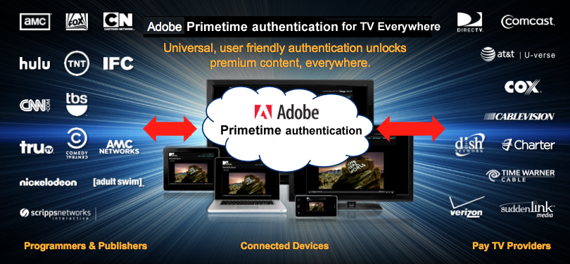

# Adobe® Pass認証について {#about-adobe-pass-authentication}

>[!IMPORTANT]
>
> このページのコンテンツは、情報提供のみを目的として提供されています。 このAPIを使用するには、Adobeの現在のライセンスが必要です。 無断使用は認められません。

## TV Everywhereについて {#about-tv-everywhere}

今日のテレビ視聴者は、いつでもどこでも有料テレビコンテンツにシームレスにアクセスできることを期待しています。 インターネット接続デバイスの台頭により、オーディエンスは次のようなさまざまなプラットフォームでコンテンツを利用しています。

* ノート PC
* タブレット
* スマートフォン
* web サイト
* フェデレーションアプリ
* ゲーム機
* セットトップボックス
* スマートテレビ

TV Everywhereは、有料テレビ加入者が、自宅の内外の複数のデバイスをまたいで、既に支払ったコンテンツにアクセスできるようにする業界の取り組みです。

従来型（リニア） TVは依然として堅調ですが、動画消費で最も急速に成長しているセグメントは、時間のかかるコンテンツ、オンラインストリーミング、代替スクリーンです。 この変化により、動画配信市場は混乱を極め、TV Everywhereは&#x200B;**プログラマー、有料テレビ事業者、および加入者の関心を惹きつける重要なソリューションとなっています。**

### TV Everywhereの目標 {#goals-tv-everywhere}

**技術的な目標**

* 有料テレビの顧客が、あらゆるデバイスやプラットフォームから登録済みコンテンツにシームレスにアクセスできるようにします。

**ビジネス目標**

* 既存の顧客関係を維持、強化しながら、新たな機会を実現します。
* プログラマーやコンテンツ所有者が、より広範なオーディエンスにリーチし、プレミアムコンテンツの価値を最大化できるようにします。
* 視聴者との直接的なオンラインエンゲージメントを通じてブランドを拡大。

### TV Everywhereの課題 {#challenges-tv-everywhere}

TV Everywhereのチャンスには大きな課題があり、権利付与は最も重要です。 視聴者がサブスクリプションコンテンツにアクセスする前に、システムが使用権限を確認する必要があります。

主な質問は次のとおりです。

* ユーザーは、有料テレビ事業者のサブスクリプションを利用していますか？
* サブスクリプションには、リクエストされたコンテンツが含まれていますか？

有料テレビ事業者が顧客データとアクセス権限を制御するため、エンタイトルメントの決定はプログラマーやコンテンツ所有者にとって特に困難です。

使用権限の他にも、次のようないくつかの技術的および統合上の課題が発生します。

* シームレスなアクセスを保証するマルチデバイス戦略を策定する。
* 番組制作会社と有料テレビ事業者との複雑な関係を管理する。
* 不正アクセスの防止とサービス利用規約の適用。
* web サイトやアプリをまたいで、一貫性のあるユーザーフレンドリーな認証体験を提供する。
* アフィリエイト契約に沿った、迅速な市場投入までの時間を維持。
* 複数の統合に関連するコストの制御。

これらの課題により、プログラマーと複数の有料TV認証システムとの間で、リソースを非常に多く必要とし、時間と技術的な専門知識の両方が必要となります。

これらの課題を克服するために、**Adobe® Pass Authentication**&#x200B;は、資格情報の検証を簡素化および合理化し、TV Everywhere コンテンツへのシームレスで安全なアクセスを可能にします。

## Adobe Pass認証の概要 {#introduction-adobe-pass-authentication}

Adobe Pass認証を利用すれば、番組制作会社と有料テレビ事業者の間で行われる権利付与の取り引きを安全に管理し、適切な顧客が容易に適切なコンテンツにアクセスできるようにできます。

*Adobe Pass認証を通じて接続する一部の番組制作会社および有料テレビ事業者*

**Adobe Pass認証のメリット**

* **プログラマー**

  有料テレビ事業者（MVPD （マルチチャネルビデオプログラミングディストリビューター）と呼ばれている事業者と簡単に統合して、最も多くのオーディエンスにリーチし、収益を最適化したい場合。

* **有料テレビ事業者（MVPD）**

  単一の統合を通じて複数のコンテンツ所有者（プログラマー）とつながり、サブスクリプションコンテンツへのオンラインでのアクセスを促進することで顧客満足度を向上させたい方。

* **有料テレビ視聴者**

  時間や場所、デバイスを問わず、すでに支払い済みのコンテンツを視聴したいオーディエンスに最適です。

**プログラマー**

オーディエンスへのリーチと売上を最大化したいプログラマーは、次のことが可能です。

* 複数の直接接続を管理することなく、主要な有料TV プロバイダーと容易に統合できます。
* 主要なプロバイダーやプラットフォームをまたいで認証を確保することで、オーディエンスを拡大したい。
* 安全な認証でプレミアムコンテンツを保護し、承認済みのユーザーやデバイスへのアクセスを制限できます。
* シングルサインオン（SSO）を有効にして、アプリやweb サイト全体のユーザーエクスペリエンスを向上させます。

**有料テレビ事業者（MVPD）**

有料テレビ事業者は、次のような取り組みを通じて顧客体験を向上させ、業務を効率化することができます。

* 単一の統合を通じて複数のコンテンツ所有者とつながる。
* デバイスやプラットフォームをまたいで、ブランドのシームレスな視聴体験を提供する。
* 安全な認証により、不正アクセスを防止し、世帯ごとの同時ストリームを管理。

**有料テレビ視聴者**

加入者はTV Everywhereの恩恵を受けており、いつでも、どこでも、どのデバイスからでも、すでに有料となっているコンテンツを視聴することができます。

### Adobe Pass Authenticationとの統合 {#integrating-adobe-pass-authentication}

有料テレビ事業者または番組制作会社のいずれであっても、Adobe Pass認証と統合するには、積極的な参加が必要です。 ここでは、両方の役割のプロセスの概要を解説します。

#### プログラマー統合プロセス {#programmer-integration-process}

統合が正式に開始されると、追加のガイダンスを利用できますが、通常、プロセスには次のステップが含まれます。

**前提条件**

* CMS （コンテンツ管理システム）:CMS
* コンテンツ配信メカニズム。サードパーティコンテンツ配信ネットワーク（CDN）を含むことがあります。
* web サイトやスタンドアロンアプリケーションにメディアプレーヤーを組み込んだ、既存のオンライン動画プラットフォーム。

**統合タスク**

* Adobe Pass認証[REST API DCR](/help/authentication/integration-guide-programmers/rest-apis/rest-api-dcr/dynamic-client-registration-overview.md)を統合します。
* Adobe Pass認証[REST API V2](/help/authentication/integration-guide-programmers/rest-apis/rest-api-v2/apis/rest-api-v2-apis-overview.md)を統合します。
* Adobe Pass認証[Media Token Verifier](/help/authentication/integration-guide-programmers/features-standard/entitlements/media-tokens.md#media-token-verifier)を統合します。
* 認証、認証、ログアウトワークフローのユーザーインターフェイスを開発します。

プログラマー統合プロセスについて詳しくは、[ プログラマーのキックスタートガイド ](/help/authentication/kickstart/programmer-kickstart-guide.md)および[ プログラマー統合ガイド ](/help/authentication/integration-guide-programmers/programmer-integration-guide-overview.md)のドキュメントを参照してください。

#### 有料テレビ事業者の統合プロセス {#pay-tv-provider-integration-process}

統合が正式に開始されると、追加のガイダンスを利用できますが、通常、プロセスには次のステップが含まれます。

**前提条件**

* Adobe Pass Authentication Non-Disclosure Agreement （NDA）に署名します。
* 認証および認証システムの仕様をAdobe Pass認証エンジニアリングチームに提供します。 最もシンプルな統合をおこなうには、認証用のSAML ベースのID プロバイダー（IdP）とSOAP ベースの認証システムをお勧めします。

**統合タスク**

* Adobe Pass認証サーバーとの接続を確立します。
* ステージングリリースを完了し、品質保証を行います。
* 生産リリースを完了し、品質保証を確保します。

標準の統合は、有料テレビ事業者は無料で利用できます。これには、ドキュメントや基本的な電子メールサポートが含まれます。 ただし、広範なサポートやタイムラインの短縮が必要なプロバイダーにはサポート料金が発生するか、Synacorなどの経験豊富なサードパーティパートナーとの提携を選択する場合があります。

Adobe Pass Authenticationは、有料テレビ プロバイダー固有のビジネスロジックを効率的にサポートできます。

* 認証リクエストを受信したときに有料テレビ事業者が自己完結型で適用するビジネスロジックの場合、Adobeは履行をサポートするために必要なデータ（一意のデバイス ID、IP アドレスなど）を提供します。
* ユーザーの操作やAdobeによる特定の処理を必要とするビジネスロジックの場合、有料テレビ事業者ごとにカスタムプロパティを管理できます。 これらの設定には、認証プロセスの特定のポイントでトリガーされる事前定義済みのワークフローが含まれる場合があります。

有料テレビ事業者の統合プロセスについて詳しくは、[MVPDのキックスタートガイド ](/help/authentication/kickstart/mvpd-kickstart-guide.md)および[MVPD統合ガイド ](/help/authentication/integration-guide-mvpds/mvpd-integration-guide-overview.md)を参照してください。

### 使用権限のフロー {#entitlement-flow}

Adobe Pass Authenticationは、プロキシとして機能し、両当事者に安全で一貫性のあるインターフェイスを提供することで、プログラマーとMVPD間の資格フローを促進します。

プログラマーの場合、Adobe Pass Authenticationは&#x200B;**Standard**&#x200B;または&#x200B;**Premium**&#x200B;層の一部としてAPIを提供します。

* 標準のAdobe Pass認証API:
  * [REST API DCR](/help/authentication/integration-guide-programmers/rest-apis/rest-api-dcr/dynamic-client-registration-overview.md)
  * [REST API V2](/help/authentication/integration-guide-programmers/rest-apis/rest-api-v2/apis/rest-api-v2-apis-overview.md)

* プレミアム Adobe Pass認証API:
  * [Temp Pass APIのリセット](/help/authentication/integration-guide-programmers/features-premium/temporary-access/temp-pass-feature.md#reset-tempass-api-access)
    * [TempPass機能](/help/authentication/integration-guide-programmers/features-premium/temporary-access/temp-pass-feature.md)
  * [劣化API](/help/authentication/integration-guide-programmers/features-premium/degraded-access/degradation-feature.md#degradation-api-access)
    * [デグラデーション機能](/help/authentication/integration-guide-programmers/features-premium/degraded-access/degradation-feature.md)
  * [使用権限サービス監視API](/help/authentication/integration-guide-programmers/features-premium/esm/entitlement-service-monitoring-api.md)

エンタイトルメントのフローについて詳しくは、[ プログラマー統合ガイド ](/help/authentication/integration-guide-programmers/programmer-integration-guide-overview.md#entitlement-flow)のドキュメントを参照してください。

#### 使用権限について {#understanding-entitlements}

Adobe Passの認証ソリューションでは、認証ワークフローと承認ワークフローが正常に完了したときに生成される、特定のデータであるエンタイトルメントの作成を中心に展開します。 これらの使用権限は、保護されたコンテンツへのアクセスを許可しますが、有効期間は限られています。 使用権限が期限切れになると、認証または承認プロセスを再度開始して更新する必要があります。

使用権限について詳しくは、次のドキュメントを参照してください。

* **プロファイル**

  認証に成功すると、Adobe Pass Authenticationは、リクエスト側のアプリケーション、デバイス、サービスプロバイダーの識別子（依頼者識別子）に関連付けられた認証済みプロファイル（「長期間有効」）を作成します。

* **[ユーザーメタデータ](/help/authentication/integration-guide-programmers/features-standard/entitlements/user-metadata.md)**

  認証が成功すると（場合によっては認証後も）、Adobe Pass AuthenticationはMVPDからユーザーメタデータを受け取り、リクエスト側のアプリケーションに公開できます。

* **[決定](/help/authentication/integration-guide-programmers/features-standard/entitlements/decisions.md)**

  認証が成功すると、Adobe Pass Authenticationは、リクエスト側のアプリケーション、デバイス、サービスプロバイダー識別子（依頼者識別子）および特定の保護されたリソース（リソース識別子）に関連付けられた認証決定（「長期間有効」）を作成します。

* **[メディアトークン](/help/authentication/integration-guide-programmers/features-standard/entitlements/media-tokens.md)**

  認証が成功すると、Adobe Pass Authenticationは、成功した再生リクエストに関連付けられたメディアトークン（「短期間有効」）を作成し、不正を軽減するための業界のベストプラクティス（ストリームリッピングなど）をサポートします。

プロファイルと決定の有効期間（「TTL」）値は、プログラマーと有料テレビ事業者の間の合意に基づいて設定され、関係者全員に最もサービスを提供する価値に同意します。

#### ユーザーインターフェイスの構築 {#building-user-interface}

プログラマーは、web サイトやアプリ内のエンタイトルメントワークフローのユーザーインターフェイス（UI）の設計と実装を担当します。一方、ログインプロセスなどの特定の要素は、有料テレビ事業者が処理します。

少なくとも、プログラマーは次の条件を満たす必要があります。

* **プロバイダー選択インターフェイスの実装**
  * 新規ユーザーが有料テレビ事業者を特定し、初めてログインできるようにします。
  * 有料テレビ事業者の中には、利用者を外部のログインページにリダイレクトするものと、iframe内でログインを必要とするものもあります。 プログラマは、必要に応じてiframeを生成するコールバック関数を実装する必要があります。

* **サポートされている有料テレビ プロバイダーの一覧を管理**
  * 承認済みのプロバイダーを通じてのみコンテンツにアクセスできるようにします。

* **認証状態を示す**
  * アプリやweb サイト内で利用者が認証されたタイミングを表示します。

* **保護されたリソースの特定**
  * 表示する前に認証が必要なコンテンツを明確に示します。
  * アクセスが許可されたら、UIを更新して正常な認証を反映します。

## FAQ {#faqs}

**TV Everywhereとは何ですか？**

TV Everywhereは、有料テレビの顧客が、既に購読しているプレミアムコンテンツに、インターネットに接続されたさまざまなデバイスからアクセスできるようにする、業界の取り組みです。 これには、パーソナルコンピューター、タブレット、スマートフォン、ゲーム機、セットトップボックス、スマートテレビが含まれます。 主な課題は、シームレスで使いやすい認証プロセスを確保し、顧客が複数のログインや技術的な障壁なしにサブスクリプションコンテンツにアクセスできるようにすることです。

**Adobe Pass Authenticationとは何ですか。また、TV Everywhereをどのようにサポートしますか？**

Adobe Pass Authenticationは、シンプルかつ効率的な方法でコンテンツに対するユーザーの使用権限を安全に検証することで、TV Everywhereを活用します。 これは、番組制作会社と有料テレビ事業者の両方が設定したビジネスルールに基づいて、迅速なバックエンド統合を容易にするホスト型サービスです。 その結果、あらゆる関係者にとって市場投入までの時間が短縮され、詐欺を最小限に抑えた、より安全な環境が構築され、複数のプラットフォームをまたいでより多くのテレビコンテンツにアクセスできるため、より優れたユーザーエクスペリエンスが実現します。

**Adobe Pass認証はどのように配信されますか？**

Adobe Pass認証は、SaaS （Software as a Service）ソリューションとして提供されます。 このアプローチにより、エンドユーザー、プログラマー、有料テレビ事業者の間で、コンテンツの利用資格の検証のための安全なコミュニケーションが確保されます。

**Adobe Pass Authenticationは、他のTV Everywhere ソリューションと何が異なりますか？**

Adobe Pass Authenticationには、代替ソリューションよりも多くの利点があります。

* **シームレスなシングルサインオン （SSO）** – 個々のプロバイダーとの直接統合とは異なり、Adobe Pass Authenticationでは、ユーザーが異なるweb サイトやアプリ間を移動する際に、永続的なログイン体験を実現できます。
* **幅広い市場浸透度** - プログラマーがAdobe Pass Authenticationと統合すると、米国世帯の90%以上をカバーする有料テレビ事業者にすぐにアクセスできるようになります。
* **Adobeのエコシステムとの統合** - Adobe Analyticsを含む他のAdobe ソリューションとシームレスに連携し、コンテンツの配信、保護、収益化を行うことができます。

**Adobe Pass認証はどの程度安全ですか？**

セキュリティは最優先事項です。 Adobe Pass認証では、許可されたユーザーのみが、ユーザーのデバイスへのアクセスをバインドすることで、プレミアムコンテンツにアクセスできます。 また、1世帯あたりの同時ストリーム、セッション、デバイスの数を制限するオプションも提供しています。

**Adobe Pass認証でサポートされているデバイスはどれですか？**

Adobe Pass Authenticationは、web ベースのデバイス、モバイルデバイス、TV接続デバイスなど、幅広いデバイスで動作するように設計されています。

**Adobe Pass認証には、エンドユーザーに対して何か費用がかかりますか？**

いいえ。 Adobe Pass Authenticationは、エンドユーザーに対して無料で提供されます。
