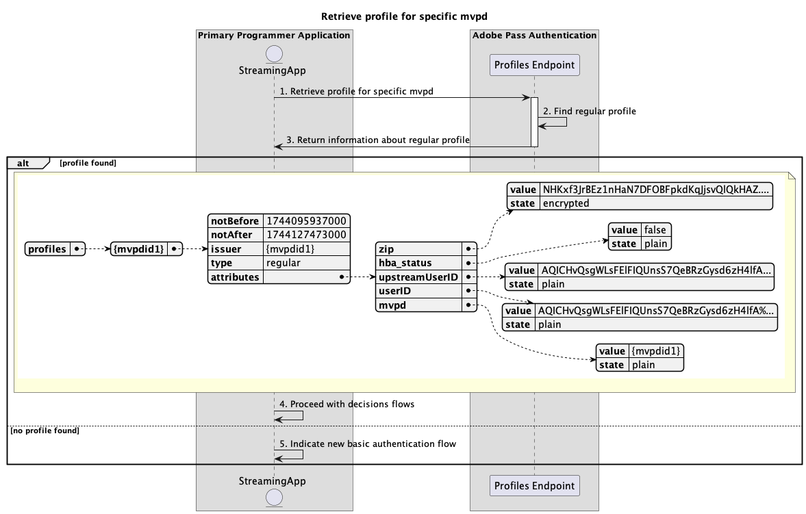

# プライマリアプリケーション内で実行される基本プロファイルフロー {#basic-profiles-flow-primary-application}

>[!IMPORTANT]
>
> このページの内容は、情報提供のみを目的として提供されています。 この API を使用するには、Adobe Systems からの最新のライセンス版が必要です。 無断使用は認められません。

>[!IMPORTANT]
>
> REST API V2 の実装については、[ スロットルメカニズム ](/help/authentication/throttling-mechanism.md) のドキュメントで制限されています。

Adobe Pass認証使用権内の **プロファイルフロー** により、ストリーミングアプリケーションはアクティブなユーザーログインに関する情報にアクセスできます。

基本プロファイルフローを使用すると、次のシナリオについてクエリを実行できます。

* [プロファイルの取得](#retrieve-profiles)
* [特定の mvpd のプロファイルの取得](#retrieve-profile-for-specific-mvpd)
* [特定のコードのプロファイルの取得](#retrieve-profile-for-specific-code)

## プロファイルの取得 {#retrieve-profiles}

### 前提条件 {#prerequisites-retrieve-profiles}

プロファイルを取得する前に、次の前提条件が満たされていることを確認します。

* ストリーミングアプリケーションは、すべての通常のプロファイルを取得しようとしています。

### ワークフロー {#workflow-retrieve-profiles}

次の図に示すように、プライマリ アプリケーション内で実行される基本的なプロファイル取得フロー実装するには、上記の手順に従います。

*プロファイルの取得*

1. **プロファイルの取得:** ストリーミング アプリケーションは、プロファイル エンドポイントにリクエストを送信して、すべてのプロファイル情報を取得するために必要なすべてのデータを収集します。

   >[!IMPORTANT]
   >
   > 次について詳しくは、[ プロファイルの取得 ](../../apis/profiles-apis/rest-api-v2-profiles-apis-retrieve-profiles.md) API ドキュメントを参照してください。
   >
   > * `serviceProvider` のようなすべての _必須_ パラメーター
   > * `Authorization`、`AP-Device-Identifier` などのすべての _必須_ ヘッダー
   > * すべての _オプション_ パラメーターおよびヘッダー

1. **標準プロファイル検索文字列:** Adobe Pass サーバーは、受信したパラメーターとヘッダーに基づいて、すべての有効なプロファイルを識別します。

1. **通常のプロファイルに関する情報を返します** Profiles エンドポイントの応答には、受信したパラメーターとヘッダーに関連付けられている見つかったプロファイルに関する情報が含まれます。

   >[!IMPORTANT]
   >
   > プロファイル応答で提供される情報の詳細については、 [プロファイルの取得](../../apis/profiles-apis/rest-api-v2-profiles-apis-retrieve-profiles.md) API ドキュメントを参照してください。
   > 
   >  
   > 
   > プロファイルエンドポイントは、基本条件が満たされていることを確認するために、リクエストデータを検証します。
   >
   > * _required_ パラメーターおよびヘッダーは有効である必要があります。
   >
   >  
   >
   > 検証に失敗した場合は、エラー応答が生成され、[ 拡張エラーコード ](../../../enhanced-error-codes.md) ドキュメントに従った追加情報が提供されます。

1. **プロファイルを選択し、決定フローを続行：** プロファイルエンドポイント応答にプロファイルが含まれている場合、ストリーミングアプリケーションは（最終的にエンドユーザーとやり取りすることで）内部ロジックを使用して、使用可能なプロファイルの 1 つを選択し、後続の決定フローを続行します。

1. **新しい基本認証フローを指定：** プロファイルエンドポイント応答にプロファイルが含まれていない場合、ストリーミングアプリケーションは新しい基本認証フローを開始するようにユーザーに指示します。

## 特定の mvpd のプロファイルの取得 {#retrieve-profile-for-specific-mvpd}

### 前提条件 {#prerequisites-retrieve-profile-for-specific-mvpd}

特定の MVPD のプロファイルを取得する前に、次の前提条件が満たされていることを確認します。

* 選択されたまたはキャッシュされた `mvpd` 識別子を持つストリーミングアプリケーションは、特定の MVPD の通常のプロファイルを取得したいと考えています。

### ワークフロー {#workflow-retrieve-profile-for-specific-mvpd}

次の図に示すように、プライマリ・アプリケーション内で実行される特定の MVPD の基本的なプロファイル取得フローを実装するには、次の手順に従います。

*特定の mvpd のプロファイルを取得する*

1. **特定の mvpd のプロファイルを取得する:** ストリーミング アプリケーションは、プロファイル エンドポイントにリクエストを送信して、その特定の MVPD のプロファイル情報を取得するために必要なすべてのデータを収集します。

   >[!IMPORTANT]
   >
   > 次について詳しくは、[ 特定の mvpd のプロファイルを取得 ](../../apis/profiles-apis/rest-api-v2-profiles-apis-retrieve-profile-for-specific-mvpd.md)API ドキュメントを参照してください。
   >
   > * `serviceProvider` や `mvpd` など、すべての _必須_ パラメーター
   > * `Authorization`、`AP-Device-Identifier` などのすべての _必須_ ヘッダー
   > * _オプションの_&#x200B;パラメーターとヘッダーすべてを選択

1. **通常のプロファイル検索文字列:** Adobe Pass サーバーは、受信したパラメーターとヘッダーに基づいて有効なプロファイルを識別します。

1. **通常のプロファイルに関する情報を返す:** Profiles エンドポイントの応答には、受信したパラメーターとヘッダーに関連付けられている見つかったプロファイルに関する情報が含まれます。

   >[!IMPORTANT]
   >
   > プロファイル応答で提供される情報の詳細については、 [特定の mvpd のプロファイルの取得](../../apis/profiles-apis/rest-api-v2-profiles-apis-retrieve-profile-for-specific-mvpd.md) API ドキュメントを参照してください。
   > 
   >  
   > 
   > プロファイルエンドポイントは、リクエストデータを検証して、基本条件が満たされていることを確認します。
   >
   > * _required_ パラメーターおよびヘッダーは有効である必要があります。
   > * 指定した `serviceProvider` と `mvpd` の統合はアクティブである必要があります。
   >
   >  
   > 
   > 検証に失敗した場合は、エラー応答が生成され、[ 拡張エラーコード ](../../../enhanced-error-codes.md) ドキュメントに従った追加情報が提供されます。

1. **決定フローで続行：** プロファイルエンドポイント応答にプロファイルが含まれている場合、ストリーミングアプリケーションはプロファイル情報を使用して、後続の決定フローを続行します。

1. **新しい基本認証フローを指定：** プロファイルエンドポイント応答にプロファイルが含まれていない場合、ストリーミングアプリケーションは新しい基本認証フローを開始するようにユーザーに指示します。

## 特定のコードのプロファイルを取得する {#retrieve-profile-for-specific-code}

### 前提 条件 {#prerequisites-retrieve-profile-for-specific-code}

特定の認証コードのプロファイルを取得する前に、次の前提条件が満たされていることを確認してください。

* MVPD との対話型認証を実行するために使用される `code` を持つストリーミング アプリケーションは、特定の認証コードのプロファイルを取得する必要があります。

### ワークフロー {#workflow-retrieve-profile-for-specific-code}

次の図に示すように、プライマリ・アプリケーション内で実行される特定の認証コードに対して基本プロファイル取得フローを実装するには、次の手順に従います。

*特定のコードのプロファイルを取得*

1. **特定のコードのプロファイルを取得：** ストリーミングアプリケーションは、プロファイルエンドポイントにリクエストを送信して、その特定の認証コードのプロファイル情報を取得するために必要なすべてのデータを収集します。

   >[!IMPORTANT]
   >
   > 以下について詳しくは、 [特定のコードについてはプロファイルを取得](../../apis/profiles-apis/rest-api-v2-profiles-apis-retrieve-profile-for-specific-code.md) API ドキュメントを参照してください。
   >
   > * `serviceProvider` などの&#x200B;_必須_&#x200B;パラメーターすべてを選択、`code`
   > * `Authorization` のようなすべての _必須_ ヘッダー
   > * すべての _オプション_ パラメーターおよびヘッダー

1. **標準プロファイルを検索：** Adobe Pass サーバーは、受信したパラメーターとヘッダーに基づいて有効なプロファイルを識別します。

1. **通常のプロファイルに関する情報を返す：** プロファイルエンドポイント応答には、受信したパラメーターとヘッダーに関連付けられた、見つかったプロファイルに関する情報が含まれます。

   >[!IMPORTANT]
   >
   > プロファイル応答で提供される情報について詳しくは、[ 特定のコードのプロファイルの取得 ](../../apis/profiles-apis/rest-api-v2-profiles-apis-retrieve-profile-for-specific-code.md) API ドキュメントを参照してください。
   > 
   >  
   > 
   > プロファイルエンドポイントは、基本条件が満たされていることを確認するために、リクエストデータを検証します。
   >
   > * _required_ パラメーターおよびヘッダーは有効である必要があります。
   >
   >  
   >
   > 検証に失敗した場合は、エラー応答が生成され、[ 拡張エラーコード ](../../../enhanced-error-codes.md) ドキュメントに従った追加情報が提供されます。

1. **決定フローで続行：** プロファイルエンドポイント応答にプロファイルが含まれている場合、ストリーミングアプリケーションはプロファイル情報を使用して、後続の決定フローを続行します。

1. **新しい基本認証フローを指定：** プロファイルエンドポイント応答にプロファイルが含まれていない場合、プライマリアプリケーションは新しい基本認証フローを開始するようにユーザーに指示します。
