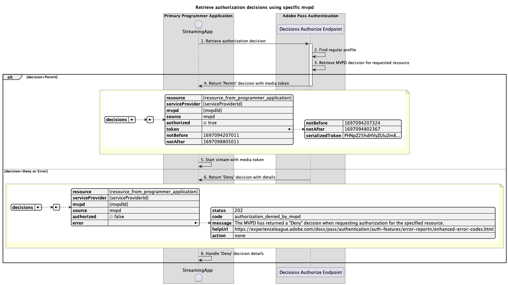

# プライマリアプリケーション内で実行される基本認証フロー {#basic-authorization-flow-performed-within-primary-application}

>[!NOTE]
>
> このページのコンテンツは情報提供のみを目的としています。 この API を使用するには、Adobeから現在のライセンスが必要です。 無許可の使用は許可されていません。

Adobe Pass認証使用権内の **認証フロー** により、ストリーミングアプリケーションは、MVPD がコンテンツのストリーミングをユーザーにリクエストすることを許可するか拒否するかを判断できます。 決定が `Permit` の場合、応答にはメディアトークンが含まれます。 Adobe Pass サーバーがメディアトークンに署名すると、ストリーミングアプリケーションでメディアトークン検証用ライブラリを使用して、ストリームがリリースされる前に信頼性を確認できます。

メディアトークン検証ライブラリを使用した検証は、CDN からストリームを解放するための権限チェーンでリンクされているストリーミングアプリケーションバックエンドサービスで行う必要があります。

## 特定の mvpd を使用した認証決定の取得 {#retrieve-authorization-decisions-using-specific-mvpd}

### 前提条件 {#prerequisites-retrieve-authorization-decisions-using-specific-mvpd}

特定の MVPD を使用して認証決定を取得する前に、次の前提条件が満たされていることを確認してください。

* ストリーミングアプリケーションには、次のいずれかの基本認証フローを使用して MVPD に対して正常に作成された有効な標準プロファイルが必要です。
   * [プライマリアプリケーション内での認証の実行](../basic-flows/rest-api-v2-basic-authentication-primary-application-flow.md)
   * [事前に選択された mvpd を使用して、セカンダリ・アプリケーション内で認証を実行](../basic-flows/rest-api-v2-basic-authentication-secondary-application-flow.md)
   * [事前に選択された mvpd を使用せずに、セカンダリ・アプリケーション内で認証を実行](../basic-flows/rest-api-v2-basic-authentication-secondary-application-flow.md)
* ストリーミングアプリケーションは、ユーザーが選択したリソースを再生する前に、認証決定を取得する必要があります。

### ワークフロー {#workflow-retrieve-authorization-decisions-using-specific-mvpd}

次の図に示すように、プライマリ アプリケーション内で実行される特定の MVPD を使用した基本的な認証フローを実装するには、次の手順に従います。

*特定の mvpd を使用した認証決定の取得*

1. **認証決定の取得：** ストリーミングアプリケーションは、決定の承認エンドポイントを呼び出して、特定のリソースの認証決定を取得するために必要なすべてのデータを収集します。

   次の項目について詳しくは、[ 特定の mvpd を使用した認証決定の取得 ](../../apis/decisions-apis/rest-api-v2-decisions-apis-retrieve-authorization-decisions-using-specific-mvpd.md) API ドキュメントを参照してください。
   * `serviceProvider`、`mvpd`、`resources` など、すべての _必須_ パラメーター
   * `Authorization` や `AP-Device-Identifier` など、すべての _必須_ ヘッダー
   * すべての _オプション_ パラメーターおよびヘッダー

1. **標準プロファイルを検索：** Adobe Pass サーバーは、受信したパラメーターとヘッダーに基づいて有効なプロファイルを識別します。

1. **リクエストされたリソースの MVPD 決定を取得：** Adobe Pass サーバーは MVPD 認証エンドポイントを呼び出して、ストリーミングアプリケーションから受信した特定のリソースに関する `Permit` または `Deny` の決定を取得します。

1. **メディアトークン `Permit` 決定を返す：** 決定の承認エンドポイント応答には、`Permit` 決定とメディアトークンが含まれています。

   決定応答で提供される情報について詳しくは、[ 特定の mvpd を使用した認証の決定の取得 ](../../apis/decisions-apis/rest-api-v2-decisions-apis-retrieve-authorization-decisions-using-specific-mvpd.md) API ドキュメントを参照してください。

   >[!IMPORTANT]
   >
   > 決定の認証エンドポイントは、基本条件が満たされていることを確認するためにリクエストデータを検証します。
   >
   > * _required_ パラメーターおよびヘッダーは有効である必要があります。
   > * 指定した `serviceProvider` と `mvpd` の統合はアクティブである必要があります。
   >
   >  
   > 
   > 検証に失敗した場合は、エラー応答が生成され、[ 拡張エラーコード ](../../../enhanced-error-codes.md) ドキュメントに従った追加情報が提供されます。

1. **メディアトークンでストリームを開始：** ストリーミングアプリケーションは、メディアトークンを使用してコンテンツを再生します。

1. **詳細を含んだ決定 `Deny` 返す：** 決定の承認承認エンドポイント応答には、[ 拡張エラーコード ](../../../enhanced-error-codes.md) ドキュメントに従った `Deny` 決定とエラーペイロードが含まれています。

   決定応答で提供される情報について詳しくは、[ 特定の mvpd を使用した認証の決定の取得 ](../../apis/decisions-apis/rest-api-v2-decisions-apis-retrieve-authorization-decisions-using-specific-mvpd.md) API ドキュメントを参照してください。

   >[!IMPORTANT]
   >
   > 決定の認証エンドポイントは、基本条件が満たされていることを確認するためにリクエストデータを検証します。
   >
   > * _required_ パラメーターおよびヘッダーは有効である必要があります。
   > * 指定した `serviceProvider` と `mvpd` の統合はアクティブである必要があります。
   >
   >  
   > 
   > 検証に失敗した場合は、エラー応答が生成され、[ 拡張エラーコード ](../../../enhanced-error-codes.md) ドキュメントに従った追加情報が提供されます。

1. **決定の詳細 `Deny` 処理：** ストリーミングアプリケーションは、応答からのエラー情報を処理し、それを使用して、オプションで特定のメッセージをユーザーインターフェイスに表示できます。
