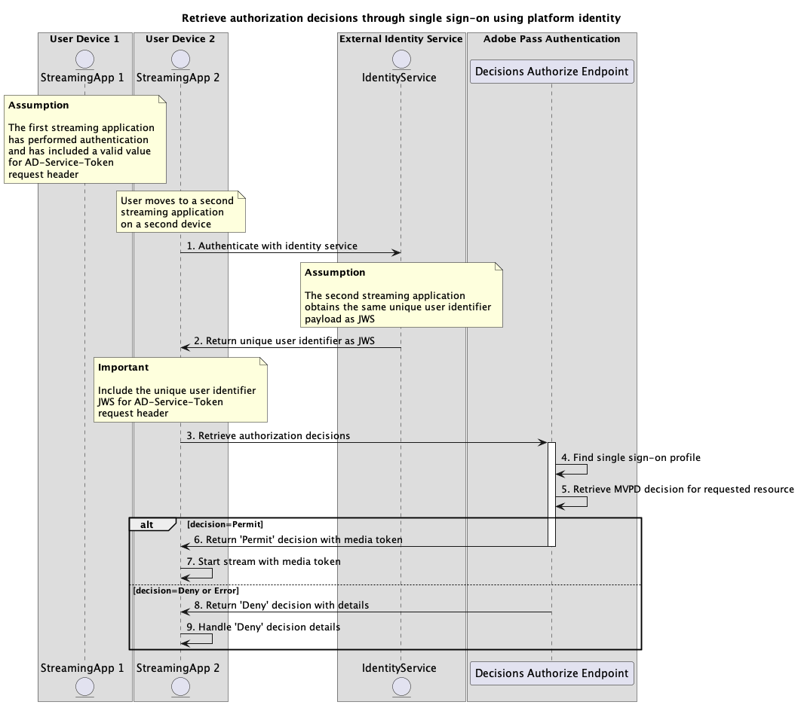

# サービストークンフローを使用したシングルサインオン{#single-sign-on-service-token-full-flows}

サービストークンを使用すると、複数のアプリケーションで一意のユーザー ID を使用して、Adobe Pass サービスの使用時に複数のデバイスやプラットフォームにわたってシングルサインオン（SSO）を実現できます。

アプリケーションは、Adobe Pass システムの外部で外部 ID サービスを使用して、一意のユーザー ID ペイロードを取得する役割を果たします。例えば、次のようなものがあります。

* ユーザーが同じ資格情報を使用して各デバイスにログインし、同じユーザー ID またはユーザーアカウント名に関連付けられている、ダイレクト ツーコンシューマー（DTC） サービス。
* GoogleやFacebookなどのサードパーティの認証サービス。ユーザーは同じ資格情報を使用して各デバイスにログインし、同じメールアドレスに関連付けられます。

アプリケーションは、この一意のユーザー ID ペイロードを指定するすべてのリクエストの `AD-Service-Token` ヘッダーの一部として含める責任があります。

ヘッダーについて詳 `AD-Service-Token` くは、[AD-Service-Token](../../appendix/headers/rest-api-v2-appendix-headers-ad-service-token.md) ドキュメントを参照してください。

## サービストークンを使用したシングルサインオンによる認証の実行 {#performing-authentication-flow-using-service-token-single-sign-on-method}

### 前提条件 {#prerequisites-scenario-performing-authentication-flow-using-service-token-single-sign-on-method}

サービストークンを使用してシングルサインオンを通じた認証フローを実行する前に、次の前提条件が満たされていることを確認します。

* 外部 ID サービスは、複数のデバイスとプラットフォームにまたがって、すべてのアプリケーション `JWS` 対してペイロードとして一貫した情報を返す必要があります。
* 最初のストリーミングアプリケーションは、一意のユーザー識別子を取得し、それを指定するすべてのリクエストの [AD-Service-Token](../../appendix/headers/rest-api-v2-appendix-headers-ad-service-token.md) ヘッダーの一部として `JWS` ペイロードを含める必要があります。
* 最初のストリーミングアプリケーションは MVPD を選択する必要があります。
* 最初のストリーミングアプリケーションは、選択した MVPD でログインするための認証セッションを開始する必要があります。
* 最初のストリーミングアプリケーションは、ユーザーエージェントで選択された MVPD を使用して認証する必要があります。
* 2 番目のストリーミングアプリケーションは、一意のユーザー識別子を取得し、それを指定するすべてのリクエストの [AD-Service-Token](../../appendix/headers/rest-api-v2-appendix-headers-ad-service-token.md) ヘッダーの一部として `JWS` ペイロードを含める必要があります。

>[!IMPORTANT]
>
> 前提
> 
>  
> 
> * 最初のストリーミングアプリケーションは、MVPD を選択するためのユーザーインタラクションをサポートしています。
> * 最初のストリーミングアプリケーションは、ユーザーエージェント内の選択された MVPD で認証するユーザーインタラクションをサポートしています。

### ワークフロー {#workflow-steps-scenario-performing-authentication-flow-using-service-token-single-sign-on-method}

次の図に示すように、サービストークンを使用してシングルサインオンを通じて認証フローを実装するには、指定された手順を実行します。

*サービストークンを使用したシングルサインオンによる認証の実行*

1. **ID サービスによる認証：** 最初のストリーミングアプリケーションは、Adobe Pass システムの外部で ID サービスを呼び出し、一意のユーザー ID に関連付けられた `JWS` ペイロードを取得します。

1. **一意のユーザー ID を JWS として返す：** 最初のストリーミングアプリケーションは、基本的なセキュリティ条件が満たされていることを確認するために応答データを検証します。
   * ペイロードが期限切れではありません。
   * ペイロードが署名されました。

1. **認証セッションの作成：** 最初のストリーミングアプリケーションは、セッションエンドポイントを呼び出して認証セッションを開始するために必要なすべてのデータを収集します。

   次について詳しくは、[ 認証セッションの作成 ](../../apis/sessions-apis/rest-api-v2-sessions-apis-create-authentication-session.md) API ドキュメントを参照してください。
   * `serviceProvider`、`mvpd`、`domainName`、`redirectUrl` などのすべての _必須_ パラメーター
   * `Authorization`、`AP-Device-Identifier` などのすべての _必須_ ヘッダー
   * すべての _オプション_ パラメーターおよびヘッダー

   >[!IMPORTANT]
   >
   > ストリーミングアプリケーションは、リクエストを行う前に、一意のユーザー識別子に有効な値が含まれていることを確認する必要があります。
   >
   >  
   > 
   > ヘッダーについて詳 `AD-Service-Token` くは、[AD-Service-Token](../../appendix/headers/rest-api-v2-appendix-headers-ad-service-token.md) ドキュメントを参照してください。

1. **次のアクションを示す：** セッションエンドポイント応答には、次のアクションに関する最初のストリーミングアプリケーションをガイドするために必要なデータが含まれています。

   セッション応答で提供される情報について詳しくは、[ 認証セッションの作成 ](../../apis/sessions-apis/rest-api-v2-sessions-apis-create-authentication-session.md) API ドキュメントを参照してください。

   >[!IMPORTANT]
   >
   > セッション エンドポイントは、基本的な条件が満たされていることを確認するために、リクエストデータを検証します。
   >
   > * _required_ パラメーターおよびヘッダーは有効である必要があります。
   > * 指定した `serviceProvider` と `mvpd` の統合はアクティブである必要があります。
   >
   >  
   > 
   > 検証に失敗した場合は、エラー応答が生成され、[ 拡張エラーコード ](../../../enhanced-error-codes.md) ドキュメントに従った追加情報が提供されます。

1. **ユーザーエージェントで URL を開く：** セッションエンドポイントの応答には、次のデータが含まれます。
   * MVPD ログインページ内でインタラクティブ認証を開始するために使用できる `url`。
   * `actionName` 属性は「authenticate」に設定されています。
   * `actionType` 属性は「interactive」に設定されます。

   Adobe Pass バックエンドが有効なプロファイルを識別できない場合、最初のストリーミングアプリケーションがユーザーエージェントを開いて指定された `url` を読み込み、Authenticate エンドポイントにリクエストを送信します。 このフローには、複数のリダイレクトが含まれ、最終的にユーザーが MVPD ログインページに移動して、有効な資格情報を提供する場合があります。

1. **Complete MVPD authentication:** 認証フローが正常に完了すると、ユーザーエージェントインタラクションは通常のプロファイルをAdobe Pass バックエンドに保存し、指定された `redirectUrl` に到達します。

1. **特定のコードのプロファイルを取得：** 最初のストリーミングアプリケーションは、プロファイルエンドポイントにリクエストを送信してプロファイル情報を取得するために必要なすべてのデータを収集します。

   次について詳しくは、[ 特定のコードのプロファイルの取得 ](../../apis/profiles-apis/rest-api-v2-profiles-apis-retrieve-profiles-for-specific-code.md)API ドキュメントを参照してください。
   * `serviceProvider`、`code` などのすべての _必須_ パラメーター
   * `Authorization`、`AP-Device-Identifier` などのすべての _必須_ ヘッダー
   * すべての _オプション_ パラメーターおよびヘッダー

   >[!NOTE]
   >
   > 提案：ストリーミングアプリケーションは、ユーザーエージェントが指定された `redirectUrl` に到達するのを待って、通常のプロファイルが正常に生成および保存されたかどうかを確認できます。

1. **標準プロファイルを検索：** Adobe Pass サーバーは、受信したパラメーターとヘッダーに基づいて有効なプロファイルを識別します。

1. **通常のプロファイルに関する情報を返す：** プロファイルエンドポイント応答には、受信したパラメーターとヘッダーに関連付けられた、見つかったプロファイルに関する情報が含まれます。

   プロファイル応答で提供される情報について詳しくは、[ 特定のコードのプロファイルの取得 ](../../apis/profiles-apis/rest-api-v2-profiles-apis-retrieve-profiles-for-specific-code.md) API ドキュメントを参照してください。

   >[!IMPORTANT]
   >
   > プロファイルエンドポイントは、基本条件が満たされていることを確認するために、リクエストデータを検証します。
   >
   > * _required_ パラメーターおよびヘッダーは有効である必要があります。
   >
   >  
   > 
   > 検証に失敗した場合は、エラー応答が生成され、[ 拡張エラーコード ](../../../enhanced-error-codes.md) ドキュメントに従った追加情報が提供されます。

1. **決定フローで続行：** 最初のストリーミングアプリケーションは、後続の決定フローで続行できます。

   >[!IMPORTANT]
   >
   > ストリーミングアプリケーションは、リクエストを行う前に、一意のユーザー識別子に有効な値が含まれていることを確認する必要があります。
   >
   >  
   > 
   > ヘッダーについて詳 `AD-Service-Token` くは、[AD-Service-Token](../../appendix/headers/rest-api-v2-appendix-headers-ad-service-token.md) ドキュメントを参照してください。

1. **ID サービスによる認証：** 2 つ目のストリーミングアプリケーションは、Adobe Pass システムの外部で ID サービスを呼び出し、一意のユーザー ID に関連付けられた `JWS` ペイロードを取得します。

1. **一意のユーザー ID を JWS として返す：** 2 番目のストリーミングアプリケーションは、基本的なセキュリティ条件が満たされていることを確認するために応答データを検証します。
   * ペイロードが期限切れではありません。
   * ペイロードが署名されました。

1. **プロファイルの取得：** 2 番目のストリーミングアプリケーションは、プロファイルエンドポイントにリクエストを送信して、すべてのプロファイル情報を取得するために必要なすべてのデータを収集します。

   次について詳しくは、[ プロファイルの取得 ](../../apis/profiles-apis/rest-api-v2-profiles-apis-retrieve-profiles.md) API ドキュメントを参照してください。
   * `serviceProvider` のようなすべての _必須_ パラメーター
   * `Authorization`、`AP-Device-Identifier` などのすべての _必須_ ヘッダー
   * すべての _オプション_ パラメーターおよびヘッダー

   >[!IMPORTANT]
   >
   > ストリーミングアプリケーションは、リクエストを行う前に、一意のユーザー識別子に有効な値が含まれていることを確認する必要があります。
   >
   >  
   > 
   > ヘッダーについて詳 `AD-Service-Token` くは、[AD-Service-Token](../../appendix/headers/rest-api-v2-appendix-headers-ad-service-token.md) ドキュメントを参照してください。

1. **シングルサインオンプロファイルの検索：** Adobe Pass サーバーは、受信したパラメーターとヘッダーに基づいて有効なシングルサインオンプロファイルを識別します。

1. **シングルサインオンプロファイルに関する情報を返す：** プロファイルエンドポイント応答には、受信したパラメーターとヘッダーに関連付けられた、見つかったプロファイルに関する情報が含まれます。

   プロファイル応答で提供される情報について詳しくは、[ プロファイルの取得 ](../../apis/profiles-apis/rest-api-v2-profiles-apis-retrieve-profiles.md) API ドキュメントを参照してください。

   >[!IMPORTANT]
   >
   > プロファイルエンドポイントは、基本条件が満たされていることを確認するために、リクエストデータを検証します。
   >
   > * _required_ パラメーターおよびヘッダーは有効である必要があります。
   >
   >  
   > 
   > 検証に失敗した場合は、エラー応答が生成され、[ 拡張エラーコード ](../../../enhanced-error-codes.md) ドキュメントに従った追加情報が提供されます。

1. **決定フローで続行：** 2 番目のストリーミングアプリケーションは、後続の決定フローで続行できます。

   >[!IMPORTANT]
   >
   > ストリーミングアプリケーションは、リクエストを行う前に、一意のユーザー識別子に有効な値が含まれていることを確認する必要があります。
   >
   >  
   > 
   > ヘッダーについて詳 `AD-Service-Token` くは、[AD-Service-Token](../../appendix/headers/rest-api-v2-appendix-headers-ad-service-token.md) ドキュメントを参照してください。

## サービストークンを使用したシングルサインオンを通じた認証決定の取得 {#performing-authorization-flow-using-service-token-single-sign-on-method}

### 前提条件 {#prerequisites-scenario-performing-authorization-flow-using-service-token-single-sign-on-method}

サービストークンを使用してシングルサインオンを通じて認証フローを実行する前に、次の前提条件が満たされていることを確認します。

* 外部 ID サービスは、複数のデバイスとプラットフォームにまたがって、すべてのアプリケーション `JWS` 対してペイロードとして一貫した情報を返す必要があります。
* 最初のストリーミングアプリケーションは、一意のユーザー識別子を取得し、それを指定するすべてのリクエストの [AD-Service-Token](../../appendix/headers/rest-api-v2-appendix-headers-ad-service-token.md) ヘッダーの一部として `JWS` ペイロードを含める必要があります。
* 2 つ目のストリーミングアプリケーションでは、ユーザーが選択したリソースを再生する前に、認証決定を取得する必要があります。

>[!IMPORTANT]
>
> 前提
>
>  
> 
> * 最初のストリーミングアプリケーションで認証が実行され、[AD-Service-Token](../../appendix/headers/rest-api-v2-appendix-headers-ad-service-token.md) リクエストヘッダーに有効な値が含まれています。

### ワークフロー {#workflow-steps-scenario-performing-authorization-flow-using-service-token-single-sign-on-method}

次の図に示すように、サービストークンを使用してシングルサインオンを通じて認証フローを実装するには、指定された手順を実行します。

*サービストークンを使用したシングルサインオンを通じた認証決定の取得*

1. **ID サービスによる認証：** 2 つ目のストリーミングアプリケーションは、Adobe Pass システムの外部で ID サービスを呼び出し、一意のユーザー ID に関連付けられた `JWS` ペイロードを取得します。

1. **一意のユーザー ID を JWS として返す：** 2 番目のストリーミングアプリケーションは、基本的なセキュリティ条件が満たされていることを確認するために応答データを検証します。
   * ペイロードが期限切れではありません。
   * ペイロードが署名されました。

1. **認証決定の取得：** 2 番目のストリーミングアプリケーションは、決定の承認エンドポイントを呼び出して、特定のリソースの認証決定を取得するために必要なすべてのデータを収集します。

   次の項目について詳しくは、[ 特定の mvpd を使用した認証決定の取得 ](../../apis/decisions-apis/rest-api-v2-decisions-apis-retrieve-authorization-decisions-using-specific-mvpd.md) API ドキュメントを参照してください。
   * `serviceProvider`、`mvpd`、`resources` など、すべての _必須_ パラメーター
   * `Authorization` や `AP-Device-Identifier` など、すべての _必須_ ヘッダー
   * すべての _オプション_ パラメーターおよびヘッダー

   >[!IMPORTANT]
   >
   > ストリーミングアプリケーションは、リクエストを行う前に、一意のユーザー識別子に有効な値が含まれていることを確認する必要があります。
   >
   >  
   > 
   > ヘッダーについて詳 `AD-Service-Token` くは、[AD-Service-Token](../../appendix/headers/rest-api-v2-appendix-headers-ad-service-token.md) ドキュメントを参照してください。

1. **シングルサインオンプロファイルの検索：** Adobe Pass サーバーは、受信したパラメーターとヘッダーに基づいて有効なシングルサインオンプロファイルを識別します。

1. **リクエストされたリソースの MVPD 決定を取得：** Adobe Pass サーバーは MVPD 認証エンドポイントを呼び出して、ストリーミングアプリケーションから受信した特定のリソースに関する `Permit` または `Deny` の決定を取得します。

1. **メディアトークン `Permit` 決定を返す：** 決定の承認エンドポイント応答には、`Permit` 決定とメディアトークンが含まれています。

   決定応答で提供される情報について詳しくは、[ 特定の mvpd を使用した認証の決定の取得 ](../../apis/decisions-apis/rest-api-v2-decisions-apis-retrieve-authorization-decisions-using-specific-mvpd.md) API ドキュメントを参照してください。

   >[!IMPORTANT]
   >
   > 決定の認証エンドポイントは、基本条件が満たされていることを確認するためにリクエストデータを検証します。
   >
   > * _required_ パラメーターおよびヘッダーは有効である必要があります。
   > * 指定した `serviceProvider` と `mvpd` の統合はアクティブである必要があります。
   >
   >  
   > 
   > 検証に失敗した場合は、エラー応答が生成され、[ 拡張エラーコード ](../../../enhanced-error-codes.md) ドキュメントに従った追加情報が提供されます。

1. **メディアトークンでストリームを開始：** 2 番目のストリーミングアプリケーションは、メディアトークンを使用してコンテンツを再生します。

1. **詳細を含んだ決定 `Deny` 返す：** 決定の承認承認エンドポイント応答には、[ 拡張エラーコード ](../../../enhanced-error-codes.md) ドキュメントに従った `Deny` 決定とエラーペイロードが含まれています。

   決定応答で提供される情報について詳しくは、[ 特定の mvpd を使用した認証の決定の取得 ](../../apis/decisions-apis/rest-api-v2-decisions-apis-retrieve-authorization-decisions-using-specific-mvpd.md) API ドキュメントを参照してください。

   >[!IMPORTANT]
   >
   > 決定の認証エンドポイントは、基本条件が満たされていることを確認するためにリクエストデータを検証します。
   >
   > * _required_ パラメーターおよびヘッダーは有効である必要があります。
   > * 指定した `serviceProvider` と `mvpd` の統合はアクティブである必要があります。
   >
   >  
   > 
   > 検証に失敗した場合は、エラー応答が生成され、[ 拡張エラーコード ](../../../enhanced-error-codes.md) ドキュメントに従った追加情報が提供されます。

1. **決定の詳細 `Deny` 処理：** 2 番目のストリーミングアプリケーションは、応答からのエラー情報を処理し、それを使用して、オプションで特定のメッセージをユーザーインターフェイスに表示できます。

>[!NOTE]
>
> 事前認証フローの手順は、認証フローの手順と同じです。ただし、使用されるエンドポイントが、「[ 特定の mvpd を使用した事前認証決定の取得 ](../../apis/decisions-apis/rest-api-v2-decisions-apis-retrieve-preauthorization-decisions-using-specific-mvpd.md) ドキュメントで説明されているエンドポイントである点が異なります。
