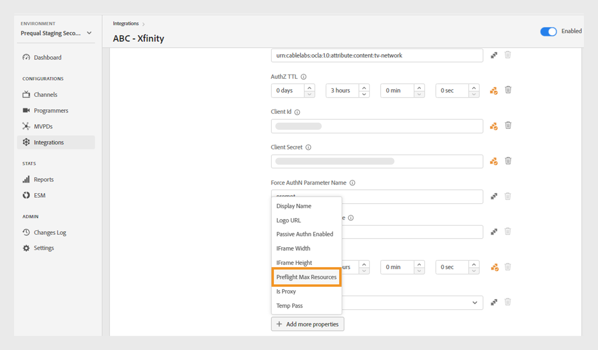
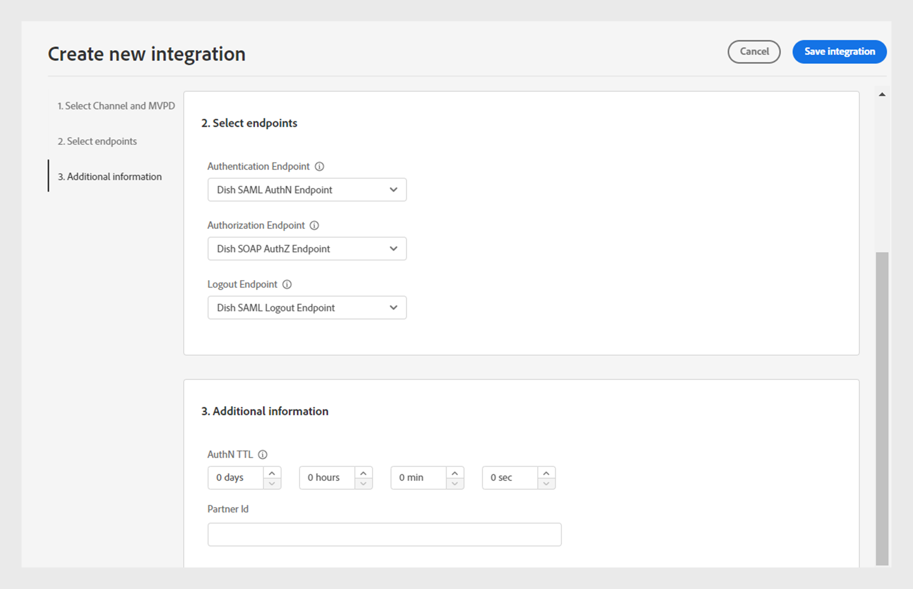

# 統合

>[!NOTE]
>
>このページのコンテンツは情報提供のみを目的としています。 この API を使用するには、Adobeから現在のライセンスが必要です。 無許可の使用は許可されていません。

この **統合** tve ダッシュボードの「」セクションでは、チャネルと MVPD 間の統合の設定を表示および管理できます。 以下の手順でも可能です [新しい統合の作成](#create-new-integration) 要件に応じて。

この **統合** 左側のパネルのタブには、既存の統合のリストと次の詳細が表示されます。

* 統合が現在アクティブか非アクティブかを示すステータス
* 特定のチャネルと各 MVPD をリンクする統合
* チャネル ID を使用したチャネル名
* MVPD 表示名と MVPD ID

*既存の統合のリスト*

にチャネルまたは MVPD の名前を入力 **検索** リストの上のバーをクリックすると、統合について詳しく確認できます。

## 統合設定の管理 {#manage-integration-conf}

特定の統合を管理するには、次の手順に従います。

1. 「」を選択します **統合** 左パネルの「」タブ。
1. 提供されたリストから統合を選択して、次のセクションの様々な設定を表示および編集します。

   * [エンドポイントの選択](#endpoint-selection)
   * [Platform 設定](#platform-settings)
   * [ユーザーメタデータ](#user-metadata)

>[!IMPORTANT]
>
> 表示 [変更のレビューとプッシュ](/help/authentication/tve-dashboard-review-push-changes.md) 設定変更のアクティベートに関する詳細情報

### エンドポイントの選択 {#endpoint-selection}

このセクションでは、認証、認可、およびログアウトの各フローに使用される MVPD のエンドポイントを、それぞれのドロップダウンメニューから選択できます。

*認証、承認およびログアウトのフローのエンドポイント*

>[!NOTE]
>
>MVPD は、各フローに 1 つまたは複数のエンドポイントを提供できます。 新しいチャネルを統合する場合、MVPD は各フローで優先エンドポイントを指定する必要があります。

>[!IMPORTANT]
>
>エンドポイントに対する変更は、統合の全体的な動作に影響を与えます。 これらの変更は、MVPD から確認を受けた後にのみ実装する必要があります。

### Platform 設定 {#platform-settings}

このセクションでは、すべての統合設定を表示および編集できます [プラットフォーム](/help/authentication/tve-dashboard-reports.md#platforms). これらの設定は、個々のプラットフォームに基づいて変更できます。 例えば、別のプラットフォームのデフォルト値を維持しながら、Android で認証 TTL 時間を調整できます。

プラットフォーム設定の各プロパティは、MVPD によって設定されたデフォルト値を継承しますが、必要に応じて調整できます。

>[!IMPORTANT]
>
>プラットフォーム設定で各プロパティに設定される値を決定するには、MVPD との契約が必要です。

>[!IMPORTANT]
>
> 設定の継承は、MVPD 設定（最も一般的）から始まり、MVPD エンドポイント、統合、プラットフォームカテゴリ、プラットフォーム（最も具体的な値を保持する）へと連鎖します。

**Platform 設定** を使用して、継承チェーンの各レベルの設定を上書きします。 チェーン内の使用可能なレベルは、次のようにグループ化されます。

* **すべてに対するデフォルト**：特定のプラットフォームの値が定義されていない場合、プログラマーの実装に関係なく、すべてのプラットフォームにわたって共通に適用できるプロパティの値を設定します。

* **デスクトップデバイス**：プログラミング方法（JS SDK または REST API）に関係なく、すべてのデスクトップコンピューターおよびラップトップコンピューターに適用されるプロパティの値を設定します。

* **モバイルデバイス**：次のようなすべてのモバイルデバイスに適用されるプロパティの値を設定します **iOS**, **Android**、など（プログラミングアプローチ（SDK または REST API）に関係なく）。

* **テレビ接続デバイス**：次のようなすべてのテレビ接続デバイスに適用されるプロパティの値を設定します **tvOS**, **Roku**, **FireTV**、その他（プログラミング方法（SDK または REST API）に関係なく）

* **未識別のデバイス**：現在のメカニズムではプラットフォームを正確に識別できないすべてのデバイスに適用されるプロパティの値を設定します。 このような場合は、MVPD で定義されている最も制限が厳しいルールを適用します。

  

  *プラットフォームのカテゴリとデバイス*

を選択  アイコンは各プロパティの右側にあり、前述の各継承レベルで使用されるプロパティを参照できます。

#### 最もよく使用されるビジネスフロー {#most-used-flows}

この **Platform 設定** セクションには、様々なビジネスフローで使用される様々なプロパティが用意されています。 実際のプロパティは、特定の統合で選択された MVPD によって異なる場合があります。 最も使用されているフローを次に示します。

**すべてのプラットフォームでの AuthN TTL および AuthZ TTL**

>[!IMPORTANT]
>
>認証（AuthN）の TTL と承認（AuthZ）の TTL の値は、MVPD 設定に合わせる必要があります。

次の手順に従って、特定の統合に関するすべてのプラットフォームで認証および認証 TTL を変更します。

1. 「」を選択します **統合** 左パネルの「」タブ。
1. AuthN TTL および AuthZ TTL の値を変更する統合を選択します。
1. に移動します。 **Platform 設定** セクション。

1. を選択 **すべてに対するデフォルト** タブの下 **Platform 設定**.

   >[!NOTE]
   >
   >の期間を変更する場合 **AuthN TTL** および **AuthZ TTL** プラットフォームカテゴリまたは特定のプラットフォームの場合は、それに応じてプラットフォームを選択します。

   

   *すべてのプラットフォームでの AuthN TTL AuthZ TTL 期間の変更*

   **回答：** AuthN TTL プロパティ **B.** AuthZ TTL プロパティ

1. 上向き矢印と下向き矢印を選択して、の日数、時間数、分数、秒数の期間を調整します **AuthN TTL** および **AuthZ TTL** プロパティ。

期間 **AuthN TTL** および **AuthZ TTL** すべてのプラットフォームで、次の場合にのみ更新されます [変更のレビューとプッシュ](/help/authentication/tve-dashboard-review-push-changes.md).

**Platform SSO を有効にする**

>[!IMPORTANT]
>
>**シングルサインオンを有効にする** プロパティは、次でのみサポートされています *iOS、tvOS、Roku および FireTV* プラットフォーム。 これらのプラットフォームでシングルサインオンをサポートする MVPD との統合にのみ適用されます。

特定の統合およびプラットフォームで SSO を有効化または無効化するには、次の手順に従います。

1. 「」を選択します **統合** 左パネルの「」タブ。
1. シングルサインオンを有効または無効にする統合を選択します。

1. に移動します。 **Platform 設定** セクション。

1. シングルサインオンを有効にするプラットフォームまたはプラットフォームのカテゴリを選択してください **Platform 設定**.

   

   *特定のプラットフォームのシングルサインオンを有効にする*

   **回答：** シングルサインオンプロパティ **B.** Platform 権限の適用プロパティ

1. を選択 **はい** 有効にする、または **不可** を無効にするには **シングルサインオンを有効にする** ドロップダウンメニュー。

1. を選択 **はい** 有効にする、または **不可** を無効にするには **プラットフォーム権限の適用** ドロップダウンメニュー。

   **プラットフォーム権限の適用** プロパティは、ユーザーの決定が次のどちらであるかを制御します **許可** または **拒否** テレビプロバイダーのサブスクリプションへのプラットフォームアクセスが尊重されます。

   例えば、次の両方に該当する場合： **シングルサインオンを有効にする** および **プラットフォーム権限の適用** が有効になっていて、ユーザーが TV プロバイダーのサブスクリプションへのプラットフォームアクセスを拒否することを選択すると、それぞれのアプリケーション（チャネル）は、別のアプリケーション（チャネル）によって取得されたAdobe Pass認証トークンを使用できなくなります。

この **シングルサインオン** 選択したプラットフォームのプロパティは、の後にのみ有効または無効になります [変更のレビューとプッシュ](/help/authentication/tve-dashboard-review-push-changes.md).

**ホームベースの認証を有効にする**

OAuth2 ベースの MVPD のホームベースの認証を有効または無効にするには、次の手順に従います。

1. 「」を選択します **統合** 左パネルの「」タブ。
1. ホームベースの認証を有効または無効にする統合を選択します。
1. に移動します。 **Platform 設定** セクション。
1. ホームベースの認証を有効にするプラットフォームまたはプラットフォームのカテゴリを選択します **Platform 設定**.

   

   *特定のプラットフォームでホームベースの認証を有効にする*

   **回答：** Attempt HBA プロパティ **B.** HBA AuthN TTL プロパティ

1. を選択 **はい** とを有効にするには **不可** を無効にするには **Attempt HBA** ドロップダウンメニュー。

>[!IMPORTANT]
>
>期間の変更 **HBA AuthN TTL** プロパティは避ける必要があります。 承認プロセスで予期しないエラーが発生する可能性があります。

この **Attempt HBA** 特定の MVPD のプロパティは、次の場合にのみ有効または無効になります [変更のレビューとプッシュ](/help/authentication/tve-dashboard-review-push-changes.md).

#### プロパティをさらに追加 {#add-more-properties}

この **プロパティをさらに追加** を使用すると、特に一般的でないフローの統合用に、追加の固有プロパティを柔軟に含めることができます。

次のプロパティを追加できます。

* すべてのプラットフォームで、次を選択します。 **すべてに対するデフォルト** タブをクリックします。
* プラットフォームのカテゴリの場合は、 **デスクトップデバイス**, **モバイルデバイス**、または **テレビ接続デバイス** タブをクリックします。
* 特定のデバイスに対して、次を選択します **iOS**, **Android**, **tvOS**, **Roku**、または **FireTV** タブをクリックします。

これらのプロパティを追加することで有効にできる様々なフローの例を次に示します。

**事前承認済みリソースの数の変更**

ほとんどの MVPD は、デフォルトで最大 5 つのリソース ID を使用したプリフライト authZ 呼び出しをサポートしています。
ただし、MVPD がこの上限の引き上げに同意した場合は、 **プロパティをさらに追加** を選択して、 **プリフライトの最大リソース** 「オプション」メニューから選択します。

**プリフライトの最大リソース** は、MVPD で合意された上限を指定できる新しい属性を追加します。

*Preflight Max Resources プロパティの追加*

この **プリフライトの最大リソース** プロパティはの後にのみ追加されます [変更のレビューとプッシュ](/help/authentication/tve-dashboard-review-push-changes.md).

**MVPD の表示名またはロゴ URL の変更**

MVPD ピッカーを作成せず、提供された設定に依存するプログラマーアプリケーションの場合は、に移動します。 **プロパティをさらに追加** を選択して、 **表示名** または **ロゴ URL** 各 MVPD に必要な表示名またはロゴ URL をオプションメニューから追加します。

同じ MVPD に対して、これらのプロパティに異なる値を使用できるのは、デバイスのプラットフォームと目的のユーザーエクスペリエンスによって異なります。

*表示名またはロゴ URL プロパティを追加します*

この **表示名** または **ロゴ URL** プロパティはの後にのみ追加されます [変更のレビューとプッシュ](/help/authentication/tve-dashboard-review-push-changes.md).

**アプリ（チャネル）切り替え時の新しい認証フローのリクエスト**

ユーザーがアプリを切り替えるときに新しい認証を強制する場合。 その場合は、に移動できます。 **プロパティをさらに追加**&#x200B;を選択し、 **アグリゲータごとの認証** プロパティ。

追加中 **アグリゲータごとの認証** 各チャネルのシングルサインオンを効果的に解除します。

*アグリゲータプロパティごとに認証を追加*

この **アグリゲータごとの認証** プロパティはの後にのみ追加されます [変更のレビューとプッシュ](/help/authentication/tve-dashboard-review-push-changes.md).

追加後、次を選択します **はい** 有効にする **アグリゲータごとの認証** 選択した統合のプロパティ。

#### プロパティの削除 {#delete-properties}

を選択  各プロパティの右側にあるアイコンをクリックして、不要になったプロパティを削除します。

>[!NOTE]
>
>一部のプロパティは、選択した MVPD の必須要件のため、削除できません。

プロパティは次から削除されます **Platform 設定** 次の後にのみセクション [変更のレビューとプッシュ](/help/authentication/tve-dashboard-review-push-changes.md).

### ユーザーメタデータ {#user-metadata}

このセクションでは、MVPD で共有される各ユーザーメタデータ パラメーターの設定を更新できます。

>[!NOTE]
>
>各 MVPD は、異なるパラメータを共有する場合があります。 MVPD が共用できるパラメーターについて詳しくは、Adobe担当者にお問い合わせください。

ユーザーメタデータセクションには、次の列が表示されます。

**キー**:API で値の抽出に使用される実際のユーザーメタデータパラメーターを表します。

**説明**：各ユーザーメタデータパラメーターの簡単な説明が提供されます。

**暗号化**：この列では、を選択して API のパラメーターを有効/無効にできます **はい** または **不可** それぞれドロップダウンメニューから。 オプトイン **はい** api でパラメーター値が暗号化されることを示します。 暗号化は、で定義された証明書を使用して実行されます。 **ユーザーメタデータ** スコープ。

>[!TIP]
>
>
> 必ず以下を確認します **郵便番号** パラメーターは暗号化されています。

で使用可能な証明書について詳しくは、こちらを参照してください [プログラマー](/help/authentication/tve-dashboard-programmers.md#available-certificates) および [チャネル](/help/authentication/tve-dashboard-channels.md#available-certificates) セクション。

**Enabled**：この列では、を選択して API のパラメーターを有効/無効にできます **はい** または **不可** それぞれドロップダウンメニューから。

*ユーザーメタデータに使用可能なパラメーター*

## 新しい統合の作成 {#create-new-integration}

現在の設定で新しい MVPD との新しい統合を作成するには、次の手順に従います。

1. 「」を選択します **統合** 左パネルの「」タブ。
1. を選択 **新しい統合の作成** ～の右上に **統合** セクション。

   

   *新しい統合の作成*

   次のセクションが表示されます。

   **チャネルと MVPD を選択**

   を選択 **チャネル** から **チャネルを選択** 新しい統合を追加するためのドロップダウンメニュー。 チャネルを選択したら、必要なを選択します **MVPD** から **MVPD を選択** 選択したチャネルと統合されるドロップダウンメニュー。

   

   *チャネルと MVPD を選択*

   **エンドポイントを選択**

   必要な MVPD を選択した後、 **エンドポイントを選択**  セクションには、その特定の MVPD 用に設定されたデフォルトのエンドポイントが事前に入力されます。

   >[!IMPORTANT]
   >
   >MVPD で特に指定されていない限り、どのフローでもデフォルトのエンドポイントを変更しないでください。

   

   *エンドポイントを選択*

   **追加情報**

   このセクションには、で選択した MVPD 用に設定する必要がある様々なプロパティが含まれています。 **チャネルと MVPD を選択** セクション。

   >[!NOTE]
   >
   > 実際のプロパティは、で選択した MVPD によって異なる場合があります。 **チャネルと MVPD を選択** セクション。

   例えば、 **AuthN TTL** または **パートナー ID** （チャネル ID）を使用して、次の画像の MVPD ログインページでブランド提携を行います。

   

   *追加情報を編集*

   を選択 **統合を保存** ～の右上に **新しい統合の作成** セクション。

新しい統合は、次の場合にのみ作成されます： [変更のレビューとプッシュ](/help/authentication/tve-dashboard-review-push-changes.md).

## 統合を無効にする {#disable-integratgion}

統合を無効にするには、次の手順に従います。

1. 「」を選択します **統合** 左パネルの「」タブ。
1. 無効にする統合を選択します。
1. 選択した統合の右上にある切替スイッチを無効にします。

   

   *統合を無効にする*

統合は、次の場合にのみ無効になります [変更のレビューとプッシュ](/help/authentication/tve-dashboard-review-push-changes.md).

統合が無効になると、エンドユーザーは特定の MVPD を使用して認証または承認できなくなります。

