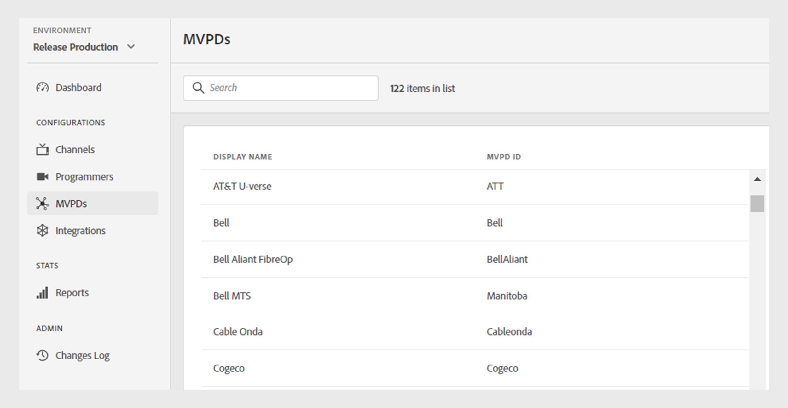

# MVPD

>[!NOTE]
>
>このページのコンテンツは情報提供のみを目的としています。 この API を使用するには、Adobeから現在のライセンスが必要です。 無許可の使用は許可されていません。

TVE Dashboard の **MVPD** セクションでは、Adobe Pass認証エコシステムに統合された MVPD のリストを表示できます。

左側のパネルの [**MVPD**] タブには、MVPD のリストと次の詳細が表示されます。

* **表示名**：各 MVPD のピッカーの表示名。

* **MVPD ID**：システム内の新しい統合の設定に使用される MVPD の一意の ID。

*統合 MVPD の一覧*

特定の MVPD を検索するには、リストの上にある **検索** バーに MVPD の名前を入力します。
