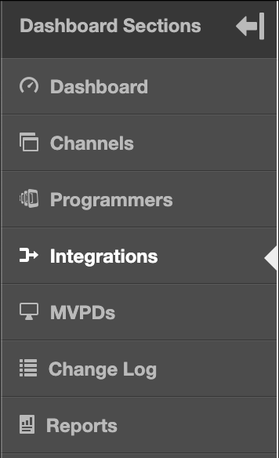

# Primetime TVE ダッシュボードユーザーガイド {#tve-db-user-guide}

>[!NOTE]
>
>このページのコンテンツは情報提供のみを目的としています。 この API を使用するには、Adobeから現在のライセンスが必要です。 無許可の使用は許可されていません。

## 概要 {#tve-db-intro}

[[!DNL Adobe] TVE ダッシュボード（TVE ダッシュボード）](https://console.auth.adobe.com/) は、Adobe Pass Authentication 製品チームとビジネス上の関係を持つメディア会社（プログラマー）で働くユーザーを対象としたセルフサービスダッシュボードです。

アクセス権を取得するには、テクニカルアカウントマネージャー（TAM）にお問い合わせください。 アクセスするには、2 つの新しいユーザーグループをAdobe Marketing Cloud組織で設定する必要があります。

* TVE ダッシュボードの読み取り/書き込み – このグループのメンバーは、ダッシュボードのすべての編集可能なセクションに対する完全な権限を持ちます
* TVE ダッシュボード読み取り専用 – このグループのメンバーは、ダッシュボード全体での表示権限のみを持ちます

このユーザーガイドを詳しく説明する前に、次の資料を確認して、Adobe Pass Authentication 製品チームが提供するフローと機能を理解し、このドキュメントで使用される用語について理解しておくことをお勧めします。

* [TVE テクニカルペーパー](/help/authentication/technical-paper.md)
* [プログラマ キックスタートガイド](/help/authentication/programmer-kickstart-guide.md)
* [使用権限フロー](/help/authentication/entitlement-flow.md)
* [用語集](/help/authentication/glossary.md)

このユーザーガイドの次の節に進み、会社のチャネル、プログラマー、またはチャネルと MVPD （マルチチャネルビデオプログラムディストリビューター）間の統合に関する様々な設定を管理する方法を確認します。

>[!IMPORTANT]
>TVE ダッシュボードでは、基本ワークスペースと詳細ワークスペースを切り替えることができます。 それには、右上隅のアイコンを切り替えます。 Advanced Workspace は、Adobe Pass Authentication 製品チームが提供する機能に関する高度な知識と十分な技術的知識を持つユーザーを対象としています。

*図 1:Adobe Primetime TVE ダッシュボードの「基本/詳細ワークスペース」ドロップダウン*

## 環境 {#authn-environments}

ユーザーが実行する必要のあるタスクに応じて、Adobe Pass Authentication 環境を切り替える必要が生じる場合があります。 Adobe Pass認証環境について詳しくは、次のドキュメントを参照してください。 [Adobe Pass認証環境について](/help/authentication/understanding-the-adobe-environments.md).

TVE ダッシュボードには、次に示すように、Prequalification （事前選定）および Release という 2 つの環境が用意されています。各環境には、Staging および Production という 2 つのプロファイルがあります。

* [前提条件のステージング](https://console-prequal.auth-staging.adobe.com/)
* [初期生成](https://console-prequal.auth.adobe.com/)
* [リリースステージング](https://console.auth-staging.adobe.com/)
* [実稼動をリリース](https://console.auth.adobe.com/)

環境を切り替えるには、以下に示すドロップダウン要素から、エントリで表される目的の環境をクリックします。

*図 2:Adobe Passの TVE ダッシュボード環境ドロップダウン*

>[!IMPORTANT]
>
>TVE Dashboard を使用してAdobe Pass Authentication 設定に管理上の変更を加える場合、適切に機能させるために、以下の手順に従うことを強くお勧めします。

TVE ダッシュボードを使用してAdobe Pass Authentication 設定に管理上の変更を加えるには：

* で変更を実行します。 [ステージングのリリースと検証](http://sp.auth-staging.adobe.com/apitest/api.html).
* で変更を実行します。 [実稼動環境の前提条件と検証](http://sp.auth-staging.adobe.com/apitest/api.html).
* で変更を実行します。 [実稼動環境をリリースし、それらを検証します](http://sp.auth-staging.adobe.com/apitest/api.html).

>[!IMPORTANT]
>
>管理変更を有効にするには、ユーザーは、サイドバーの左下に表示されるボタンを選択して「変更を確認およびプッシュ」セクションに移動する必要があります。変更を確認するには、新しく作成した変更の説明を追加し、「プッシュ設定」を選択して設定の更新を確認します。

*図 3:Adobe Primetime TVE ダッシュボードのレビューとプッシュの変更通知*

## セクション {#sections}

メディア会社（プログラマー）で作業するユーザーは、サイドバーから TVE ダッシュボードの次のセクションにアクセスできます。

* **チャネル** - コンテンツプロバイダーに関連する設定が含まれます
* **プログラマー** - 1 つ以上を集計している親組織に関連する設定が含まれます **チャネル**
* **統合**  – 間の統合に関連する設定が含まれます **チャネル** および **MVPD**
* **MVPD**  – 利用可能なに関連する設定が含まれます **MVPD**
* **報告書** - AuthN TTL、AuthZ TTL、SSO の 3 種類のレポートの集計データが含まれます
* **変更ログ** - TVE ダッシュボード設定に適用された最新の変更が含まれます

*図 4:Adobe Primetimeの TVE ダッシュボードセクション*

### チャネル {#tve-db-channels-section}

このセクションでは、使用可能なチャネルの設定を表示および編集したり、新しい設定を作成したりできます。 使用可能なチャネルの 1 つをクリックすると、次のタブを含む画面が返されます。

* **チャネルデータ**
   * **チャネル Id** - システムで使用されるチャネルの一意の ID。「リクエスター ID」とも呼ばれます。
   * **表示名** - チャネルの商品名。
* **一般設定**
   * **Analytics 設定** - Adobe Analyticsに転送されるAdobe Pass認証イベントを設定します。 この機能を有効にする前に、レポートスイート ID （RSID）を設定する必要がある方法について詳しくは、Adobeにお問い合わせください。
* **証明書**

  認証フローで使用される証明書のリストが、発行組織、発行日、有効期限と共に含まれます。 これらの証明書は、秘密鍵または公開鍵として機能し、検証目的で使用されます。
* **ドメイン**

  それぞれのチャネルがAdobe Pass Authentication と通信するドメインのリストが含まれます。
* **統合**

  使用可能な MVPD との統合のリストが、有効になっているかどうかにかかわらず、各統合のステータスと共に含まれます。 特定のエントリをクリックすると、統合ページに移動できます。
* **登録アプリケーション**

  アプリケーション登録のリストが含まれます。 詳しくは、ドキュメントを確認してください [動的なクライアント登録管理](/help/authentication/dynamic-client-registration-management.md).

* **カスタムスキーム**

  カスタムスキームのリストが含まれます。 詳しくは、 [iOS/tvOS アプリケーションの登録](/help/authentication/iostvos-application-registration.md) および [動的なクライアント登録管理](/help/authentication/dynamic-client-registration-management.md)

#### ドメインの追加/削除 {#add-delete-domains}

選択したチャネルに対して新しいドメインを追加するプロセスを開始するには、ドメイン リストの下の「新しいドメインを追加」ボタンをクリックする必要があります。 これにより、ドメイン名を指定できる新しいドメインエントリが作成されます。 より一般的なドメインがドメインリストに既に存在する場合は、新しいサブドメインを追加しないでください。

*図：チャネルの「ドメイン」タブ*

### プログラマー {#tve-db-programmers-section}

このセクションでは、使用可能なプログラマーの設定を表示および編集したり、新しい設定を作成したりできます。 利用可能なプログラマーの 1 つをクリックすると、次のタブを含む画面が返されます。

* **プログラマーデータ**
   * **プログラマー Id** - システムで使用されるプログラマーの一意の ID。
   * **表示名** - プログラマーの商品名。
   * **ロゴ Url** - プログラマーの商用ロゴ URL （Uniform Resource Locator）。
   * **ロゴのプレビュー**  – 上記の Uniform Resource Locator （URL）からダウンロードした、プログラマーの商用ロゴのプレビュー。

* **証明書**

  認証フローで使用される証明書のリストが、発行組織、発行日、有効期限と共に含まれます。 これらの証明書は、秘密鍵または公開鍵として機能し、検証目的で使用されます。

* **チャネル**

  この特定のプログラマーに属するチャネルのリストが含まれます。 特定のエントリをクリックすると、「チャネル」セクションに移動できます。

* **登録アプリケーション**

  アプリケーション登録のリストが含まれます。 詳しくは、 [動的なクライアント登録管理](/help/authentication/dynamic-client-registration-management.md).

* **カスタムスキーム**

  カスタムスキームのリストが含まれます。 詳しくは、 [iOS/tvOS アプリケーションの登録](/help/authentication/iostvos-application-registration.md) および [動的なクライアント登録管理](/help/authentication/dynamic-client-registration-management.md).

### 統合 {#tve-db-integrations-sec}

このセクションでは、チャネルと使用可能な MVPD の間の統合の設定を表示および編集したり、新しい設定を作成したりできます。 使用可能な統合のいずれかをクリックすると、基本ワークスペースを使用している場合は 1 ページが返され、詳細ワークスペースを使用している場合は次のタブが表示される画面が返されます。

* **統合データ**
   * **統合 Id**- 「_」文字で区切られたチャネルの一意の ID に MVPD の一意の ID を追加した結果。
   * **チャネル表示名** - チャネルの商品名。
   * **チャネル Id** - システムで使用されるチャネルの一意の ID。「リクエスター ID」とも呼ばれます。
   * **MVPD 表示名** - MVPD の商品名。
   * **MVPD Id** - システムで使用される MVPD の一意の ID。
* **一般設定**
   * **ユーザーメタデータキー**  – 特定の統合に使用可能なメタデータキーの設定。
   * **Platform 固有の設定**  – 特定のプラットフォームに対して異なる設定を指定します（例：TTL、SSO、IFrames）。

* **認証設定**
   * Adobe Pass認証機能に関連する設定が含まれます。
* **認証設定**
   * Adobe Pass認証認証機能に関連する設定が含まれます。
* **ログアウト設定**
   * Adobe Pass認証ログアウト機能に関する設定が含まれます。

#### 統合を作成 {#create-integration}

新しい統合を作成するには、次の手順に従ってください。

* 「Add New Integration」ボタンをクリックします。
* チャネルを検索して選択
* mvpd の検索と選択
* tve ダッシュボードが「統合 ID」を計算し、使用可能な MVPD エンドポイントを表示するまで待ちます
* 認証、承認、ログアウトの各エンドポイントを選択するか、デフォルト値を使用します。
* 「統合を作成」ボタンをクリック
* mvpd の設定に応じて、ポップアップが表示されて追加のプロパティを要求できます。このプロパティは MVPD によって事前に提供されているはずなので、このプロパティを要求しない場合は、新しく作成された統合ページへのリダイレクトが行われます

*図 5. Adobe Primetime TVE ダッシュボードの新規統合ウィンドウ*

#### 統合を更新 {#update-integration}

既存の統合を更新するには、「統合」セクションまたは「統合」タブを含む「チャネル」セクションから、その特定の統合のテーブルエントリをクリックします。

基本ワークスペースモードを使用する場合、このセクションでは、認証および認証トークン TTL （time-to-live）や iFrame 設定など、最も一般的に更新される設定を表示および編集できます。 動的に定義されるトークン永続性 TTL をサポートする MVPD との統合では、TTL 設定が見つからない場合があることに注意してください（のエントリ 1.19 を参照）。 [MVPD 統合要件](/help/authentication/mvpd-integr-features.md)）に設定します。

詳細ワークスペースモードを使用する場合、このセクションでは、あまり一般的でない設定を表示および編集できます。

基本および高度なワークスペースモードの場合、これらの設定はプラットフォームレベルで変更できます（例えば、Android では認証 TTL トークンのカスタム値を選択し、他のすべてのプラットフォームではデフォルトに設定）。

>[!IMPORTANT]
>MVPD/MVPD エンドポイント/統合/Platform （Platform が最も具体的な値を持ち、MVPD が最も一般的なデフォルト）の設定継承チェーンを理解することが重要です。

*図 6. Adobe Primetime TVE ダッシュボードのプロパティ継承チェーンコンポーネント*

#### Platform 固有の設定 {#platform-sp-settings}

このサブセクションは、特定のプラットフォームの設定を上書きするために使用できます。 使用可能なプラットフォームは次のとおりです。

* **すべてのプラットフォーム**  – 特定のプラットフォームに他の値が設定されていない場合に、プログラマーの実装に関係なく、すべてのプラットフォームに適用される値を設定します。
* **Android** - Adobe Pass Authentication Android SDK を介してプログラマー実装に適用される値を設定します。
* **クライアントレス REST API** - Adobe Pass認証 REST API を使用して、プログラマー実装に適用される値を設定します。
* **消防テレビ** - Adobe Pass Authentication FireTV SDK を介してプログラマー実装に適用される値を設定します。
* **FLASHSDK**  – このプラットフォームは非推奨（廃止予定）です。 **非推奨**
* **Javascript SDK** - Adobe Pass Authentication JavaScript SDK を介してプログラマー実装に適用される値を設定します。
* **Roku** - Adobe Pass認証 REST API を介してプログラマーの実装に適用され、デバイスタイプとして「Roku」を送信する値を設定します。 これは、Roku デバイスの場合は、クライアントレス REST API プラットフォームに設定された値よりも優先されます。
* **Xbox ネイティブ SDK**  – このプラットフォームは非推奨（廃止予定）です。 **非推奨**
* **Xbox 360 REST API** - Adobe Pass Authentication REST API を介してプログラマーの実装に適用され、デバイスタイプとして「xbox」を送信する値を設定します。 Xbox 360 デバイスの場合、クライアントレス REST API プラットフォームで設定した値よりも優先されます。
* **Xbox One REST API** - Adobe Pass認証 REST API を介してプログラマーの実装に適用され、デバイスタイプとして「xboxOne」を送信する値を設定します。 これは、XboxOne デバイスの場合、クライアントレス REST Api プラットフォームで設定された値よりも優先されます。
* **iOS** - Adobe Pass Authentication iOS SDK を介してプログラマー実装に適用される値を設定します。
* **tvOS** - Adobe Pass Authentication tvOS SDK を介してプログラマー実装に適用される値を設定します。

*図 7. Adobe Primetime TVE Dashboard Platform 固有の設定*

#### Platform シングルサインオンを有効にする {#enable-platform-sso}

特定の統合とプラットフォームについてシングルサインオンを有効/無効にするには、以下の手順に従ってください。

* 高度なワークスペースモードを使用していることを確認します
* 目的の統合に移動します
* に移動します。 **一般設定** タブ
* シングル サインオンを有効または無効にするプラットフォームを選択してください
* を切り替え **シングルサインオンを有効にする** 目的の値にフラグを設定します（はい/いいえ）

  >[!IMPORTANT]
  >以下の点に注意することが重要です。 **シングルサインオンを有効にする** flag は、iOS、tvOS、Roku、FireTV の各プラットフォームで、シングルサインオンをサポートする MVPD との統合でのみ使用できます。

* を切り替え **プラットフォーム権限の適用** 目的の値にフラグを設定します（はい/いいえ）

  >[!IMPORTANT]
  >以下の点に注意することが重要です。 **プラットフォーム権限の適用** フラグは、ユーザーの TV プロバイダー購読へのプラットフォーム アクセスを許可または拒否するユーザーの決定を強制するかどうかを制御します。 次の場合のシナリオを検討します **シングルサインオンを有効にする** フラグが「Yes」に設定されている。 **プラットフォーム権限の適用** フラグも「はい」に設定され、ユーザーが TV プロバイダーのサブスクリプションへのプラットフォームアクセスを拒否することを選択すると、それぞれのアプリ（チャンネル）は、別のアプリ（チャンネル）によって取得されたAdobe Pass認証トークンを使用できなくなります。

#### ホームベースの認証を有効にする {#enable-hba}

次の手順に従って、のホーム ベース認証を有効/無効にしてください **OAuth2** ベースの MVPD:

* 高度なワークスペースモードを使用していることを確認します
* 目的の統合に移動します
* に移動します。 **認証設定** タブ
* に移動します。 **AuthN の動的ルール** サブタブ
* を切り替え **Attempt HBA** 目的の値にフラグを設定します（はい/いいえ）

>[!IMPORTANT]
>「HBA AuthN TTL」の値は決して上書きしないでください。上書きすると、認証フローが予期せず失敗する可能性があります。

～に手を伸ばす **tve-support@adobe.com** SAML ベースの MVPD に対してホーム ベース認証を有効にする方法については、を参照してください。

### MVPD {#tve-db-mvpds-sec}

このセクションでは、使用可能な MVPD の設定を表示できます。 利用可能な MVPD のいずれかをクリックすると、次のタブを含む画面が返されます。

* **MVPD データ**
   * **MVPD Id** - システムで使用される MVPD の一意の ID。
   * **表示名** - ユーザーのピッカーで使用される MVPD の商品名。
   * **ロゴ Url** - MVPD の商用ロゴ URL （Uniform Resource Locator）。
   * **ロゴのプレビュー**  – 上記の Uniform Resource Locator （URL）からダウンロードした MVPD の商用ロゴのプレビュー。
* **一般設定**
   * **ユーザーメタデータキー**
      * 特定の MVPD で使用可能なメタデータキー。
   * **クライアントデータプロパティ**
      * **認証/アグリゲータ** - 「はい」に設定した場合、ユーザーがアクセスしようとしている新しいチャネルごとに新しい認証トークンが必要になります。
      * **Passive AuthN Enabled**  – 認証/ アグリゲータフラグが「はい」に設定され、「受動認証 N 有効化」が「はい」に設定されている場合、ブラウザーの完全なリダイレクトやピッカーを表示しなくても、別のチャネルを使用した認証プロセスがバックグラウンドで実行されます。
      * **認証/ブラウザーセッション** - 「はい」に設定すると、ブラウザーを閉じた後にユーザーがログアウトします。 「いいえ」に設定した場合、ユーザーはブラウザーを再起動して、ログイン状態を維持できます。
      * **IFrame が必要です** - 「はい」に設定すると、MVPD ログインウィンドウに iFrame が必要であることを示します。 「iFrame Width」フィールドと「iFrame Height」フィールドは、MVPD ログインページを読み込む iFrame に必要なサイズを表します。
* **認証設定**
   * **エンドポイントを選択**
      * このフィールドは、MVPD によって公開された認証エンドポイントを示します。 エンドポイントは、使用する認証プロトコルによって異なる可能性があります。
   * **AuthN の一般設定**
      * このサブタブには、MVPD で使用される認証プロトコルとプロトコル関連情報が表示されます。
   * **AuthN 証明書**
      * このサブタブには、MVPD が認証フローで使用する証明書が、発行者組織、発行日、有効期限と共に表示されます。 これらの証明書は、秘密鍵または公開鍵として機能し、検証目的で使用されます。
   * **AuthN の動的ルール**
      * このサブタブには、認証プロセスに適用されるルールが表示されます。 図のリクエスト/応答/トークンを押すと、認証フローのその部分に適用されたパラメーターがハイライト表示されているのを確認できます。
* **認証設定**
   * **エンドポイントを選択**
      * このフィールドは、MVPD によって公開される認証エンドポイントを示します。 エンドポイントは、使用する認証プロトコルによって異なる可能性があります。 使用可能な認証プロトコルは、SOAP、REST （クライアントレスデバイス用）、SAML、XACML および OAUTH です。
   * **AuthZ の一般設定**
      * このサブタブには、MVPD で使用される認証プロトコルとプロトコルに関する情報が表示されます。
      * **プリフライト設定**
         * 1 回の呼び出しで MVPD によって事前認証できるリソースの数、使用される PreFlight モデル、タイムアウトしきい値を記述します。 場合によっては、特定の統合でリソースの数が異なることがあります。 これは&quot; &quot;を編集して管理できます&#x200B;**プリフライトリソースの最大数**「プロパティ。一般設定タブで使用できます。 このプロパティは特定の統合に対してのみ使用でき、設定されている場合は、認証設定/PreFlight 設定/PreFlight 最大リソースで定義された値の代わりに使用されます。
      * **DOS 保護**
         * MVPD 認証エンドポイントでのサービス拒否保護について説明します。 各フィールドの正確な説明については、DOS 保護フィールドにカーソルを合わせてツールチップを確認してください。
      * MVPD が **TempPath**&#x200B;を選択し、続いて **AuthZ の一般設定** また、TempPass の期間に関する情報も含まれています。
      * MVPD が **フレキシブル TempPass**&#x200B;を選択し、続いて **AuthZ の一般設定** また、TempPass の期間、最大リソース数、識別フィールドに関する情報も含まれます（以下の画像を参照）。
   * **AuthZ 証明書**
      * このサブタブには、MVPD が認証フローで使用する証明書が、発行者組織、発行日、有効期限と共に表示されます。 これらの証明書は、秘密鍵または公開鍵として機能し、検証目的で使用されます。
   * **AuthZ 動的ルール**
      * このサブタブには、認証プロセスに適用されるルールが表示されます。 図のを押す **リクエスト/応答/トークン**&#x200B;を参照すると、認証フローのその部分に適用されるパラメーターがハイライト表示されているのを確認できます。
* **ログアウト設定**
   * **エンドポイントを選択**
      * このフィールドは、MVPD によって公開されたログアウトエンドポイントを示します。 指定されるプロトコルは、SAML または OAuth2 のいずれかです。
      * **ログアウトの一般設定**
         * このサブタブには、MVPD で使用されるログアウトプロトコルと、プロトコルに関する情報が表示されます。
         * **ログアウト応答の署名を要求** - 「はい」に設定した場合、応答は信頼された証明書によって署名される必要があります。
      * **ログアウト証明書**
         * このサブタブには、MVPD がログアウトフローで使用する証明書が、発行者組織、発行日、有効期限と共に表示されます。 これらの証明書は、秘密鍵または公開鍵として機能し、検証目的で使用されます。
      * **動的ルールをログアウト**
         * このサブタブには、ログアウトプロセスに適用されるルールが表示されます。 図のを押す **リクエスト/応答/トークン**&#x200B;ログアウトフローのその部分に適用されるパラメーターがハイライト表示されているのを確認できます。

### レポート {#tve-db-reports-sec}

このセクションに移動するには、「」の「レポート」をクリックしてください[ダッシュボードセクション](#sections)」メニューに移動します。 これにより、3 つのタブを持つ画面に移動します。これらのタブの詳細については、次のサブセクションで説明します。 [AuthN TTL レポート](#authn-ttl-reports), [AuthZ TTL レポート](#authz-ttl-reports), [SSO レポート](#sso-reports).

このセクションでは、すべてのプラットフォームにわたる様々な MVPD を使用したチャネル/s 統合の複数のタイプのレポートの集計データを表示および書き出すことができます。

#### プラットフォーム {#report-platforms}

すべてのレポートで、次のプラットフォームの値が集計されます。

**ブラウザー**
Adobe Pass Authentication JavaScript SDK を介してプログラマー実装に適用される値を表示します。

**モバイル：IOS**
Adobe Pass Authentication iOS SDK を介してプログラマー実装に適用される値を表示します。

**モバイル : ANDROID**
Adobe Pass Authentication Android SDK を介してプログラマーの実装に適用される値を表示します。

**モバイル：その他**
モバイルデバイス用に開発されたAdobe Pass認証 REST API を使用して、プログラマーの実装に適用される値を表示します。

**TVCD: ROKU**
Adobe Pass認証 REST API 経由でプログラマーの実装に適用され、デバイスタイプとして「Roku」を送信する値を表示します。

**TVCD: FIRETV**
Adobe Pass Authentication FireTV SDK を介してプログラマー実装に適用される値を表示します。

**TVCD: APPLETV**
Adobe Pass Authentication tvOS SDK を介してプログラマー実装に適用される値を表示します。

**TVCD：その他**
テレビに接続されたデバイス用に開発されたAdobe Pass認証 REST API を使用したプログラマー実装に適用される値を表示します。

**プラットフォーム：不明**
Adobe Pass Authentication Services が不明なデバイスタイプを検出するプログラマー実装に適用される値を表示します。

仕組みを見直す [クライアント情報を渡す](/help/authentication/passing-client-information-device-connection-and-application.md) 目的のデバイスタイプ（例：「Roku」）の送信方法の詳細については、Adobe Pass認証 REST API または SDK を参照してください。

すべてのレポートは、Adobe Pass認証環境ごとに固有の設定に基づいて計算された値を集計します。 したがって、異なる TVE ダッシュボード環境に切り替えると、異なるレポートデータが予想される可能性があります。

を確認してください [環境](#authn-environments) 使用可能なAdobe Pass認証の環境について詳しくは、こちらを参照してください。

##### 特定のチャネル/MVPD の選択 {#selecting-specific-channels-mvpds}

すべてのレポートでは、特定のチャネルを選択するか、結果のレポートに含める特定の MVPD を選択することで、フィルターを使用できます。

1 つまたは複数のチャネルを選択するには、 **ドロップダウンリスト** 「レポート用に選択されたチャネル」ラベルの後に配置されます。 図 8 を参照してください。/9。/10。 下の画像。

1 つまたは複数の MVPD を選択するには、 **ドロップダウンリスト** 「レポート用に選択された MVPD」ラベルの後に配置されます。 図 8 を参照してください。/9。/10。 下の画像。

デフォルトでは、データは会社のすべてのチャネル（「すべてのチャネル」）と、それらが統合されている MVPD （「すべての MVPD」）にわたって集計されます。

特定のオプションを選択せずに「すべてのチャネル」または「すべての MVPD」の選択を解除した場合、UI に「データがありません」プレースホルダーが表示されます。

##### 報告書のエクスポート {#export-report}

すべてのレポートで、データをコンマ区切り値（CSV）形式のファイルで書き出すことができます。

データをエクスポートする場合は、ウィンドウの右上隅にある「レポートをエクスポート」ボタンを使用してください。 図 8 を参照してください。/9。/10。 下の画像。

ファイル名 **Report.csv** は自動的にコンピューターにダウンロードされます。 そのため、ブラウザの設定でファイルのダウンロードが許可されていることを確認してください。

Report.csv ファイルの計算中、「データの書き出し」読み込みアイコンが画面に表示されます。これには時間がかかる場合があります **数分に** 書き出すデータのサイズに応じて異なります。

#### AuthN TTL レポート （#authn-ttl-reports）

このレポートは、すべてのプラットフォームにわたる様々な MVPD を使用したチャネル/s 統合用に設定された認証トークンの有効期限（TTL）を表示します。

認証トークンの有効期間（別名） **AuthN TTL**。は、次のような人間が読み取れる値で表示されます。 **日、時間、分、秒**.

ユーザーエクスペリエンスに関しては、AuthN TTL レポートを使用すると、特定の MVPD および特定のプラットフォームを考慮して、ユーザーが認証される時間を視覚的に調べることができます。

このタイプのレポートに移動するには、「レポート」セクションの「AuthN TTL レポート」タブをクリックします。

*図 8:Adobe Primetime TVE ダッシュボードの「AuthN TTL レポート」タブ*

AuthN TTL レポート テーブルにはページが含まれ、画面サイズに応じて水平および垂直方向にスクロールできます。

AuthN TTL 値の変更を検討する場合は、 [統合](#tve-db-integrations-sec) セクション。

>[!IMPORTANT]
>「**MVPD で設定**「プレースホルダーは、Adobe Pass認証設定ではなく、AuthN TTL 値を適用する MVPD となる場合に使用されます。

#### AuthZ TTL レポート {#authz-ttl-reports}

このレポートは、すべてのプラットフォームにわたる、様々な MVPD を使用したチャネル/s 統合用に設定された認証トークンの有効期限（TTL）を表示します。

認証トークンの有効期間（別名） **AuthZ TTL**。は、次のような人間が読み取れる値で表示されます。 **日、時間、分、秒**.

ユーザーエクスペリエンスに関しては、AuthZ TTL レポートを使用すると、特定の MVPD および特定のプラットフォームを考慮して、ユーザーが認証される時間を視覚的に調べることができます。

このタイプのレポートに移動するには、「レポート」セクションの「AuthZ TTL レポート」タブをクリックします。

*図 9. Adobe Primetime TVE ダッシュボードの AuthZ TTL レポートタブ*

AuthZ TTL レポート テーブルにはページが含まれ、画面サイズに応じて水平および垂直方向にスクロールできます。

AuthZ TTL 値を変更する場合は、を参照してください [統合](#tve-db-integrations-sec) セクション。

>[!IMPORTANT]
>「**MVPD で設定**「プレースホルダーは、Adobe Pass認証設定ではなく、AuthZ TTL 値を適用する MVPD となる場合に使用されます。

#### SSO レポート {#sso-reports}

このレポートは、すべてのプラットフォームにわたる様々な MVPD を使用したチャネル統合に設定されたシングルサインオン（SSO）ステータスを表示します。

シングルサインオンステータス（「」とも呼ばれます） **SSO ステータス**&#x200B;は、以下の値を持つ 3 段階の状態として表示されます。 **SSO が無効、SSO が有効、SSO が不明**.

ユーザーエクスペリエンスに関しては、SSO レポートを使用すると、特定の MVPD と特定のプラットフォームを考慮して、期待されるユーザー認証 SSO エクスペリエンスを視覚的に調べることができます。

このタイプのレポートに移動するには、「」をクリックしてください&#x200B;**SSO レポート**「」の「」タブ&#x200B;**報告書**」セクションに移動します。

*図 10: Adobe Primetime TVE ダッシュボードの「SSO レポート」タブ*

SSO レポート テーブルにはページが含まれており、画面サイズに応じて水平および垂直にスクロールできます。

SSO ステータスの変更を検討する場合は、 [統合](#tve-db-integrations-sec) セクション。

>[!IMPORTANT]
>“**SSO が不明です**「プレースホルダーは、SSO が有効で可能な場合に使用されますが、ユーザープラットフォーム設定やユーザーの決定（例えば、サードパーティ cookie をブロックするユーザーブラウザーオプション、テレビプロバイダーのサブスクリプションへのプラットフォームアクセスを拒否するユーザー）、または MVPD 設定（例えば、各チャネルに対して認証をリクエストする MVPD）によって SSO が実行されない場合があります。

### 変更ログ {#tve-db-changelog-sec}

このセクションには、TVE ダッシュボードを通じてAdobe Pass Authentication 環境および設定にプッシュされたすべての変更のリストが表示されます。

プッシュの日付、変更を操作したユーザー、プッシュのステータスを示す列があります。

また、このセクションでは、検査する特定の変更を絞り込み、メールアイテムとして比較を共有するために、2 つのテーブルエントリを比較することもできます。

### Feedback {#tve-db-feedback-sec}

このセクションでは、ユーザーがフィードバックを送信できます。 次の手順に従って、Adobe Pass認証製品チームにフィードバックを提供します。

* 画面右側の「フィードバック」ボタンをクリックします
* 件名を入力
* メッセージを入力
* 必要に応じて、「スクリーンショットをアップロード」ボタンをクリックして、メッセージにスクリーンショットをアップロードします。
* 「送信」ボタンをクリックします

*図 11: Adobe Primetime TVE ダッシュボードの「フィードバック」セクション*

スクリーンショットの取得方法については、以下のリンクを参照してください。

* [Windows でスクリーンショットをキャプチャする方法](https://support.microsoft.com/en-us/windows/use-snipping-tool-to-capture-screenshots-00246869-1843-655f-f220-97299b865f6b#1TC=windows-7)

* [Macでスクリーンショットを取得する方法](https://support.apple.com/en-us/HT201361)

## トラブルシューティング {#tve-db-troubleshoot}

### メンテナンスモード {#maintenance-mode}

*図：メンテナンスモードの TVE アプリ*

TVE ダッシュボードが「メンテナンスモード」の場合、ユーザーは表示や新しい変更を行うことができません。

この場合は、Adobe Pass Authentication エンジニアリングチームが TVE Dashboard のメンテナンス作業を完了するのを待つ必要があります。

### 縮退状態 {#degraded-state}

*図：機能縮退状態の TVE アプリ*

TVE ダッシュボードが「機能縮退状態」の場合、ユーザーは検索および並べ替え機能を使用できませんが、表示や新しい変更は可能です。

この場合は、Adobe Pass Authentication エンジニアリングチームが TVE Dashboard のメンテナンス作業を完了するのを待つ必要があります。
