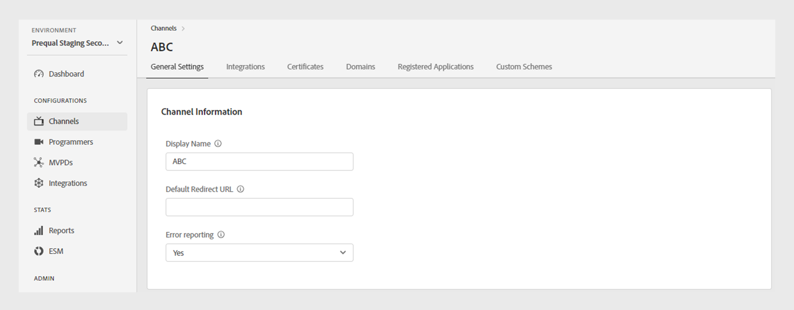
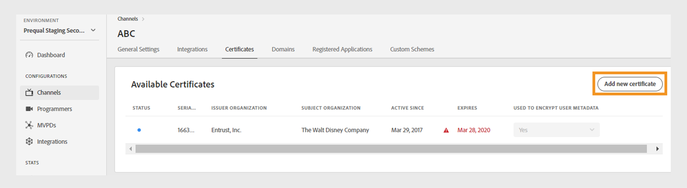

# チャネル {#channels}

>[!NOTE]
>
>このページのコンテンツは情報提供のみを目的としています。 この API を使用するには、Adobeから現在のライセンスが必要です。 無許可の使用は許可されていません。

TVE ダッシュボードの「**チャネル**」セクションでは、特定のプログラマーに関連付けられたチャネルの設定を表示および管理できます。 また、必要に応じて [ 新しいチャネルを追加 ](#add-new-channel) することもできます。

左側のパネルの「**チャネル**」タブには、リンクされたチャネルのリストと次の詳細が表示されます。

* **表示名**：商業目的で使用されるチャネルのブランド名。
* **チャネル ID**：一意の ID。依頼者 ID とも呼ばれます。
* **統合**: [MVPD](/help/authentication/glossary.md#mvpd) で確立された接続数。

*既存のチャネルのリスト*

チャネルについて詳しくは、リストの上にある **検索** バーにチャネルの名前を入力します。

## チャネル設定の管理 {#manage-channel-conf}

特定のチャネルの様々な設定を管理するには、次の手順に従います。

1. 左パネルの「**チャネル**」タブを選択します。

1. 使用可能なリストからチャネルを選択します。

1. 次のいずれかのタブを選択して、選択したチャネルの対応する設定を表示および編集します。

   * [一般設定](#general-settings)
   * [統合](#integrations)
   * [証明書](#certificates)
   * [ドメイン](#domains)
   * [登録アプリケーション](#registered-applications)
   * [カスタムスキーム](#custom-schemes)

   

   *チャネル設定*

>[!IMPORTANT]
>
> 設定変更のアクティベートについて詳しくは、[ 変更のレビューとプッシュ ](/help/authentication/tve-dashboard/new-tve-dashboard/tve-dashboard-review-push-changes.md) を参照してください。

### 一般設定 {#general-settings}

このタブには **チャネル情報** と **Analytics 設定** が表示されます。

#### チャネル情報 {#channel-information}

このセクションでは、次の詳細を編集できます。

* **表示名**：商業目的で使用されるチャネルのブランド名。

* **デフォルトのリダイレクト URL**：認証およびログアウト用のバックアップリダイレクト URL。

* **エラーレポート**:「**はい**」を選択すると、Adobe Pass SDK はエラーレポートを分析用にAdobe Pass バックエンドに送信します。

*チャネル情報の編集*

#### Analytics 設定 {#analytics-configuration}

この節では、Adobe AnalyticsへのAdobe Pass認証イベントの転送を設定できます。

**Analytics 設定** を有効にするには、テクニカルアカウントマネージャー（TAM）に連絡して、レポートスイート ID （RSID）の設定について詳しく問い合わせてください。

*Analytics 設定の有効化*

「**新しい Analytics 設定を追加**」を選択して、複数の設定を追加します。

新しい設定変更が作成され、サーバーを更新する準備が整いました。 「**Analytics 設定**」セクションの新しい分析設定を使用するには、[ 変更のレビューとプッシュ ](/help/authentication/tve-dashboard/new-tve-dashboard/tve-dashboard-review-push-changes.md) フローに進みます。

### 統合 {#integrations}

このタブには、現在選択されているチャネルと MVPD 間で使用可能な統合のリストが表示されます。 このリストには、各統合とそのステータスが表示され、統合が有効かどうかが示されます。 このリストから特定の統合を選択して、「[ 統合 ](tve-dashboard-integrations.md)」セクションに記載されている詳細情報にアクセスします。

*使用可能な統合のリスト*

### 証明書 {#certificates}

このタブには、ユーザーメタデータ暗号化フローで使用される [ 使用可能な証明書 ](#available-certificates) および [ 継承された使用可能な証明書 ](#inherited-avail-certificates) の一覧が表示されます。 次の各証明書に関する詳細が表示されます。

* ステータス（「ユーザーメタデータの暗号化 **使用に対し** 有効になっているかどうか）
* シリアル番号
* 発行者組織の名前
* 件名の組織の名前
* 発行日
* 有効期限
* ユーザーメタデータを暗号化するドロップダウンメニュー（「はい **を選択すると、証明書によって、郵便番号の値などのユーザーの機密情報が暗号化されます**。

#### 使用可能な証明書 {#available-certificates}

これらの証明書は、秘密鍵または公開鍵として機能し、ユーザーメタデータの暗号化に使用されます。
「利用可能な証明書」セクションで、次の変更を行うことができます。

* [新しい証明書を追加](#add-new-certificate)
* [証明書を削除](#delete-certificate)

##### 新しい証明書を追加 {#add-new-certificate}

新しい証明書を追加するには、次の手順に従います。

1. **利用可能な証明書** セクションの上部にある **新しい証明書を追加** を選択します。

   

   *新しい証明書を追加する*

1. 証明書の公開鍵を **新しい証明書** ダイアログボックスに貼り付けます。

1. 「**証明書を追加**」を選択します。

1. **使用可能な証明書** の一覧で、新しい証明書を見つけます。

   >[!IMPORTANT]
   >
   > システムが最新で、新しい証明書を使用する準備ができていることを確認します。

1. **暗号化されたユーザーメタデータに使用** ドロップダウンメニューから **はい** を選択して、新しい証明書をアクティブにします。

新しい設定変更が作成され、サーバーを更新する準備が整いました。 **使用可能な証明書** セクションにリストされている新しい証明書を使用するには、[ 変更の確認とプッシュ ](/help/authentication/tve-dashboard/new-tve-dashboard/tve-dashboard-review-push-changes.md) フローに進みます。

##### 証明書を削除 {#delete-certificate}

次の手順に従って、証明書を削除します。

1. **使用可能な証明書** のリストから削除する証明書の上にマウスポインターを置きます。

1. 「**削除**」を選択します。

   

   *選択した証明書を削除する*

1. **アクティブな証明書を削除** ダイアログボックスから **削除** を選択します。

新しい設定変更が作成され、サーバーを更新する準備が整いました。 証明書は、「レビューとプッシュの変更 [ の後にのみ **使用可能な証明書** セクションから削除さ ](/help/authentication/tve-dashboard/new-tve-dashboard/tve-dashboard-review-push-changes.md) ます。

#### 継承された使用可能な証明書 {#inherited-avail-certificates}

メディア会社は、これらの証明書を独自のレベルで定義します。 同じメディア会社に関連付けられているすべてのチャネルが、これらの証明書を使用できます。

*継承された使用可能な証明書*

### ドメイン {#domains}

このタブには、各チャネルがAdobe Pass Authentication と通信する際に使用できる使用可能なドメインのリストが表示されます。

ドメインには、次の変更を加えることができます。

* [新しいドメインを追加](#add-domains)
* [ドメインを削除](#delete-domain)

>[!TIP]
>
> より一般的なドメインがリストに存在する場合は、新しいサブドメインを追加しないでください。

#### 新しいドメインを追加 {#add-domains}

ドメインを追加するには、次の手順に従います。

1. **使用可能なドメイン** セクションの右上隅にある **新しいドメインを追加** を選択します。

   

   *新しいドメインを追加*

1. **新規ドメイン** ダイアログボックスにドメインの名前を入力します。

1. **ドメインを追加** を選択して、選択したチャネルに新しいドメインを追加します。

新しい設定変更が作成され、サーバーを更新する準備が整いました。 「**使用可能なドメイン**」セクションにリストされている新しいドメインを使用するには、[ 変更の確認とプッシュ ](/help/authentication/tve-dashboard/new-tve-dashboard/tve-dashboard-review-push-changes.md) フローに進みます。

#### ドメインを削除 {#delete-domain}

ドメインを削除するには、次の手順に従います。

1. **利用可能なドメイン** のリストから削除するドメインにポインタを合わせます。

1. 「**削除**」を選択します。

   

   *選択したドメインを削除*

1. **ドメインを削除** ダイアログボックスの **削除** を選択します。

新しい設定変更が作成され、サーバーを更新する準備が整いました。 ドメインは、「確認とプッシュの変更 [ の後にのみ **「使用可能なドメイン** セクションから削除され ](/help/authentication/tve-dashboard/new-tve-dashboard/tve-dashboard-review-push-changes.md) す。

選択したドメインは使用できなくなりました。 その結果、このドメインに関連付けられているアプリケーションは、Adobe Pass Authentication サービスへのアクセスができなくなります。

### 登録アプリケーション {#registered-applications}

このタブには、カスタム スキーマの一覧が表示されます。 [iOS/tvOS アプリケーションの登録 ](/help/authentication/iostvos-application-registration.md) を表示します。

## 新しいチャネルを追加 {#add-new-channel}

新しいチャネルを追加するには、次の手順に従います。

1. 左パネルの「**チャネル**」タブを選択します。

1. **チャネル** セクションの右上隅にある **新しいチャネルを追加** を選択します。

   

   *新しいチャネルを追加*

1. **新規チャネル** ダイアログボックスのドロップダウンメニューから **プログラマー ID** を選択します。

1. **チャネル ID** に一意の ID を入力します。

1. **表示名** に、商用目的で使用するチャネルのブランド名を入力します。

1. **チャネルを追加** を選択します。

新しい設定変更が作成され、サーバーを更新する準備が整いました。 「**チャネル**」セクションにリストされている新しいチャネルを使用するには、[ 変更のレビューとプッシュ ](/help/authentication/tve-dashboard/new-tve-dashboard/tve-dashboard-review-push-changes.md) フローに進みます。
