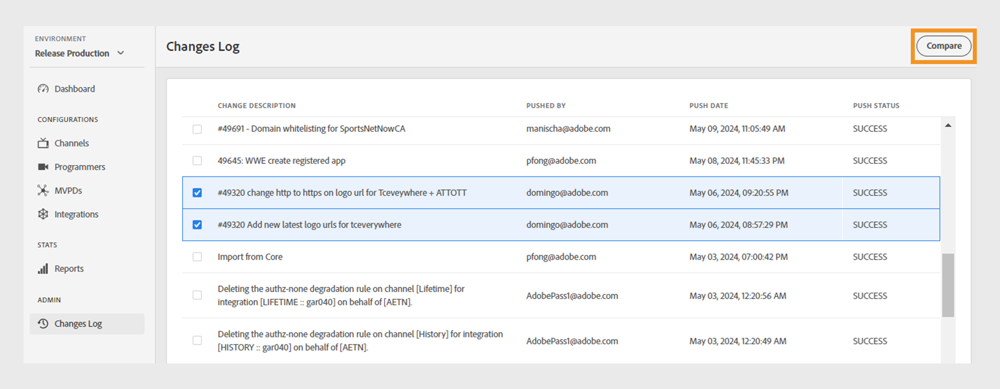
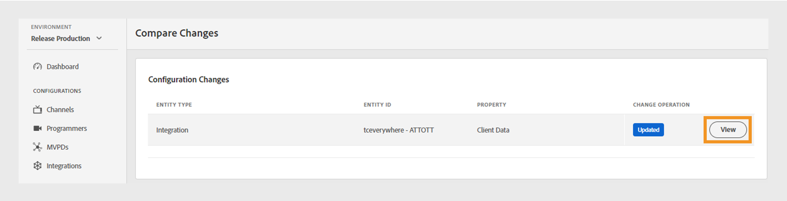
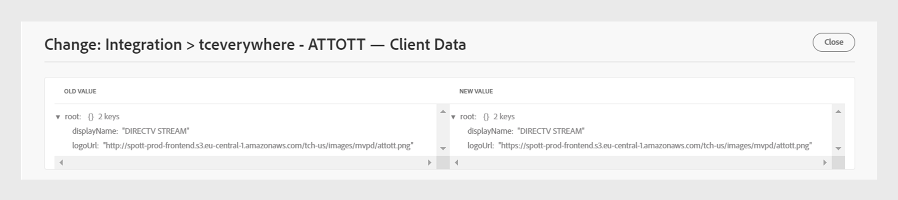

# 変更ログ {#changes-log}

>[!NOTE]
>
>このページのコンテンツは、情報提供のみを目的として提供されています。 このAPIを使用するには、Adobeの現在のライセンスが必要です。 無断使用は認められません。

TVE ダッシュボードの&#x200B;**Changes Log** セクションでは、TVE ダッシュボードを通じてAdobe Pass Authentication Environmentにプッシュされた設定変更を表示できます。 また、2つの異なる設定変更を比較することもできます。

左側のパネルの「**変更履歴**」タブには、TVE ダッシュボードの特定のアカウントを通じて行われたすべての設定変更のリストが表示されます。 この変更点のリストには、次の詳細が含まれています。

* **変更説明**：設定変更の範囲に関する簡単な説明です。
* **によってプッシュされました**：変更を行うユーザーの電子メール ID。
* **プッシュ日**：設定を変更した日付。
* **プッシュステータス**: プッシュ操作が成功、保留中、または失敗したかどうかを示します。

## 変更点を比較 {#compare-changes}

変更点を比較するには、次の手順に従います。

1. 比較するリストから2つの設定変更を選択します。

   

   *設定の変更を比較*

1. 画面の右上隅にある「**比較**」を選択します。

   「**設定変更**」セクションには、エンティティの種類、エンティティ ID、プロパティ、および各変更の変更操作のステータスが表示されます。

1. 表示する設定変更にカーソルを合わせます。

1. 変更された値にアクセスするには、**ビュー**&#x200B;を選択します。

   

   *設定の変更を表示*

次に、選択した設定で行われた変更の例を示します。 変更内の古い値と新しい値の違いを確認できます。

*古い値と新しい値*
