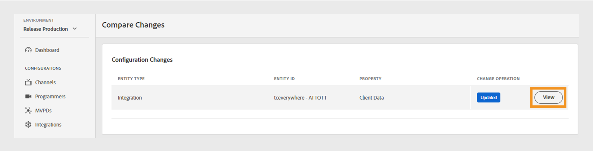

# 変更ログ {#changes-log}

>[!NOTE]
>
>このページのコンテンツは情報提供のみを目的としています。 この API を使用するには、Adobeの最新ライセンスが必要です。 無許可の使用は許可されていません。

TVE Dashboard の **Changes Log** セクションでは、TVE Dashboard を通じてAdobe Pass Authentication Environment にプッシュされたコンフィギュレーションの変更内容を確認できます。 また、2 つの異なる設定変更を比較することもできます。

左側のパネルの **変更ログ** タブには、TVE ダッシュボードの特定のアカウントを通じて行われたすべての設定変更のリストが表示されます。 この変更点のリストには、次の詳細が含まれます。

* **変更説明**：設定変更の範囲に関する短い説明。
* **プッシュ済み**：変更を行うユーザーのメール ID。
* **プッシュ日**：設定変更の日付。
* **プッシュステータス**：プッシュ操作が成功、保留、失敗のいずれであったかを示します。

## 変更内容の比較 {#compare-changes}

変更を比較するには、次の手順に従います。

1. 比較する 2 つの設定変更をリストから選択します。

   

   *設定の変更を比較*

1. 画面の右上隅にある「**比較**」を選択します。

   「**設定変更**」セクションには、エンティティのタイプ、エンティティ ID、プロパティ、各変更の変更操作のステータスが表示されます。

1. 表示する設定の変更にポインタを合わせます。

1. 「**表示**」を選択して、変更された値にアクセスします。

   

   *設定の変更を表示*

次に、選択した設定で行われた変更の例を示します。 変更内の古い値と新しい値の違いを確認できます。

*古い値と新しい値*
